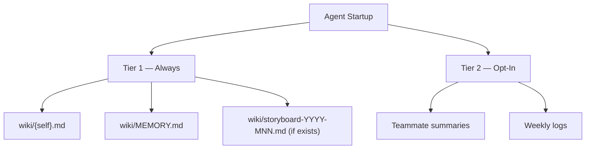

# Memory Protocol

This file governs **agent memory and action routing** — what to read, how reads
feed into action selection, and what to write. For non-wiki outputs see
[coordination-protocol.md](coordination-protocol.md).

## Memory Tiers

**Tier 1 (always, every run):** own summary, MEMORY.md, current storyboard —
three files that do not grow with agent count or week count.

**Tier 2 (opt-in):**

- **Teammate summaries** — read only when coordinating with a named agent or
  investigating a priority-index item that names them.
- **Weekly logs** — read only when the skill is `kata-wiki-curate`,
  `kata-trace`, or `kata-session`, or when explicitly investigating a historical
  decision.

Skills that need Tier 2 files declare it in their own Step 0.

## Action Routing

Tier 1 reads feed the agent's Assess order. After reading all Tier 1 files,
apply this priority scheme — the first level with actionable work wins:

1. **Owned priorities.** MEMORY.md Cross-Cutting Priorities where you are
   `Owner`. These are team commitments assigned to you — they preempt
   domain-specific work.
2. **Storyboard items.** Per-agent deliverables in the current storyboard and
   open experiment issues labeled `agent:{self}`.
3. **Domain assess.** The numbered steps in your agent profile's Assess section.
4. **Cross-cutting fallback.** MEMORY.md items listing you under `Agents` (not
   Owner) where you can contribute. Report clean only after checking all four.

The `### Decision` block records which level produced the chosen action.

## During Each Run

Append a new `## YYYY-MM-DD` section at the end of the current week's log:

- **File:** `wiki/{agent}-$(date +%G-W%V).md`
- **Heading:** `# {Agent Title} — YYYY-Www` (create the file if missing)
- **Cadence:** one file per ISO week

Use `###` subheadings for the fields skills specify to record. Every run must
open with a `### Decision` subheading containing:

| Field            | Record                                                 |
| ---------------- | ------------------------------------------------------ |
| **Surveyed**     | What was checked at each routing level and the results |
| **Alternatives** | What actions were available                            |
| **Chosen**       | What action was selected and which skill was invoked   |
| **Rationale**    | Why this action over the alternatives                  |

## After Each Run

Update `wiki/{agent}.md` with:

1. Actions taken
2. Observations for teammates
3. Open blockers

## Summary Contract

Each `wiki/<agent>.md` conforms to a mechanically-checkable contract.

**Permitted sections (in order):**

1. `# {Agent Title} — Summary` (H1, exactly one)
2. `**Last run**:` line — date and one-line description
3. Agent-specific state section(s) using H2
4. `## Open Blockers` — currently-blocking items only
5. `## Observations for Teammates` — items not yet promoted to the priority
   index; agent-to-agent callouts

**Excluded from summaries** (with correct homes):

- Historical audit data (previously tracked PRs, resolved blockers, evaluation
  history) → weekly log
- Storyboard commitments → storyboard file
- Policy clarifications → CONTRIBUTING.md or skill docs
- Metrics tables → CSV under `wiki/metrics/{agent}/{domain}/`

**Line budget: 80 lines.** Checked mechanically: `wc -l wiki/<agent>.md ≤ 80`.
Summaries are state, not history. The line budget forces the discipline.

## Weekly Log Contract

Weekly logs (`wiki/<agent>-YYYY-Www.md`) are:

- **Append-only audit records** — no edits to past entries except format fixes.
- **Tier 2** — not in the default startup load.
- **Named readers:** `kata-wiki-curate` (always), `kata-session` (for experiment
  verification), agents explicitly investigating past decisions.
- **Format:** `## YYYY-MM-DD` / `### {Subsection}` structure.
- **No line budget** — write-once records off the critical startup path.

## Cross-Cutting Priority Index

`wiki/MEMORY.md` is the canonical location for cross-cutting items that affect
multiple agents or the whole team.

**Schema:** table row with fields Item / Agents / Owner / Status / Added.
Maximum 10 active entries. Explicit empty state: a row reading
`| *None* | — | — | — | — |` (distinguishes "no items" from "not tracked yet").

`kata-wiki-curate` is the authoritative writer; any agent may propose an entry
but the curator verifies. Resolved items are removed within one curation cycle.

**Entry lifecycle:**

- **Add** — Finding affects ≥2 agents and persists beyond the run that surfaced
  it. Link the GitHub artifact (Issue, PR, Discussion) that carries the
  permanent record.
- **Update** — Ownership transfers (change Owner) or material progress lands
  (change Status: PR opened, PR merged, blocker cleared).
- **Remove** — Underlying problem resolved; the linked GitHub artifact is the
  permanent record. Do not keep resolved entries.
