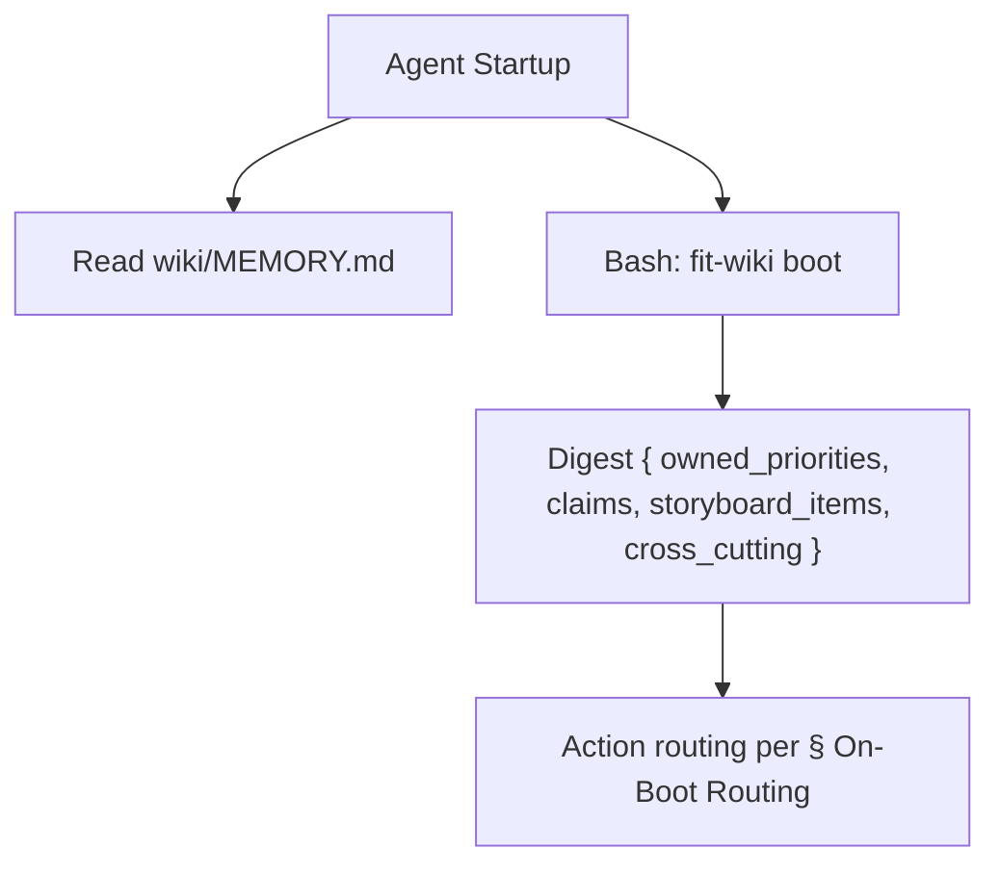

# Memory Protocol

This file governs **agent memory and action routing** via the `fit-wiki` CLI.
Every contract below maps to one or more `fit-wiki` subcommands — the CLI is
the path, not an alternative. For non-wiki outputs see
[coordination-protocol.md](coordination-protocol.md).

## On-Boot Read Set

Three Tier 1 surfaces, all in `wiki/`:

| Surface | Path | Reader |
| --- | --- | --- |
| Own summary | `wiki/{self}.md` | `fit-wiki boot` (digest) |
| Cross-cutting memory | `wiki/MEMORY.md` | direct `Read` + `fit-wiki boot` |
| Current storyboard | `wiki/storyboard-YYYY-MNN.md` | `fit-wiki boot` (slice) |

**Step 0 contract — two tool calls within the first ten:**

1. `Read wiki/MEMORY.md` — direct file open of the priority surface and `##
   Active Claims`.
2. `Bash: fit-wiki boot --agent <self>` — structured digest of the other
   Tier 1 surfaces. JSON output; `--format markdown` for prose.

Total cost: 2 tool calls vs the legacy 3 reads (closes F11).

## On-Boot Routing

Apply this priority scheme against the `boot` digest's JSON fields — first
level with actionable work wins:

1. **Owned priorities** (`owned_priorities[]`) — MEMORY.md `## Cross-Cutting
   Priorities` rows where you are `Owner`. Team commitments preempt domain
   work.
2. **Storyboard items** (`storyboard_items[]`) — per-agent deliverables plus
   open experiment issues labeled `agent:{self}`.
3. **Domain assess** — the numbered steps in your agent profile's Assess
   section.
4. **Cross-cutting fallback** (`cross_cutting[]`) — rows listing you under
   `Agents` (not Owner). Report clean only after checking all four.

**Skip-self rule:** an agent treats its own row in `claims[]` as preempting
routing — the work is already in flight. Other agents' claims are settled
state for routing purposes.

The `### Decision` block records which level produced the chosen action.

## Tool-vs-Memory Habit

The competing habit named by the JTBD analysis is `gh` / `git` / source
re-derivation. When the next answer can come from either path, **prefer
memory** — every primitive is calibrated to cost fewer tool calls than the
alternative: one for the on-boot read set (closes **F11**), one for a
Decision-block append (closes **F4**), one for inbox state (partial **F5**).
The CLI is the path, not the alternative.

## During Each Run

Append entries to the current weekly log via `fit-wiki log`:

- `fit-wiki log decision --agent <self> --surveyed ... --chosen ...
  --rationale ... [--alternatives ...]` — required at the **opening** of each
  weekly-log entry. Decision-block contract closes **F6 / F13**.
- `fit-wiki log note --agent <self> --field "Actions taken" --body "..."` —
  in-run field append.
- `fit-wiki log done --agent <self>` — close the entry.

Rotation is implicit: when the next append would push the file past the
500-line cap, `log` seals the current file as `…-Www-partN.md` and writes the
new entry to a fresh `…-Www.md`. `fit-wiki rotate` is the operator escape.

Triage the Message Inbox via `fit-wiki inbox {list|ack|promote|drop}`.
`promote --index N` writes a row into `## Cross-Cutting Priorities` and
removes the inbox bullet.

Cross-agent memos use `fit-wiki memo` (writer-side); the recipient triages
via `inbox`. Update `wiki/{agent}.md` directly with Actions taken and Open
Blockers as needed at run end.

## Summary Contract

Each `wiki/<agent>.md` conforms to a mechanically-checkable contract —
`audit` gates it on Stop-hook and pre-merge CI (closes **F10**).

**Permitted sections (in order):** `# {Agent Title} — Summary` (H1) →
`**Last run**:` → `## Message Inbox` (with `<!-- memo:inbox -->` marker —
MUST be the first H2) → agent-specific H2 sections → `## Open Blockers`.

**Line budget: 496 lines** (`SUMMARY_LINE_BUDGET`); **word budget: 6 400
words** (`SUMMARY_WORD_BUDGET`) to backstop dense single-line prose. State,
not history.

## Weekly Log Contract

Weekly logs (`wiki/<agent>-YYYY-Www.md`) are append-only Tier 2 records.
Named readers: `kata-wiki-curate` (always), `kata-session` (for experiment
verification), agents explicitly investigating past decisions.

**Line budget: 496 lines** (`WEEKLY_LOG_LINE_BUDGET`); **word budget: 6 400
words** (`WEEKLY_LOG_WORD_BUDGET`) to backstop dense single-line prose. A
Tier 2 read of the largest legal weekly log consumes ≤2.5% of an agent's
1M-token context window — the *context tax* every reader pays (closes **F3
/ F17**). Storyboards (`wiki/storyboard-YYYY-MNN.md`) share the same
budgets — 496 lines / 6 400 words — gated by `storyboard.line-budget` and
`storyboard.word-budget` audit rules. The three budgets share numeric
limits today; each surface keeps its own rule pair so the limits can
diverge later if the context-tax model says one surface should be looser
or tighter.

Overflow rotates: `log` seals the current file as
`<agent>-YYYY-Www-partN.md` and writes the day's append into a fresh
`<agent>-YYYY-Www.md`. No part is ever rewritten — the append-only audit
guarantee is preserved by rename, not by in-place edit.

Every dated `## YYYY-MM-DD` entry opens with `### Decision` (required;
`audit` enforces).

## Cross-Cutting Priorities

`wiki/MEMORY.md` carries the cross-cutting priority surface. Read by every
boot (digest's `owned_priorities` + `cross_cutting` slices). Schema: `| Item
| Agents | Owner | Status | Added |`, max 10 active. Writers: `fit-wiki
inbox promote` (from a memo) and direct `kata-wiki-curate` edits.

## Active Claims

Sibling H2 to Cross-Cutting Priorities in `wiki/MEMORY.md`. A *claim* is an
assertion that an agent is actively working on a named target (a spec, an
open PR, a storyboard experiment) and intends to ship the next observable
state change for it. **Row present = active; row absent = settled.**

Schema (header copied verbatim from `libwiki/constants.js`):

```
| agent | target | branch | pr | claimed_at | expires_at |
```

Lifecycle:

- `fit-wiki claim --agent <self> --target <id> --branch <name> [--pr <id>]
  [--expires-at YYYY-MM-DD]` — defaults `expires_at = claimed_at + 7 days`.
  Refuses duplicates with exit 2.
- `fit-wiki release --agent <self> --target <id>` — normal lifecycle removal.
- `fit-wiki release --expired` — operator cleanup, removes every row past
  `expires_at`.

Audit history lives in git history of `MEMORY.md` — rows are settled by
deletion, with the prior commit preserving the claim record. Closes **F8 /
F18**.

## Named Jobs This Protocol Serves

- *Find the next thing to pick up without colliding* → `fit-wiki claim` /
  `release`. Claims surface + skip-self rule keeps two agents from racing on
  the same target.
- *Trust another agent's reported state without re-deriving* → `fit-wiki
  boot` digest + `Read wiki/MEMORY.md`.
- *Receive memos without breaking my contract* → `fit-wiki inbox list / ack /
  promote / drop`.

## CLI Contract Map

| Subcommand | Status | Contract(s) realized |
| --- | --- | --- |
| `boot` | new | On-Boot Read Set; On-Boot Routing |
| `log decision` | new | Decision-block opening (write) |
| `log note` / `log done` | new | Weekly log field append / close |
| `claim` / `release` | new | Active Claims write |
| `inbox list` | new | Message Inbox read |
| `inbox ack` / `drop` | new | Message Inbox triage |
| `inbox promote` | new | Cross-Cutting Priorities write (from inbox) |
| `rotate` | new | Weekly Log Contract (explicit rotation) |
| `audit` | absorbed (`scripts/wiki-audit.sh`) | Summary; Active Claims schema; Decision-block opening (gate); Weekly Log cap (gate); Expired claims |
| `memo` | retained | Sibling channel (cross-agent memo writer) |
| `push` / `pull` | retained | Sibling channel (wiki git lifecycle) |
| `init` | modified | Active Claims scaffold; Stop-hook installation |
| `refresh` | extended | Sibling channel (storyboard + obstacle/experiment markers) |

One-shot administrative scripts (`scripts/spec-NNN-*.mjs`) write to `wiki/`
transiently and self-delete in the same commit; they are not part of this
protocol's read/write contract.

**Reverse map — every contract has a writer and (if gated) an auditor:**

| Contract assigned to the CLI | Subcommand(s) |
| --- | --- |
| On-Boot Read Set / On-Boot Routing | `boot` |
| Decision-block (write / gate) | `log decision` / `audit` |
| Weekly log append | `log decision`, `log note`, `log done` |
| Weekly log cap (write / gate) | `log` (seal-before-append), `rotate` / `audit` |
| Active Claims (write / gate) | `claim`, `release`, `release --expired` / `audit` |
| Cross-Cutting Priorities write | `inbox promote` (plus `kata-wiki-curate`) |
| Message Inbox (read / triage) | `inbox list` / `inbox ack`, `drop`, `promote` |
| Summary Contract (gate) | `audit` |
| Active Claims scaffold + Stop-hook install | `init` |

## Process


