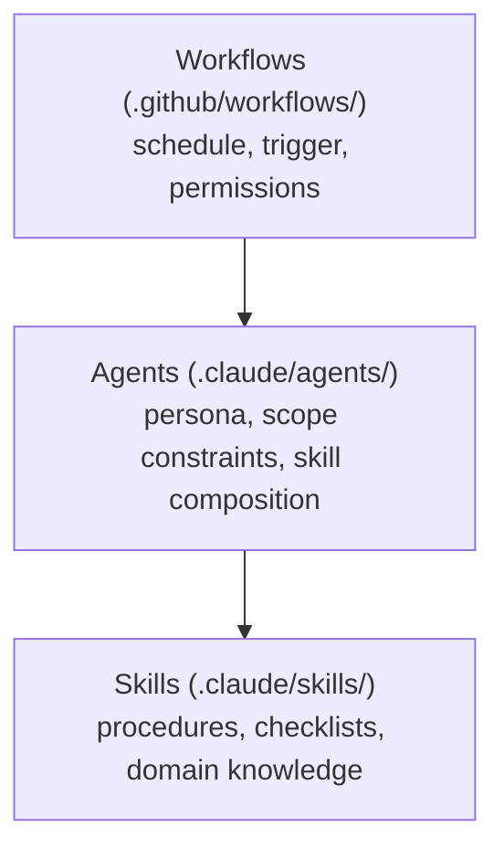
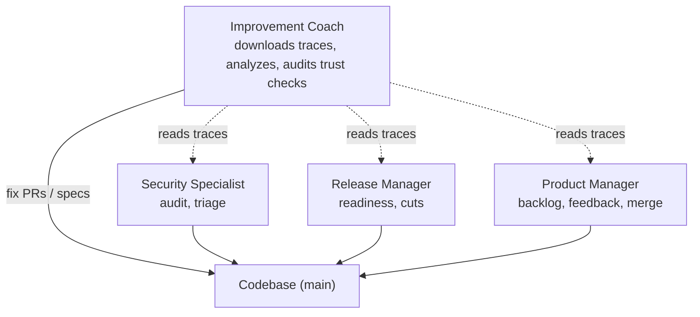
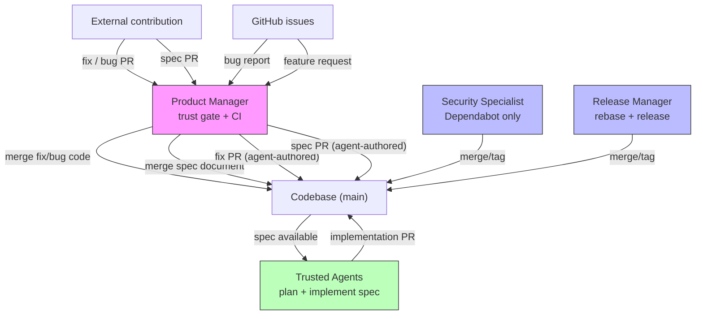

# Continuous Improvement System

> "Improve constantly and forever the system of production and service."
>
> — W. Edwards Deming

Autonomous repo self-maintenance powered by Claude Code agents on GitHub
Actions. Seven scheduled workflows, four agent personas, and eleven skills form
a closed feedback loop that keeps the codebase secure, release-ready, and
steadily improving. Product evaluation sessions validate changes from the user's
perspective. This system maintains the project — not the engineering frameworks
the products serve.

## Architecture



All workflows use a shared composite action (`.github/actions/claude/`) that
installs Claude Code, runs a prompt against an agent profile, captures the
execution trace as NDJSON, and uploads it as an artifact. Authentication via
GitHub App tokens (see § Authentication).

## Agents

| Agent                   | Purpose                                                                   | Skills                                                              |
| ----------------------- | ------------------------------------------------------------------------- | ------------------------------------------------------------------- |
| **security-specialist** | Patch dependencies, harden supply chain, enforce security policies        | security-update, security-audit, spec                               |
| **release-manager**     | Keep PR branches merge-ready, repair trivial CI on main, cut releases     | release-readiness, release-review, gh-cli                           |
| **improvement-coach**   | Deep-analyze agent traces, fix trivial issues, spec larger improvements   | gemba-walk, grounded-theory-analysis, spec, gh-cli                  |
| **product-manager**     | Review PRs for product alignment, triage issues, verify contributor trust | product-backlog, product-feedback, product-evaluation, spec, gh-cli |

Each agent has explicit scope constraints — it knows what it must _not_ do. When
a finding exceeds an agent's scope, it writes a formal spec (`specs/`) rather
than attempting the fix.

## Workflows

Daily pipeline: work creators (04–05 UTC) → preparers (06 UTC) → mergers (08
UTC) → releasers (09 UTC) → analyzers (10 UTC). Same-agent workflows never
overlap.

| Workflow              | Schedule                | Agent               | What it does                                                                  |
| --------------------- | ----------------------- | ------------------- | ----------------------------------------------------------------------------- |
| **security-audit**    | Tue & Fri 04:07 UTC     | security-specialist | Audit supply chain, dependencies, credentials, OWASP Top 10                   |
| **security-update**   | Mon & Thu 04:43 UTC     | security-specialist | Apply security updates: triage Dependabot PRs, address audit findings         |
| **product-feedback**  | Mon, Wed, Fri 05:17 UTC | product-manager     | Triage open issues, implement trivial fixes, write specs for aligned requests |
| **release-readiness** | Daily 06:23 UTC         | release-manager     | Rebase open PRs on main, fix lint/format failures, repair main CI if broken   |
| **product-backlog**   | Daily 08:13 UTC         | product-manager     | Classify open PRs by type, verify contributor trust, merge fix/bug/spec PRs   |
| **release-review**    | Tue, Thu, Sat 09:37 UTC | release-manager     | Find unreleased changes, bump versions, tag, push, verify publish             |
| **improvement-coach** | Wed & Sat 10:47 UTC     | improvement-coach   | Deep-analyze a single random agent trace, open fix PRs or write specs         |

Off-minute schedules avoid API load spikes. All workflows support
`workflow_dispatch`, use concurrency groups, and have a 30-minute timeout.

## The Feedback Loop

The improvement coach closes the loop. Each cycle focuses on **one trace** —
depth over breadth: select a run → download the trace → deep-analyze every turn
via grounded theory → categorize findings → act (trivial fixes become PRs,
larger improvements become specs).

When analyzing a **product-backlog** trace, the coach also verifies that the
product manager performed trust checks on every merged PR (see §
Accountability).



## Skills

| Skill                        | Purpose                                                                       |
| ---------------------------- | ----------------------------------------------------------------------------- |
| **security-audit**           | Seven-area security review (supply chain, deps, credentials, OWASP, CI)       |
| **security-update**          | Security updates: Dependabot triage, npm audit findings, vulnerability fixes  |
| **release-readiness**        | Mechanical PR preparation — rebase, fix, report                               |
| **release-review**           | Version bumps, tagging, publish verification                                  |
| **gemba-walk**               | Trace observation process — select, download, analyze, report                 |
| **grounded-theory-analysis** | Qualitative trace analysis adapted from research methodology                  |
| **spec**                     | Spec and plan lifecycle — write, review, approve, track status                |
| **gh-cli**                   | GitHub CLI installation and usage patterns for CI                             |
| **product-backlog**          | PR triage with type classification, contributor verification, and merge gates |
| **product-evaluation**       | Supervise product evaluation sessions, capture feedback, create issues        |
| **product-feedback**         | Issue triage with classification, fix PRs for bugs, and specs for features    |

## Trust Boundary

Product-backlog is the sole external merge point — every other merge path
operates on trusted sources (our agents, Dependabot). External contributions
pass through a two-tier gate:

| PR type         | What merges                          | Who implements the change           |
| --------------- | ------------------------------------ | ----------------------------------- |
| `fix` / `bug`   | The contributor's code (small patch) | The external contributor            |
| `spec`          | A specification document (WHAT/WHY)  | Trusted agents, not the contributor |
| Everything else | Nothing — PR is skipped              | N/A                                 |

**Trivial fixes** (`fix`, `bug`) from top-20 contributors merge the
contributor's code, gated by CI and trust checks.

**CI app PRs** (`app/forward-impact-ci`) are trusted by identity — the product
manager skips the top-20 lookup and proceeds to type classification and CI.

**Specs** (`spec`) from top-20 contributors merge only the specification
document. Planning and implementation is performed by trusted agents, not the
contributor — even a compromised top contributor cannot inject code through the
autonomous pipeline.

**All other PR types** (features, refactors) require human review.



| Merge point           | Source                    | Trust model                                     |
| --------------------- | ------------------------- | ----------------------------------------------- |
| **product-backlog**   | External fix/bug PRs      | Top-20 contributor gate + CI                    |
| **product-backlog**   | External spec PRs         | Top-20 gate + CI + spec review                  |
| **product-backlog**   | CI app PRs                | Trusted app identity (`forward-impact-ci`) + CI |
| **security-update**   | Dependabot PRs            | Trusted bot, policy-gated                       |
| **release-readiness** | Agent-authored rebases    | Agent-only, no external input                   |
| **release-review**    | Agent-authored tags/bumps | Agent-only, no external input                   |
| **release-manager**   | Trivial CI fixes on main  | Agent-only, mechanical fixes only               |
| **improvement-coach** | Agent-authored fix/spec   | Agent-only, traces as evidence                  |
| **product-feedback**  | Agent-authored fix/spec   | Agent-only, issues as input                     |

## Design Principles

- **Fix-or-spec discipline.** Mechanical fixes (`fix/` branches) and structural
  improvements (`spec/` branches) are never mixed in one PR.
- **Explicit scope constraints.** Each agent lists what it must _not_ do.
- **Main branch CI repair.** See CONTRIBUTING.md § Pull Request Workflow for the
  release manager's direct-to-`main` exception.
- **Trace-driven observability.** Every workflow captures a full execution
  trace. The improvement coach must quote specific evidence — no speculation.
- **Least privilege.** `security-audit` runs `contents: read` only. Write
  workflows use scoped per-run installation tokens.

## Shared Memory

Agents share persistent memory via the repository's **GitHub wiki**, mounted as
a git submodule at `.claude/memory/`. Synced by `just memory-pull` (on
`SessionStart`) and `just memory-push` (on `Stop`).

Each agent maintains two kinds of file:

- A rolling **summary** — `<agent>.md`, latest state (coverage, backlog,
  blockers, observations for teammates).
- A **weekly log** — `<agent>-<YYYY>-W<VV>.md`, keyed by ISO week-year and week
  number (`date +%G-W%V`). One file per agent per week provides continuity
  across the weekly CI cadence without fragmenting context into daily files.

Every scheduled run must read the summary and the current week's log before
acting, append that run's findings to the week's log, and update the summary at
the end. The canonical memory instruction block lives in each agent profile;
skills reference it without restating paths.

## Authentication

Workflows authenticate via a **GitHub App** (`forward-impact-ci`), not a PAT.
Each run generates a short-lived installation token via
`actions/create-github-app-token` — no long-lived secrets to rotate.

Benefits: on-demand tokens (1-hour expiry), distinct bot identity
(`forward-impact-ci[bot]`) for unambiguous audit trails, and one-click setup for
downstream installations (store `CI_APP_ID` and `CI_APP_PRIVATE_KEY` as
repository secrets, or create a custom App and override `app-slug`).

Token generation runs before `actions/checkout` so the checkout token triggers
downstream workflows. The `security-audit` workflow uses `GITHUB_TOKEN` for
checkout (preserving `contents: read` least privilege) and generates a separate
App token for API access.

## Accountability

The improvement coach audits the product manager's trust verification in
product-backlog traces. Every merged PR must show: (1) a contributor lookup
call, (2) author verification against the result. A merge without visible trust
verification is a **high-severity finding** that requires a fix PR or spec.

## Authoring Best Practices

Lessons from trace analysis and grounded-theory coding of agent workflow runs.

### Instruction layering

Agent instructions span four layers. Each layer owns a distinct concern — no
layer should restate content from another.

```
libeval system prompt   — relay mechanics (how turns work, completion signal)
       ↓
workflow task            — this run (which product, scenario, success criteria)
       ↓
agent profile            — who you are (persona, voice, skill routing, constraints)
       ↓
skills                   — how to do it (procedures, checklists, templates)
```

**Rules:**

1. **Each layer owns its concern.** No layer restates another's content.
2. **Reference by name, not by content.** Tasks and profiles name skills — they
   do not copy their steps.
3. **Tasks are scenario-specific; skills are reusable.** Shared procedures
   belong in skills; per-run details (which product, success criteria) belong in
   tasks.
4. **Skills may elaborate on system prompt behaviour** but must not contradict
   or copy it verbatim.
5. **Profiles define boundaries; skills define steps.** Prefer one sentence per
   constraint. No MUST/MUST NOT checklists that repeat skill content.
6. **Task texts must activate the full workflow.** Name the complete cycle
   ("Walk the gemba and act on findings"), not just the first phase.

**Common violations:**

| Violation                                   | Symptom                                   |
| ------------------------------------------- | ----------------------------------------- |
| Task restates skill procedures              | Agent follows task wording, skips skill   |
| Profile copies skill checklists             | Tokens wasted parsing redundant text      |
| Skill description parrots system prompt     | Contradictions when system prompt evolves |
| Task references skills unavailable to agent | Agent stalls searching for missing skill  |

### Skill length and progressive disclosure

SKILL.md is the instruction the agent reads on every run. Keep it short — aim
for **~200 lines or fewer**. Long skills waste tokens on boilerplate and
increase the chance the agent skips steps buried deep in the document.

Move supporting material into co-located subdirectories that the agent reads
only when needed:

```
.claude/skills/<skill-name>/
  SKILL.md                     ← core instructions (always loaded)
  scripts/<name>.sh|.mjs       ← executable automation the agent invokes
  references/<name>.md         ← templates, examples, data tables
```

**What belongs in `scripts/`:** Repeatable shell or JS commands that the agent
runs verbatim — installation routines, data extraction queries, discovery
helpers. The SKILL.md documents the script's purpose and invocation; the script
contains the implementation.

**What belongs in `references/`:** Content the agent reads on demand —
comment/PR/issue body templates, report formats, worked examples, data
inventories (e.g. SHA-to-workflow mappings). The SKILL.md names the reference
file and describes when to consult it.

**What stays in SKILL.md:** The decision-making procedure — when to use the
skill, the gate checklist, the process steps, classification criteria, and
memory instructions. If the agent needs it on every run to know _what to do
next_, it belongs in the SKILL.md.

**Guideline, not a hard rule.** Some skills (e.g. `spec` at 179 lines) are
entirely instructional with no templates or scripts to extract — that's fine.
The goal is not to hit a line count but to separate procedure from supporting
material so the core instructions stay scannable.

### Shared patterns must be consistent

Use the same wording for shared structural elements (memory instructions,
prerequisites format, section headings) across all agents and skills.
Inconsistent wording correlated with agents skipping steps in trace analysis.

### resume() must propagate session state

The SDK does not persist `permissionMode` across resume boundaries. Always pass
all session configuration again when calling `resume()`.
