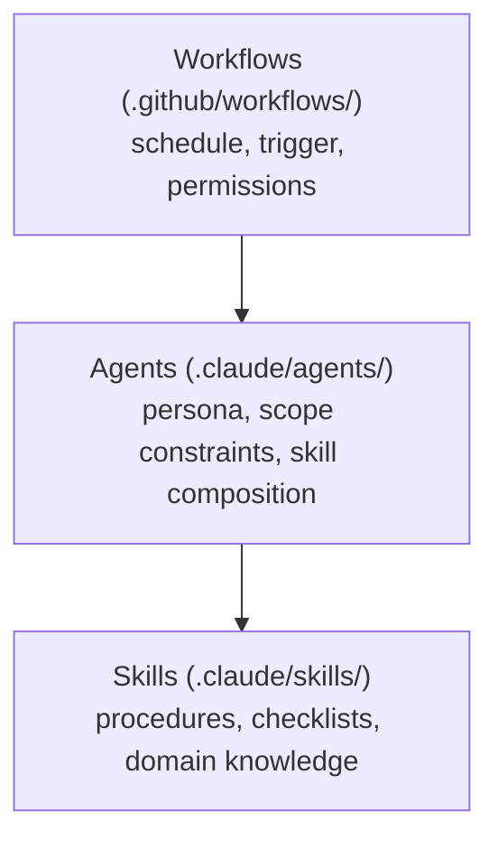
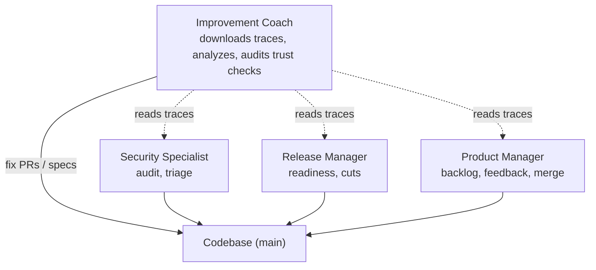
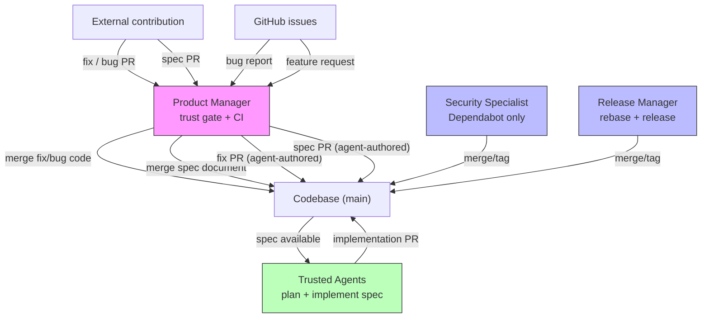

# Continuous Improvement System

> "Improve constantly and forever the system of production and service."
>
> — W. Edwards Deming

This monorepo runs an autonomous continuous improvement system powered by Claude
Code agents on GitHub Actions. Seven scheduled workflows, four agent personas,
and nine skills form a closed feedback loop that keeps the codebase secure,
release-ready, and steadily improving — without human intervention for routine
tasks. This is a repo self-maintenance system, not part of the Forward Impact
products — it maintains the project, not the engineering frameworks the products
serve.

## Architecture

Three layers compose the system:

All workflows use a shared composite action (`.github/actions/claude/`) that
installs Claude Code, configures the GitHub App's bot Git identity, runs a
prompt against an agent profile in non-interactive mode, captures a full
execution trace as NDJSON, and uploads it as a workflow artifact. Each workflow
generates a short-lived installation token from the GitHub App before invoking
the composite action (see § Authentication below).

## Agents

| Agent                   | Purpose                                                                   | Skills                                             |
| ----------------------- | ------------------------------------------------------------------------- | -------------------------------------------------- |
| **security-specialist** | Patch dependencies, harden supply chain, enforce security policies        | dependabot-triage, security-audit, spec            |
| **release-manager**     | Keep PR branches merge-ready, repair trivial CI on main, cut releases     | release-readiness, release-review, gh-cli          |
| **improvement-coach**   | Deep-analyze agent traces, fix trivial issues, spec larger improvements   | gemba-walk, grounded-theory-analysis, spec, gh-cli |
| **product-manager**     | Review PRs for product alignment, triage issues, verify contributor trust | product-backlog, product-feedback, spec, gh-cli    |

Each agent has explicit scope constraints — it knows what it must _not_ do. When
a finding exceeds an agent's scope, it writes a formal spec (`specs/`) rather
than attempting the fix.

## Workflows

Workflows are sequenced as a daily pipeline: work creators (04–05 UTC) →
preparers (06 UTC) → mergers (08 UTC) → releasers (09 UTC) → analyzers (10 UTC).
Each step runs after enough time for CI to complete on the previous step’s
output. Same-agent workflows never overlap within a day.

| Workflow              | Schedule                | Agent               | What it does                                                                  |
| --------------------- | ----------------------- | ------------------- | ----------------------------------------------------------------------------- |
| **security-audit**    | Tue & Fri 04:07 UTC     | security-specialist | Audit supply chain, dependencies, credentials, OWASP Top 10                   |
| **dependabot-triage** | Mon & Thu 04:43 UTC     | security-specialist | Evaluate Dependabot PRs against policy, merge/fix/close                       |
| **product-feedback**  | Mon, Wed, Fri 05:17 UTC | product-manager     | Triage open issues, implement trivial fixes, write specs for aligned requests |
| **release-readiness** | Daily 06:23 UTC         | release-manager     | Rebase open PRs on main, fix lint/format failures, repair main CI if broken   |
| **product-backlog**   | Daily 08:13 UTC         | product-manager     | Classify open PRs by type, verify contributor trust, merge fix/bug/spec PRs   |
| **release-review**    | Tue, Thu, Sat 09:37 UTC | release-manager     | Find unreleased changes, bump versions, tag, push, verify publish             |
| **improvement-coach** | Wed & Sat 10:47 UTC     | improvement-coach   | Deep-analyze a single random agent trace, open fix PRs or write specs         |

All schedules use off-minute values to avoid API load spikes. Every workflow
supports `workflow_dispatch` for manual runs, uses concurrency groups, and has a
30-minute timeout.

## The Feedback Loop

The improvement coach is the meta-agent that closes the loop. Each cycle focuses
on **one trace** — depth over breadth. It:

1. **Selects** a single completed run from the other six workflows (preferring
   failures, but successful runs are valid targets for inefficiency analysis).
2. **Downloads** the execution trace artifact and processes it with `fit-eval`.
3. **Deep-analyzes** every turn, tool call, and result using grounded theory
   methodology (open coding, axial coding, selective coding) — no skimming.
4. **Categorizes** findings as trivial fix, improvement, or observation.
5. **Acts**: trivial fixes become PRs; larger improvements become specs.

When analyzing a **product-backlog** trace, the coach additionally verifies that
the product manager performed trust checks on every merged PR (see §
Accountability below).

This means the system studies its own behaviour and feeds corrections back in —
a closed feedback loop running on a 2–3 day cadence.

## Skills

| Skill                        | Purpose                                                                       |
| ---------------------------- | ----------------------------------------------------------------------------- |
| **security-audit**           | Seven-area security review (supply chain, deps, credentials, OWASP, CI)       |
| **dependabot-triage**        | Policy-based evaluation and action on Dependabot PRs                          |
| **release-readiness**        | Mechanical PR preparation — rebase, fix, report                               |
| **release-review**           | Version bumps, tagging, publish verification                                  |
| **gemba-walk**               | Trace observation process — select, download, analyze, report                 |
| **grounded-theory-analysis** | Qualitative trace analysis adapted from research methodology                  |
| **spec**                     | Spec and plan lifecycle — write, review, approve, track status                |
| **gh-cli**                   | GitHub CLI installation and usage patterns for CI                             |
| **product-backlog**          | PR triage with type classification, contributor verification, and merge gates |
| **product-feedback**         | Issue triage with classification, fix PRs for bugs, and specs for features    |

## Trust Boundary

The product-backlog workflow handles all non-Dependabot PRs. For **external
contributions**, it is the sole merge point in the CI system — every other merge
point operates on trusted sources (our own agents, Dependabot).

External contributions pass through a two-tier gate:

| PR type         | What merges                          | Who implements the change           |
| --------------- | ------------------------------------ | ----------------------------------- |
| `fix` / `bug`   | The contributor's code (small patch) | The external contributor            |
| `spec`          | A specification document (WHAT/WHY)  | Trusted agents, not the contributor |
| Everything else | Nothing — PR is skipped              | N/A                                 |

**Trivial fixes** (`fix`, `bug`) from top-20 contributors merge the
contributor's own code, gated by CI and trust checks. These are small,
mechanical patches where the code diff is the deliverable.

**CI app PRs** authored by `app/forward-impact-ci` are trusted by identity —
they were created by one of our own agent workflows (product-feedback,
improvement-coach, etc.). The product manager skips the top-20 contributor
lookup for these PRs and proceeds directly to type classification and CI checks.

**Specs** (`spec`) from top-20 contributors merge only the specification
document — a description of what should change and why. The spec passes through
an additional `spec` review quality gate. Critically, **planning and
implementation of approved specs is performed by trusted agents**, not by the
external contributor. The contributor proposes _what_ to change; the system's
own agents decide _how_ and write the code. This separation means that even a
compromised top-20 contributor cannot inject significant code changes through
the autonomous pipeline — they can only propose ideas that trusted agents
evaluate and implement independently.

**Features, refactors, and other significant changes** are never auto-merged.
The product manager skips these PR types entirely, requiring human review.

**CI app PRs** authored by `app/forward-impact-ci` are also processed by
product-backlog. These are PRs created by our own agent workflows
(product-feedback, improvement-coach, etc.) and are trusted by identity — the
product manager skips the top-20 contributor lookup and proceeds directly to
type classification and CI checks.

| Merge point           | Source                    | Trust model                                     |
| --------------------- | ------------------------- | ----------------------------------------------- |
| **product-backlog**   | External fix/bug PRs      | Top-20 contributor gate + CI                    |
| **product-backlog**   | External spec PRs         | Top-20 gate + CI + spec review                  |
| **product-backlog**   | CI app PRs                | Trusted app identity (`forward-impact-ci`) + CI |
| **dependabot-triage** | Dependabot PRs            | Trusted bot, policy-gated                       |
| **release-readiness** | Agent-authored rebases    | Agent-only, no external input                   |
| **release-review**    | Agent-authored tags/bumps | Agent-only, no external input                   |
| **release-manager**   | Trivial CI fixes on main  | Agent-only, mechanical fixes only               |
| **improvement-coach** | Agent-authored fix/spec   | Agent-only, traces as evidence                  |
| **product-feedback**  | Agent-authored fix/spec   | Agent-only, issues as input                     |

This design concentrates external-contribution risk at a single auditable point.
The improvement coach verifies that the product manager performed trust checks
on every merged PR (see § Accountability below).

## Design Principles

**Fix-or-spec discipline.** Agents separate mechanical fixes (`fix/` branches)
from structural improvements (`spec/` branches) — never mixed in one PR.

**Explicit scope constraints.** Each agent definition lists what it must not do.
The release manager never resolves substantive merge conflicts. The security
engineer never weakens existing policies. The improvement coach never speculates
without trace evidence.

**Main branch CI repair.** See CONTRIBUTING.md § Pull Request Workflow for the
release manager's direct-to-`main` exception and its scope constraints.

**Trace-driven observability.** Every workflow captures a full execution trace
as an artifact. The improvement coach must quote specific tool calls, error
messages, or token counts — speculation without evidence is prohibited.

**Least privilege.** The security-audit workflow runs with `contents: read`
only. Workflows that need to push use `contents: write` with a scoped
installation token generated per run by the GitHub App.

## Shared Memory

Agents share persistent memory backed by the repository's **GitHub wiki**,
mounted as a git submodule at `.claude/memory/`.

- **`just memory-update`** (called by `just install` / `SessionStart` hook) —
  initializes and updates the memory submodule from `{repo}.wiki.git`.
- **`just memory-commit`** (`Stop` hook) — commits and pushes memory changes
  when a session ends.

During a run, Claude Code reads and writes memory files in `.claude/memory/`.
Each agent records actions taken, decisions, observations for teammates, and
deferred work so subsequent runs have context about what happened and what still
needs attention.

## Authentication

Agent workflows authenticate to GitHub using a **GitHub App** instead of a
personal access token (PAT). Each workflow run generates a short-lived
installation token via `actions/create-github-app-token`, scoped to the
repository the App is installed on. This provides three benefits over PATs:

1. **No token expiry management.** Installation tokens are generated on demand
   and expire after one hour. There is no long-lived secret to rotate.
2. **Distinct bot identity.** Commits and API calls appear as the App's bot
   account (`forward-impact-ci[bot]`), not a personal GitHub user. This makes
   the audit trail unambiguous — agent actions are clearly separated from human
   actions.
3. **One-click setup for downstream installations.** The Forward Impact CI App
   is public. Organizations that install the monorepo can add the App to their
   repository and store `CI_APP_ID` and `CI_APP_PRIVATE_KEY` as repository
   secrets. Organizations that prefer full control can create their own GitHub
   App with the same permissions and override the `app-slug` input in the
   composite action.

The token generation step runs at the workflow level before `actions/checkout`,
so the checkout token triggers downstream workflows and the same token is passed
to the composite action via the `GH_TOKEN` environment variable. The
`security-audit` workflow generates an App token for API access but uses the
default `GITHUB_TOKEN` for checkout, preserving its `contents: read` least
privilege constraint.

## Accountability

The **improvement coach** is responsible for auditing the product manager's
trust verification. When analyzing a product-backlog trace, the coach must
check:

1. **Every merged PR had a contributor lookup** — the trace must show a
   `gh api repos/{owner}/{repo}/contributors` call before each merge.
2. **The author was verified against the result** — the trace must show the
   author login being compared to the contributor list.
3. **No merge happened without both checks** — if a PR was merged without a
   visible trust verification, this is a **high-severity finding**.

If trust verification is missing or incomplete, the improvement coach must open
a fix PR or spec to correct the gap. This is the mechanism that holds the
product manager accountable — trace evidence, not trust.

## Authoring Best Practices

Lessons from trace analysis and grounded-theory coding of agent workflow runs.

### Task texts must activate the full workflow

A workflow's `task-text` becomes the agent's first user message. If it only
names the analysis phase ("Analyze a recent agent trace"), the agent completes
analysis and stops — it never reaches the action phase. Task texts must name the
complete cycle: "Walk the gemba and act on findings."

### Profiles and skills: signal over length

Shorter agent profiles produce better task activation than longer ones. When a
profile contains redundant scope constraints, MUST/MUST NOT checklists that
repeat skill content, or verbose memory boilerplate, the agent spends tokens
parsing instructions instead of acting. Prefer:

- **One sentence per constraint** — not a paragraph
- **No duplication between profile and skill** — the profile says _when_ to use
  a skill; the skill says _how_
- **Constraints, not procedures** — profiles define boundaries; skills define
  steps

### Shared patterns must be consistent

When multiple agents or skills share a structural element (memory instructions,
prerequisites format, section headings), use the same wording everywhere. During
trace analysis, inconsistency between files correlated with agents skipping
steps that were worded differently from what they'd seen in other contexts.

### resume() must propagate session state

When an agent SDK session is resumed (e.g., after a supervisor handoff), all
session configuration — especially `permissionMode` — must be passed again. The
SDK does not persist configuration across resume boundaries. A resumed session
that drops `bypassPermissions` falls back to `acceptEdits`, blocking Bash tool
calls and stalling the workflow.

### Supervisor tasks must not reference unavailable skills

When a supervisor resumes a session, the resumed agent may not have access to
the same skills as the original. Task definitions for supervised workflows
should use direct tool calls (e.g., `gh issue create`) rather than referencing
skills that may be unavailable in the resumed context.
