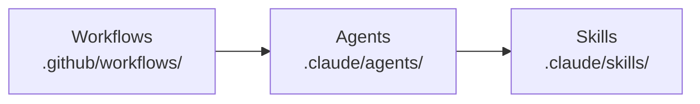
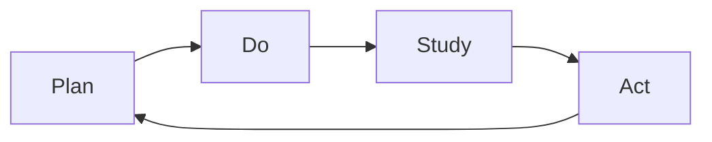
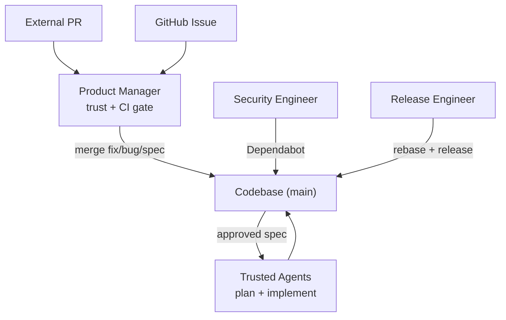

# Gemba

> "Go see, ask why, show respect."
>
> — Taiichi Ohno

Gemba is the Forward Impact repo self-maintenance system: autonomous agents
running on GitHub Actions that keep the codebase secure, release-ready, and
steadily improving. The name comes from the Toyota Production System concept of
_genba_ (現場) — "the real place where work happens." Gemba agents walk the real
place (the execution traces of prior runs) and act on what they find.

## Architecture



**Workflows** define schedule, trigger, and permissions. **Agents** define
persona, scope constraints, and skill composition. **Skills** define procedures,
checklists, and domain knowledge. All workflows share two composite actions:
`bootstrap/` (Bun + deps) and `gemba-action/` (runs a task via `fit-eval`,
captures an NDJSON execution trace, uploads it as an artifact).

## The PDSA Loop

Every workflow belongs to a phase of the **Plan-Do-Study-Act** cycle (after
Deming). Findings from Study always re-enter the loop as specs or fix PRs —
nothing is observed without a downstream action.



- **Plan** — Turn approved `spec.md` (WHAT/WHY) into `plan-a.md` (HOW) with
  steps, files, tests, and risks.
- **Do** — Execute plans via implementation PRs. Run scheduled workflows that
  harden, release, and maintain the codebase. Every run captures a full
  execution trace.
- **Study** — Analyze outputs from Do. Four streams: security posture audits,
  external feedback triage, documentation review (one topic deep per cycle), and
  trace analysis (one trace deep per cycle via grounded theory).
- **Act** — Convert findings into action. Trivial findings become fix PRs
  directly; structural findings become new `spec.md` documents entering the
  backlog. Fix PRs (`fix/` branches) and specs (`spec/` branches) are never
  mixed.

## Agents

Six agent personas, each with explicit scope constraints — when a finding
exceeds an agent's scope, it writes a spec rather than attempting the fix.

| Agent                 | Phase          | Purpose                                                             |
| --------------------- | -------------- | ------------------------------------------------------------------- |
| **staff-engineer**    | Plan, Do       | Own the full spec -> plan -> implement arc for approved specs       |
| **security-engineer** | Do, Study, Act | Patch dependencies, harden supply chain, enforce security policies  |
| **release-engineer**  | Do             | Keep PR branches merge-ready, repair trivial CI, cut releases       |
| **product-manager**   | Do, Study, Act | Triage issues and PRs, merge fix/bug/spec PRs, run evaluations      |
| **technical-writer**  | Study, Act     | Review docs for accuracy, curate wiki, fix staleness, spec gaps     |
| **improvement-coach** | Study, Act     | Walk traces, audit invariants, fix trivial issues, spec larger ones |

## Workflows

Ten scheduled workflows span 03-11 UTC. Times respect dependencies (plans before
implementation, rebase before merge, merge before release) and same-agent
workflows never overlap. Off-minute schedules avoid API load spikes. All support
`workflow_dispatch`, use concurrency groups, and have a 30-minute timeout.

| Workflow              | Phase          | Schedule                                | Agent             |
| --------------------- | -------------- | --------------------------------------- | ----------------- |
| **security-audit**    | Study          | Tue & Fri 04:07 UTC                     | security-engineer |
| **security-update**   | Do             | Mon & Thu 04:43 UTC                     | security-engineer |
| **product-manager**   | Do, Study, Act | Daily 08:13 UTC + Mon/Wed/Fri 05:17 UTC | product-manager   |
| **release-readiness** | Do             | Daily 06:23 UTC                         | release-engineer  |
| **plan-specs**        | Plan           | Daily 07:11 UTC                         | staff-engineer    |
| **implement-plans**   | Do             | Daily 07:53 UTC                         | staff-engineer    |
| **release-review**    | Do             | Tue, Thu, Sat 09:37 UTC                 | release-engineer  |
| **doc-review**        | Study, Act     | Mon & Thu 05:37 UTC                     | technical-writer  |
| **wiki-curate**       | Study, Act     | Wed & Sat 03:47 UTC                     | technical-writer  |
| **improvement-coach** | Study -> Act   | Wed & Sat 10:47 UTC                     | improvement-coach |

## Skills

All Gemba skills use the `gemba-` prefix. Each owns exactly one PDSA phase (or
none for utilities). Reading an agent's skill list reveals its phase coverage.

**Plan:** gemba-plan (specs -> executable plans). **Do:** gemba-implement
(execute plans), gemba-security-update (Dependabot triage, vulnerability fixes),
gemba-release-readiness (rebase, lint fix), gemba-release-review (version bumps,
tagging, publish verification). **Study:** gemba-security-audit (seven-area
security review), gemba-product-triage (issue classification),
gemba-product-classify (PR mergeability gate), gemba-product-evaluation (user
testing sessions), gemba-documentation (one topic deep per run),
gemba-wiki-curate (agent memory hygiene), gemba-walk (trace observation via
grounded theory). **Act:** gemba-spec (write specs capturing WHAT/WHY).
**Utility:** gemba-gh-cli (GitHub CLI patterns for CI), gemba-review (grade a
single artifact — leaf skill, never spawns sub-agents), gemba-ship (rebase,
push, open PR, merge a feature branch).

## Trust Boundary

The product manager is the sole external merge point. All other merge paths
operate on trusted sources (our agents, Dependabot).



| External PR type | What merges                     | Who implements                        |
| ---------------- | ------------------------------- | ------------------------------------- |
| `fix` / `bug`    | Contributor's code (small)      | The external contributor              |
| `spec`           | Specification document only     | Trusted agents, never the contributor |
| Everything else  | Nothing — requires human review | N/A                                   |

Top-20 contributors pass the trust gate. CI app PRs (`forward-impact-ci`) are
trusted by identity. Even a compromised top contributor cannot inject code
through the autonomous pipeline — specs merge only the document, not code.

## Design Principles

- **PDSA over pipeline.** Findings from Study always re-enter the loop.
- **Fix-or-spec discipline.** Mechanical fixes and structural improvements never
  share a PR.
- **Explicit scope constraints.** Each agent knows what it must _not_ do.
- **Trace-driven observability.** Every workflow captures a trace. The
  improvement coach must quote specific evidence — no speculation.
- **Least privilege.** Read-only workflows use `contents: read`. Write workflows
  use scoped per-run installation tokens.
- **Main branch CI repair.** See CONTRIBUTING.md for the release engineer's
  direct-to-`main` exception.

## Shared Memory

Agents share persistent memory via the **GitHub wiki** submodule at `wiki/`.
Synced by `just wiki-pull` (on `SessionStart`) and `just wiki-push` (on `Stop`).

Each agent maintains two file types:

- **Summary** (`<agent>.md`) — latest state: coverage, backlog, blockers,
  teammate observations.
- **Weekly log** (`<agent>-<YYYY>-W<VV>.md`) — one file per agent per week,
  keyed by ISO week-year.

Every scheduled run reads the summary and current week's log before acting,
appends findings to the log, and updates the summary at the end. Entry-point
skills must include a read step and a "Memory: what to record" section.
Sub-skills and utility skills are exempt.

## Authentication

Workflows authenticate via the **GitHub App** (`forward-impact-ci`), not a PAT.
Each run generates a short-lived installation token (1-hour expiry) via
`actions/create-github-app-token` — no long-lived secrets to rotate. The token
generates before `actions/checkout` so the checkout token triggers downstream
workflows. `security-audit` uses `GITHUB_TOKEN` for checkout (preserving least
privilege) and a separate App token for API access.

## Accountability

Cross-agent accountability runs through the `gemba-walk` skill's invariant
audit. The improvement coach verifies named per-agent invariants against the
actual trace on every walk — e.g., that the product manager ran a contributor
lookup before marking any non-CI-app PR mergeable. The canonical invariant list
lives in `.claude/skills/gemba-walk/references/invariants.md`. High-severity
audit failures must result in a fix PR or spec.

## Authoring Best Practices

Lessons from trace analysis of agent workflow runs.

### Instruction layering

Agent instructions span four layers, each owning a distinct concern:

1. **libeval system prompt** — relay mechanics (how turns work, completion)
2. **workflow task** — this run (which product, scenario, success criteria)
3. **agent profile** — who you are (persona, voice, skill routing, constraints)
4. **skills** — how to do it (procedures, checklists, templates)

No layer restates another's content. Tasks name skills — they don't copy steps.
Shared procedures belong in skills; per-run details belong in tasks. Profiles
define boundaries; skills define steps.

### Skill structure

SKILL.md is read on every run — aim for ~200 lines or fewer. Move supporting
material into co-located subdirectories:

```text
.claude/skills/<skill-name>/
  SKILL.md                     <- core instructions (always loaded)
  scripts/<name>.sh|.mjs       <- executable automation
  references/<name>.md         <- templates, examples, data tables
```

SKILL.md holds the decision-making procedure. `scripts/` holds repeatable
commands the agent runs verbatim. `references/` holds content the agent reads on
demand. Some skills are entirely instructional with nothing to extract — that's
fine.

### Recursion-safe self-review

Skills requiring independent review of their output must spawn a fresh sub-agent
targeting a **leaf skill** (`gemba-review`) whose process never spawns further
sub-agents. This prevents infinite recursion. Defense-in-depth: the parent's
review step also tells the sub-agent "do not invoke this skill."

### Shared patterns

Use identical wording for shared structural elements (memory instructions,
prerequisites, section headings) across all agents and skills. Inconsistent
wording correlated with agents skipping steps in trace analysis.

### SDK note

`resume()` does not persist `permissionMode` across resume boundaries — always
pass all session configuration again.
