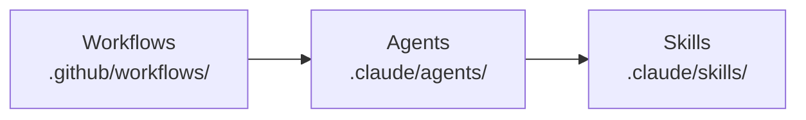
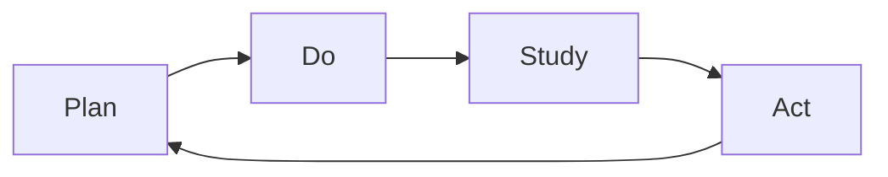
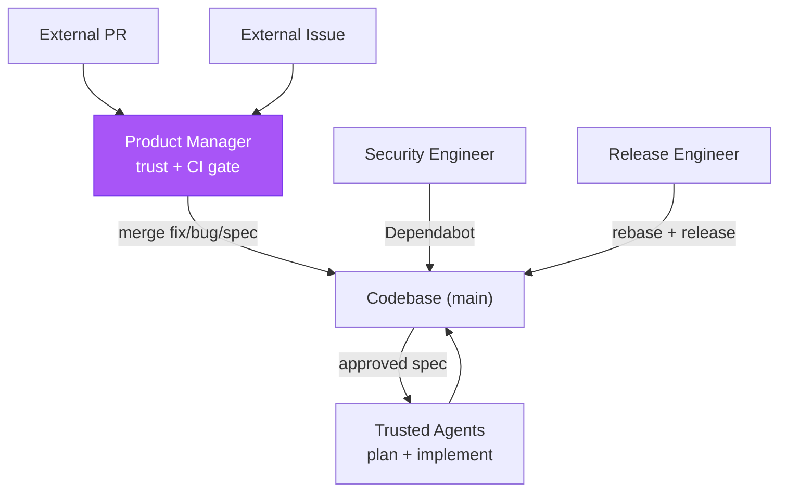

# Kata

> "What does the pattern of the Improvement Kata give us? A means for
> systematically and scientifically working toward a new desired condition, in a
> way that is appropriate for the unpredictability and uncertainty involved."
>
> — Mike Rother, _Toyota Kata_

Kata is the Forward Impact repo self-maintenance system: autonomous agents
running on GitHub Actions that keep the codebase secure, release-ready, and
steadily improving. The name comes from Toyota Kata — the improvement kata
pattern of _understand the direction_, _grasp the current condition_, _establish
the next target condition_, and _experiment toward it_. Kata agents grasp the
current condition (by analyzing execution traces of prior runs), establish
target conditions (via specs), and experiment toward them (via implementation).
Seven workflows — five individual agent runs scheduled across three shifts, one
daily team storyboard, and one on-demand coaching session — six agent personas,
and eighteen skills form a self-reinforcing PDSA cycle.

## Architecture



**Workflows** define schedule, trigger, and permissions. **Agents** define
persona, scope constraints, and skill composition. **Skills** define procedures,
checklists, and domain knowledge.

All workflows share two composite actions:

- `bootstrap/` — sets up Bun and installs dependencies.
- `kata-action/` — runs a task against an agent profile via `fit-eval`, captures
  the execution trace as NDJSON, and uploads it as an artifact.

## The PDSA Loop

Every workflow belongs to a phase of the **Plan-Do-Study-Act** cycle (after
Deming). Findings from Study always re-enter the loop as specs or fix PRs —
nothing is observed without a downstream action.



- **Plan** — Turn approved `spec.md` (WHAT/WHY) into `design.md` (WHICH/WHERE)
  and then `plan-a.md` (HOW/WHEN) with steps, files, sequencing, and risks.
- **Do** — Execute plans via implementation PRs. Run scheduled workflows that
  harden, release, and maintain the codebase. Every run captures a full
  execution trace.
- **Study** — Analyze outputs from Do. Four streams: security posture audits,
  external feedback triage, documentation review (one topic deep per cycle), and
  trace analysis (one trace deep per cycle via grounded theory).
- **Act** — Convert findings into action. Trivial findings become fix PRs
  directly; structural findings become new `spec.md` documents entering the
  backlog. Fix PRs (`fix/` branches) and specs (`spec/` branches) are never
  mixed.

## Agents

Six agent personas, each with explicit scope constraints — when a finding
exceeds an agent's scope, it writes a spec rather than attempting the fix.

| Agent                 | Phase          | Purpose                                                                 |
| --------------------- | -------------- | ----------------------------------------------------------------------- |
| **staff-engineer**    | Plan, Do       | Own the full spec -> design -> plan -> implement arc for approved specs |
| **release-engineer**  | Do             | Keep PR branches merge-ready, repair trivial CI, cut releases           |
| **security-engineer** | Do, Study, Act | Patch dependencies, harden supply chain, enforce security policies      |
| **product-manager**   | Do, Study, Act | Triage issues and PRs, merge fix/bug/spec PRs, run evaluations          |
| **technical-writer**  | Study, Act     | Review docs for accuracy, curate wiki, fix staleness, spec gaps         |
| **improvement-coach** | Study          | Facilitate storyboard meetings and 1-on-1 coaching sessions             |

## Workflows

Seven workflows run on a three-shift rhythm aligned to Europe/Paris time: a
**night shift** finishes by 07:00, the **storyboard** runs at 08:00, a **day
shift** finishes by 15:00, and a **swing shift** finishes by 23:00. Within each
shift agents form a producer → reviewer → shipper chain: product-manager triages
and merges incoming work so staff-engineer has a fresh backlog, staff
implements, and release-engineer ships. On the night shift — the full cycle
before the morning storyboard — security-engineer and technical-writer slot in
between staff and release so they can review the code staff just produced before
it ships. Day and swing shifts skip the review pair; dependency churn and
documentation drift do not need intra-day cadence, and CVE-driven work can run
on demand via `workflow_dispatch`. Cron schedules are authored in UTC; Paris
times below use CEST (UTC+2), the tighter summer constraint. All support
`workflow_dispatch`, use concurrency groups, and have a 30-minute timeout.
Individual agent workflows send a generic task prompt; the agent's Assess
section determines the actual action. The storyboard and coaching session send
specific task prompts to the improvement coach as facilitator.

| Workflow                    | Schedule (Paris, CEST)                | Agent                                    |
| --------------------------- | ------------------------------------- | ---------------------------------------- |
| **kata-storyboard**         | Daily 08:00                           | improvement-coach (facilitates 5 agents) |
| **kata-coaching**           | `workflow_dispatch`                   | improvement-coach (facilitates 1 agent)  |
| **agent-product-manager**   | Night 03:23 · Day 12:17 · Swing 20:17 | product-manager                          |
| **agent-staff-engineer**    | Night 04:11 · Day 13:11 · Swing 21:11 | staff-engineer                           |
| **agent-security-engineer** | Night 04:53                           | security-engineer                        |
| **agent-technical-writer**  | Night 05:37                           | technical-writer                         |
| **agent-release-engineer**  | Night 06:23 · Day 14:23 · Swing 22:23 | release-engineer                         |

## Skills

All Kata skills use the `kata-` prefix. Each owns exactly one PDSA phase (or
none for utilities). Reading an agent's skill list reveals its phase coverage.

| Skill                     | Phase   | Purpose                                       |
| ------------------------- | ------- | --------------------------------------------- |
| `kata-design`             | Plan    | Specs to architectural design documents       |
| `kata-plan`               | Plan    | Designs to executable plans                   |
| `kata-implement`          | Do      | Execute plans step by step                    |
| `kata-security-update`    | Do      | Dependabot triage, vulnerability fixes        |
| `kata-release-readiness`  | Do      | Rebase, lint fix, merge readiness             |
| `kata-release-review`     | Do      | Version bumps, tagging, publish verification  |
| `kata-security-audit`     | Study   | Seven-area security review                    |
| `kata-product-issue`      | Study   | Issue triage against product vision           |
| `kata-product-pr`         | Study   | PR merge gate (trust, type, CI, spec quality) |
| `kata-product-evaluation` | Study   | User testing sessions                         |
| `kata-documentation`      | Study   | One topic deep per run                        |
| `kata-wiki-curate`        | Study   | Agent memory hygiene                          |
| `kata-trace`              | Study   | Trace analysis via grounded theory            |
| `kata-spec`               | Act     | Write specs capturing WHAT/WHY                |
| `kata-metrics`            | Utility | Time-series recording and XmR analysis        |
| `kata-review`             | Utility | Grade a single artifact (leaf, no sub-agents) |
| `kata-ship`               | Utility | Rebase, push, open PR, merge a feature branch |
| `kata-storyboard`         | Utility | Toyota Kata coaching protocol for meetings    |

## Trust Boundary

The product manager is the sole external merge point. All other merge paths
operate on trusted sources (our agents, Dependabot).



| External PR type | What merges                     | Who implements                        |
| ---------------- | ------------------------------- | ------------------------------------- |
| `fix` / `bug`    | Contributor's code (small)      | The external contributor              |
| `spec`           | Specification document only     | Trusted agents, never the contributor |
| Everything else  | Nothing — requires human review | N/A                                   |

Top-7 contributors pass the trust gate. CI app PRs (`forward-impact-ci`) are
trusted by identity. Even a compromised top contributor cannot inject code
through the autonomous pipeline — specs merge only the document, not code.

## Design Principles

- **PDSA over pipeline.** Findings from Study always re-enter the loop.
- **Fix-or-spec discipline.** Mechanical fixes and structural improvements never
  share a PR.
- **Explicit scope constraints.** Each agent knows what it must _not_ do.
- **Trace-driven observability.** Every workflow captures a trace. The
  improvement coach must quote specific evidence — no speculation.
- **Least privilege.** Read-only workflows use `contents: read`. Write workflows
  use scoped per-run installation tokens.
- **Main branch CI repair.** See CONTRIBUTING.md for the release engineer's
  direct-to-`main` exception.

## Shared Memory

Agents share persistent memory via the **GitHub wiki** at `wiki/`. Cloned on
demand and synced by `just wiki-pull` (on `SessionStart`) and `just wiki-push`
(on `Stop`).

Each agent maintains two file types:

- **Summary** (`<agent>.md`) — latest state: coverage, backlog, blockers,
  teammate observations.
- **Weekly log** (`<agent>-<YYYY>-W<VV>.md`) — one file per agent per week,
  keyed by ISO week-year.

Every scheduled run reads the summary and current week's log before acting,
appends findings to the log, and updates the summary at the end. Entry-point
skills must include a read step and a "Memory: what to record" section.
Sub-skills and utility skills are exempt.

## Metrics

Agents record time-series data to `wiki/metrics/{agent}/{domain}/{YYYY}.csv`
after each run. The `kata-metrics` skill defines the CSV schema (six fields:
date, metric, value, unit, run, note), storage convention, and metric design
guidance. Each entry-point skill carries a `references/metrics.md` suggesting
domain-specific metrics.

Metrics serve the coaching cycle: the team storyboard meeting (see Workflows
table) uses metric data to answer "what is the actual condition now?" with
numbers rather than narratives. Process behavior charts (XmR) built from the
time series distinguish stable processes from those reacting to special causes.

All agents — both facilitator and participants — load `kata-storyboard` and
`kata-metrics`. During storyboard meetings, each participant records its own
domain metrics to CSV before sharing them with the team, ensuring measurements
persist as structured data rather than only as narrative in the storyboard
markdown.

## Authentication

Workflows authenticate via the **GitHub App** (`forward-impact-ci`), not a PAT.
Each run generates a short-lived installation token (1-hour expiry) via
`actions/create-github-app-token` — no long-lived secrets to rotate. The token
generates before `actions/checkout` so the checkout token triggers downstream
workflows.

## Accountability

Cross-agent accountability runs through the `kata-trace` skill's invariant
audit. Domain agents verify their own per-agent invariants against their own
traces during 1-on-1 coaching sessions facilitated by the improvement coach —
e.g., that the product manager ran a contributor lookup before marking any
non-CI-app PR mergeable. The canonical invariant list lives in
`.claude/skills/kata-trace/references/invariants.md`. High-severity audit
failures must result in a fix PR or spec.

## Authoring Best Practices

Lessons from trace analysis of agent workflow runs.

### Instruction layering

Agent instructions span seven layers, each owning a distinct concern:

1. **libeval system prompt** — relay mechanics (how turns work, completion)
2. **CLAUDE.md** — project identity (goal, users, products, distribution model,
   documentation map)
3. **CONTRIBUTING.md** — contribution standards (invariants, technical rules,
   quality gates, git conventions, security)
4. **workflow task** — this run (which product, scenario, success criteria)
5. **agent profile** — who you are (persona, voice, skill routing, constraints)
6. **skills** — how to do it (procedures, templates, domain knowledge)
7. **checklists** — did you do it (yes/no verification at pause points)

Layer 2 is auto-loaded via `settingSources: ["project"]`; layer 3 is referenced
by layer 2 and read on demand. Layers 6 and 7 coexist in the same file
(SKILL.md) but serve fundamentally different purposes — skill instructions are
_procedural_ (they teach, explain, and guide decisions), checklists are
_verificational_ (each item is a binary assertion that a prior step was
completed, with no explanation of how). Similarly, CONTRIBUTING.md spans layers:
its invariants and rules are layer 3 content, while its universal READ-DO and
DO-CONFIRM checklists are layer 7 content.

Rules:

- No layer restates another's content. When two layers mention the same tool,
  use voice to separate them: layer 1 describes what a tool is ("ToolX sends a
  message to ThingY"), layer 6 directs when to use it ("Use ToolX to deliver the
  quarterly finance report to ThingY").
- Agents follow the most specific layer. A skill that provides a complete
  procedure makes system-level tool descriptions invisible — tools not named in
  the skill procedure will not be used regardless of what layer 1 says.
- CLAUDE.md orients — what the project is, who it serves, where to find things.
  It never contains technical rules or step-by-step procedures.
- CONTRIBUTING.md governs — how contributions must behave. All technical
  invariants, quality commands, and policies live here. Domain-specific
  procedures belong in skills.
- Tasks name skills — they don't copy steps. Shared procedures belong in skills;
  per-run details belong in tasks.
- Profiles define boundaries; skills define steps; checklists verify steps.
- A checklist item must never teach how to do something — that belongs in the
  skill procedure above it. If a checklist item needs explanation, the procedure
  is incomplete.

### Instruction length

Auto-loaded layers consume context on every run. Keep them tight so agents spend
tokens on the task, not on re-reading project boilerplate.

| Layer           | Target | Loaded           |
| --------------- | ------ | ---------------- |
| CLAUDE.md       | ≤ 192  | auto (every run) |
| CONTRIBUTING.md | ≤ 256  | on demand        |
| Agent profile   | ≤ 64   | auto (every run) |
| SKILL.md        | ≤ 192  | auto (per skill) |

The same principle applies across layers: keep the main file to its concern;
push supporting material into co-located references or linked documents.

### Skill structure

Move supporting material out of SKILL.md into co-located subdirectories:

```text
.claude/skills/<skill-name>/
  SKILL.md                     <- core instructions (always loaded)
  scripts/<name>.sh|.mjs       <- executable automation
  references/<name>.md         <- templates, examples, data tables
```

SKILL.md holds the decision-making procedure. `scripts/` holds repeatable
commands the agent runs verbatim. `references/` holds content the agent reads on
demand. Some skills are entirely instructional with nothing to extract — that's
fine. Entry-point skills include tagged checklists as verification gates (see
below).

### Checklists

Checklists are the lowest instruction layer — they verify that higher layers
were followed without restating them. Two tagged types serve as gates at natural
pause points:

- **`<read_do_checklist>`** — Entry gate. Read each item, then do it.
- **`<do_confirm_checklist>`** — Exit gate. Do from memory, then confirm every
  item before crossing a boundary.

The boundary between skill procedure and checklist is strict: if the agent needs
the checklist item to _learn_ what to do, the item belongs in the procedure. If
the agent already knows what to do and the item only confirms it was done, it
belongs in the checklist. Duplicating procedural guidance into checklist items
bloats the document and creates contradiction risk when one copy is updated
without the other.

Keep checklists short (5–9 items), action-oriented, and free of explanation.
Entry-point skills embed domain-specific checklists; universal checklists live
in CONTRIBUTING.md. See [CHECKLISTS.md](CHECKLISTS.md) for design rules, type
selection, and authoring guidance.

### Recursion-safe self-review

Skills requiring independent review of their output must spawn a fresh sub-agent
targeting a **leaf skill** (`kata-review`) whose process never spawns further
sub-agents. This prevents infinite recursion. Defense-in-depth: the parent's
review step also tells the sub-agent "do not invoke this skill." Callers spawn a
**panel** of such leaf reviewers in parallel and merge findings by majority
vote; panel size does not change the leaf invariant. See the `kata-review`
caller protocol for panel sizes and merge algorithm.

### Shared patterns

Use identical wording for shared structural elements (memory instructions,
prerequisites, section headings) across all agents and skills. Inconsistent
wording correlated with agents skipping steps in trace analysis.

### SDK caveat

`resume()` does not persist `permissionMode` across resume boundaries — always
pass all session configuration again when calling `resume()`.
