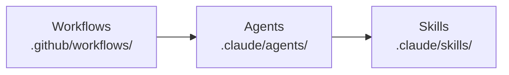
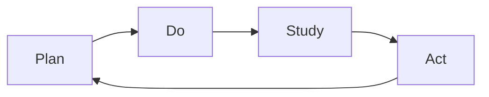
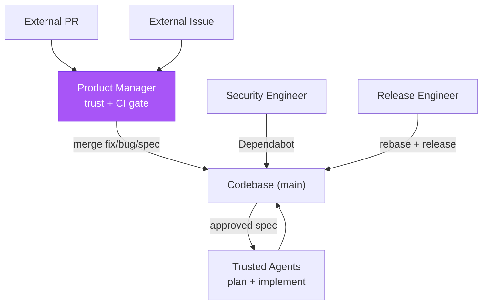

# Kata Agent Team

> "What does the pattern of the Improvement Kata give us? A means for
> systematically and scientifically working toward a new desired condition, in a
> way that is appropriate for the unpredictability and uncertainty involved."
>
> — Mike Rother, _Toyota Kata_

The Kata Agent Team is an autonomous and continuously improving agentic
development team running on GitHub Actions. It owns the full spec → design →
plan → implement → release → improve loop end-to-end: shipping features,
hardening security, cutting releases, curating docs, and improving its own
practice. The name follows Toyota Kata — agents grasp the current condition (via
prior-run traces), establish target conditions (via specs), and experiment
toward them (via implementation). Eight workflows (five scheduled agent runs
across three shifts, a daily storyboard, an on-demand coaching session, an
event-driven conversation responder), six agent personas, and eighteen skills
form a self-reinforcing PDSA cycle.

## Architecture

**Workflows** define schedule, trigger, permissions; **Agents** define persona,
scope, skill composition; **Skills** define procedures, checklists, domain
knowledge. Two composite actions are shared by all workflows: `bootstrap/`
(Bun + dependencies) and `kata-action/` (runs a task against an agent profile
via `fit-eval`, capturing the execution trace as NDJSON artifact).

## The PDSA Loop

Every workflow belongs to a phase of the **Plan-Do-Study-Act** cycle (after
Deming). Findings from Study always re-enter the loop as specs or fix PRs —
nothing is observed without downstream action.

- **Plan** — Turn approved `spec.md` (WHAT/WHY) into `design-a.md` (WHICH/WHERE)
  then `plan-a.md` (HOW/WHEN) with steps, files, sequencing, risks.
- **Do** — Execute plans via implementation PRs; run scheduled workflows that
  harden, release, and maintain. Every run captures a trace.
- **Study** — Analyze Do outputs across four streams: security audits, external
  feedback triage, one-topic-deep doc review, one-trace-deep grounded theory.
- **Act** — Trivial findings become **pushed fix PRs**; structural findings
  become `spec.md` documents on **pushed spec branches**. A local commit is not
  a PR — the URL is the only valid completion signal. `fix/` and `spec/`
  branches never mix.

## Agents

Six personas with explicit scope constraints — when a finding exceeds scope, the
agent writes a spec rather than attempting the fix.

| Agent                 | Phase          | Purpose                                                                 |
| --------------------- | -------------- | ----------------------------------------------------------------------- |
| **staff-engineer**    | Plan, Do       | Own the full spec -> design -> plan -> implement arc for approved specs |
| **release-engineer**  | Do             | Keep PR branches merge-ready, repair trivial CI, cut releases           |
| **security-engineer** | Do, Study, Act | Patch dependencies, harden supply chain, enforce security policies      |
| **product-manager**   | Do, Study, Act | Triage issues and PRs, merge fix/bug/spec PRs, run evaluations          |
| **technical-writer**  | Study, Act     | Review docs for accuracy, curate wiki, fix staleness, spec gaps         |
| **improvement-coach** | Study          | Facilitate storyboard meetings and 1-on-1 coaching sessions             |

## Workflows

Seven scheduled workflows run on a three-shift Europe/Paris rhythm: **night** by
07:00, **storyboard** at 08:00, **day** by 15:00, **swing** by 23:00. Each shift
forms a producer → reviewer → shipper chain: product-manager triages and merges
so staff has a fresh backlog, staff implements, release ships. The night shift —
the full cycle before the morning storyboard — slots security-engineer and
technical-writer between staff and release to review code before it ships; day
and swing skip the review pair (dependency churn and doc drift need no intra-day
cadence; CVE-driven work runs on demand). Crons are authored in UTC; Paris times
below use CEST (UTC+2), the tighter summer bound. An eighth workflow,
**agent-conversation**, runs on PR comments, new discussions, and discussion
comments — the product manager facilitates and routes the comment to the
participant best suited to respond. All workflows support `workflow_dispatch`,
use concurrency groups, and time out at 30 minutes. Agent workflows send a
generic prompt; the agent's Assess section picks the action. Storyboard and
coaching send specific prompts to the improvement coach.

| Workflow                    | Schedule (Paris, CEST)                | Agent                                    |
| --------------------------- | ------------------------------------- | ---------------------------------------- |
| **kata-storyboard**         | Daily 08:00                           | improvement-coach (facilitates 5 agents) |
| **kata-coaching**           | `workflow_dispatch`                   | improvement-coach (facilitates 1 agent)  |
| **agent-product-manager**   | Night 03:23 · Day 12:17 · Swing 20:17 | product-manager                          |
| **agent-staff-engineer**    | Night 04:11 · Day 13:11 · Swing 21:11 | staff-engineer                           |
| **agent-security-engineer** | Night 04:53                           | security-engineer                        |
| **agent-technical-writer**  | Night 05:37                           | technical-writer                         |
| **agent-release-engineer**  | Night 06:23 · Day 14:23 · Swing 22:23 | release-engineer                         |
| **agent-conversation**      | On PR/discussion activity             | product-manager (facilitates 4 agents)   |

## Skills

All Kata skills use the `kata-` prefix and own exactly one PDSA phase (or none
for utilities). An agent's skill list reveals its phase coverage.

| Skill                     | Phase   | Purpose                                       |
| ------------------------- | ------- | --------------------------------------------- |
| `kata-design`             | Plan    | Specs to architectural design documents       |
| `kata-plan`               | Plan    | Designs to executable plans                   |
| `kata-implement`          | Do      | Execute plans step by step                    |
| `kata-security-update`    | Do      | Dependabot triage, vulnerability fixes        |
| `kata-release-readiness`  | Do      | Rebase, lint fix, merge readiness             |
| `kata-release-review`     | Do      | Version bumps, tagging, publish verification  |
| `kata-security-audit`     | Study   | Seven-area security review                    |
| `kata-product-issue`      | Study   | Issue triage against product vision           |
| `kata-product-pr`         | Study   | PR merge gate (trust, type, CI, spec quality) |
| `kata-product-evaluation` | Study   | User testing sessions                         |
| `kata-documentation`      | Study   | One topic deep per run                        |
| `kata-wiki-curate`        | Study   | Agent memory hygiene                          |
| `kata-trace`              | Study   | Trace analysis via grounded theory            |
| `kata-spec`               | Act     | Write specs capturing WHAT/WHY                |
| `kata-metrics`            | Utility | Time-series recording and XmR analysis        |
| `kata-review`             | Utility | Grade a single artifact (leaf, no sub-agents) |
| `kata-ship`               | Utility | Rebase, push, open PR, merge a feature branch |
| `kata-session`            | Utility | Toyota Kata coaching protocol for sessions    |

## Trust Boundary

The product manager is the sole external merge point; all other merge paths
operate on trusted sources (our agents, Dependabot).

| External PR type | What merges                     | Who implements                        |
| ---------------- | ------------------------------- | ------------------------------------- |
| `fix` / `bug`    | Contributor's code (small)      | The external contributor              |
| `spec`           | Specification document only     | Trusted agents, never the contributor |
| Everything else  | Nothing — requires human review | N/A                                   |

Top-7 contributors pass the trust gate; `forward-impact-ci` PRs are trusted by
identity. A compromised top contributor cannot inject code via this pipeline —
specs merge only the document, not code.

## Design Principles

- **PDSA over pipeline.** Findings from Study always re-enter the loop.
- **Fix-or-spec discipline.** Mechanical fixes and structural improvements never
  share a PR.
- **Explicit scope constraints.** Each agent knows what it must _not_ do.
- **Trace-driven accountability.** Every workflow captures a trace; the
  improvement coach quotes specific evidence — no speculation. `kata-trace`'s
  invariant audit (`.claude/skills/kata-trace/references/invariants.md`) is the
  **enforcement mechanism** for per-agent and cross-cutting rules; high-severity
  failures trigger a fix or spec.
- **Least privilege.** The workflow-level `permissions:` block restricts only
  `GITHUB_TOKEN`, not the App token. All agent workflows set
  `permissions: contents: write` — the minimum for checkout fallback. The App
  token carries all coordination-channel permissions (Issues, PRs, Discussions)
  via its installation settings; adding those to `permissions:` would only widen
  `GITHUB_TOKEN`'s blast radius.
- **Main branch CI repair.** See CONTRIBUTING.md for the release engineer's
  direct-to-`main` exception.

## Shared Memory

Agents share persistent memory via the **GitHub wiki** at `wiki/`, cloned on
demand and synced by `just wiki-pull` (on `SessionStart`) and `just wiki-push`
(on `Stop`). The wiki is a separate checkout, not a submodule — `wiki/` is
gitignored, and only the `Stop` hook publishes wiki commits; never
`git add wiki` into a main-repo commit.

Each agent maintains a **summary** (`<agent>.md`) — latest state, backlog,
blockers, teammate observations — and a **weekly log**
(`<agent>-<YYYY>-W<VV>.md`), one file per agent per ISO week. The canonical
read-summary, append-log, update-summary cadence is defined in
[`memory-protocol.md`](.claude/agents/references/memory-protocol.md), an
agent-level shared reference. Entry-point skills include a read step and a
"Memory: what to record" section; sub-skills and utility skills are exempt. The
wiki holds settled state — open questions live in Discussions until answered.

## Coordination Channels

Four channels carry agent-to-agent and agent-to-human collaboration,
distinguished by **time horizon** and **persistence**. Per-output coordination
across them — including cross-agent escalation, run-time trust, Discussion
ownership, and inbound comment handling — is governed by
[coordination-protocol.md](.claude/agents/references/coordination-protocol.md),
the sibling of `memory-protocol.md`. Each channel has an explicit non-purpose so
they don't compete.

| Channel               | Use for                                                                                                      | Lifetime                              | Mechanism                     |
| --------------------- | ------------------------------------------------------------------------------------------------------------ | ------------------------------------- | ----------------------------- |
| **Storyboard**        | Daily current condition and next experiment                                                                  | One day; captured into wiki           | `kata-storyboard` workflow    |
| **Discussion**        | Open questions before they become decisions — RFCs, cross-policy                                             | Open until resolved into spec or wiki | `agent-conversation` workflow |
| **PR / issue thread** | Real-time response on a specific artifact; PDSA state for experiment and obstacle issues                     | Lives with the artifact               | `agent-conversation` workflow |
| **Sub-agent**         | Specialized inline work within one run (not for cross-agent comms — see escalation in coordination-protocol) | Ephemeral (one task)                  | `Agent` tool, skill spawning  |

- **Storyboard** observes and plans; structural decisions go through
  `kata-spec`, not the meeting.
- **Discussions** must terminate: every thread either resolves into a spec or
  wiki note, or closes as "not now". Otherwise they compete with the wiki as a
  source of truth.
- **PR/issue threads** are scoped to one artifact — cross-cutting questions
  belong in a Discussion. Experiment and obstacle issues own their PDSA state;
  the storyboard references them as one-liners.
- **Sub-agents** don't carry state across runs — that's the wiki's job.

## Metrics

Agents record time-series data to `wiki/metrics/{agent}/{domain}/{YYYY}.csv`
after each run. The `kata-metrics` skill defines the CSV schema (six fields:
date, metric, value, unit, run, note), storage convention, and metric design;
each entry-point skill carries a `references/metrics.md` suggesting
domain-specific metrics.

Metrics drive the coaching cycle: the storyboard meeting answers "what is the
actual condition now?" with numbers, not narratives, and XmR process behavior
charts distinguish stable processes from special-cause reactions. All agents —
facilitator and participants — load `kata-session` and `kata-metrics`. Each
participant records metrics to CSV before sharing in storyboard, so measurements
persist as structured data rather than prose.

## Authentication

Workflows authenticate via the **GitHub App** `forward-impact-kata`, not a PAT.
Each run generates a 1-hour installation token via
`actions/create-github-app-token` — no long-lived secrets to rotate. The token
must generate before `actions/checkout` so checkout-token writes trigger
downstream workflows.

### GitHub App setup

Register `forward-impact-ci` as an organization-owned GitHub App, install it on
the monorepo, and grant these **repository permissions** (least-privilege — each
maps to at least one workflow):

| Permission    | Why                                                                                                      |
| ------------- | -------------------------------------------------------------------------------------------------------- |
| Contents      | Checkout, commit, push to `fix/`, `spec/`, release branches                                              |
| Pull requests | Open, comment, merge PRs (release-engineer, product-manager)                                             |
| Issues        | Triage, label, comment (product-manager); create, comment, close (improvement-coach via kata-storyboard) |
| Discussions   | Reply on discussions and discussion comments (agent-conversation)                                        |
| Workflows     | Token-driven pushes re-trigger downstream workflows                                                      |
| Metadata      | Required by GitHub                                                                                       |

Subscribe the App to the **Issue comment**, **Pull request review**, **Pull
request review comment**, **Discussion**, and **Discussion comment** events so
`agent-conversation` fires. Two repository secrets carry the App identity:
`CI_APP_ID` and `CI_APP_PRIVATE_KEY`. `ANTHROPIC_API_KEY` is a separate secret
consumed only by `kata-action`. The interview workflows use a second App
(`LLM_APP_ID` / `LLM_APP_PRIVATE_KEY`) and `publish-npm` uses `NPM_TOKEN`;
neither is required for Kata.

## Authoring Best Practices

Lessons from trace analysis of agent workflow runs.

### Instruction layering

Agent instructions span eight layers, ascending from most general (every agent,
every run) to most specific (one step, one pause point):

1. **libeval system prompt** — relay mechanics: turns, tool calls, completion
   signalling. Loaded once per session.
2. **CLAUDE.md** — project identity: goal, users, products, distribution, doc
   map. Auto-loaded via `settingSources: ["project"]`.
3. **CONTRIBUTING.md** — contribution standards: invariants, technical rules,
   quality gates, git, security. Referenced by L2; read on demand.
4. **workflow task** — this run: product, scenario, success criteria. Passed in
   by workflow YAML.
5. **agent profile** — persona, voice, skill routing, scope constraints.
   Auto-loaded every run.
6. **skill procedure (SKILL.md)** — decision-making, sequencing, rationale.
   Auto-loaded per skill.
7. **skill references (references/)** — data the procedure consults: templates,
   worked examples, invariant tables, lookup data. Read on demand.
8. **checklists** — binary verification at pause points, no explanation. In
   SKILL.md (domain) or CONTRIBUTING.md (universal).

L6/L7/L8 share a skill folder but serve different concerns: L6 is _procedural_,
L7 is _declarative_, L8 is _verificational_. L7 earns its own slot because a
defective template is a different class of problem from a defective procedure —
trace attribution must separate "wrong procedure" from "stale data" from
"missing verification". CONTRIBUTING.md likewise spans layers: invariants are
L3; its universal READ-DO and DO-CONFIRM checklists are L8.

Rules:

- No layer restates another. When two layers mention the same tool, separate by
  voice: L1 describes ("ToolX sends a message to ThingY"), L6 directs ("Use
  ToolX to deliver the report to ThingY").
- Agents follow the most specific layer — a complete skill procedure makes
  system-level tool descriptions invisible.
- CLAUDE.md orients (what, who, where); CONTRIBUTING.md governs (invariants,
  quality commands, policies); domain procedures live in skills.
- Tasks name skills; they don't copy steps. Shared procedures in skills; per-run
  details in tasks.
- Profiles define boundaries; procedures define steps; references supply data;
  checklists verify steps.
- A reference is declarative, not procedural — prescribing steps belongs in
  SKILL.md.
- A checklist item must never teach. If an item needs explanation, the procedure
  above it is incomplete.

### Instruction length

Auto-loaded layers consume context on every run; keep them tight so agents spend
tokens on the task, not boilerplate. Limits enforced by
`scripts/check-instructions.mjs`:

| Layer                    | Target      | Loaded           |
| ------------------------ | ----------- | ---------------- |
| L2 CLAUDE.md             | ≤ 192 lines | auto (every run) |
| L3 CONTRIBUTING.md       | ≤ 256 lines | on demand        |
| L5 Agent profile         | ≤ 64 lines  | auto (every run) |
| L6 SKILL.md              | ≤ 192 lines | auto (per skill) |
| L7 Skill reference file  | ≤ 128 lines | on demand        |
| L8 Checklist (per block) | ≤ 9 items   | auto (per skill) |

Same principle across layers: keep the main file to its concern; push supporting
material into references or linked docs. L8 is gated by item count, not lines —
wrapped-line length is a formatting artifact, not cognitive load.

### Skill structure

Move supporting material out of SKILL.md into co-located subdirectories.
SKILL.md holds the procedure (always loaded); `scripts/<name>.sh|.mjs` holds
commands run verbatim; `references/<name>.md` holds on-demand content
(templates, examples, data tables). Purely instructional skills with nothing to
extract are fine.

### Checklists

Checklists are L8 — they verify higher layers without restating them. Two tagged
types serve as gates at natural pause points:

- **`<read_do_checklist>`** — Entry gate. Read each item, then do it.
- **`<do_confirm_checklist>`** — Exit gate. Do from memory, then confirm before
  crossing a boundary.

The procedure/checklist boundary is strict: if an agent needs an item to _learn_
what to do, it belongs in the procedure; if it only confirms a known step was
done, it belongs in the checklist. Duplicating procedural guidance into
checklists bloats the document and risks contradiction.

Keep checklists short (5–9 items), action-oriented, free of explanation.
Entry-point skills embed domain-specific checklists; universal checklists live
in CONTRIBUTING.md. See [CHECKLISTS.md](CHECKLISTS.md) for design rules.

### Publishing as a gate

Autonomous agents default to human-loop handoff ("ready for PR when you'd like
me to push") when no exit criterion requires external state change. Any skill
producing code (`fix/` or `spec/` branches) must rely on the universal
DO-CONFIRM's push + PR item as its publishing gate — publishing steps described
only in L6 prose correlate with agents stopping after local commit on ephemeral
runners, losing the work. No skill restates the push + PR gate.

### Recursion-safe self-review

Skills needing independent review spawn a sub-agent targeting a **leaf skill**
(`kata-review`) that never spawns further sub-agents, preventing infinite
recursion. Defense-in-depth: the parent also tells the sub-agent "do not invoke
this skill." Callers spawn a **panel** of leaf reviewers in parallel and merge
findings by majority vote; panel size does not change the leaf invariant. See
`kata-review`'s caller protocol for panel sizes and merge algorithm.

### Shared patterns

Use identical wording for shared structural elements (memory instructions,
prerequisites, section headings) across all agents and skills — inconsistent
wording correlates with agents skipping steps in trace analysis.
