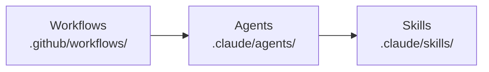
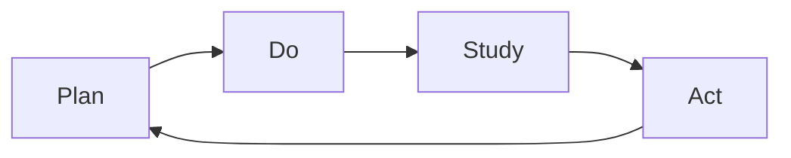
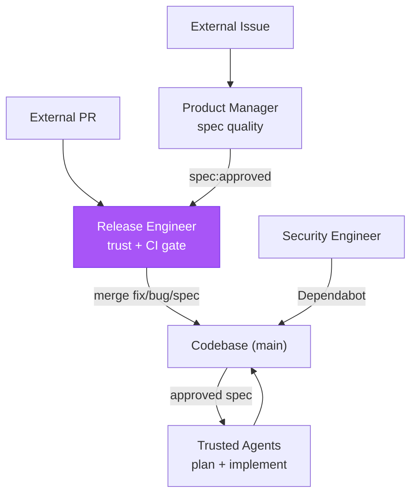

# Kata Agent Team

> "What does the pattern of the Improvement Kata give us? A means for
> systematically and scientifically working toward a new desired condition, in a
> way that is appropriate for the unpredictability and uncertainty involved."
>
> — Mike Rother, _Toyota Kata_

The Kata Agent Team is an autonomous and continuously improving agentic
development team running on GitHub Actions, organized as a daily
**Plan-Do-Study-Act** (PDSA) cycle. Agents plan by writing specs, do by shipping
features and hardening the repo, study their own execution traces and outputs,
and act on findings — closing the loop every day. The name follows Toyota Kata:
agents grasp the current condition (via prior-run traces), establish target
conditions (via specs), and experiment toward them (via implementation). Eight
workflows (five scheduled agent runs across three shifts, a daily storyboard, an
on-demand coaching session, an event-driven conversation responder), six agent
personas, and seventeen skills form this cycle.

## Architecture

**Workflows** define schedule, trigger, permissions; **Agents** define persona,
scope, skill composition; **Skills** define procedures, checklists, domain
knowledge. Composite actions under `.github/actions/` encapsulate shared CI
steps: `bootstrap/` (Bun + dependencies), `kata-action-eval/` (runs `fit-eval`
with trace capture), and `kata-action-agent/` (full agent workflow wrapping the
other two).

## Actions

Two composite actions, publishable as third-party GitHub Actions:

- **`kata-action-eval`** — Runs `fit-eval` with trace capture and artifact
  upload. Wraps a single fit-eval invocation.
- **`kata-action-agent`** — Full agent workflow: auth, checkout, bootstrap,
  eval. The primary integration point for consumers.

Internal workflows use local paths (`./.github/actions/kata-action-agent`);
external installations use `forwardimpact/kata-action-agent@v1`. Run
`kata-setup` to generate workflows interactively.

## The PDSA Loop

Every workflow belongs to a phase of the **Plan-Do-Study-Act** cycle (after
Deming). Findings from Study always re-enter the loop as specs or fix PRs —
nothing is observed without downstream action.

- **Plan** — Turn approved `spec.md` (WHAT/WHY) into `design-a.md` (WHICH/WHERE)
  then `plan-a.md` (HOW/WHEN) with steps, files, sequencing, risks.
- **Do** — Execute plans via implementation PRs; run scheduled workflows that
  harden, release, and maintain. Every run captures a trace.
- **Study** — Analyze Do outputs across four streams: security audits, external
  feedback triage, one-topic-deep doc review, one-trace-deep grounded theory.
- **Act** — Trivial findings become **pushed fix PRs**; structural findings
  become `spec.md` documents on **pushed spec branches**. A local commit is not
  a PR — the URL is the only valid completion signal. `fix/` and `spec/`
  branches never mix.

## Agents

Six personas with explicit scope constraints — when a finding exceeds scope, the
agent writes a spec rather than attempting the fix.

| Agent                 | Phase          | Purpose                                                                 |
| --------------------- | -------------- | ----------------------------------------------------------------------- |
| **staff-engineer**    | Plan, Do       | Own the full spec -> design -> plan -> implement arc for approved specs |
| **release-engineer**  | Do             | Keep PR branches merge-ready, repair trivial CI, cut releases           |
| **security-engineer** | Do, Study, Act | Patch dependencies, harden supply chain, enforce security policies      |
| **product-manager**   | Study, Act     | Triage issues, review spec quality, run evaluations                     |
| **technical-writer**  | Study, Act     | Review docs for accuracy, curate wiki, fix staleness, spec gaps         |
| **improvement-coach** | Study          | Facilitate storyboard meetings and 1-on-1 coaching sessions             |

Each agent's Assess section selects work via a four-level priority scheme
([action routing](.claude/agents/references/memory-protocol.md#action-routing)):
owned MEMORY.md priorities first, then storyboard deliverables and experiment
issues labeled `agent:{name}`, then domain-specific checks, then cross-cutting
fallback. An agent reports clean only after exhausting all four levels.

## Workflows

Seven scheduled workflows run on a three-shift Europe/Paris rhythm: **night** by
07:00, **storyboard** at 08:00, **day** by 15:00, **swing** by 23:00. Each shift
forms a producer → reviewer → shipper chain: product-manager triages and
approves spec quality so staff has a fresh backlog, staff implements, release
gates and ships. The night shift — the full cycle before the morning storyboard
— slots security-engineer and technical-writer between staff and release to
review code before it ships; day and swing skip the review pair (dependency
churn and doc drift need no intra-day cadence; CVE-driven work runs on demand).
Crons are authored in UTC; Paris times below use CEST (UTC+2), the tighter
summer bound. An eighth workflow, **agent-react**, runs on PR comments, new
discussions, and discussion comments — the release engineer facilitates and
routes the comment to the participant best suited to respond, and translates
conversational approvals into the canonical `<phase>:approved` label or APPROVED
review. All workflows support `workflow_dispatch`, use concurrency groups, and
time out at 30 minutes. Agent workflows send a generic prompt; the agent's
Assess section picks the action. Storyboard and coaching send specific prompts
to the improvement coach.

| Workflow                    | Schedule (Paris, CEST)                | Agent                                    |
| --------------------------- | ------------------------------------- | ---------------------------------------- |
| **kata-storyboard**         | Daily 08:00                           | improvement-coach (facilitates 5 agents) |
| **kata-coaching**           | `workflow_dispatch`                   | improvement-coach (facilitates 1 agent)  |
| **agent-product-manager**   | Night 03:23 · Day 12:17 · Swing 20:17 | product-manager                          |
| **agent-staff-engineer**    | Night 04:11 · Day 13:11 · Swing 21:11 | staff-engineer                           |
| **agent-security-engineer** | Night 04:53                           | security-engineer                        |
| **agent-technical-writer**  | Night 05:37                           | technical-writer                         |
| **agent-release-engineer**  | Night 06:23 · Day 14:23 · Swing 22:23 | release-engineer                         |
| **agent-react**             | On PR/discussion activity             | release-engineer (facilitates 4 agents)  |

## Skills

All Kata skills use the `kata-` prefix and own exactly one PDSA phase (or none
for utilities). An agent's skill list reveals its phase coverage.

| Skill                     | Phase   | Purpose                                       |
| ------------------------- | ------- | --------------------------------------------- |
| `kata-design`             | Plan    | Specs to architectural design documents       |
| `kata-plan`               | Plan    | Designs to executable plans                   |
| `kata-implement`          | Do      | Execute plans step by step                    |
| `kata-security-update`    | Do      | Dependabot triage, vulnerability fixes        |
| `kata-release-merge`      | Do      | Trust, type, CI, rebase, approval gate, merge |
| `kata-release-cut`        | Do      | Version bumps, tagging, publish verification  |
| `kata-security-audit`     | Study   | Seven-area security review                    |
| `kata-product-issue`      | Study   | Issue triage against product vision           |
| `kata-product-evaluation` | Study   | User testing sessions                         |
| `kata-documentation`      | Study   | One topic deep per run                        |
| `kata-wiki-curate`        | Study   | Agent memory hygiene                          |
| `kata-trace`              | Study   | Trace analysis via grounded theory            |
| `kata-spec`               | Act     | Write specs capturing WHAT/WHY                |
| `kata-metrics`            | Utility | Time-series recording and XmR analysis        |
| `kata-review`             | Utility | Grade a single artifact (leaf, no sub-agents) |
| `kata-session`            | Utility | Toyota Kata coaching protocol for sessions    |
| `kata-setup`              | Utility | Interactive Kata Agent Team setup             |

## Trust Boundary

The release engineer is the sole external merge point; all other merge paths
operate on trusted sources (our agents, Dependabot). The product manager gates
spec **quality** off the critical path via the `spec:approved` label.

| External PR type | What merges                     | Who implements                        |
| ---------------- | ------------------------------- | ------------------------------------- |
| `fix` / `bug`    | Contributor's code (small)      | The external contributor              |
| `spec`           | Specification document only     | Trusted agents, never the contributor |
| Everything else  | Nothing — requires human review | N/A                                   |

Top-7 contributors pass the trust gate; `kata-agent-team` PRs are trusted by
identity. A compromised top contributor cannot inject code via this pipeline —
specs merge only the document, not code.

## Approval Signal

Phase progression is derived from `main` (artifact files exist) plus a uniform,
machine-readable approval signal applied to PRs. The signal has two equivalent
forms — both are first-class GitHub primitives, queryable, and auditable:

1. **Label** — `<phase>:approved` applied via `gh pr edit --add-label`.
2. **APPROVED review** — `gh pr review --approve` by a trusted account (top-7
   contributor or `kata-agent-team`).

Four labels span the four phases: `spec:approved`, `design:approved`,
`plan:approved`, and the terminal `plan:implemented` (set by
`kata-release-merge` on the implementation PR before merge).

`kata-release-merge` checks for either form before merging any phase PR. The
`agent-react` facilitator translates conversational approvals (e.g. "LGTM" from
a trusted account) into the canonical signal.

## Design Principles

- **PDSA over pipeline.** Findings from Study always re-enter the loop.
- **Fix-or-spec discipline.** Mechanical fixes and structural improvements never
  share a PR.
- **Explicit scope constraints.** Each agent knows what it must _not_ do.
- **Trace-driven accountability.** Every workflow captures a trace; the
  improvement coach quotes specific evidence — no speculation. `kata-trace`'s
  invariant audit (`.claude/skills/kata-trace/references/invariants.md`) is the
  **enforcement mechanism** for per-agent and cross-cutting rules; high-severity
  failures trigger a fix or spec.
- **Least privilege.** The workflow-level `permissions:` block restricts only
  `GITHUB_TOKEN`, not the App token. All agent workflows set
  `permissions: contents: write` — the minimum for checkout fallback. The App
  token carries all coordination-channel permissions (Issues, PRs, Discussions)
  via its installation settings; adding those to `permissions:` would only widen
  `GITHUB_TOKEN`'s blast radius.
- **Main branch CI repair.** See CONTRIBUTING.md for the release engineer's
  direct-to-`main` exception.

## Shared Memory

Agents share persistent memory via the **GitHub wiki** at `wiki/`, cloned on
demand and synced by `just wiki-pull` (on `SessionStart`) and `just wiki-push`
(on `Stop`). The wiki is a separate checkout, not a submodule — `wiki/` is
gitignored, and only the `Stop` hook publishes wiki commits; never
`git add wiki` into a main-repo commit.

Each agent maintains a **summary** (`<agent>.md`) — latest state, backlog,
blockers, teammate observations — and a **weekly log**
(`<agent>-<YYYY>-W<VV>.md`), one file per agent per ISO week. The canonical
read-summary, append-log, update-summary cadence is defined in
[`memory-protocol.md`](.claude/agents/references/memory-protocol.md), an
agent-level shared reference. Entry-point skills include a read step and a
"Memory: what to record" section; sub-skills and utility skills are exempt. The
wiki holds settled state — open questions live in Discussions until answered.

## Coordination Channels

Four channels carry agent-to-agent and agent-to-human collaboration,
distinguished by **time horizon** and **persistence**. Per-output coordination
across them — including cross-agent escalation, run-time trust, Discussion
ownership, and inbound comment handling — is governed by
[coordination-protocol.md](.claude/agents/references/coordination-protocol.md),
the sibling of `memory-protocol.md`. Each channel has an explicit non-purpose so
they don't compete.

| Channel               | Use for                                                                                                      | Lifetime                              | Mechanism                    |
| --------------------- | ------------------------------------------------------------------------------------------------------------ | ------------------------------------- | ---------------------------- |
| **Storyboard**        | Daily current condition and next experiment                                                                  | One day; captured into wiki           | `kata-storyboard` workflow   |
| **Discussion**        | Open questions before they become decisions — RFCs, cross-policy                                             | Open until resolved into spec or wiki | `agent-react` workflow       |
| **PR / issue thread** | Real-time response on a specific artifact; PDSA state for experiment and obstacle issues                     | Lives with the artifact               | `agent-react` workflow       |
| **Sub-agent**         | Specialized inline work within one run (not for cross-agent comms — see escalation in coordination-protocol) | Ephemeral (one task)                  | `Agent` tool, skill spawning |

- **Storyboard** observes and plans; structural decisions go through
  `kata-spec`, not the meeting.
- **Discussions** must terminate: every thread either resolves into a spec or
  wiki note, or closes as "not now". Otherwise they compete with the wiki as a
  source of truth.
- **PR/issue threads** are scoped to one artifact — cross-cutting questions
  belong in a Discussion. Experiment and obstacle issues own their PDSA state;
  experiments carry `agent:{name}` labels for action routing. The storyboard
  references them as one-liners.
- **Sub-agents** don't carry state across runs — that's the wiki's job.

## Metrics

Agents record time-series data to `wiki/metrics/{agent}/{domain}/{YYYY}.csv`
after each run. The `kata-metrics` skill defines the CSV schema (six fields:
date, metric, value, unit, run, note), storage convention, and metric design;
each entry-point skill carries a `references/metrics.md` suggesting
domain-specific metrics.

Metrics drive the coaching cycle: the storyboard meeting answers "what is the
actual condition now?" with numbers, not narratives, and XmR process behavior
charts distinguish stable processes from special-cause reactions. All agents —
facilitator and participants — load `kata-session` and `kata-metrics`. Each
participant records metrics to CSV before sharing in storyboard, so measurements
persist as structured data rather than prose.

## Authentication

Workflows authenticate via the **GitHub App** `kata-agent-team`, not a PAT. Each
run generates a 1-hour installation token via `actions/create-github-app-token`
— no long-lived secrets to rotate. Three repository secrets are required:
`KATA_APP_ID`, `KATA_APP_PRIVATE_KEY`, `ANTHROPIC_API_KEY`.

For new installations, `kata-setup` walks through App creation, permissions,
event subscriptions, and workflow generation interactively. See
[`kata-setup/references/github-app.md`](.claude/skills/kata-setup/references/github-app.md)
for the full permission and event subscription reference.

## Authoring

Instruction architecture, length limits, skill structure, checklist design,
publishing gates, recursion-safe review, and shared-wording rules — including
the eight-layer model that governs where new instructions belong — live in
[CHECKLIST.md](CHECKLIST.md). It is the manifesto for writing instructions in
this repository, derived from trace analysis of agent workflow runs.
