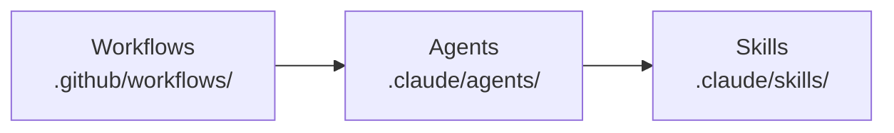
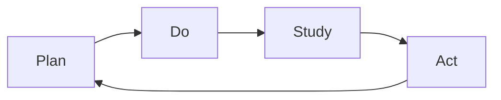
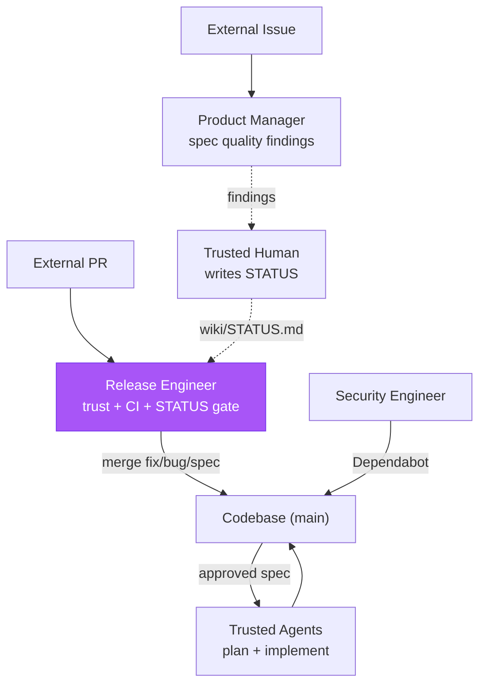

# Kata Agent Team

> "What does the pattern of the Improvement Kata give us? A means for
> systematically and scientifically working toward a new desired condition, in a
> way that is appropriate for the unpredictability and uncertainty involved."
>
> — Mike Rother, _Toyota Kata_

The Kata Agent Team is an autonomous and continuously improving agentic
development team running on GitHub Actions, organized as a daily
**Plan-Do-Study-Act** (PDSA) cycle. Agents plan by writing specs, do by shipping
features and hardening the repo, study their own execution traces and outputs,
and act on findings — closing the loop every day. The name follows Toyota Kata:
agents grasp the current condition (via prior-run traces), establish target
conditions (via specs), and experiment toward them (via implementation). Four
workflows (a sequential agent team across three shifts, a daily storyboard, an
on-demand coaching session, an event-driven conversation responder), six agent
personas, and sixteen skills form this cycle.

Kata is an implementation of two upstream standards: the repository structure
in [MONOREPO.md](MONOREPO.md) and the instruction architecture in
[COALIGNED.md](COALIGNED.md). Everything below assumes both.

## Architecture

**Workflows** define schedule, trigger, permissions; **Agents** define persona,
scope, skill composition; **Skills** define procedures, checklists, domain
knowledge. Local composite actions under `.github/actions/` encapsulate shared
CI steps: `bootstrap/` (Bun + dependencies), `audit/` (npm audit + gitleaks),
`coaligned-check/` (instruction-architecture checks), and `post-run/` (cleanup
hooks). The full agent runtime is published as external composite actions —
see § Actions.

## Actions

Two composite actions published as third-party GitHub Actions under
`forwardimpact/`:

- **`forwardimpact/fit-eval`** — Runs `fit-eval` with trace capture and
  artifact upload. Wraps a single fit-eval invocation.
- **`forwardimpact/kata-agent`** — Full agent workflow: auth, checkout,
  bootstrap, eval. The primary integration point for consumers.

Internal and external workflows both consume these by external tag (e.g.
`forwardimpact/kata-agent@v1`); the monorepo does not maintain a local copy.
Run `kata-setup` to generate workflows interactively.

## The PDSA Loop

Every workflow belongs to a phase of the **Plan-Do-Study-Act** cycle (after
Deming). Findings from Study always re-enter the loop as specs or fix PRs —
nothing is observed without downstream action.

- **Plan** — Turn approved `spec.md` (WHAT/WHY) into `design-a.md` (WHICH/WHERE)
  then `plan-a.md` (HOW/WHEN) with steps, files, sequencing, risks.
- **Do** — Execute plans via implementation PRs; run scheduled workflows that
  harden, release, and maintain. Every run captures a trace.
- **Study** — Analyze Do outputs across four streams: security audits, external
  feedback triage, one-topic-deep doc review, one-trace-deep grounded theory.
- **Act** — Trivial findings become **pushed fix PRs**; structural findings
  become `spec.md` documents on **pushed spec branches**. A local commit is not
  a PR — the URL is the only valid completion signal. `fix/` and `spec/`
  branches never mix.

## Agents

Six personas with explicit scope constraints — when a finding exceeds scope, the
agent writes a spec rather than attempting the fix.

| Agent                 | Phase          | Purpose                                                                 |
| --------------------- | -------------- | ----------------------------------------------------------------------- |
| **staff-engineer**    | Plan, Do       | Own the full spec -> design -> plan -> implement arc for approved specs |
| **release-engineer**  | Do             | Keep PR branches merge-ready, repair trivial CI, cut releases           |
| **security-engineer** | Do, Study, Act | Patch dependencies, harden supply chain, enforce security policies      |
| **product-manager**   | Study, Act     | Triage issues, review spec quality, run evaluations                     |
| **technical-writer**  | Study, Act     | Review docs for accuracy, curate wiki, fix staleness, spec gaps         |
| **improvement-coach** | Study          | Facilitate storyboard meetings and 1-on-1 coaching sessions             |

Each agent's Assess section selects work via a four-level priority scheme
([on-boot routing](.claude/agents/references/memory-protocol.md#on-boot-routing)):
owned MEMORY.md priorities first, then active claims surfaced by `fit-wiki
boot`, then storyboard deliverables and experiment issues labeled
`agent:{name}`, then domain-specific checks, then cross-cutting fallback. An
agent reports clean only after exhausting all four levels.

## Workflows

A single scheduled workflow, **kata-shift**, runs the producer → reviewer →
shipper chain three times daily on a Europe/Paris rhythm — 03:00, 12:00, and
20:00 — plus the daily storyboard at 08:00. The full chain runs in
declaration order on every invocation: product-manager triages and approves
spec quality so staff has a fresh backlog, staff implements, security-engineer
reviews code before it ships, technical-writer reviews docs, release-engineer
gates and ships, improvement-coach reviews the run. Adding or removing an
agent is a one-line edit to the matrix in
`.github/workflows/kata-shift.yml`. Crons are authored in UTC; Paris times
below use CEST (UTC+2), the tighter summer bound. A separate event-driven
workflow, **kata-dispatch**, runs on PR comments and issue activity, and on
`workflow_dispatch` from the bridge services (msbridge, ghbridge) for
threaded discussions — the release engineer facilitates and routes the
comment to the participant best suited to respond, and propagates
trusted-contributor approval signals into `wiki/STATUS.md`. Discussion
events themselves now reach kata-dispatch via the GitHub Discussions
bridge (services/ghbridge), not directly from a `discussion:` trigger. All
workflows support `workflow_dispatch` and time out at 45 minutes; storyboard,
coaching, and dispatch also use concurrency groups (kata-shift serializes
via the matrix's `max-parallel: 1`). Agent workflows send a generic prompt;
the agent's Assess section picks the action. Storyboard and coaching send
specific prompts to the improvement coach.

| Workflow            | Schedule (Paris, CEST)        | Agent                                                                                                       |
| ------------------- | ----------------------------- | ----------------------------------------------------------------------------------------------------------- |
| **kata-storyboard** | Daily 08:00                   | improvement-coach (facilitates 5 agents)                                                                    |
| **kata-coaching**   | `workflow_dispatch`           | improvement-coach (facilitates 1 agent)                                                                     |
| **kata-shift**      | Daily 03:00 · 12:00 · 20:00   | product-manager → staff-engineer → security-engineer → technical-writer → release-engineer → improvement-coach |
| **kata-dispatch**   | On PR / issue activity (and bridge dispatch) | release-engineer (facilitates 4 agents)                                                                     |

## Skills

All Kata skills use the `kata-` prefix and own exactly one PDSA phase (or none
for utilities). An agent's skill list reveals its phase coverage.

| Skill                     | Phase   | Purpose                                       |
| ------------------------- | ------- | --------------------------------------------- |
| `kata-design`             | Plan    | Specs to architectural design documents       |
| `kata-plan`               | Plan    | Designs to executable plans                   |
| `kata-implement`          | Do      | Execute plans step by step                    |
| `kata-security-update`    | Do      | Dependabot triage, vulnerability fixes        |
| `kata-release-merge`      | Do      | Trust, type, CI, rebase, approval gate, merge |
| `kata-release-cut`        | Do      | Version bumps, tagging, publish verification  |
| `kata-security-audit`     | Study   | Seven-area security review                    |
| `kata-product-issue`      | Study   | Issue triage against product vision           |
| `kata-interview`          | Study   | JTBD switching interviews                     |
| `kata-documentation`      | Study   | One topic deep per run                        |
| `kata-wiki-curate`        | Study   | Agent memory hygiene                          |
| `kata-pattern-synthesis`  | Study   | Coach-owned grounded coding of an obstacle/experiment/PR corpus into one spec + design |
| `kata-spec`               | Act     | Write specs capturing WHAT/WHY                |
| `kata-review`             | Utility | Grade a single artifact (leaf, no sub-agents) |
| `kata-session`            | Utility | Toyota Kata coaching protocol for sessions    |
| `kata-setup`              | Utility | Interactive Kata Agent Team setup             |

## Trust Boundary

The release engineer is the sole external merge point; all other merge paths
operate on trusted sources (our agents, Dependabot). The product manager gates
spec **quality** off the critical path via PR-comment findings; trusted
humans translate those findings into `wiki/STATUS.md` writes that release
engineer reads at merge time.

| External PR type | What merges                     | Who implements                        |
| ---------------- | ------------------------------- | ------------------------------------- |
| `fix` / `bug`    | Contributor's code (small)      | The external contributor              |
| `spec`           | Specification document only     | Trusted agents, never the contributor |
| Everything else  | Nothing — requires human review | N/A                                   |

Top-7 contributors pass the trust gate; `kata-agent-team` PRs are trusted by
identity. A compromised top contributor cannot inject code via this pipeline —
specs merge only the document, not code.

## Approval Signal

Approval state is recorded in the wiki at `STATUS.md` — a markdown page
wrapping a tab-separated body, one row per spec:
`{id}\t{phase}\t{status}`. STATUS is the canonical approval record;
`kata-release-merge` reads it to decide which phase PRs may merge. Signals
from any source below feed STATUS.

| Signal | Source | Captured by |
|---|---|---|
| `<phase>:approved` label | Human or `/ship-it` | `kata-dispatch` |
| APPROVED review | Trusted-account approver | `kata-dispatch` |
| Approval comment ("LGTM", "ship it") | Trusted contributor | `kata-dispatch` |
| In-session user message | Trusted user | Active agent |
| `kata-plan` panel-clean | `staff-engineer` (plans only) | `kata-plan` skill |

**Human-only for spec/design.** Agents never autonomously originate `spec
approved` or `design approved` — they only propagate signals from trusted
humans. Plans may be approved by `staff-engineer` after `kata-plan` review.

Phase progression is derived from `main`: a STATUS row at `{phase} approved`
authorizes `kata-release-merge` to merge the PR; merging the PR puts the
artifact on `main` and the next phase may begin. `kata-release-merge` writes
the terminal `plan implemented` row on the implementation PR before merge.
See [approval-signals.md](.claude/agents/references/approval-signals.md) for
the full protocol.

## Design Principles

- **PDSA over pipeline.** Findings from Study always re-enter the loop.
- **Fix-or-spec discipline.** Mechanical fixes and structural improvements never
  share a PR.
- **Explicit scope constraints.** Each agent knows what it must _not_ do.
- **Trace-driven accountability.** Every workflow captures a trace; the
  improvement coach quotes specific evidence — no speculation. The invariant
  tables (§ Invariants below) are the **enforcement mechanism** for per-agent
  and cross-cutting rules; high-severity failures trigger a fix or spec. Use
  `fit-trace` to query traces.
- **Least privilege.** The workflow-level `permissions:` block restricts only
  `GITHUB_TOKEN`, not the App token. All agent workflows set
  `permissions: contents: write` — the minimum for checkout fallback. The App
  token carries all coordination-channel permissions (Issues, PRs, Discussions)
  via its installation settings; adding those to `permissions:` would only widen
  `GITHUB_TOKEN`'s blast radius.
- **Main branch CI repair.** See CONTRIBUTING.md for the release engineer's
  direct-to-`main` exception.

## Shared Memory

Agents share persistent memory via the **GitHub wiki** at `wiki/`, cloned on
demand and synced by `just wiki-pull` (on `SessionStart`) and `just wiki-push`
(on `Stop`). The wiki is a separate checkout, not a submodule — `wiki/` is
gitignored, and only the `Stop` hook publishes wiki commits; never
`git add wiki` into a main-repo commit.

Each agent maintains a **summary** (`<agent>.md`) — latest state, backlog,
blockers, teammate observations — and a **weekly log**
(`<agent>-<YYYY>-W<VV>.md`), one file per agent per ISO week. The wiki also
holds `STATUS.md`, the canonical approval record for every spec (see §
Approval Signal). The canonical read-summary, append-log, update-summary
cadence is defined in
[`memory-protocol.md`](.claude/agents/references/memory-protocol.md), an
agent-level shared reference. Read contract: `Read wiki/MEMORY.md` + `Bash:
fit-wiki boot`. Entry-point skills include a read step and a
"Memory: what to record" section; sub-skills and utility skills are exempt.
The wiki holds settled state — open questions live in Discussions until
answered.

## Coordination Channels

Four channels carry agent-to-agent and agent-to-human collaboration,
distinguished by **time horizon** and **persistence**. Per-output coordination
across them — including cross-agent escalation, run-time trust, Discussion
ownership, and inbound comment handling — is governed by
[coordination-protocol.md](.claude/agents/references/coordination-protocol.md),
the sibling of `memory-protocol.md`. Read contract: `Read wiki/MEMORY.md` +
`Bash: fit-wiki boot`. Each channel has an explicit non-purpose so they
don't compete.

| Channel               | Use for                                                                                                      | Lifetime                              | Mechanism                    |
| --------------------- | ------------------------------------------------------------------------------------------------------------ | ------------------------------------- | ---------------------------- |
| **Storyboard**        | Daily current condition and next experiment                                                                  | One day; captured into wiki           | `kata-storyboard` workflow   |
| **Discussion**        | Open questions before they become decisions — RFCs, cross-policy                                             | Open until resolved into spec or wiki | `ghbridge` → `kata-dispatch` |
| **PR / issue thread** | Real-time response on a specific artifact; PDSA state for experiment and obstacle issues                     | Lives with the artifact               | `kata-dispatch` workflow     |
| **Sub-agent**         | Specialized inline work within one run (not for cross-agent comms — see escalation in coordination-protocol) | Ephemeral (one task)                  | `Agent` tool, skill spawning |

- **Storyboard** observes and plans; structural decisions go through
  `kata-spec`, not the meeting.
- **Discussions** must terminate: every thread either resolves into a spec or
  wiki note, or closes as "not now". Otherwise they compete with the wiki as a
  source of truth.
- **PR/issue threads** are scoped to one artifact — cross-cutting questions
  belong in a Discussion. Experiment and obstacle issues own their PDSA state;
  experiments carry `agent:{name}` labels for action routing. The storyboard
  references them as one-liners.
- **Sub-agents** don't carry state across runs — that's the wiki's job.

## Metrics

Only skills representing **end-to-end processes** — those whose output is
value-bearing on its own, not work-in-progress for a downstream skill — record
metrics.

Each such skill records one or more metrics, each a **count of units of work
observed this run** (issues triaged, PRs merged, findings filed, approvals
recorded, and so on). Metrics fall into two classes: `process-throughput`, the
units of work the producer skill produced in its own run (one per producer
skill — unchanged); and `system-health`, events about the loop the producer
skill observes while producing its own units. A new metric is
`process-throughput` if it counts units of work the producer skill produced in
its own run, and `system-health` if it counts events about the loop that the
producer skill observes while producing its own units; the producer of a new
`system-health` metric co-locates with an existing producer per
[`metric-class-guidance.md`](.claude/agents/references/metric-class-guidance.md).
Multiple metrics from one producer land as multiple rows in
`wiki/metrics/{skill}/{YYYY}.csv` — one row per metric per run. Pipeline
stations and orchestration utilities do not record.

The constraint is XmR-driven for both classes. Backlog counts and ages can be
queried any time from `gh`, `git`, or `npm audit` — they're stocks and sawtooth
functions, not process data, and freezing them into CSV adds noise without
signal. `process-throughput` rides the producer's natural run cadence;
`system-health` rides the producer's natural read of loop state. Plotted
run-over-run, both classes distinguish a stable process from a special-cause
shift.

Each measurement is one CSV row appended to
`wiki/metrics/{skill}/{YYYY}.csv` after the run. The storyboard meeting
reads these via `fit-xmr` and answers "what is the actual condition now?" with
control limits and signals — numbers, not narratives.

Changes to the canonical-11 set — additions, removals, conditional or
unconditional redefinitions — follow the protocol in
[`coordination-protocol.md` § Measurement-system changes](.claude/agents/references/coordination-protocol.md#measurement-system-changes):
each change ships in the same PR as a `wiki/redefinitions/{YYYY-MM-DD}-{slug}.md`
file naming the repair move, the affected metric(s), the falsifier set, the
verdict horizon, and the cohort read-out date. The no-silent-redefinition rule
lives there; this section does not restate it.

## Authentication

Workflows authenticate via the **GitHub App** `kata-agent-team`, not a PAT. Each
run generates a 1-hour installation token via `actions/create-github-app-token`
— no long-lived secrets to rotate. Three repository secrets are required:
`KATA_APP_ID`, `KATA_APP_PRIVATE_KEY`, `ANTHROPIC_API_KEY`.

For new installations, `kata-setup` walks through App creation, permissions,
event subscriptions, and workflow generation interactively. See
[`kata-setup/references/github-app.md`](.claude/skills/kata-setup/references/github-app.md)
for the full permission and event subscription reference.

## Authoring

Instruction architecture, length limits, skill structure, checklist design, and
the seven-layer model that governs where new instructions belong live in
[COALIGNED.md](COALIGNED.md).

## Invariants

Rules that every agent workflow run should satisfy, derived from trace analysis.
High-severity violations require a fix PR or spec. Use `fit-trace` to query
traces.

### All agents

Every agent must survey domain state before choosing an action — check open PRs,
issues, CI status, or wiki summaries before doing anything skill-specific.

Beyond that, the following apply to every trace:

- **Sandbox discipline** — `dangerouslyDisableSandbox: true` is only used to
  invoke `scripts/claude-write.sh`. Any other sandbox-disabled call is
  high-severity.
- **Wiki questions cite Discussions** — wiki entries containing open questions
  ("?", "decide whether", "needs review") must link to a Discussion.
- **Non-wiki outputs cited in weekly log** — every PR, issue comment, or
  Discussion created during a run has a citation in the log.
- **Discussions resolve within 14 days** — no Discussion authored by
  `kata-agent-team` stays open longer without a terminal event (closed, linked
  spec, or wiki note).
- **Mandate-boundary stops produce artifacts** — when an agent stops at a scope
  boundary without creating a `fix/` or `spec/` branch, it must create at least
  one coordination artifact (issue, comment, or Discussion).

### Release engineer

The trust gate is the most critical invariant in the system:

- Contributor lookup (`gh api repos/.../contributors`) ran for every non-CI-app
  PR before a mergeable verdict. Author verified against the result. A merge
  without a visible lookup is high-severity.
- CI status checked before every mergeable verdict.
- Phase PRs gated on `wiki/STATUS.md` showing the spec at `{phase} approved`
  before merge.
- `--force-with-lease` used for rebase pushes, never `--force`.
- Tags pushed individually, not via `--tags`.
- Releases performed in dependency order.
- `bun run check` and `bun run test` ran before push.

### Staff engineer

- Approved spec read before plan written; both spec and plan read before first
  edit.
- Risks section present in produced plans.
- Implementation PR title references spec id (`(#NNN)`).
- Scope discipline held — no edits outside the plan's stated blast radius.
- `bun run check` and `bun run test` ran before push.

### Product manager

- Spec quality reviewed (`kata-spec` review) and findings posted via PR
  comment; never applies `spec:approved` and never writes the spec's STATUS
  row directly.
- Spec written for `needs-spec` issues when no spec PRs are pending review.

### Security engineer

- SHA pins never downgraded to tag references in workflow files.

### Technical writer

- Source of truth (source code/data files) consulted before documentation edits.
- `bunx fit-doc build` ran before push.
- All agent summaries and current week logs read before wiki curation.

### Orchestrator (multi-agent sessions)

For `fit-eval facilitate` and `fit-eval supervise` traces: zero
`protocol_violation` events and exactly one `Conclude` tool call per run.
