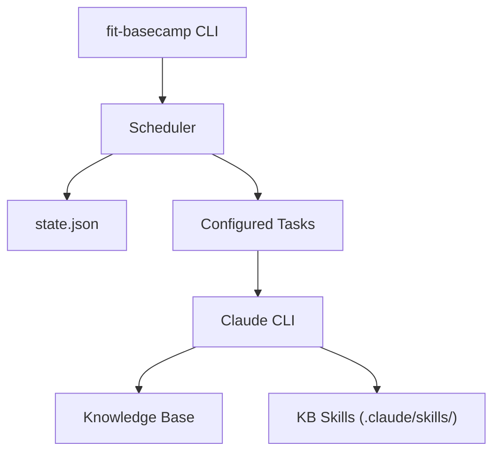

## Overview

Basecamp is the personal knowledge system of the FIT suite. It schedules AI
tasks that run against your personal knowledge base, keeping your notes,
contacts, and context organized and current.

> See the [Basecamp product page](/basecamp/) for a high-level overview.

---

## Architecture



### Components

| Component       | Path                                         | Purpose                               |
| --------------- | -------------------------------------------- | ------------------------------------- |
| CLI & Scheduler | `products/basecamp/src/basecamp.js`          | Main entry point, daemon, task runner |
| Default Config  | `products/basecamp/config/scheduler.json`    | Default task definitions              |
| KB Template     | `products/basecamp/template/`                | Template for new knowledge bases      |
| KB Skills       | `products/basecamp/template/.claude/skills/` | AI skill definitions for KB tasks     |
| macOS App       | `products/basecamp/macos/`                   | Native status menu bar app            |

---

## Scheduler

The scheduler runs tasks based on configured intervals. It can run once (for
cron-based scheduling) or as a persistent daemon.

### Modes

| Mode            | Command                         | Behaviour                    |
| --------------- | ------------------------------- | ---------------------------- |
| **Run once**    | `npx fit-basecamp`              | Execute due tasks, then exit |
| **Daemon**      | `npx fit-basecamp --daemon`     | Poll every 60 seconds        |
| **Single task** | `npx fit-basecamp --run <task>` | Run one task immediately     |

### State Management

Task state is stored in `~/.fit/basecamp/state.json`:

```json
{
  "sync-apple-mail": {
    "lastRun": "2025-01-15T10:30:00.000Z",
    "status": "success"
  }
}
```

### Logging

Logs are written to `~/.fit/basecamp/logs/scheduler-YYYY-MM-DD.log`.

---

## Task Configuration

Tasks are defined in `~/.fit/basecamp/scheduler.json`:

```json
{
  "tasks": {
    "sync-apple-mail": {
      "kb": "~/Documents/Personal",
      "schedule": { "type": "interval", "minutes": 5 },
      "enabled": true,
      "agent": null,
      "skill": "sync-apple-mail",
      "prompt": "Sync Apple Mail. Only process new threads since last sync."
    }
  }
}
```

### Task Properties

| Property           | Type         | Description                            |
| ------------------ | ------------ | -------------------------------------- |
| `kb`               | string       | Path to knowledge base directory       |
| `schedule.type`    | string       | Schedule type (`interval`)             |
| `schedule.minutes` | number       | Interval in minutes                    |
| `enabled`          | boolean      | Whether task runs on schedule          |
| `agent`            | string\|null | Specific agent to use (null = default) |
| `skill`            | string       | KB skill to invoke                     |
| `prompt`           | string       | Prompt passed to the AI                |

### Default Tasks

| Task                  | Interval | Purpose                                  |
| --------------------- | -------- | ---------------------------------------- |
| `sync-apple-mail`     | 5 min    | Import new email threads                 |
| `sync-apple-calendar` | 5 min    | Export calendar events (±14 days)        |
| `extract-entities`    | 15 min   | Process synced data into knowledge notes |

---

## Knowledge Base Structure

A knowledge base is a directory with conventions for AI access:

```
~/Documents/Personal/
├── .claude/
│   └── skills/            # AI skill definitions
│       ├── sync-apple-mail/
│       │   └── SKILL.md
│       ├── sync-apple-calendar/
│       │   └── SKILL.md
│       └── extract-entities/
│           └── SKILL.md
├── CLAUDE.md              # Agent instructions
├── USER.md                # User profile/preferences
├── mail/                  # Synced email data
├── calendar/              # Synced calendar data
├── notes/                 # Knowledge graph notes
└── ...
```

### KB Skills

Each skill is a directory under `.claude/skills/` containing a `SKILL.md` file.
Skills define what the AI should do when invoked by the scheduler.

### Initialization

```sh
npx fit-basecamp --init ~/Documents/Personal
```

This copies the template structure from `products/basecamp/template/` into the
target directory.

---

## CLI Reference

```sh
# Run due tasks once
npx fit-basecamp

# Run as persistent daemon
npx fit-basecamp --daemon

# Run a specific task
npx fit-basecamp --run sync-apple-mail

# Initialize a new knowledge base
npx fit-basecamp --init ~/Documents/Team

# Validate configuration
npx fit-basecamp --validate

# Show task status
npx fit-basecamp --status

# Show help
npx fit-basecamp --help
```

---

## macOS App

Basecamp includes an optional native macOS menu bar application that provides:

- Status menu icon in the system tray
- Quick access to scheduler status
- Task execution controls

The app is built as a Swift application:

```
products/basecamp/macos/Basecamp/
├── Sources/
│   └── StatusMenu.swift    # Status menu implementation
├── Basecamp.entitlements
└── Info.plist
```

### Building

```sh
cd products/basecamp
npm run build:macos
```

---

## Paths and Directories

| Path                             | Purpose                   |
| -------------------------------- | ------------------------- |
| `~/.fit/basecamp/`               | Basecamp home directory   |
| `~/.fit/basecamp/scheduler.json` | Task configuration        |
| `~/.fit/basecamp/state.json`     | Task run state            |
| `~/.fit/basecamp/logs/`          | Scheduler logs            |
| `/usr/local/share/fit-basecamp/` | Shared assets (installed) |

---

## Related Documentation

- [Core Model](/docs/model/) — How skills and behaviours are defined
- [Agents](/docs/pathway/agents/) — Agent profile format used by tasks
- [Map](/docs/map/) — Data format for entity definitions
