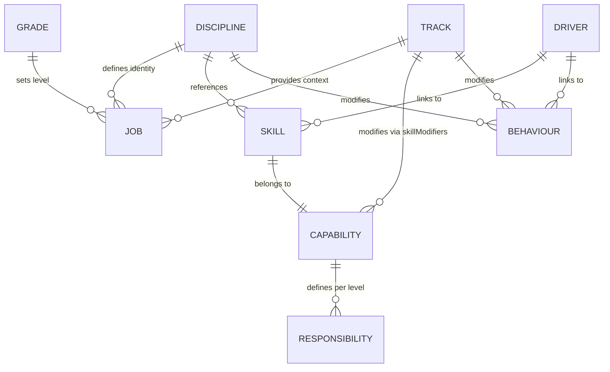
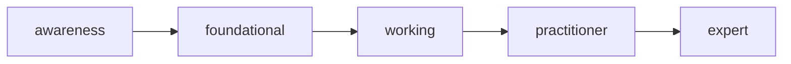
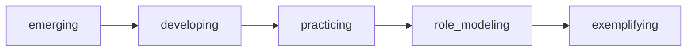

## Overview

The core model defines how your engineering terrain is traversed. Every
combination of discipline, track, and grade produces a unique, consistent role
profile — with skill levels, behaviour expectations, and responsibilities all
derived from the same source data.

---

## The Core Formula

**Job Definition** = Discipline × Track × Grade

**Agent Profile** = Discipline × Track × Stage

| Input          | Question                    |
| -------------- | --------------------------- |
| **Discipline** | What kind of engineer?      |
| **Track**      | Where and how do you work?  |
| **Grade**      | What career level?          |
| **Stage**      | What part of the lifecycle? |

Both jobs and agents use the same skill and behaviour derivation. The
difference: jobs include all skills capped by grade, while agents filter out
human-only skills and constrain by lifecycle stage.

---

## Entity Overview



| Entity         | Purpose                                           | Key Question              |
| -------------- | ------------------------------------------------- | ------------------------- |
| **Discipline** | Engineering specialty and T-shaped profile        | What kind of engineer?    |
| **Track**      | Work context and capability-based modifiers       | Where/how do you work?    |
| **Grade**      | Career level with base skill/behaviour levels     | What career level?        |
| **Skill**      | Technical or professional capability              | What can you do?          |
| **Capability** | Skill grouping for modifiers and responsibilities | What capability area?     |
| **Behaviour**  | Approach to work and mindset                      | How do you approach work? |
| **Driver**     | Organizational outcome                            | What outcomes matter?     |

---

## Skills

Skills represent technical and professional capabilities. Each skill belongs to
exactly one capability.

### Skill Levels (5 Levels)



| Level        | Grades | Description                            |
| ------------ | ------ | -------------------------------------- |
| awareness    | L1     | Learning fundamentals, needs guidance  |
| foundational | L1-L2  | Applies basics independently           |
| working      | L2-L3  | Solid competence, handles ambiguity    |
| practitioner | L3-L4  | Deep expertise, leads and mentors      |
| expert       | L5+    | Authority, shapes direction across org |

### Human-Only Skills

Some skills require physical presence, emotional intelligence, or relationship
building that AI cannot replicate. These are marked `isHumanOnly: true` and
excluded from agent profile derivation.

---

## Capabilities

Capabilities group skills and define level-based responsibilities. Track
modifiers apply to all skills in a capability at once.

Capabilities also define:

- **professionalResponsibilities** — IC role expectations per skill level
- **managementResponsibilities** — Manager role expectations per skill level
- **checklists** — Stage handoff items per skill level

---

## Behaviours

Behaviours represent mindsets and approaches to work.

### Behaviour Maturities (5 Levels)



| Maturity      | Description                       |
| ------------- | --------------------------------- |
| emerging      | Shows interest, needs prompting   |
| developing    | Regular practice with guidance    |
| practicing    | Consistent application, proactive |
| role_modeling | Influences team culture           |
| exemplifying  | Shapes organizational culture     |

---

## Disciplines

Disciplines define engineering specialties with T-shaped skill profiles:

| Tier             | Expected Level    | Purpose                 |
| ---------------- | ----------------- | ----------------------- |
| coreSkills       | Highest for grade | Core expertise          |
| supportingSkills | Mid-level         | Supporting capabilities |
| broadSkills      | Lower level       | General awareness       |

### Discipline Properties

| Property         | Type             | Purpose                                         |
| ---------------- | ---------------- | ----------------------------------------------- |
| `isProfessional` | boolean          | Uses professionalResponsibilities (IC roles)    |
| `isManagement`   | boolean          | Uses managementResponsibilities (manager roles) |
| `validTracks`    | (string\|null)[] | Valid track configurations                      |
| `minGrade`       | string           | Minimum grade required for this discipline      |

---

## Tracks

Tracks define work context and modify the base profile through capability-based
skill adjustments. Tracks are pure modifiers — they do not define role types.

Tracks also define `behaviourModifiers` (e.g., `systems_thinking: +1`).

---

## Grades

Grades define career levels with base expectations:

| Grade | Primary      | Secondary    | Broad        | Base Behaviour |
| ----- | ------------ | ------------ | ------------ | -------------- |
| L1    | foundational | awareness    | awareness    | emerging       |
| L2    | foundational | foundational | awareness    | emerging       |
| L3    | practitioner | working      | foundational | developing     |
| L4    | expert       | practitioner | working      | practicing     |
| L5    | expert       | expert       | practitioner | role_modeling  |

---

## Job Derivation

### Skill Derivation Steps

1. **Get skill type** — Is this skill primary, secondary, or broad for the
   discipline?
2. **Get base level** — Look up the grade's base level for that skill type
3. **Apply track modifier** — Add the track's modifier for the skill's
   capability
4. **Cap positive modifiers** — Positive modifiers cannot exceed grade's max
   base level
5. **Clamp to valid range** — Ensure result is between awareness and expert

### Behaviour Derivation

```
Final Maturity = Grade Base + Discipline Modifier + Track Modifier
```

Clamped to valid range (emerging → exemplifying).

---

## Key Capabilities

| Capability         | What it does                                          |
| ------------------ | ----------------------------------------------------- |
| **Job derivation** | Complete role definitions with skills and behaviours  |
| **Agent profiles** | Stage-specific agent instructions for AI assistants   |
| **Skill matrices** | Derived skill levels with track modifiers applied     |
| **Checklists**     | Stage transition criteria from capability definitions |
| **Progression**    | Career path analysis and gap identification           |
| **Interviews**     | Role-specific question selection                      |
| **Job matching**   | Gap analysis between current and target roles         |

---

## Technical Reference

### Modules

| Module           | Purpose                         |
| ---------------- | ------------------------------- |
| `derivation.js`  | Core derivation functions       |
| `agent.js`       | Agent profile generation        |
| `job.js`         | Job preparation for display     |
| `job-cache.js`   | Job caching for performance     |
| `interview.js`   | Question selection              |
| `progression.js` | Career path analysis            |
| `checklist.js`   | Stage transition checklists     |
| `toolkit.js`     | Tool derivation from skills     |
| `profile.js`     | Profile filtering (human/agent) |
| `modifiers.js`   | Capability and skill modifiers  |
| `matching.js`    | Job matching and gap analysis   |

### Programmatic Access

```javascript
import { deriveSkillMatrix, deriveBehaviourProfile, deriveJob }
  from "@forwardimpact/libpathway/derivation";

import { prepareAgentProfile }
  from "@forwardimpact/libpathway/profile";
```

---

## Related Documentation

- [Map](/docs/map/) — Data model and YAML format
- [Lifecycle](/docs/model/lifecycle/) — Stages, handoffs, and checklists
- [Agents](/docs/pathway/agents/) — Agent profile generation
- [Reference](/docs/pathway/reference/) — File organization, templates, and CLI
