<div class="page-container">
<div class="prose">

## Overview

The lifecycle model defines six stages that engineering work moves through, from
specification to deployment. Each stage has defined constraints, handoff
conditions, and checklists that ensure quality transitions.

> See [Core Model](/docs/model/) for how stages fit into the broader system.

---

## The Six Stages

```mermaid
flowchart LR
    specify["🎯 Specify"] --> plan["📐 Plan"]
    plan --> onboard["🔧 Onboard"]
    onboard --> code["💻 Code"]
    code --> review["🔍 Review"]
    review --> deploy["🚀 Deploy"]
```



| Stage       | Icon | Purpose                                               |
| ----------- | ---- | ----------------------------------------------------- |
| **specify** | 🎯   | Define WHAT users need and WHY                        |
| **plan**    | 📐   | Design HOW to build (architecture, technical choices) |
| **onboard** | 🔧   | Prepare dev environment, dependencies, credentials    |
| **code**    | 💻   | Implement the solution and write tests                |
| **review**  | 🔍   | Verify implementation against acceptance criteria     |
| **deploy**  | 🚀   | Ship to production, monitor CI/CD                     |

---

## Handoffs

Handoffs are the transitions between stages. Each stage defines named handoffs
that specify where work can flow next:

### Specify Stage

| Handoff                 | Target  | Trigger                  |
| ----------------------- | ------- | ------------------------ |
| Refine/Alternative Spec | specify | Requirements need rework |
| Plan                    | plan    | Spec accepted            |

### Plan Stage

| Handoff                 | Target  | Trigger             |
| ----------------------- | ------- | ------------------- |
| Refine/Alternative Plan | plan    | Design needs rework |
| Onboard                 | onboard | Plan accepted       |

### Onboard Stage

| Handoff     | Target  | Trigger                                     |
| ----------- | ------- | ------------------------------------------- |
| Retry Setup | onboard | Environment setup failed                    |
| Update Plan | plan    | Plan needs revision based on setup findings |
| Code        | code    | Environment ready                           |

### Code Stage

| Handoff        | Target | Trigger                                |
| -------------- | ------ | -------------------------------------- |
| Request Review | review | Implementation complete, tests passing |

### Review Stage

| Handoff           | Target | Trigger                               |
| ----------------- | ------ | ------------------------------------- |
| Request Changes   | code   | Issues found, changes needed          |
| Needs Re-planning | plan   | Fundamental problems require redesign |
| Deploy            | deploy | Review approved                       |

### Deploy Stage

| Handoff      | Target | Trigger                      |
| ------------ | ------ | ---------------------------- |
| Fix Pipeline | deploy | CI/CD issues need resolution |

---

## Constraints

Each stage defines constraints that limit what actions are allowed. Constraints
are especially important for AI agents — they prevent scope creep and ensure
agents stay within their authorized boundaries.

Examples:

- **Specify**: Cannot write code, cannot make architectural decisions
- **Plan**: Cannot commit code, must stay within specified requirements
- **Code**: Cannot change architecture, must follow the plan
- **Review**: Cannot add features, can only verify and request changes
- **Deploy**: Cannot change code, only fix pipeline configuration

---

## Checklists

Checklists ensure quality at stage transitions. They are derived dynamically
from capability definitions based on the job's skill levels.

### Two Types

| Type                | When                 | Purpose                       |
| ------------------- | -------------------- | ----------------------------- |
| **Read-Then-Do**    | Before starting work | Prerequisites and preparation |
| **Do-Then-Confirm** | Before handing off   | Verification criteria         |

### How Checklists Are Derived

```
Checklist = Stage × Skill Matrix × Capability Definitions
```

1. For each skill in the derived skill matrix
2. Look up `skill.agent.stages[stageId]` in the capability definition
3. Extract `readChecklist` and `confirmChecklist` items for the skill level
4. Group items by skill and capability

### Example

Given a "code" stage for a practitioner-level CI/CD skill:

**Read-Then-Do (before coding):**

- Review the deployment pipeline configuration
- Understand the test infrastructure
- Check branch protection rules

**Do-Then-Confirm (before requesting review):**

- All new code has test coverage
- Pipeline passes on the feature branch
- Documentation updated for changed interfaces

---

## Stages and Agents

Each stage can generate a stage-specific AI agent with:

- **Focused skill set** — Only skills relevant to that stage
- **Stage constraints** — Hard boundaries on agent actions
- **Tool set** — Tools appropriate for the stage
- **Handoff prompts** — Conditions that trigger stage transitions

This enables a multi-agent workflow where different agents handle different
lifecycle phases, each with appropriate permissions and knowledge.

```mermaid
flowchart TD
    subgraph "Agent Team"
        sa["🎯 Specify Agent"]
        pa["📐 Plan Agent"]
        ca["💻 Code Agent"]
        ra["🔍 Review Agent"]
        da["🚀 Deploy Agent"]
    end
    sa -->|handoff| pa
    pa -->|handoff| ca
    ca -->|handoff| ra
    ra -->|handoff| da
    ra -.->|changes needed| ca
    ra -.->|re-plan| pa
```



---

## Technical Reference

### Key Functions

| Function                | Module       | Purpose                        |
| ----------------------- | ------------ | ------------------------------ |
| `deriveChecklist()`     | checklist.js | Derive checklists for a stage  |
| `getStageOrder()`       | levels.js    | Stage ordering for comparisons |
| `compareByStageOrder()` | orderings.js | Sort stages by lifecycle order |

### Data Structure

```javascript
// Stage definition (from stages.yaml)
{
  id: "code",
  name: "Code",
  emojiIcon: "💻",
  description: "Implement the solution and write tests",
  constraints: ["Cannot change architecture", ...],
  handoffs: [
    { name: "Request Review", targetStage: "review", prompt: "..." }
  ]
}

// Derived checklist output
{
  readChecklist: [
    { skill: { id, name }, capability: { id, name, emojiIcon }, items: [...] }
  ],
  confirmChecklist: [
    { skill: { id, name }, capability: { id, name, emojiIcon }, items: [...] }
  ]
}
```

---

## Related Documentation

- [Core Model](/docs/model/) — Entity overview and derivation formula
- [Core Derivation](/docs/model/core/) — Skill and behaviour derivation details
- [Agents](/docs/pathway/agents/) — How agents use lifecycle stages

</div>
</div>
