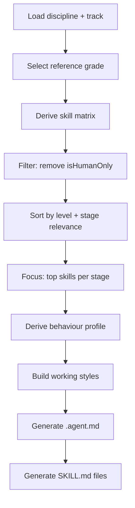

<div class="page-container">
<div class="prose">

## Overview

Agent profiles are AI coding assistant configurations derived from the same
career framework used for human job definitions. The derivation uses identical
skill and behaviour logic, then filters and focuses the output for AI
consumption.

> Agents use the same modifier logic as human profiles — a platform track agent
> has different emphases than a product track agent, just like their human
> counterparts.

---

## Agent vs Human Derivation

| Aspect          | Human Job                 | Agent Profile                          |
| --------------- | ------------------------- | -------------------------------------- |
| Skill source    | All skills                | Excludes `isHumanOnly` skills          |
| Grade           | Specified by user         | Auto-selected (practitioner threshold) |
| Output format   | Web page / markdown table | `.agent.md` + `SKILL.md` files         |
| Stage filtering | All stages shown          | Stage-specific profiles                |
| Behaviours      | Full profile              | Focused working styles                 |

---

## Reference Grade Selection

Agents need a reference grade to determine skill and behaviour levels. The
engine selects automatically:

1. **First choice** — First grade where primary skills reach `practitioner`
   level
2. **Fallback** — First grade where primary skills reach `working` level
3. **Last resort** — Middle grade by index

This ensures agents operate at a substantive senior level without overreaching
into the highest strategic grades.

---

## Profile Derivation Pipeline



### Step 1: Skill Filtering

The `filterAgentSkills()` policy removes skills marked `isHumanOnly: true` —
these require physical presence, emotional intelligence, or relationship
building that AI cannot replicate.

### Step 2: Skill Sorting

The `sortAgentSkills()` policy orders skills by:

1. Derived level (highest first)
2. Stage relevance (skills with stage-specific guidance prioritized)
3. Alphabetical (stable sort)

### Step 3: Skill Focusing

The `focusAgentSkills()` policy limits skills to those most relevant for the
agent's purpose, preventing information overload.

### Step 4: Working Styles

Emphasized behaviours (those with positive track modifiers) generate "working
style" entries that shape the agent's personality and approach. These are capped
at a configured limit to keep profiles focused.

---

## Output Format

### Agent Profile (.agent.md)

```markdown
---
name: plan-agent
description: Planning and architecture agent for platform engineering
---

# Plan Agent

## Identity
...

## Working Styles
- Systems Thinking: approaches problems holistically...
- Technical Excellence: maintains high standards...

## Skills
- [Architecture](skills/ARCHITECTURE.md)
- [API Design](skills/API-DESIGN.md)
...

## Constraints
...

## Handoffs
...
```

### Skill Document (SKILL.md)

```markdown
# Architecture

## When to Use
Apply when designing system components...

## Stages

### Plan
**Focus:** Define system structure and boundaries

**Activities:**
- Evaluate architectural options
- Document component interactions
...

**Ready when:**
- Architecture diagram reviewed
- Component boundaries defined
...

### Code
**Focus:** Implement architectural patterns
...
```

---

## Stage-Based Agents

Each lifecycle stage can produce a dedicated agent with:

| Property        | Source                            |
| --------------- | --------------------------------- |
| **Skills**      | Filtered to stage-relevant skills |
| **Constraints** | From stage definition             |
| **Handoffs**    | Stage transition conditions       |
| **Tool set**    | Tools from relevant skills        |

This enables multi-agent workflows where specialized agents handle different
phases of work.

---

## Template Variables

Agent templates use Mustache with these variables:

| Variable           | Source                             |
| ------------------ | ---------------------------------- |
| `{roleTitle}`      | Generated from discipline + track  |
| `{specialization}` | Track name or discipline specialty |
| `{skills}`         | Filtered and sorted skill list     |
| `{behaviours}`     | Working style entries              |
| `{constraints}`    | Stage constraints                  |
| `{handoffs}`       | Stage transition definitions       |

Template substitution happens via `substituteTemplateVars()` in the agent
module.

---

## Generating Agents

```sh
# Generate full agent team
npx fit-pathway agent software_engineering \
  --track=platform \
  --output=./agents

# Output:
# ./agents/
#   ├── plan.agent.md
#   ├── code.agent.md
#   ├── review.agent.md
#   └── skills/
#       ├── ARCHITECTURE.md
#       ├── API-DESIGN.md
#       └── ...
```

---

## Technical Reference

### Key Functions

| Function                   | Module               | Purpose                           |
| -------------------------- | -------------------- | --------------------------------- |
| `deriveReferenceGrade()`   | agent.js             | Auto-select appropriate grade     |
| `deriveAgentSkills()`      | agent.js             | Filter and sort skills for agents |
| `deriveAgentBehaviours()`  | agent.js             | Working style generation          |
| `substituteTemplateVars()` | agent.js             | Template variable replacement     |
| `prepareAgentProfile()`    | profile.js           | Unified agent profile preparation |
| `filterAgentSkills()`      | policies/composed.js | Skill filtering policy            |
| `sortAgentSkills()`        | policies/composed.js | Skill sorting policy              |
| `focusAgentSkills()`       | policies/composed.js | Skill focusing policy             |

### Imports

```javascript
import { prepareAgentProfile } from "@forwardimpact/libpathway/profile";
import { deriveReferenceGrade } from "@forwardimpact/libpathway/agent";
```

---

## Related Documentation

- [Pathway Overview](/docs/pathway/) — Presentation layer architecture
- [Lifecycle](/docs/model/lifecycle/) — Stages and handoffs used by agents
- [Core Model](/docs/model/) — Derivation formula shared with human profiles

</div>
</div>
