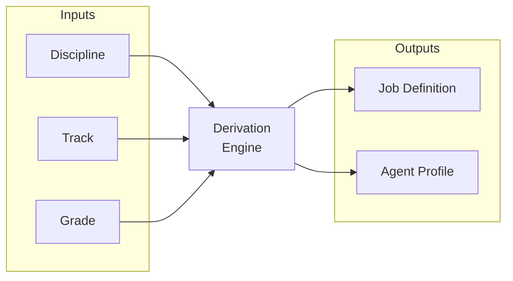
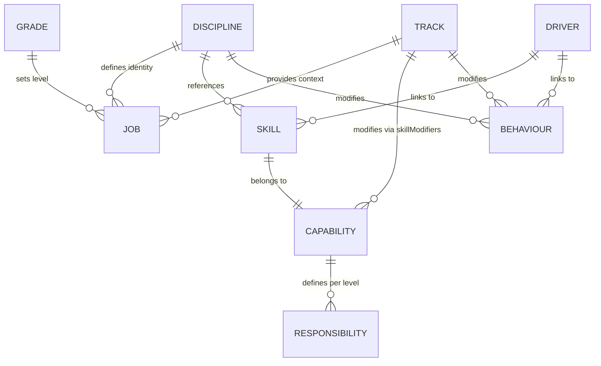
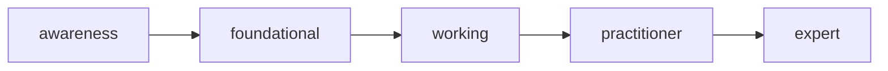
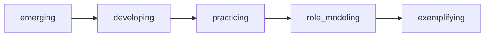
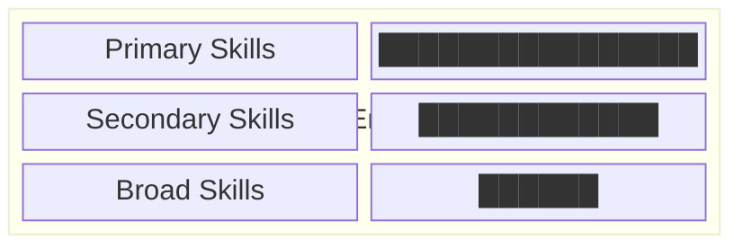
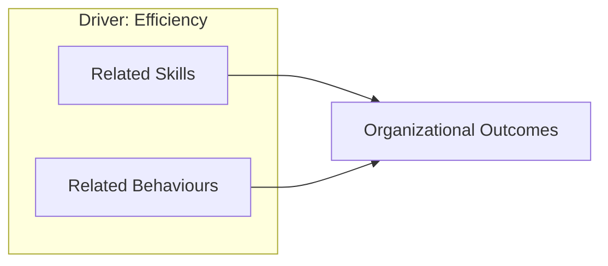
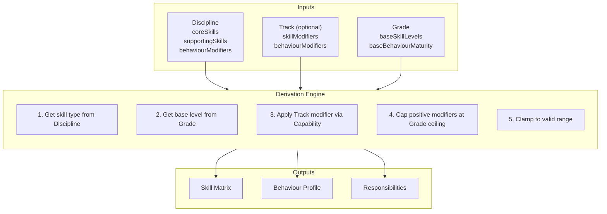

# Engineering Pathway: Core Model

A unified framework where human engineering roles and AI coding agents derive
from the same foundation.

---

## Core Formula



**Job Definition** = Discipline × Track × Grade

**Agent Profile** = Discipline × Track × Stage

| Input          | Question                    |
| -------------- | --------------------------- |
| **Discipline** | What kind of engineer?      |
| **Track**      | Where and how do you work?  |
| **Grade**      | What career level?          |
| **Stage**      | What part of the lifecycle? |

---

## Entity Overview



| Entity         | Purpose                                           | Key Question              |
| -------------- | ------------------------------------------------- | ------------------------- |
| **Discipline** | Engineering specialty and T-shaped profile        | What kind of engineer?    |
| **Track**      | Work context and capability-based modifiers       | Where/how do you work?    |
| **Grade**      | Career level with base skill/behaviour levels     | What career level?        |
| **Skill**      | Technical or professional capability              | What can you do?          |
| **Capability** | Skill grouping for modifiers and responsibilities | What capability area?     |
| **Behaviour**  | Approach to work and mindset                      | How do you approach work? |
| **Driver**     | Organizational outcome                            | What outcomes matter?     |

---

## Skills

Skills represent technical and professional capabilities. Each skill belongs to
exactly one capability.

### Skill Levels (5 Levels)



| Level        | Grades | Description                            |
| ------------ | ------ | -------------------------------------- |
| awareness    | L1     | Learning fundamentals, needs guidance  |
| foundational | L1-L2  | Applies basics independently           |
| working      | L2-L3  | Solid competence, handles ambiguity    |
| practitioner | L3-L4  | Deep expertise, leads and mentors      |
| expert       | L5+    | Authority, shapes direction across org |

### Human-Only Skills

Some skills require physical presence, emotional intelligence, or relationship
building that AI cannot replicate. These are marked `isHumanOnly: true` and
excluded from agent profile derivation.

```yaml
# Example skill in capabilities/{capability}.yaml
- id: stakeholder_management
  isHumanOnly: true
  human:
    # Full skill with all level descriptions
  agent:
    # Excluded from agent derivation
```

---

## Capabilities

Capabilities group skills and define level-based responsibilities. Track
modifiers apply to all skills in a capability at once.

| Capability    | Skills                                                                                               |
| ------------- | ---------------------------------------------------------------------------------------------------- |
| delivery      | full_stack_development, data_integration, problem_discovery, rapid_prototyping                       |
| scale         | architecture_design, code_quality, data_modeling, devops, cloud_platforms, technical_debt_management |
| reliability   | sre_practices, service_management                                                                    |
| data          | data_analysis, machine_learning, statistical_modeling                                                |
| ai            | ai_literacy, ai_augmented_development, ai_evaluation                                                 |
| process       | lean_thinking, time_management                                                                       |
| business      | stakeholder_management, business_immersion                                                           |
| people        | team_collaboration, multi_audience_communication                                                     |
| documentation | technical_writing, knowledge_management                                                              |

Capabilities also define:

- **professionalResponsibilities** — IC role expectations per skill level
- **managementResponsibilities** — Manager role expectations per skill level
- **checklists** — Stage handoff items per skill level (see
  [Lifecycle](lifecycle.md))

---

## Behaviours

Behaviours represent mindsets and approaches to work.

### Behaviour Maturities (5 Levels)



| Maturity      | Description                       |
| ------------- | --------------------------------- |
| emerging      | Shows interest, needs prompting   |
| developing    | Regular practice with guidance    |
| practicing    | Consistent application, proactive |
| role_modeling | Influences team culture           |
| exemplifying  | Shapes organizational culture     |

---

## Disciplines

Disciplines define engineering specialties with T-shaped skill profiles:



| Tier             | Expected Level    | Purpose                 |
| ---------------- | ----------------- | ----------------------- |
| coreSkills       | Highest for grade | Core expertise          |
| supportingSkills | Mid-level         | Supporting capabilities |
| broadSkills      | Lower level       | General awareness       |

### Discipline Properties

| Property         | Type             | Purpose                                         |
| ---------------- | ---------------- | ----------------------------------------------- |
| `isProfessional` | boolean          | Uses professionalResponsibilities (IC roles)    |
| `isManagement`   | boolean          | Uses managementResponsibilities (manager roles) |
| `validTracks`    | (string\|null)[] | Valid track configurations (see below)          |
| `minGrade`       | string           | Minimum grade required for this discipline      |

**validTracks Semantics:**

- `null` in array = allow trackless (generalist) jobs
- string values = allow specific track IDs
- `[null]` = trackless only
- `[null, "dx"]` = trackless OR dx track
- `["dx"]` = dx track only (no trackless)
- `[]` = no valid job combinations (legacy: allows trackless)

Disciplines also define `behaviourModifiers` that adjust baseline behaviour
expectations for engineers in that specialty.

---

## Tracks

Tracks define work context and modify the base profile through capability-based
skill adjustments. Tracks are pure modifiers—they do not define role types.

**Example: Platform Track**

| Capability    | Modifier | Effect                          |
| ------------- | -------- | ------------------------------- |
| scale         | +1       | Emphasize architecture, quality |
| documentation | +1       | Emphasize technical writing     |
| process       | +1       | Emphasize lean thinking         |
| delivery      | -1       | De-emphasize rapid prototyping  |

Tracks also define `behaviourModifiers` (e.g., `systems_thinking: +1`).

---

## Grades

Grades define career levels with base expectations:

| Grade | Primary      | Secondary    | Broad        | Base Behaviour |
| ----- | ------------ | ------------ | ------------ | -------------- |
| L1    | foundational | awareness    | awareness    | emerging       |
| L2    | foundational | foundational | awareness    | emerging       |
| L3    | working      | working      | foundational | emerging       |
| L4    | practitioner | practitioner | working      | developing     |
| L5    | expert       | practitioner | practitioner | practicing     |

Grades also define:

- **level** — Numeric ordering (higher = more senior)
- **expectations** — Scope, autonomy, influence, complexity

---

## Drivers

Drivers link skills and behaviours to organizational outcomes. Used for coverage
analysis to ensure roles contribute to business goals.



---

## Job Derivation

The derivation process transforms base definitions into a complete job profile.
Track is optional—a trackless job uses only discipline and grade.



### Skill Derivation Steps

1. **Get skill type** — Is this skill primary, secondary, or broad for the
   discipline?
2. **Get base level** — Look up the grade's base level for that skill type
3. **Apply track modifier** — Add the track's modifier for the skill's
   capability
4. **Cap positive modifiers** — Positive modifiers cannot exceed grade's max
   base level
5. **Clamp to valid range** — Ensure result is between awareness and expert

### Example: code_quality (capability: scale)

**Inputs:** Software Engineering × Platform × L3

1. Skill type: `primary` (in coreSkills)
2. Base level: `working` (index 2)
3. Track modifier: `+1` (Platform has `scale: 1`)
4. After modifier: index 3 (`practitioner`)
5. Cap check: L3 max is `working`, cap to index 2
6. **Final: `working`**

### Behaviour Derivation

Behaviours use additive modifiers from both discipline and track:

```
Final Maturity = Grade Base + Discipline Modifier + Track Modifier
```

Clamped to valid range (emerging → exemplifying).

### Responsibility Derivation

Responsibilities come from capabilities based on the maximum skill level
achieved in that capability. Uses `professionalResponsibilities` or
`managementResponsibilities` based on discipline type.

---

## Related Documents

- [Lifecycle](lifecycle.md) — Stages, handoffs, and checklists
- [Agents](agents.md) — Agent profile generation and SKILL.md format
- [Reference](reference.md) — File organization, templates, and CLI
