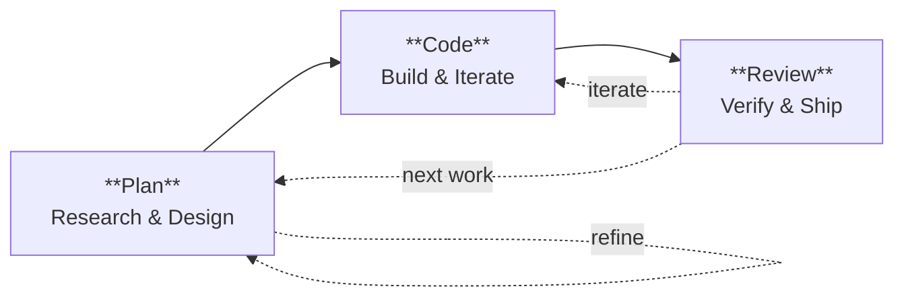
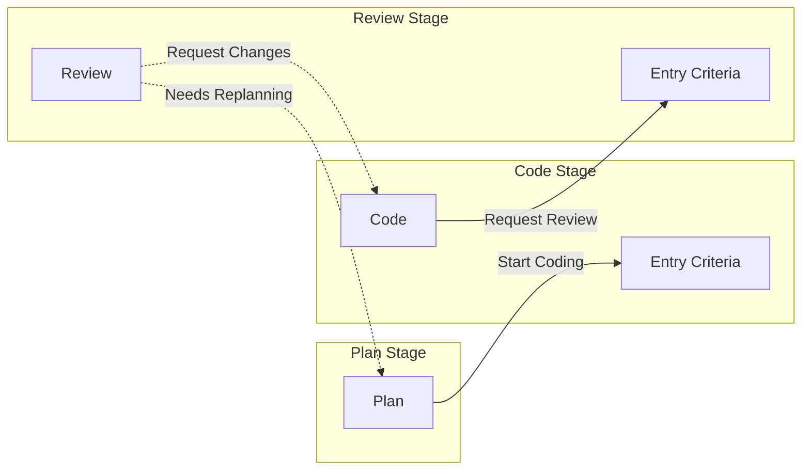
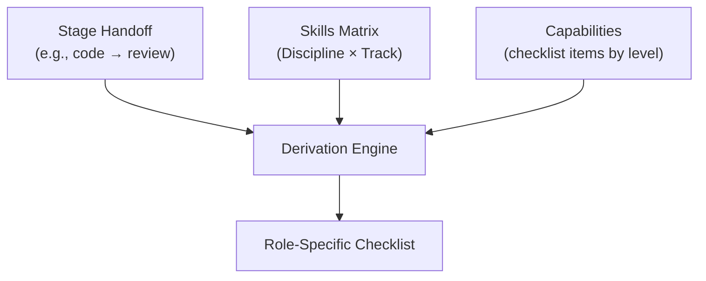

# Lifecycle

The engineering lifecycle represents the flow of work from inception to
production. This lifecycle applies to both human engineers and AI coding agents,
with the same stages, handoffs, and checklists.

> See [Core Model](core.md) for foundational concepts and
> [Agents](../pathway/agents.md) for AI-specific profile generation.

---

## Stages

Three stages define discrete phases with clear entry and exit criteria:



| Stage      | Focus           | Human Activity                    | Agent Mode   |
| ---------- | --------------- | --------------------------------- | ------------ |
| **Plan**   | What & How      | Research, design, create plan     | Read-only    |
| **Code**   | Build & Iterate | Implement, test, refine           | Full editing |
| **Review** | Verify & Ship   | Review, approve, deploy, document | Read-only    |

### Stage Definitions

**Plan**

Understand the problem, gather context, and design the solution. Research
approaches and trade-offs. Produce an implementation plan with clear
requirements and acceptance criteria.

- Identify dependencies and risks
- Break down into actionable work items
- Document approach with rationale

**Code**

Implement the solution iteratively. Write tests alongside code. Follow
established patterns and conventions. Address feedback from reviews.

- Build in small, reviewable increments
- Validate against acceptance criteria continuously
- Keep technical debt explicitly tracked

**Review**

Verify code quality, correctness, and completeness. Check against acceptance
criteria. Ship to production, monitor for issues, and document changes.

- Ensure all review feedback is addressed
- Validate outcomes match expectations
- Update documentation and communicate changes

---

## Handoffs

Handoffs define the transitions between stages. Each stage has entry criteria
that define what must be complete before starting work. Exit criteria are
implicit: the exit criteria of Stage A equal the entry criteria of Stage B.



### Plan Stage

**Entry Criteria**: None (entry stage)

**Handoffs**:

- **Start Coding** → Code stage

### Code Stage

**Entry Criteria**:

- Problem statement documented
- Approach selected with rationale
- Implementation plan exists

**Handoffs**:

- **Request Review** → Review stage

### Review Stage

**Entry Criteria**:

- Implementation complete
- Tests written and passing
- Self-review completed

**Handoffs**:

- **Request Changes** → Code stage
- **Needs Replanning** → Plan stage

---

## Checklists

Checklists are derived from the job's skill profile. Different Discipline ×
Track combinations produce different checklists for the same handoff, reflecting
the role's emphasis areas.

### Derivation Formula



```
Checklist = Handoff × Skills Matrix × Capability Checklists
```

### Capability-Level Checklist Items

Capabilities define checklist items by skill level. Items are included when the
job's maximum skill level in that capability meets the threshold:

```yaml
# Example: capabilities.yaml
- id: scale
  checklists:
    code_to_review:
      foundational:
        - Code follows team style guide
        - Basic tests exist
      working:
        - Error handling is comprehensive
        - Edge cases are tested
      practitioner:
        - Performance implications considered
        - Security review completed
      expert:
        - Architectural patterns documented
        - Cross-cutting concerns addressed
```

### Example: Different Profiles, Different Checklists

**Software Engineering × Forward Deployed (code → review)**

Skills emphasize: rapid_prototyping, business_immersion, stakeholder_management

```markdown
- [ ] Solution addresses discovered business need
- [ ] Core functionality works end-to-end
- [ ] Tests cover critical paths
- [ ] Technical debt explicitly noted for later
```

**Software Engineering × Platform (code → review)**

Skills emphasize: architecture_design, code_quality, technical_writing

```markdown
- [ ] Architecture follows established patterns
- [ ] Backward compatibility verified
- [ ] API contracts documented
- [ ] Test coverage meets standards
- [ ] Performance benchmarks pass
- [ ] Documentation updated
- [ ] Migration path documented (if breaking)
```

---

## Human Application

For human engineers, the lifecycle provides:

1. **Reminder checklists** — Printed or displayed checklists for each handoff
2. **Quality gates** — Clear criteria for moving between stages
3. **Consistency** — Same expectations regardless of who does the work
4. **Mentoring framework** — Senior engineers can coach using stage criteria

### Example: Printed Handoff Checklist

**CODE → REVIEW CHECKLIST**  
Software Engineer - Platform - L3

**Scale**

- [ ] Architecture follows established patterns
- [ ] Backward compatibility verified
- [ ] Performance implications considered

**Documentation**

- [ ] API contracts documented
- [ ] README updated

**Reliability**

- [ ] Error handling is comprehensive
- [ ] Monitoring and alerting configured

---

## Agent Application

For AI coding agents, the lifecycle provides:

1. **Stage-specific agents** — One agent per Discipline × Track × Stage
2. **Tool restrictions** — Read-only in plan/review, full editing in code
3. **Handoff buttons** — VS Code UI to transition between stage agents with rich
   prompts
4. **Capability-driven focus** — Agent instructions derived from skill profile
5. **Entry criteria verification** — Handoff prompts include target stage
   requirements

### Handoff Workflow

When an agent offers a handoff:

1. **Before Handoff**: Agent verifies completion of checklist items
2. **Summary**: Agent summarizes work completed in current stage
3. **Entry Criteria Check**: Handoff prompt includes target stage requirements
4. **Transition**: Target agent receives summary and validates entry criteria
5. **Return Format**: All agents use consistent summary structure

See [Agents](../pathway/agents.md) for agent profile generation details.

### Stage Tool Sets

| Stage  | Tools                                    | Mode        |
| ------ | ---------------------------------------- | ----------- |
| Plan   | search, web/fetch, search/codebase, todo | Read-only   |
| Code   | search, search/codebase, edit, todo      | Full access |
| Review | search, search/codebase, read, todo      | Read-only   |

---

## Related Documents

- [Core Model](core.md) — Disciplines, Tracks, Grades, Skills, Behaviours
- [Agents](../pathway/agents.md) — Agent profile generation and SKILL.md format
- [Reference](../pathway/reference.md) — File organization, templates, and CLI
