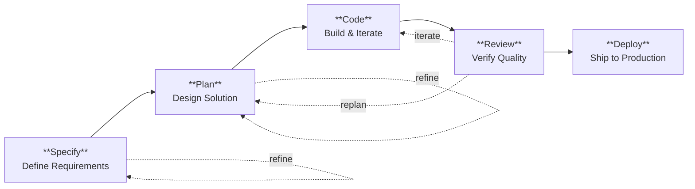
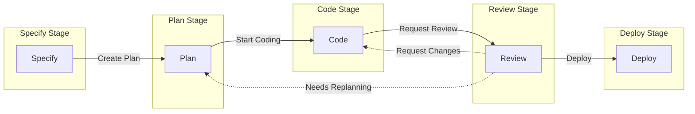
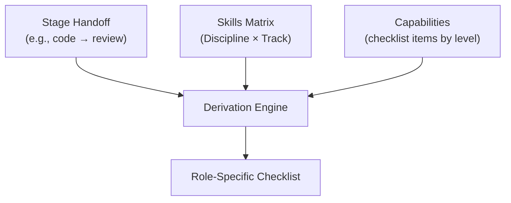

<div class="product-value">
<p>
The lifecycle defines the journey from idea to production. Five stages — specify,
plan, code, review, deploy — with clear handoff criteria at each transition.
The same lifecycle governs human engineers and AI coding agents, with
role-specific checklists derived from each team's skill profile.
</p>
</div>

> See [Core Model](core.md) for foundational concepts and
> [Agents](../pathway/agents.md) for AI-specific profile generation.

---

## Stages

Five stages define discrete phases with clear entry and exit criteria:



| Stage       | Focus              | Human Activity                    | Agent Mode   |
| ----------- | ------------------ | --------------------------------- | ------------ |
| **Specify** | What & Why         | Gather requirements, user stories | Read-only    |
| **Plan**    | How                | Design, architecture, contracts   | Read-only    |
| **Code**    | Build & Iterate    | Implement, test, refine           | Full editing |
| **Review**  | Verify Quality     | Review, test, approve             | Read-only    |
| **Deploy**  | Ship to Production | Push, monitor, verify             | Read-only    |

### Stage Definitions

**Specify**

Define WHAT users need and WHY. Gather requirements, write user stories, and
define acceptance criteria without making technology choices.

- Document user stories and acceptance criteria
- Mark ambiguities with [NEEDS CLARIFICATION]
- Focus on requirements, not implementation

**Plan**

Define HOW to build the solution. Make technology choices, design architecture,
and define contracts and data models.

- Every technology choice traces to a requirement
- Define contracts before implementation details
- Document rationale for decisions

**Code**

Implement the solution iteratively. Write tests alongside code. Follow
established patterns and conventions.

- Implement one task at a time, verify before moving on
- Write tests alongside implementation
- Track progress with the todo tool

**Review**

Verify the implementation works correctly. Run the application, test against
acceptance criteria, and document findings.

- Test against acceptance criteria through manual testing
- Document actionable findings
- Approve when all criteria are met

**Deploy**

Ship the changes to production. Push code, monitor CI/CD workflows, and verify
successful deployment.

- Use git push to deploy changes
- Monitor triggered workflows
- Verify all workflows complete successfully

---

## Handoffs

Handoffs define the transitions between stages. Each stage has entry criteria
that define what must be complete before starting work. Exit criteria are
implicit: the exit criteria of Stage A equal the entry criteria of Stage B.



### Specify Stage

**Entry Criteria**: None (entry stage)

**Exit Criteria**:

- spec.md exists with user stories and acceptance criteria
- No unresolved [NEEDS CLARIFICATION] markers

**Handoffs**:

- **Refine Spec** → Specify (refine existing spec)
- **Create Plan** → Plan stage

### Plan Stage

**Entry Criteria**:

- spec.md exists with user stories and acceptance criteria
- No unresolved [NEEDS CLARIFICATION] markers

**Exit Criteria**:

- plan.md exists with technology choices and architecture
- Contracts and data models defined

**Handoffs**:

- **Refine Plan** → Plan (refine existing plan)
- **Start Coding** → Code stage

### Code Stage

**Entry Criteria**:

- spec.md and plan.md exist
- No unresolved [NEEDS CLARIFICATION] markers

**Exit Criteria**:

- Implementation complete according to plan.md
- Tests written and passing
- Self-review completed

**Handoffs**:

- **Request Review** → Review stage

### Review Stage

**Entry Criteria**:

- Implementation complete
- Tests written and passing
- Self-review completed

**Exit Criteria**:

- Application runs locally without errors
- Changes verified against acceptance criteria
- Review approved

**Handoffs**:

- **Request Changes** → Code stage
- **Needs Replanning** → Plan stage
- **Deploy** → Deploy stage

### Deploy Stage

**Entry Criteria**:

- Review approved
- Application runs locally without errors

**Exit Criteria**:

- All triggered workflows are green
- Deployment verified in target environment

**Handoffs**:

- **Fix Pipeline** → Code stage (if deployment fails)

---

## Checklists

Checklists are derived from the job's skill profile. Different Discipline ×
Track combinations produce different checklists for the same handoff, reflecting
the role's emphasis areas.

### Derivation Formula



```
Checklist = Handoff × Skills Matrix × Capability Checklists
```

### Capability-Level Checklist Items

Capabilities define checklist items by skill level. Items are included when the
job's maximum skill level in that capability meets the threshold:

```yaml
# Example: capabilities.yaml
- id: scale
  checklists:
    code_to_review:
      foundational:
        - Code follows team style guide
        - Basic tests exist
      working:
        - Error handling is comprehensive
        - Edge cases are tested
      practitioner:
        - Performance implications considered
        - Security review completed
      expert:
        - Architectural patterns documented
        - Cross-cutting concerns addressed
```

### Example: Different Profiles, Different Checklists

**Software Engineering × Forward Deployed (code → review)**

Skills emphasize: rapid_prototyping, business_immersion, stakeholder_management

```markdown
- [ ] Solution addresses discovered business need
- [ ] Core functionality works end-to-end
- [ ] Tests cover critical paths
- [ ] Technical debt explicitly noted for later
```

**Software Engineering × Platform (code → review)**

Skills emphasize: architecture_design, code_quality, technical_writing

```markdown
- [ ] Architecture follows established patterns
- [ ] Backward compatibility verified
- [ ] API contracts documented
- [ ] Test coverage meets standards
- [ ] Performance benchmarks pass
- [ ] Documentation updated
- [ ] Migration path documented (if breaking)
```

---

## Human Application

For human engineers, the lifecycle provides:

1. **Reminder checklists** — Printed or displayed checklists for each handoff
2. **Quality gates** — Clear criteria for moving between stages
3. **Consistency** — Same expectations regardless of who does the work
4. **Mentoring framework** — Senior engineers can coach using stage criteria

### Example: Printed Handoff Checklist

**CODE → REVIEW CHECKLIST**  
Software Engineer - Platform - L3

**Scale**

- [ ] Architecture follows established patterns
- [ ] Backward compatibility verified
- [ ] Performance implications considered

**Documentation**

- [ ] API contracts documented
- [ ] README updated

**Reliability**

- [ ] Error handling is comprehensive
- [ ] Monitoring and alerting configured

---

## Agent Application

For AI coding agents, the lifecycle provides:

1. **Stage-specific agents** — One agent per Discipline × Track × Stage
2. **Tool restrictions** — Read-only in plan/review, full editing in code
3. **Handoff buttons** — VS Code UI to transition between stage agents with rich
   prompts
4. **Capability-driven focus** — Agent instructions derived from skill profile
5. **Entry criteria verification** — Handoff prompts include target stage
   requirements

### Handoff Workflow

When an agent offers a handoff:

1. **Before Handoff**: Agent verifies completion of checklist items
2. **Summary**: Agent summarizes work completed in current stage
3. **Entry Criteria Check**: Handoff prompt includes target stage requirements
4. **Transition**: Target agent receives summary and validates entry criteria
5. **Return Format**: All agents use consistent summary structure

See [Agents](../pathway/agents.md) for agent profile generation details.

### Stage Tool Sets

| Stage   | Tools                                  | Mode        |
| ------- | -------------------------------------- | ----------- |
| Specify | search, fetch, codebase, read          | Read-only   |
| Plan    | search, fetch, codebase, read          | Read-only   |
| Code    | search, codebase, read, edit, terminal | Full access |
| Review  | search, codebase, read                 | Read-only   |
| Deploy  | terminal, codebase, read               | Read-only   |

---

## Related Documents

- [Core Model](core.md) — Disciplines, Tracks, Grades, Skills, Behaviours
- [Agents](../pathway/agents.md) — Agent profile generation and SKILL.md format
- [Reference](../pathway/reference.md) — File organization, templates, and CLI
