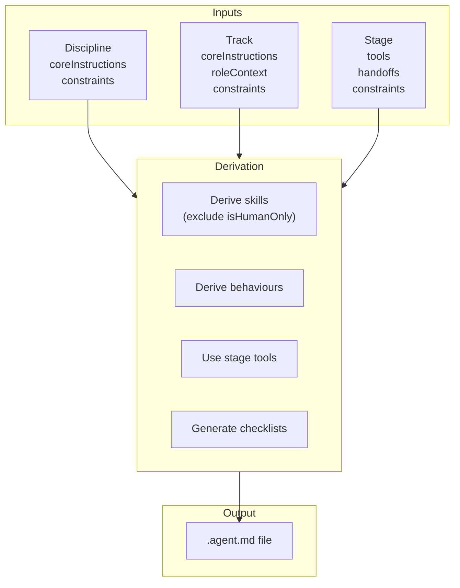
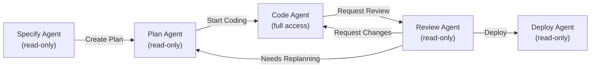
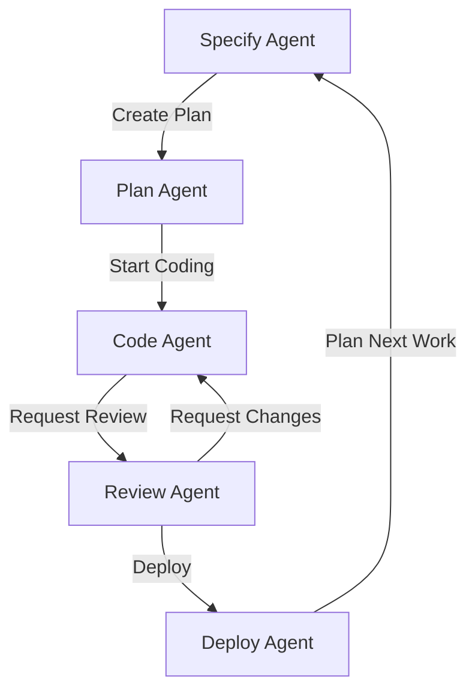

> See [Core Model](../model/core.md) for foundational concepts and
> [Lifecycle](../model/lifecycle.md) for stages, handoffs, and checklists.

---

## Agent Skills Standard (SKILL.md)

Agent skills follow the [Agent Skills Standard](https://agentskills.io/), an
open format that enables portability across different AI agents including GitHub
Copilot, VS Code, and CLI tools.

Each skill generates a `SKILL.md` file with YAML frontmatter:

```yaml
# .github/skills/code-quality-review/SKILL.md
---
name: code-quality-review
description: |
  Guide for reviewing code quality. Use when reviewing PRs,
  conducting code reviews, or assessing code health.
---

# Code Quality & Review

## When to use this skill
- Reviewing pull requests
- Assessing code health
- Establishing quality standards

## Project-Specific Guidance
...detailed instructions, examples, and references...
```

Key benefits:

- **Portable**: Works across VS Code, GitHub Copilot CLI, and coding agents
- **Progressive loading**: Only relevant skills load into context
- **Resource inclusion**: Skills can reference scripts, templates, and examples
- **Composable**: Multiple skills combine for complex workflows

### Skill Body Guidelines

| Include                    | Exclude                      |
| -------------------------- | ---------------------------- |
| Project-specific patterns  | Generic best practices       |
| Codebase conventions       | Language documentation       |
| Local file references      | External tutorials           |
| Team preferences           | Universal programming advice |
| Integration patterns       | Tool installation guides     |
| Testing strategies (local) | Widely-known frameworks      |

The agent already knows general programming. Focus on what makes THIS codebase
unique.

---

## Agent Profile Derivation

Agent profiles combine Discipline, Track, and Stage to produce stage-specific
[VS Code Custom Agents](https://code.visualstudio.com/docs/copilot/customization/custom-agents).



### Reference Grade

Agent profiles use a dynamically derived reference grade based on your
configured grades. The system selects the first grade where primary skills reach
**practitioner** level, providing a balanced skill profile that represents
substantive senior-level expertise.

If no practitioner-level grade exists, it falls back to the first working-level
grade, or the middle grade if neither exists.

### Human-Only Skills

Skills marked `isHumanOnly: true` require physical presence, emotional
intelligence, or relationship building. These are excluded from agent profile
derivation but remain fully defined for human roles.

---

## Stage-Specific Agents

Each stage produces a separate agent with appropriate tools and constraints. See
[Lifecycle](../model/lifecycle.md) for stage definitions.



### Stage Tool Sets

| Stage   | Tools                                  | Mode        |
| ------- | -------------------------------------- | ----------- |
| Specify | search, fetch, codebase, read          | Read-only   |
| Plan    | search, fetch, codebase, read          | Read-only   |
| Code    | search, codebase, read, edit, terminal | Full access |
| Review  | search, codebase, read                 | Read-only   |
| Deploy  | terminal, codebase, read               | Read-only   |

### Tool Derivation

Stages define the authoritative tool set for each lifecycle phase:

```
Final Tools = Stage.tools
```

---

## Generated Agent Profile

Each `.agent.md` file follows this structure:

```yaml
---
name: software-engineering-platform-plan
description: |
  Planning agent for Software Engineering on Platform track.
  Use for research, context gathering, and plan generation.
tools: [search, fetch, codebase]
infer: true
handoffs:
  - label: Start Coding
    agent: software-engineering-platform-code
    prompt: Implement the planned changes.
---

# Software Engineering - Platform - Plan Agent

You are in planning mode. Research, gather context, and generate
implementation plans without making code changes.

## Core Identity

{Track.agent.coreInstructions or Discipline.agent.coreInstructions with template substitution}

Your primary capabilities:
- Architecture & Design
- Code Quality & Review
- Cloud Platforms
- DevOps & CI/CD

## Operational Context

{Track.roleContext}

## Working Style

{Top 3 behaviours with workflow patterns}

## Before Handoff

Before offering a handoff, verify and summarize completion of these items:

{Derived from Handoff × Skills Matrix × Capability Checklists}

When verified, summarize what was accomplished then offer the handoff.
If items are incomplete, explain what remains.

## Return Format

When completing work (for handoff or as a subagent), provide:

1. **Work completed**: What was accomplished
2. **Checklist status**: Items verified from Before Handoff section
3. **Recommendation**: Ready for next stage, or needs more work

## Constraints

- Do not make code edits
- {Discipline.agent.constraints}
- {Track.agent.constraints}
```

---

## Handoff Flow

Agents form a connected workflow through VS Code's handoff system. Handoff
buttons appear after each response, allowing transitions between stage agents.



Humans guide AI through the lifecycle with explicit approval at each transition,
maintaining control over when stages change.

---

## Related Documents

- [Core Model](../model/core.md) — Disciplines, Tracks, Grades, Skills,
  Behaviours
- [Lifecycle](../model/lifecycle.md) — Stages, handoffs, and checklists
- [Reference](reference.md) — File organization, templates, and CLI
