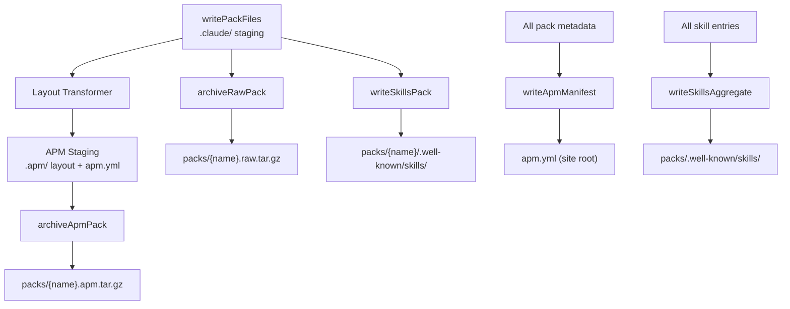
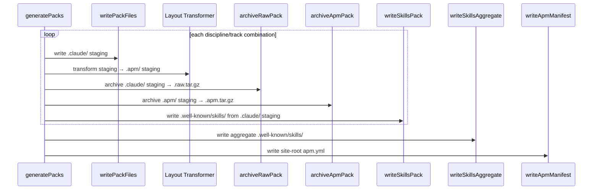

# 520 — Design: APM-Compatible Pack Distribution

## Problem Recap

Pathway packs are tarballs with a `.claude/` layout. APM expects an `.apm/`
layout and a valid `apm.yml` manifest. Two things must change: the pack layout
and the manifest format. The transport (tarball download + `apm unpack`) already
works — only the content is wrong.

## Migration Strategy

This is a clean break. All function names are renamed for symmetric channel
naming across the three distribution channels (raw, apm, skills). Archive files
gain format qualifiers (`.raw.tar.gz`, `.apm.tar.gz`). No old names are
preserved, no aliases, no re-exports. Tests are updated to match.

## Distribution Channels

Three channels, symmetric naming:

| Channel    | Format                | Artifact            | Command               |
| ---------- | --------------------- | ------------------- | --------------------- |
| **Raw**    | `.claude/` layout     | `{name}.raw.tar.gz` | `curl \| tar`         |
| **APM**    | `.apm/` layout        | `{name}.apm.tar.gz` | `curl` + `apm unpack` |
| **Skills** | `.well-known/skills/` | `{name}/` directory | `npx skills add`      |

## Function Naming

All pack pipeline functions follow the pattern `{verb}{Channel}Pack` or
`{verb}{Channel}{Noun}`:

| Function               | Channel    | File                       | Responsibility                                    |
| ---------------------- | ---------- | -------------------------- | ------------------------------------------------- |
| `writePackFiles`       | _(shared)_ | `build-packs.js`           | Write `.claude/` staging (input for all channels) |
| `archiveRawPack`       | Raw        | `build-packs.js`           | Archive `.claude/` staging → `.raw.tar.gz`        |
| `archiveApmPack`       | APM        | `build-packs.js`           | Transform + archive → `.apm.tar.gz`               |
| `writeSkillsPack`      | Skills     | `build-packs.js`           | Write per-pack `.well-known/skills/`              |
| `writeSkillsAggregate` | Skills     | `build-packs.js`           | Write aggregate `.well-known/skills/`             |
| `writeApmManifest`     | APM        | `build-packs.js`           | Write site-root `apm.yml`                         |
| `getRawCommand`        | Raw        | `agent-builder-install.js` | `curl -sL <url> \| tar xz`                        |
| `getApmCommand`        | APM        | `agent-builder-install.js` | `curl -sLO <url> && apm unpack <file>`            |
| `getSkillsCommand`     | Skills     | `agent-builder-install.js` | `npx skills add <url>`                            |

**Renamed from → to:**

| Old name                   | New name                                        |
| -------------------------- | ----------------------------------------------- |
| `archivePack`              | `archiveRawPack`                                |
| `writePackRepository`      | `writeSkillsPack`                               |
| `writeAggregateRepository` | `writeSkillsAggregate`                          |
| `writeApmManifest`         | `writeApmManifest` _(kept — already symmetric)_ |
| `getApmInstallCommand`     | `getApmCommand`                                 |
| `getSkillsAddCommand`      | `getSkillsCommand`                              |
| _(none)_                   | `getRawCommand` _(new)_                         |

## Components



Three new pieces of work, everything else is a rename:

| New                                | Responsibility                                          |
| ---------------------------------- | ------------------------------------------------------- |
| **Layout Transformer**             | Converts `.claude/` staging tree to `.apm/` layout      |
| **`archiveApmPack`**               | Archives the `.apm/` staging as a deterministic tarball |
| **`writeApmManifest`** (rewritten) | Emits a valid APM project manifest at the site root     |

## Layout Transformer

Converts the existing `.claude/` pack staging directory into APM's `.apm/`
package structure. A second staging directory per pack; no mutation of the
original.

**Mapping rules:**

| Source (`.claude/`)          | Target (`.apm/` or root)          |
| ---------------------------- | --------------------------------- |
| `agents/{name}.md`           | `.apm/agents/{name}.agent.md`     |
| `skills/{name}/SKILL.md`     | `.apm/skills/{name}/SKILL.md`     |
| `skills/{name}/scripts/*`    | `.apm/skills/{name}/scripts/*`    |
| `skills/{name}/references/*` | `.apm/skills/{name}/references/*` |
| `CLAUDE.md`                  | _(dropped — no APM primitive)_    |
| `settings.json`              | _(dropped — no APM primitive)_    |

The `.agent.md` extension is required by APM's agent detection. `CLAUDE.md` and
`settings.json` have no usable APM equivalent — APM's instructions primitive
deploys to `.claude/instructions/`, which Claude Code does not read (it reads
`.claude/CLAUDE.md`). Both files are excluded from the APM bundle; the raw
tarball remains the distribution path for them.

An `apm.yml` is generated at the APM staging root with `name` and `version`
fields — the minimum APM requires to recognize a package.

**Per-bundle `apm.yml` format:**

```yaml
name: se-platform
version: 0.25.29
```

**Why a separate staging dir instead of in-place transform?** The `.claude/`
staging is read by `archiveRawPack` and `writeSkillsPack` after transformation.
Mutating it would require either ordering guarantees or re-staging. A parallel
directory is simpler.

**Why not rewrite `writePackFiles` to emit both layouts?** That couples the APM
layout to the formatter layer. The transformer operates on the finished staging
output, so APM-specific knowledge stays in one place and formatter changes don't
require APM-aware updates.

## `archiveApmPack`

Archives the APM staging directory as a deterministic `.apm.tar.gz`. Uses the
same deterministic strategy as `archiveRawPack`: epoch timestamps, sorted file
list, `gzip -n`. The only difference is the input directory (`.apm/` staging
instead of `.claude/` staging) and the output filename (`{name}.apm.tar.gz`
instead of `{name}.raw.tar.gz`).

The implementation reuses the shared archive helpers (`collectPaths`,
`resetTimestamps`) — no new archiving machinery.

## `writeApmManifest` (rewritten)

Replaces the current `writeApmManifest`. Emits a valid APM project manifest at
the site root.

**Format:**

```yaml
name: engineering-pathway
version: 0.25.29
description: "Engineering Pathway agent teams for Claude Code"
dependencies:
  apm:
    - name: se-platform
      description: "Software Engineering (Platform) — agent team"
      url: "https://pathway.example.com/packs/se-platform.apm.tar.gz"
    - name: se-forward-deployed
      description: "Software Engineering (Forward Deployed) — agent team"
      url: "https://pathway.example.com/packs/se-forward-deployed.apm.tar.gz"
```

The `dependencies.apm` section lists each pack with its download URL. APM's
`dependencies.apm` entries are normally git references, but the site-root
manifest serves as a human- and machine-readable index of available packs rather
than an `apm install` target — consumers use the `apm unpack` command for
individual packs.

The `skills:` array and per-pack `digest` fields from the current manifest are
dropped — the format is not valid APM and misleads anyone reading the file.

## `getRawCommand`

New function. Produces:

```
curl -sL https://host/packs/se-platform.raw.tar.gz | tar xz
```

Downloads and extracts the raw pack in one step via pipe. The `.claude/`
directory inside the archive is written directly into the current working
directory — no intermediate file on disk.

## `getApmCommand`

Replaces the current `getApmInstallCommand`. Produces:

```
curl -sLO https://host/packs/se-platform.apm.tar.gz && apm unpack se-platform.apm.tar.gz
```

The command downloads the APM bundle and unpacks it in one step. `apm unpack`
reads the `.apm/` layout and maps it to the target directory (`.claude/` by
default).

**Why `apm unpack` instead of `apm install`?** `apm install` only accepts git
repository references. It resolves through `git ls-remote` and has no tarball
code path. `apm unpack` is APM's built-in mechanism for extracting pre-built
bundles — designed for offline, air-gapped, and static hosting scenarios.

## `getSkillsCommand`

Renamed from `getSkillsAddCommand`. No logic change — same output:

```
npx skills add https://host/packs/se-platform
```

Renamed purely for channel symmetry with `getApmCommand`.

## Data Flow



The Layout Transformer runs after `writePackFiles`. `archiveRawPack` and
`writeSkillsPack` read from the `.claude/` staging directory, unchanged.
`archiveApmPack` reads from the `.apm/` staging directory. Both staging
directories are cleaned up after all archives and repositories are written.

## Build Output

After the change, `packs/` contains:

```
packs/
  se-platform.raw.tar.gz         ← renamed: .claude/ layout for curl|tar
  se-platform.apm.tar.gz         ← new: .apm/ layout for apm unpack
  se-platform/
    .well-known/skills/           ← renamed function, same output
      index.json
      architecture-design/
        SKILL.md
        ...
  de-backend.raw.tar.gz
  de-backend.apm.tar.gz
  de-backend/
    .well-known/skills/
      ...
  .well-known/skills/             ← renamed function, same output
    index.json
    ...
apm.yml                           ← rewritten: valid APM project manifest
```

Each distribution channel has its own artifact. No path mixing, no shared
directories serving double duty.

## Risks

1. **`apm unpack` bundle format assumptions.** `apm unpack` expects a directory
   (or tarball) containing an `.apm/` tree and an `apm.yml`. If a future APM
   version changes the expected bundle structure, unpack could fail. Mitigation:
   success criterion 1 (end-to-end `apm unpack` test) catches this. The format
   is stable — it mirrors the installed package layout, which is APM's core
   contract.

2. **Two tarballs per pack.** Each pack now produces both `{name}.raw.tar.gz`
   (`.claude/` layout) and `{name}.apm.tar.gz` (`.apm/` layout). The content
   overlap is high — the same skills and agents in different directory
   structures. This is acceptable: the tarballs are small (~50–100KB each), the
   total overhead is ~1MB for 12 packs, and the alternative (trying to make one
   archive serve both layouts) would couple the two distribution paths.
