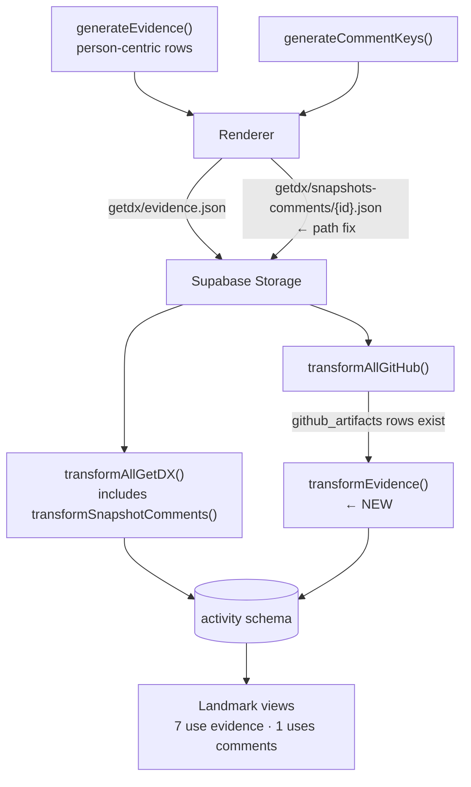

# 550 — Seed Contract: Landmark Coverage — Design

## Problem

`fit-map activity seed` leaves the `evidence` and `getdx_snapshot_comments`
tables empty. Two distinct root causes:

1. **Evidence — missing transform.** The synthetic generator produces evidence
   and the renderer writes `getdx/evidence.json` to storage, but no transform
   reads it into the DB. The `evidence` table requires `artifact_id` (NOT NULL
   FK to `github_artifacts`), while synthetic evidence is person-centric
   `{person_email, skill_id, proficiency}`.
2. **Comments — storage path mismatch.** The renderer writes comments to
   `getdx/snapshots/{id}/comments.json`. The existing
   `transformSnapshotComments` reads from `getdx/snapshots-comments/{id}.json`.
   Files exist but are never found.

## Architecture



## Components

### A. Evidence Transform (new)

A new `transformEvidence(supabase)` function in the transform layer.

**Reads** `getdx/evidence.json` from Supabase Storage — the file the renderer
already writes.

**Resolves person → artifact.** For each synthetic evidence row, queries
`github_artifacts` by `email` to find an artifact for that person. The evidence
table requires `artifact_id` (NOT NULL FK), so every evidence row must link to a
real artifact.

**Maps to DB schema:**

| Synthetic field   | DB column     | Mapping                                         |
| ----------------- | ------------- | ----------------------------------------------- |
| _(resolved)_      | `artifact_id` | From `github_artifacts` lookup by email         |
| `skill_id`        | `skill_id`    | Direct                                          |
| `proficiency`     | `level_id`    | Direct — proficiency strings, not career levels |
| _(from artifact)_ | `marker_text` | See extraction logic below                      |
| _(constant)_      | `matched`     | `true`                                          |
| _(constant)_      | `rationale`   | `"synthetic"`                                   |
| `observed_at`     | `created_at`  | Direct                                          |

**`marker_text` extraction.** The `marker_text` column is NOT NULL. Artifact
metadata varies by type: PRs have `metadata.title`, commits have
`metadata.message`, reviews have neither. Extract in priority order:
`metadata.title` → `metadata.message` → `"{skill_id} evidence"` (fallback).

**`level_id` clarification.** The `level_id` column stores proficiency strings
(awareness, foundational, working, practitioner, expert) — the same vocabulary
the evidence table uses in production. These are skill proficiency levels, not
career levels from `levels.yaml`.

**Idempotency.** Delete existing rows where `rationale = 'synthetic'` before
inserting. The evidence PK is a generated UUID with no unique constraint on
`(artifact_id, skill_id)`, so upsert is not feasible without a schema change
(excluded by spec). Delete-then-insert achieves the same result.

**Distribution.** Multiple evidence rows may map to the same person. Distribute
across that person's artifacts round-robin to avoid concentrating all evidence
on a single artifact. Skip any person with zero artifacts (graceful
degradation).

**Dependency order.** Must run after `transformAllGitHub()` — artifacts must
exist in the DB before evidence can reference them.

### B. Comments Path Fix (renderer change)

Change `renderGetDXComments` to write files to
`getdx/snapshots-comments/{snapshotId}.json` instead of
`getdx/snapshots/{snapshotId}/comments.json`.

The existing `transformSnapshotComments` already reads from
`getdx/snapshots-comments/` — no transform changes needed. All other GetDX
resources follow the `getdx/{resource-type}/` directory convention; the current
renderer path is the outlier.

_Rejected: changing the transform to match the renderer's path._ The
`getdx/{resource-type}/` convention is established across teams-list,
snapshots-list, snapshots-info, and initiatives-list. The renderer should
conform, not the other way around.

### C. Transform Orchestrator (modified)

The existing `transformAll()` runs `people → getdx → github` in sequence. Append
`transformEvidence()` after GitHub, preserving the existing order:

```
people → getdx → github → evidence (new, appended)
```

Evidence depends on people (for email resolution) and github (for artifact
rows). GetDX is independent of evidence but runs first per existing ordering.

### D. Verify (modified)

Add `evidence` and `getdx_snapshot_comments` row counts to the verify output and
success criteria. Currently checks only `organization_people`,
`getdx_snapshots`, and `github_events`.

### E. Seed Reporting (modified)

Report the evidence transform result alongside the existing transform reports.

## Key Decisions

### Person → artifact resolution lives in the transform, not the generator

The generator stays purely structural — it assigns skills to people without
knowing DB-generated artifact UUIDs. The transform layer is where DB awareness
belongs. This follows the existing pattern: GitHub transforms resolve
`github_username → email` at transform time, not generation time.

_Rejected: modifying the generator to emit artifact references._ The generator
runs before artifacts exist. Adding a lookahead coupling between evidence
generation and webhook generation would break the clean stage separation
(generate → render → upload → transform).

### Delete-then-insert for idempotency, not upsert

The evidence table's PK is a server-generated UUID with no unique constraint on
`(artifact_id, skill_id)`. Upserting requires either a deterministic UUID or a
new constraint. The spec excludes schema changes. Deleting rows where
`rationale = 'synthetic'` and re-inserting is idempotent and preserves any real
evidence written by Guide.

_Rejected: adding a unique constraint on `(artifact_id, skill_id)`._ Schema
changes are excluded by spec. Also, real Guide evidence could legitimately
produce multiple rows for the same artifact+skill pair (different markers).

### No generator changes needed

The existing `generateEvidence()` output contains everything the transform
needs: `person_email` (for artifact lookup), `skill_id`, `proficiency` (for
`level_id`), and `observed_at` (for `created_at`). The `marker_text` is derived
from the artifact's own metadata at transform time — this is closer to how Guide
works (it reads artifact content to find markers).

_Rejected: adding marker_text generation to libsyntheticgen._ Marker text
depends on artifact content, which is a transform-time concern. The generator
shouldn't need to know artifact metadata shapes.

## Data Flow Summary

### Evidence (end to end)

```
DSL scenario.affects.evidence_skills
  → generateEvidence() → [{person_email, skill_id, proficiency, observed_at}]
  → renderGetDXPayloads() (evidence is co-located here) → getdx/evidence.json
  → seed uploads to Supabase Storage (already exists)
  → transformEvidence() → resolve email → artifact_id, map fields (NEW)
  → evidence table rows
  → Landmark views: evidence, health, readiness, timeline, voice, practice, practiced
```

### Comments (end to end)

```
DSL snapshots.comments_per_snapshot
  → generateCommentKeys() → [{snapshot_id, email, driver, timestamp}]
  → renderGetDXComments() → getdx/snapshots-comments/{id}.json (PATH FIX)
  → seed uploads to Supabase Storage (already exists)
  → transformSnapshotComments() (already exists, no changes)
  → getdx_snapshot_comments table rows
  → Landmark view: voice
```
