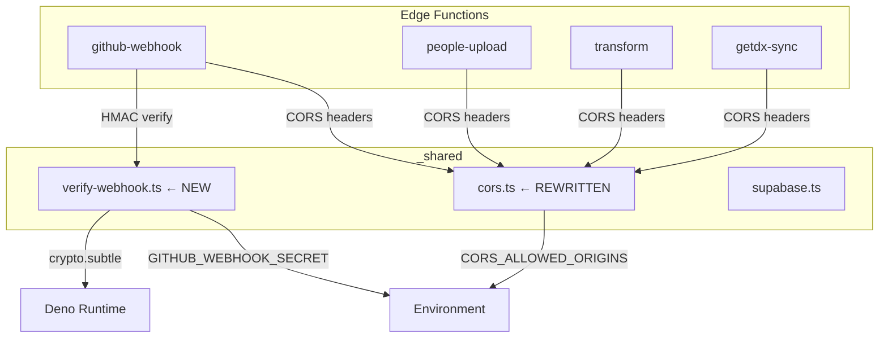
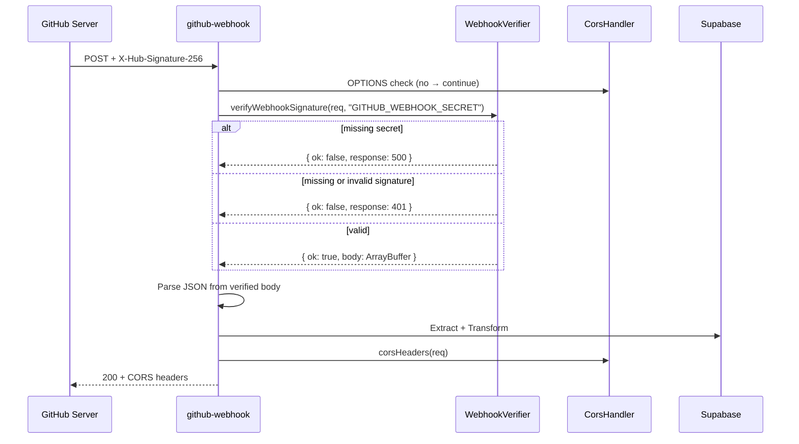

# 560 — Supabase Edge Function Security Hardening — Design

## Overview

Two new shared modules in `_shared/` and a wiring change across all four edge
functions. WebhookVerifier adds HMAC-SHA256 gate to `github-webhook`;
CorsHandler replaces the static wildcard CORS export with origin-validated
headers on every function.

## Architecture



## Components

### A. WebhookVerifier (new: `_shared/verify-webhook.ts`)

Reusable HMAC-SHA256 signature verification for incoming webhooks using the Web
Crypto API (`crypto.subtle`), available in Deno without imports.

**Interface:**

```ts
verifyWebhookSignature(
  req: Request,
  secretEnvVar: string,
): Promise<
  { ok: true; body: ArrayBuffer } | { ok: false; response: Response }
>
```

**Contract:**

- **Fail closed.** If the webhook secret env var is not configured, returns 500
  immediately — no payload processing occurs.
- **Auth gate.** If `X-Hub-Signature-256` is missing or the HMAC-SHA256 digest
  does not match, returns 401. Comparison must be constant-time to prevent
  timing attacks. The specific constant-time API is a Deno runtime detail for
  the plan to resolve (Deno's `crypto.subtle.timingSafeEqual` if available,
  manual fixed-length byte comparison otherwise).
- **Body ownership.** Returns the raw `ArrayBuffer` on success because
  `Request.body` is a stream consumed on first read — the caller parses JSON
  from the verified bytes.

_Rejected: separate verify step with caller reading body._ Impossible — body
already consumed by verifier. _Rejected: caller pre-reads body before
verification._ Tempts pre-verification processing of untrusted data.

### B. CorsHandler (rewrite: `_shared/cors.ts`)

Replaces the static wildcard export with a function that validates the request
origin against an environment-driven allowlist.

**Interface:**

```ts
corsHeaders(req: Request): Record<string, string>
handlePreflight(req: Request): Response
```

**`corsHeaders(req)`:** Reads `Origin` from the request. Checks against
`CORS_ALLOWED_ORIGINS` env var (comma-separated list of trusted origins).
Returns `Access-Control-Allow-Origin` set to the matching origin plus
`Vary: Origin` if matched, or an empty object if unmatched or absent.

**`handlePreflight(req)`:** Returns a 204 Response with CORS headers for OPTIONS
requests. Disallowed origins get 204 without CORS headers — the browser
interprets missing `Access-Control-Allow-Origin` as denial.

**Origin matching:**

- Exact string match against each allowlist entry (full origin including scheme)
- `CORS_ALLOWED_ORIGINS` unset → defaults to localhost only. Matching rule:
  origin must equal `http://localhost` or match `http://localhost:<port>`
  (parsed URL comparison, not string prefix — `http://localhost.evil.com` does
  not match)
- `Vary: Origin` on every response prevents CDN cache poisoning

_Rejected: fail 500 when env var missing (like webhook secret)._ CORS is
defense-in-depth. Server-to-server callers (webhooks, cron) never send `Origin`
headers — failing 500 would break them. Localhost default preserves
server-to-server functionality while blocking browser-based attacks.

_Rejected: wildcard as default._ Defeats the purpose of the fix.

### C. Edge Function Integration

`corsHeaders` is currently exported from `cors.ts` but not imported by any of
the four edge functions. All four adopt the new CorsHandler for OPTIONS
preflight and response headers. `github-webhook` additionally adopts
WebhookVerifier as an auth gate before payload processing.

## Decisions

### Wire CORS into all four functions, not just browser-facing ones

Even though some functions are server-to-server today (getdx-sync, transform),
all four adopt the CORS handler. Cost is negligible (one conditional + header
merge) and prevents the wildcard pattern from reappearing when access patterns
change.

_Rejected: CORS only on people-upload._ Leaves three functions vulnerable if
they later serve browser requests. The handler is zero-cost for requests without
`Origin` headers.

### 204 without headers for disallowed preflight, not 403

Browsers check for `Access-Control-Allow-Origin` presence, not status codes. A
204 without CORS headers is the standards-compliant denial signal. A 403 would
leak allowlist information to scanners and is semantically incorrect (the
request was understood, not forbidden).

_Rejected: 403 Forbidden._ Non-standard for CORS denial, information leak risk.

### Localhost default over fail-closed for CORS

When `CORS_ALLOWED_ORIGINS` is unset, only `http://localhost` origins (any port)
are permitted. This matches the Supabase local development model where functions
run on `localhost:54321` and dashboards on `localhost:3000`. Production
deployments must set explicit origins.

_Rejected: require env var always._ Breaks local development ergonomics. The
Supabase CLI doesn't set custom env vars by default — requiring one for CORS
would add friction to every `supabase functions serve` invocation.

## Verification Flow


