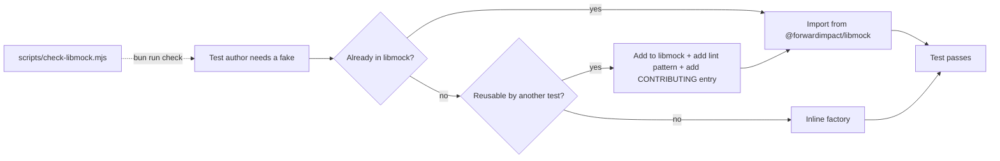

# Design 0640-a — Refactor Test Suite for Speed and Maintenance

## Restatement

The test suite is too slow and too duplicative because (i) production
modules import `node:fs`, `Date.now()`, and `child_process` ambiently, so
unit tests reach for the real OS; (ii) test files reinvent fixtures and
mocks that libmock already offers; and (iii) a handful of test files have
ballooned past the size at which their structure conveys intent. Goal: cut
maintenance surface and wall-clock without dropping coverage.

## Scope Boundary

Three specs share this surface; this design owns the **test-side hygiene**
slice only.

| Slice | Spec | What it owns |
|---|---|---|
| Source-side DI (every src module accepts `fs`/`proc`/`clock`/`subprocess`) | [**1370**](../1370-ambient-dependencies-to-injected-collaborators/spec.md) (design PR #1259) | Eliminates real I/O from tests by giving every module a seam. Owns the libprompt/libtemplate/libsyntheticprose loader refactor flagged "Still open" in 0640. |
| Runner switch (`node:test` → `bun test` via `mock.fn` shim) | [**0650**](../0650-bun-test-runner/spec.md) | Eliminates Node fork-per-file overhead. |
| Test-side hygiene (this design) | **0640** | libmock surface completion + discovery contract + test-file shape + parametrization audit. |

This design does not add source-side DI, does not switch the runner, and
does not reduce coverage (spec § C deferred — spec author flagged
"unlikely to pay off" after their own audit).

### Already settled by prior execution passes

The spec § "Outcome so far" records work already on `main`. This design
does not re-design it; the planner skips:

| Spec section | State | Why excluded from this design |
|---|---|---|
| **A.1** framework-data fixtures, **A.2** libeval helpers, **A.4** CLI helpers, **A.5** discovery docs | Shipped (see libmock `fixture/`, `mock/`; `CONTRIBUTING.md`; `scripts/check-libmock.mjs`) | Settled; planner verifies, does not redo. |
| **B.1** parallel test execution | No-op | Spec's own measurement showed parallel = serial on `node:test` because fork-per-file dominates; 0650 supersedes. |
| **B.2** real-fs → `createMockFs` in unit tests | Deferred to 1370 | Blocked by source-side loaders importing `node:fs` directly; that's 1370's charter. |
| **B.3** cached framework-data loads | Shipped for `products/summit/test/` (`loadStarterData` + `memoizeAsync`); applicable elsewhere only if a hot site appears | Settled; no remaining hot site identified. |

## Components

| Component | Role |
|---|---|
| **libmock module surface** | Existing canonical home for shared fakes (`fixture/` for data shapes, `mock/` for collaborator fakes). This design adds the remaining helpers flagged as **A.3 holes** in the spec (graph-index, repl-environment, grpc-health) so libmock covers every fake reused at >2 sites. |
| **Discovery contract** | `CONTRIBUTING.md` test section + `scripts/check-libmock.mjs` pattern lint. Lint accumulates one entry per shared libmock helper; adding a helper requires adding its inline-pattern signature so future inlining fails `bun run check`. |
| **Test-file shape policy** | Single sentence in `CONTRIBUTING.md`: target ≤400 LOC per `*.test.js`; split by behaviour family (e.g. schema vs orchestration), never by data type. Judgement-shaped, not pattern-shaped — no lint. |
| **Test-file consolidation policy** | Sibling pairs that share scaffolding may collapse into one file when (i) behaviour family is the same, and (ii) combined LOC stays ≤400. Otherwise stay separate — discoverability beats file-count. |
| **Parametrization audit rule** | Combinatorial matrices in `*.test.js` are kept only when each axis encodes a real code path. Cross-multiplication that exercises the same loop is collapsed to boundary cases + one representative per code path. |

## Data Flow — Test Author Adding a Mock

Three artifacts land together when a new helper ships: the helper in
`libraries/libmock/src/`, its inline-pattern entry in
`scripts/check-libmock.mjs`, and (if the helper introduces a new naming
convention) a `CONTRIBUTING.md` line. The lint enforces the discovery
contract; CONTRIBUTING.md makes it discoverable; libmock holds the code.

## Key Decisions

| # | Decision | Why | Rejected alternative |
|---|---|---|---|
| 1 | Single `libmock` package owns every shared fake | One discoverable surface; one lint target; one place new contributors learn the conventions | Per-library `test-harness.js` modules — splits the surface and re-creates the discovery problem |
| 2 | New helper, its lint pattern, and its CONTRIBUTING.md note land in the same PR | Forces the social contract; lint alone cannot catch a freshly-named pattern | "Migrate later" backlog — proven not to work; 67 inline reimplementations accumulated under that contract |
| 3 | Pattern-based lint (regex against named identifiers), not AST-based | Cheap to maintain, sufficient signal-to-noise for a finite list of named helpers | AST-based lint — adds parse cost and dependency surface for marginal precision on a known-finite pattern set |
| 4 | Test-file LOC ceiling: 400, split by behaviour family | Behaviour-family split keeps every file end-to-end readable; data-type split scatters one feature across files. 400 LOC aligns with the work — the files needing split are all >400; the spec's 300-LOC count (52 files) is an indicator, not a ceiling | "By data type" split — proven to scatter related tests; "no ceiling" — the >500-LOC files cited in spec § B.4 are the counter-example |
| 5 | Parametrization rule: boundary + one representative per code path | Cross-multiplied matrices test the same loop N² times; boundary + per-branch sampling exercises the same logic at ~10% of the cases | Blanket case cap — over-cuts where the matrix encodes real branches; status quo — preserves redundant cases |
| 6 | Source-side DI work routes to spec 1370, not 0640 | 1370 is the whole-monorepo DI charter; the loader refactor (libprompt/libtemplate/libsyntheticprose) is the shape 1370 owns | Re-scope into 0640 — would duplicate 1370's charter and bypass its panel review |
| 7 | Runner switch routes to spec 0650, not 0640 | 0650 is the focused bun-runner spec with the `mock.fn` shim plan | Bundle into 0640 — would re-open scope after 0650 approval |
| 8 | Spec § C coverage cuts deferred indefinitely | Spec author's own audit refuted every named candidate ("turned out to cover distinct surfaces on closer inspection") | Take the cuts now — author's audit refuted them |
| 9 | Discovery contract lives in `CONTRIBUTING.md`, not a separate `TESTING.md` | One home per policy (CLAUDE.md doctrine); test conventions are part of contribution conventions | Separate `TESTING.md` — splits the read-do surface |

## Out of Scope

- Adding source-side DI seams — spec 1370.
- Switching the test runner — spec 0650.
- Coverage reductions (spec § C) — deferred per spec author.
- Reorganizing libmock internals — only additive extensions.
- Changing what products do — only test code.

## Open Questions for the Plan

1. **File-consolidation eligibility surface.** Should the consolidation
   policy apply only to libeval and libtelemetry (which the spec named)
   or to every library? The architectural choice is whether sibling-pair
   collapse is a libmock-area convention or a monorepo convention. Plan
   decides; default conservative (named areas first).
2. **Property-based testing.** The spec § Open Questions asks whether
   property-based (fast-check) replaces hand-curated boundary sets for
   the libskill matrices. Architectural question: do we admit a new test
   tool to the library set? Plan decides; default no (boundary sets
   first; admit fast-check only if a matrix is genuinely
   property-shaped).
3. **Lint scope.** Does `check-libmock.mjs` enforce only named-helper
   patterns or also generic "you wrote a function called `createMock*`
   without importing libmock first" heuristics? The latter is broader
   coverage at higher false-positive risk. Plan decides; default narrow
   (named patterns only).

— Staff Engineer 🛠️
