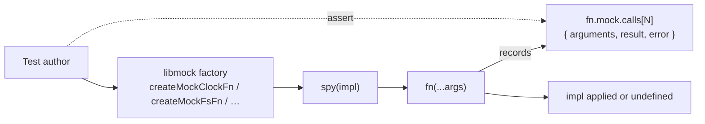

# Design 0650-a — Switch Test Runner from `node:test` to `bun test`

## Restatement

`node --test` forks a new Node process per test file. With 200+ files
that overhead dominates wall-clock — measured 16.3 s serial; cumulative
Node boot would be ≈ 19 s in the parallel-bound case, hence the ceiling
even when `--test-concurrency` is raised. `bun test` runs the same suite
in 11 s inside one process, a 32% wall-clock cut. The blocker has been
libmock's reliance on `mock.fn` from `node:test`, which throws
`NotImplementedError` under bun. Goal: lift the blocker, switch the
default, keep every test passing on both runners.

## Scope Boundary

This design owns the **runner switch** slice of the test-suite refactor
chartered by [spec 0640](../0640-refactor-test-suite/spec.md). Two
siblings own the other slices:

| Slice | Spec | Owns |
|---|---|---|
| Source-side DI (every src module accepts `fs`/`proc`/`clock`/`subprocess`) | [**1370**](../1370-ambient-dependencies-to-injected-collaborators/spec.md) | Lets unit tests run without OS access; depends on 0650 only insofar as the dispatched fakes share the libmock surface. |
| Test-side hygiene (libmock helper surface, file-size policy, parametrization audit) | [**0640**](../0640-refactor-test-suite/design-a.md) | Eliminates duplicate fakes; does not change runner. |
| Runner switch + bun compat (this design) | **0650** | Replace `mock.fn` with portable shim; sweep two bun-incompatible idioms; flip `package.json` test script. |

The three slices are independent — any order works. 0650 lands first as
the wall-clock unlocker.

### Already shipped

This is a retrospective design. The implementation is on `main` (`bun test`
in `package.json`; `libraries/libmock/src/mock/spy.js`; sweep across
libmock's `mock/` callsites and 25 test files; the lone environment-
conditional skip rewritten as a guarded early-return at
`libraries/libconfig/test/libconfig-env-file.test.js:175-176`; three
gRPC callback-style tests in `libraries/librpc/test/health.test.js`
rewritten async around a local `checkAsync` Promise wrapper at
`health.test.js:67-74`). The 0640 sibling design lives on PR #1277, not
yet on `main`. The plan validates this design against the shipped
artifacts, names the carrying commits, and identifies follow-ups.

## Components

| Component | Role |
|---|---|
| **`libmock/src/mock/spy.js`** | Runtime-independent mock-function factory. Matches `node:test`'s `mock.fn` call-shape: `fn.mock.calls[N]` carries `arguments`, `this`, `result`, `error` (the last two populated on the corresponding code path); plus `callCount`, `resetCalls`, `mockImplementation`. Imports nothing from `node:test` or `bun:test`. |
| **`libmock` mock-factory modules** — `clock`, `fs`, `grpc`, `clients`, `logger`, `observer`, `storage` (7 swept files in `libraries/libmock/src/mock/`) | Internal callers of `spy`. All `mock.fn(...)` callsites swept; the `mock` import from `node:test` dropped. Public API unchanged: every `createMock*Fn` factory still returns a function with the same `.mock` introspection surface. |
| **Test files (`*.test.js`)** | Continue to import `test` / `describe` / `beforeEach` / `afterEach` (and rarely `it`) from `node:test`. bun's `node:test` interop handles all of these. Tests that called `mock.fn` directly import `spy` from libmock instead. Pre-existing exception: `libraries/libpack/test/*.test.js` already import `describe`/`test`/`expect` from `bun:test`; libpack is a bun-only build tool and is left unchanged. |
| **`package.json` `test` script** | `find … -name '*.test.js' \| xargs bun test`. Replaces `xargs bun run node --test --test-concurrency=0` — the serial flag drops with the runner change (see Decision 9). CI (`.github/workflows/check-test.yml`) calls `bun run test`; no workflow change. |
| **`libconfig-env-file.test.js` skip-site** | The lone `t.skip()` callsite rewritten as a guarded early-return — `if (process.getuid?.() === 0) return;` plus a one-line comment naming the skip rationale. Environment-conditional skip ("running as root") needs no first-class skip semantics. |
| **`librpc/test/health.test.js` callback rewrites** | The three `(_, done) => done()` tests for `healthDefinition.Check` rewritten `async` around a local `checkAsync(handlers, service)` Promise wrapper. Tests assert on the resolved value; no test-runner timeout dependency. The auth-bypass test later in the same file keeps its inline assertion-callback shape — it is not a `done`-callback test and bun runs it identically. |

## Data Flow — Mock Function Call

The single `spy` site replaces what was previously a per-runner branch.
Test authors keep the same `.mock.calls[N].arguments` inspection surface.

## Key Decisions

| # | Decision | Why | Rejected alternative |
|---|---|---|---|
| 1 | Custom runtime-independent `spy` over runtime-detecting shim | `bun:test`'s mock surface and `node:test`'s mock surface have both churned across releases; a 45-LOC in-tree helper insulates the suite from either runner's experimental API | Path A — detect runner, dispatch to `mock.fn` or `bun:test`'s `mock`, translate call-shape. Fights bun's getter on `.mock` and breaks the day either runtime renames a field. |
| 2 | Keep `node:test`'s `describe`/`test`/`beforeEach`/`afterEach`/`it` imports | bun's `node:test` interop handles all of these with no behavioral diff; switching to `bun:test` would touch every test file for zero functional gain and would harden lock-in to bun | Sweep imports to `bun:test`. Touches ~400 files; raises switch-back cost. |
| 3 | `spy` is dependency-free (no import from any runner) | One symbol, one implementation, no environment branching. Future runner changes do not require a libmock update. | Re-export `mock.fn` under one runner and shim under the other. Two implementations to maintain. |
| 4 | `t.skip("…")` → early `return` for environment-conditional skips | bun throws `NotImplementedError` on `t.skip`; the lone callsite skips when running as root and CI doesn't run as root, so the test silently passes in the normal path and the skip semantics carry no signal worth preserving | Polyfill `t.skip` on the test context. Adds a global mutation for one site. |
| 5 | Callback-style `(t, done) => done()` → `async` + Promise wrapper | bun does not support callback-style done; the three sites were thin gRPC handler asserts that wrap cleanly into a local `checkAsync(handlers, service)` Promise factory | Keep callback form by inserting a polyfill at test-runtime. Adds a runtime shim for three sites. |
| 6 | Switch is unconditional, not flagged | Both runners stayed working at the moment of the switch (any author can run either via the underlying CLI); a flag would create a second supported configuration to maintain | `TEST_RUNNER=node` env switch. No active consumer; pure carrying cost. |
| 7 | No adoption of `bun:test`-specific features | Snapshot testing, `bun:test` mocks, `bun:test`'s timing utilities — admitting any of them couples the suite to bun and forecloses Decision 2's switch-back path | Adopt `bun:test` snapshot testing now. Foreclosed. |
| 8 | CI workflow unchanged | `package.json` is the single switch point; CI invokes `bun run test` and gates on the script's exit code — runner-agnostic | Update workflow to call `bun test` directly. Splits the switch point across two files. |
| 9 | `--test-concurrency=0` (serial) dropped with the runner change | bun's intra-process worker model already eliminates the fork-per-file overhead that `--test-concurrency=0` was avoiding; under bun the flag is a no-op and re-implementing serial mode would require a different switch | Pass an equivalent bun flag. No measured win on the current suite; would also re-introduce a tuning knob the spec does not warrant. |

## Out of Scope

- Source-side DI seams — spec 1370.
- libmock surface completion (graph-index, repl-environment helpers) and test-file shape policy — spec 0640.
- Snapshot testing, `bun:test`-specific mock or timing APIs — Decision 7.
- Coverage tooling — not currently in CI; orthogonal to runner choice.
- Reporter format — CI consumes pass/fail counts; reporter shape is not part of any contract.

## Open Questions for the Plan

1. **Bun-incompat lint rule.** The spec § Risks names three patterns
   that silently break under bun: `t.skip(...)`, `mock.timers`,
   callback-style `(t, done) => done()`. Two further bun-interop edges
   that the design's `node:test` reliance exposes — `t.diagnostic(...)`
   and `t.runOnly(...)` — should be lint-considered alongside them.
   Hook forms (`beforeEach`/`afterEach`/`before`/`after`) are bun-OK
   today and excluded. Architectural question: does the test suite
   gain a lint rule that fails CI on new occurrences, or rely on the
   first failing run to surface them? Plan decides; default: rule
   added to `scripts/check-libmock.mjs` (one home with the libmock
   discovery contract) for the five named patterns only.
2. **`spy` lifecycle completeness.** Two `mock.fn` lifecycle methods
   are not reproduced: `mockReset` (clears calls + impl together) and
   `mockRestore` (re-installs original). Introspection coverage is
   complete (`arguments`, `this`, `result`, `error`, `callCount`).
   Architectural question: do we add the missing lifecycle methods now
   or wait for a real callsite? Plan decides; default: wait.
3. **Switch-back posture.** Decision 2 keeps `node:test` viable as a
   fallback runner. Plan decides whether a CI matrix entry runs the
   suite under `node --test` weekly as a canary, or whether the
   fallback is documented-but-unverified. Default: documented-only;
   add a matrix entry only if a bun-side regression actually surfaces.

— Staff Engineer 🛠️
