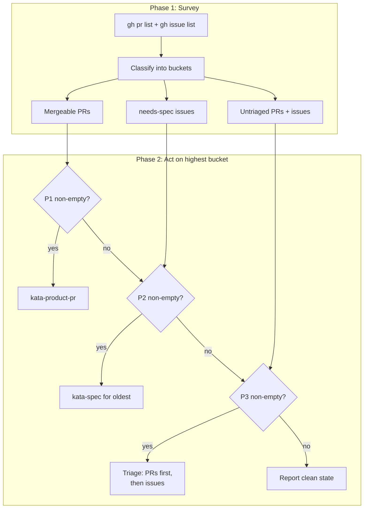
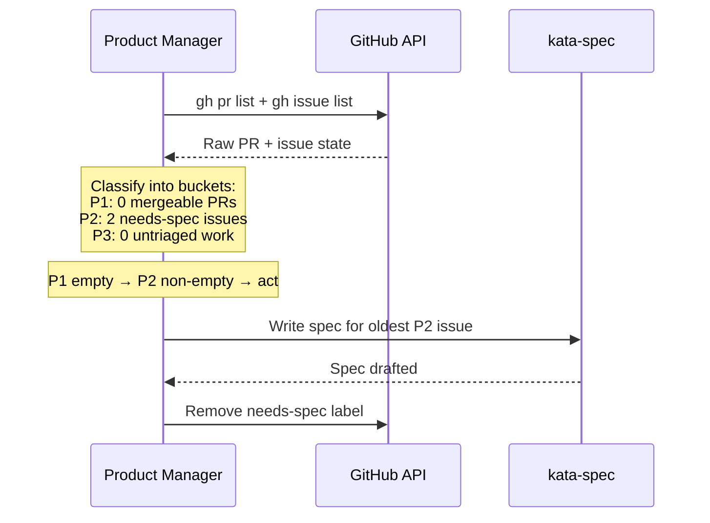

# Design A: Priority-Based Assess with Unified Survey

## Problem

The product manager agent triages issues but never progresses them. Three
instruction-layer defects combine: no assess step for triaged-but-pending
issues, the `triaged` label making issues invisible to re-examination, and PR
work always taking priority. Result: 7 runs, $9.25, zero specs written.

## Architecture

Three components change; no new components are introduced. The coordination
signal is a `needs-spec` GitHub label, supplementing `triaged`. The structural
change replaces the sequential if/else assess with a two-phase survey-then-act
pattern.

## Components and Interfaces

| Component             | Role                      | Change                                                                                                                                                                     |
| --------------------- | ------------------------- | -------------------------------------------------------------------------------------------------------------------------------------------------------------------------- |
| Agent profile         | Assess + label lifecycle  | Survey all work items before choosing action; act on highest-priority item per priority matrix; remove `needs-spec` after spec completion                                  |
| kata-product-issue    | Triage hand-off signaling | Step 4 labels product-aligned issues `needs-spec` (in addition to `triaged`) via `gh issue edit --add-label`; trivial fixes and out-of-scope issues receive only `triaged` |
| kata-trace invariants | Observability             | Add invariant: issue progression expected when no PRs are mergeable and `needs-spec` issues exist                                                                          |

## Data Flow

1. **Agent profile Phase 1 (Survey).** The agent runs both queries and
   classifies every item into one of three buckets:
   - `gh pr list --state open --json ...` → **Mergeable PRs** or **Untriaged**
     (classified-but-blocked PRs go to neither bucket)
   - `gh issue list --state open --json ...` → **needs-spec issues** (labeled
     `needs-spec`), **Untriaged** (no `triaged` label), or done (labeled
     `triaged` without `needs-spec` — no bucket)

2. **Agent profile Phase 2 (Act).** Pick the first non-empty bucket:

   | Priority | Work type                   | Rationale                                              |
   | -------- | --------------------------- | ------------------------------------------------------ |
   | P1       | Mergeable PRs               | Time-sensitive — contributor waiting for merge         |
   | P2       | Issues labeled `needs-spec` | Already classified, stale — spec work unblocks backlog |
   | P3       | Untriaged work              | New PRs or issues needing classification (PRs first)   |
   | —        | Clean state                 | Nothing actionable                                     |

   A PR is **mergeable** when it meets kata-product-pr's existing gate criteria
   (fix/bug/spec type, CI green, trusted contributor). Classified-but-blocked
   PRs are surveyed but match no bucket, which breaks the starvation cycle where
   re-examining blocked PRs consumed every run. Within P3, PRs are triaged
   before issues to preserve existing behavior.

3. **kata-product-issue Step 4 (hand-off).** The skill labels product-aligned
   issues with both `triaged` and `needs-spec` via `gh issue edit --add-label`.
   Trivial-fix and out-of-scope issues receive only `triaged`.

4. **Label cleanup.** After spec completion, the agent removes `needs-spec` via
   `gh issue edit --remove-label` to prevent re-selection.

5. **kata-trace** audits: if a run has zero mergeable PRs and open `needs-spec`
   issues but no `kata-spec` invocation, flag a violation.

## Key Decisions

| Decision                                  | Rejected alternative               | Why                                                                                                                                                                                                  |
| ----------------------------------------- | ---------------------------------- | ---------------------------------------------------------------------------------------------------------------------------------------------------------------------------------------------------- |
| Survey-then-prioritize assess             | Sequential if/else (Design A)      | Sequential assess causes structural starvation — PRs always run first; survey + prioritize lets the agent see all work before choosing                                                               |
| Mergeable PRs > needs-spec > untriaged    | Five separate priority levels      | Three buckets cover all actionable states; within untriaged, PRs before issues preserves existing behavior without a separate tier                                                                   |
| `needs-spec` label as coordination signal | Wiki marker, comment markers       | GitHub-native, multi-issue, visible to humans, immune to wiki sync failures; wiki `SPEC_DUE` marker failed in Storyboard Experiments 3–10 due to triage-first attractor and single-issue cardinality |
| Single action per run                     | Multi-action within one run        | Keeps skill invocation boundaries clean; the priority buckets ensure the most valuable action happens each run                                                                                       |
| Remove `needs-spec` after spec written    | Leave permanently                  | Prevents re-selection on subsequent runs; label is a transient action signal                                                                                                                         |
| Oldest-first ordering for spec writing    | Priority-based or random selection | Simple, deterministic, prevents starvation; no priority metadata exists on issues today                                                                                                              |

## Scope Boundary

This design does not change:

- PR type gates or mergeable criteria (kata-product-pr)
- Wiki bookkeeping procedures
- kata-product-evaluation issue creation
- The `triaged` label skip filter in kata-product-issue Step 1 (it remains — the
  filter correctly prevents re-classification; `needs-spec` is the action
  signal)
