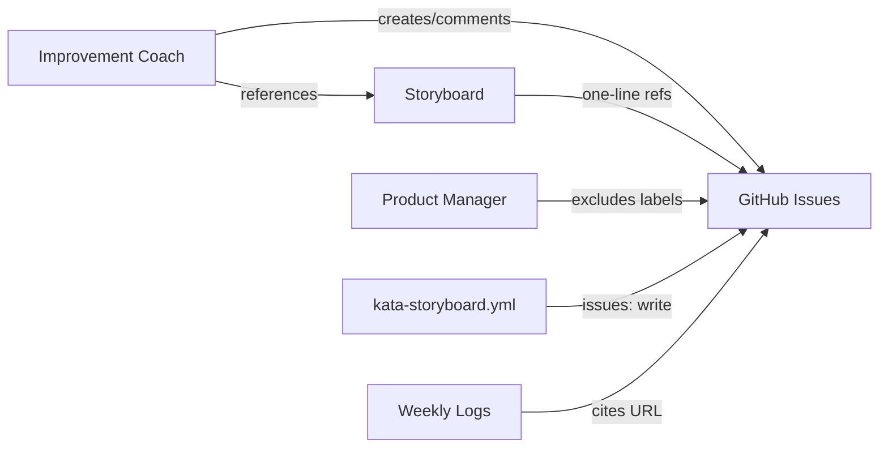
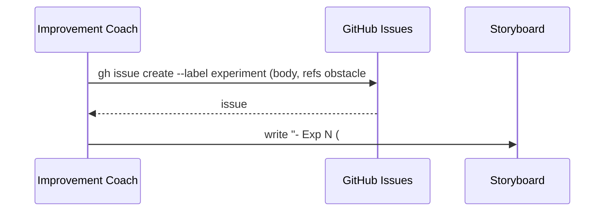
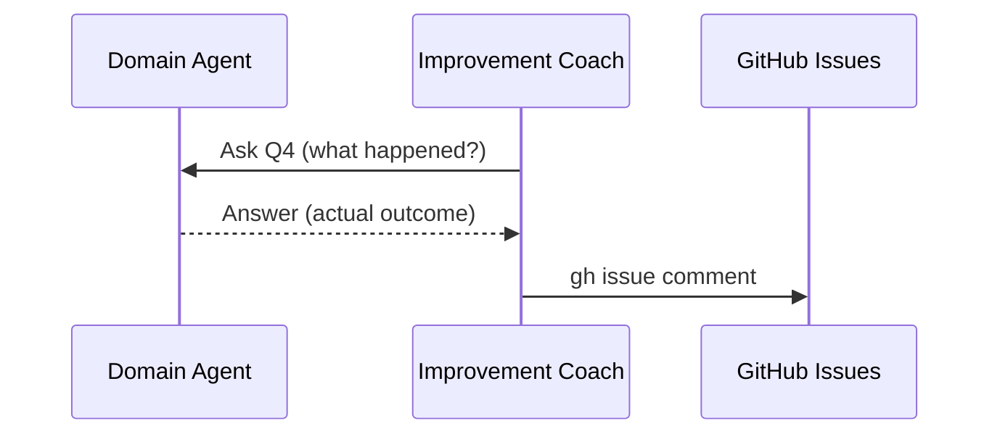
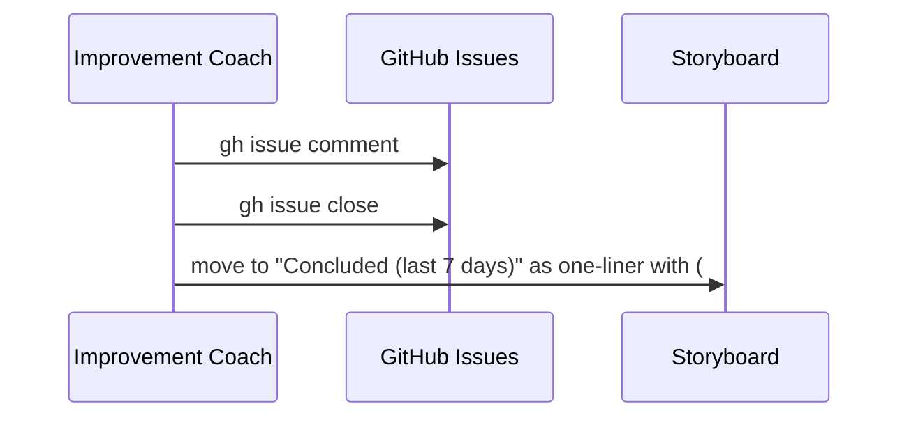

# Design A — Track Storyboard Experiments and Obstacles as GitHub Issues

## Architecture

Five components interact to move experiment and obstacle state from inline
storyboard text to GitHub issues. The improvement coach is the sole issue
creator; all other agents interact via comments routed through the coach during
facilitated sessions.



## Components

| Component                          | Change                                                                             |
| ---------------------------------- | ---------------------------------------------------------------------------------- |
| Issue labels (repo-level)          | Add `experiment` and `obstacle` labels to the repository                           |
| Storyboard template                | Replace multi-line experiment/obstacle blocks with one-line issue reference format |
| Facilitator process (team overlay) | Add issue lifecycle: create on new item, comment on progress, close on conclusion  |
| Storyboard workflow                | Add `issues: write` to workflow permissions                                        |
| PM triage skill                    | Exclude `experiment` and `obstacle` labeled issues from survey and `open_issues`   |
| Routing protocol                   | Add experiment/obstacle issue as an output type in the channel-by-output table     |
| KATA.md coordination channels      | Update the channels table to reflect issues as a PDSA coordination surface         |

## Data Flow

### Issue creation (new experiment)



### Session progress update



### Experiment conclusion



## Issue Structure

Each labeled issue carries specific data in its body:

| Label        | Body fields                                                | Comments carry                                                       |
| ------------ | ---------------------------------------------------------- | -------------------------------------------------------------------- |
| `experiment` | Obstacle ref (`#NNN`), owner agent, What, Expected outcome | Progress updates, actual outcomes, closing verdict + learning        |
| `obstacle`   | Description, blocking dimension                            | Related experiment refs (via GitHub cross-links), closing resolution |

The issue body is the initial state. All subsequent state changes — actual
outcomes, learning, verdict — are posted as comments, preserving the
deliberation trail that git-diff-only editing currently loses.

## Storyboard Format

### Active section (new format)

```markdown
### Active

- **Current obstacle →** Obstacle name (#401)
- Other obstacle (#402)
```

```markdown
### Active

- Exp 15 (#527) — SE coverage retirement proposal
- Exp 16 (#528) — SE Dim #9 reframe proposal
```

### Concluded section (unchanged shape, adds issue link)

```markdown
### Concluded (last 7 days)

- ~~Obstacle name~~ (#401) — RESOLVED 2026-04-28. One-sentence verdict.
- **Exp 14 — Orchestration trace pull** (#526) — DELIVERED 2026-04-28. Learning.
```

## PM Triage Bypass

The PM triage survey adds `--search "-label:experiment -label:obstacle"` to
exclude process-improvement issues. The `open_issues` metric uses the same
filter — only product-work issues count toward the XmR-tracked metric.

## Key Decisions

| Decision                      | Choice                                                    | Rejected alternative                | Why                                                                                                          |
| ----------------------------- | --------------------------------------------------------- | ----------------------------------- | ------------------------------------------------------------------------------------------------------------ |
| Classification mechanism      | Labels (`experiment`, `obstacle`)                         | GitHub issue types                  | Labels use standard `gh` CLI for create, list, and filter; issue types require GraphQL for creation          |
| Issue creation ownership      | Improvement coach only (during storyboard sessions)       | Each agent creates its own issues   | Centralizes naming (Exp N), avoids permission sprawl to 5 agent workflows                                    |
| Obstacle–experiment linking   | Body cross-reference (`Obstacle: #NNN`)                   | `parentIssueId` sub-issue hierarchy | Body reference is simpler; GitHub renders bidirectional links from `#NNN` automatically                      |
| Storyboard human-readable IDs | Keep `Exp N` numbering, append `(#NNN)`                   | Replace with issue numbers only     | Exp N is established conversational shorthand across 23 experiments; issue number is machine cross-reference |
| PM triage exclusion           | Label exclude filter (`--search "-label:experiment ..."`) | Separate query with post-filtering  | CLI search filters are simpler and already used by PM triage                                                 |

## Channel Ownership

The spec's five channel ownership rules (spec.md § Channel ownership) govern the
boundary between issue, storyboard, and wiki. The design enforces them
structurally: PDSA data lives only in the issue; the storyboard carries only
one-line references; the wiki log cites issue URLs without restating content.

### Routing protocol update

The routing-protocol.md channel-by-output table gains a row for experiment and
obstacle state. This output type routes to a labeled issue — distinct from the
existing "Reply tied to one PR or one issue" row, which covers responses on
artifacts, not artifacts that own their own state.

### KATA.md coordination channels update

The KATA.md channels table currently describes "PR / issue thread" as "Real-time
response on a specific artifact." Experiment and obstacle issues are a different
pattern — the issue _is_ the artifact, not a response on one. The table's
description and non-purpose clarification update to acknowledge this dual role:
issues serve both as response threads (existing) and as PDSA coordination
surfaces (new).

## Migration

The improvement coach performs a one-time migration during the first storyboard
session after implementation: active experiments and obstacles each get a GitHub
issue with the appropriate label, and the storyboard entry gains the `(#NNN)`
suffix. Already-concluded items need no action. The migration is idempotent —
entries with an existing issue link are skipped.
