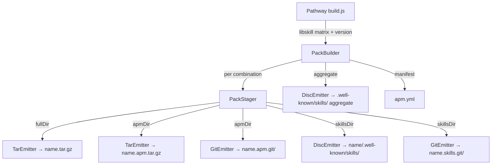

# Design C — Git-Installable Pack Repos (libpack Extraction)

## How This Differs from Designs A and B

Designs A and B keep all pack logic inside Pathway's command tree. Design C
extracts pack generation into a new `libraries/libpack` package with OO+DI
patterns, making pack distribution a reusable capability any consumer can drive
from a libskill matrix. Pathway calls libpack as a client; libskill remains pure
functions; libpack owns staging, archiving, and bare-repo emission.

## Prerequisites

This design deliberately extends the spec's architectural scope. The spec
authorizes "a generic build-time primitive" inside the pack pipeline; this
design places that primitive in a new shared library. If this variant is
selected, the spec's Scope section should be amended to include the library
extraction before planning begins.

## Overview

Introduce `PackBuilder` — the single entry point in `libpack`. It accepts
discipline × track combinations (with their derived profiles and skills from
libskill) plus a version string, and produces all distribution artifacts: staged
directory trees, tarballs, bare git repos, and discovery indices.
Format-specific work is delegated to injected emitters implementing an `Emitter`
interface. A `PackStager` handles layout concerns (full, APM, skills).

Pathway's `build.js` constructs a `PackBuilder` with concrete emitters, feeds it
the combinations from libskill, and writes the results into its output
directory. Pathway stays functional — it calls `builder.build()` and receives
output paths.

## Components

| Component     | Package | Responsibility                                                            | Pattern          |
| ------------- | ------- | ------------------------------------------------------------------------- | ---------------- |
| `PackBuilder` | libpack | Orchestrate: loop combinations, compose stager + emitters, write manifest | class (entry)    |
| `PackStager`  | libpack | Stage directory trees per layout (full, APM, skills) from pack content    | class (internal) |
| `Emitter`     | libpack | Interface: emit staged dir to an output path                              | interface        |
| `TarEmitter`  | libpack | Deterministic `.tar.gz` from any staged dir                               | class (emitter)  |
| `GitEmitter`  | libpack | Static bare git repo from any staged dir + version                        | class (emitter)  |
| `DiscEmitter` | libpack | Copy staged skills tree to `.well-known/skills/` with discovery index     | class (emitter)  |
| Pack glue     | Pathway | Derive content via libskill, construct `PackBuilder`, invoke build        | function         |
| Install UI    | Pathway | Surface install commands from builder output metadata                     | function         |

## Data Flow

## Interfaces

**Emitter.** Each emitter receives a staged directory, an output path, and
options (version, pack name). Emitters throw on failure, remove partial output
before re-throwing, write only under the output path, and have no global state
or network access. `GitEmitter` uses the version for tag and commit message;
`TarEmitter` and `DiscEmitter` ignore it.

**PackBuilder.** Constructed with a map of format name → emitter, a stager, and
I/O primitives (filesystem operations, child-process execution). The builder
accepts an array of pre-derived combinations (pack name, profiles, skill files,
team instructions, templates, settings) plus output directory, site URL,
version, and standard title. Returns metadata (pack list, aggregate skills) for
the install UI and APM manifest.

**PackStager.** Receives a combination's content and produces three staged
directory trees (full, APM, skills). Replaces the current `writePackFiles`,
`stageApmBundle`, and skills-extraction logic from `writeSkillsPack`. These
existing Pathway functions move into `PackStager`; they are not kept alongside.

**Dependency injection.** I/O primitives (filesystem, child-process) and
emitters are constructor-injected. Defaults are the real Node APIs and concrete
emitters. The `git` binary remains the packfile engine (same as designs A/B).

## Bare-Repo Layout

Same as designs A and B — frozen single-commit bare repo over dumb HTTP:

| Path                           | Contents                                              |
| ------------------------------ | ----------------------------------------------------- |
| `HEAD`                         | `ref: refs/heads/main\n`                              |
| `config`                       | minimal bare config (`bare = true`, format version 0) |
| `description`                  | `Pathway pack: {name}\n`                              |
| `info/refs`                    | sorted refs, one `<sha>\t<ref>` line per ref          |
| `objects/info/packs`           | `P pack-<sha>.pack\n`                                 |
| `objects/pack/pack-<sha>.pack` | all objects in one pack                               |
| `objects/pack/pack-<sha>.idx`  | matching index                                        |
| `packed-refs`                  | header + sorted `<sha> <ref>` lines                   |

## Install UI Changes

Two new command cards appear in the install section. Cards are grouped by what
the consumer gets (layout), not by whose tool they use:

| Group      | Card             | Command                                          |
| ---------- | ---------------- | ------------------------------------------------ |
| **Full**   | Direct download  | `curl -sL .../packs/{name}.raw.tar.gz \| tar xz` |
| **APM**    | `apm install`    | `apm install .../packs/{name}.apm.git`           |
|            | `apm unpack`     | `curl -sLO ... && apm unpack {name}.apm.tar.gz`  |
| **Skills** | `npx skills add` | `npx skills add .../packs/{name}`                |
|            | `git clone`      | `git clone .../packs/{name}.skills.git`          |

No existing card is removed (Spec Requirement 7).

## Determinism Contract

Identical input at the same Pathway version produces byte-identical output
across every emitter. Each emitter owns its own contract and is independently
testable for byte-equality.

| Field                   | Pinned value                                          |
| ----------------------- | ----------------------------------------------------- |
| Commit author/committer | `Forward Impact Pathway <pathway@forwardimpact.team>` |
| Commit/author date      | epoch (`1970-01-01T00:00:00Z`)                        |
| Commit message          | `pathway v{version}\n`                                |
| Default branch          | `main`                                                |
| Tag                     | lightweight `v{version}` (no tag object)              |
| Pack input order        | objects in deterministic SHA order                    |
| Pack contents           | all objects, no delta reuse (`--no-reuse-delta`)      |
| Tarball                 | epoch timestamps, sorted file list, `gzip -n`         |
| Discovery index         | sorted JSON, sorted skill entries                     |

## Key Decisions

| #   | Decision                                                                | Rejected                                  | Why                                                                                                                                                                                                                                                  |
| --- | ----------------------------------------------------------------------- | ----------------------------------------- | ---------------------------------------------------------------------------------------------------------------------------------------------------------------------------------------------------------------------------------------------------- |
| 1   | Extract to `libraries/libpack` as a reusable package                    | Keep in Pathway commands (designs A/B)    | Pack distribution is a capability, not a Pathway page concern. Libraries like libstorage, libcodegen already model reusable capabilities as packages. A second consumer (e.g. a CLI pack tool) can use libpack directly without depending on Pathway |
| 2   | OO+DI for libpack (`PackBuilder`, injected emitters)                    | Procedural functions (design A)           | Emitters have shared interface but different backends (tar/git/discovery); DI lets tests verify orchestration without shelling out to `git`. Follows libstorage/libcodegen precedent in this repo                                                    |
| 3   | Pathway stays functional — `generatePacks` becomes a thin glue function | Move Pathway formatting into libpack      | Pathway's formatters are UI-layer (templates, markdown rendering). libpack takes formatted content as input, not raw data. This keeps the dependency arrow one-way: Pathway → libpack → libskill                                                     |
| 4   | libskill stays pure functions — no changes                              | Add pack-awareness to libskill            | libskill derives data; libpack distributes it. Adding distribution concerns to libskill would violate its single responsibility                                                                                                                      |
| 5   | `PackStager` as a separate class from `PackBuilder`                     | Stager logic inline in builder            | Staging (content layout) and building (orchestration) change for different reasons. Stager is independently testable                                                                                                                                 |
| 6   | Emitter interface with three implementations                            | Single emitter with format parameter      | Each format has distinct I/O (tar+gzip, git pack-objects, file copy). A common interface with distinct implementations is cleaner than a switch                                                                                                      |
| 7   | System `git` binary as packfile engine, injected via `exec`             | `isomorphic-git` or hand-written packfile | System git has the canonical wire format; injection lets tests avoid shelling out while integration tests verify real git output                                                                                                                     |
| 8   | Lightweight tag, no delta reuse, latest-only                            | Annotated tag, delta reuse, history       | Same rationale as designs A/B — determinism and spec scope                                                                                                                                                                                           |
| 9   | Input is `{ combinations }` pre-derived by the caller                   | libpack calls libskill directly           | libpack should not depend on how combinations are discovered — Pathway derives them from its data loader and libskill, then hands the result to libpack. This keeps libpack's input surface minimal                                                  |
| 10  | `siteUrl` gate remains in Pathway's `build.js`, not inside libpack      | libpack checks `siteUrl` internally       | The gate is a build-orchestration concern. libpack always emits when called — the caller decides whether to call it                                                                                                                                  |

## Risks

| #   | Risk                                                  | Mitigation                                                                                              |
| --- | ----------------------------------------------------- | ------------------------------------------------------------------------------------------------------- |
| 1   | Larger change surface than design A                   | Extraction is mechanical — move + wrap in class. Logic is unchanged. Integration tests cover end-to-end |
| 2   | New package boundary adds publish/versioning overhead | Same monorepo tooling as other `libraries/*` packages. No novel process                                 |
| 3   | DI indirection makes debugging harder                 | Concrete defaults wired in factory function; DI used only at construction, not at call sites            |
| 4   | System git version perturbs packfile bytes            | Pin git version in CI; byte-equality assertion on every run (same as designs A/B)                       |

## Out of Scope

Design honors the spec's Out-of-Scope list (single commit per build, dumb-HTTP
only, no auth surface, no client tooling changes, no CDN cache opinions).
Additionally: no second consumer of libpack is built — only Pathway calls it.
