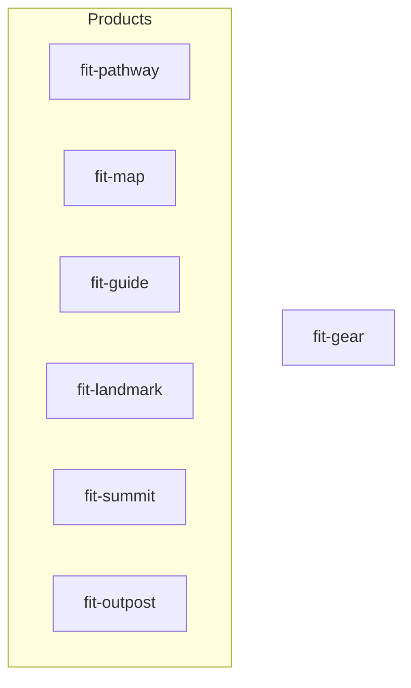

# Design — Seed `forwardimpact/homebrew-tap` with initial casks

## Architecture

Four components collaborate. Seven cask files in the tap repo define what
Homebrew installs. The publish-brew workflow writes version and sha256 into
those casks on each release. A conventions document in the monorepo prescribes
how casks are authored. The tap README bridges tap and monorepo.

| Component       | Location                                       | Purpose                                              |
| --------------- | ---------------------------------------------- | ---------------------------------------------------- |
| Cask files (x7) | `forwardimpact/homebrew-tap/Casks/`            | Homebrew cask definitions installed by `brew install` |
| Publish workflow | `.github/workflows/publish-brew.yml` in mono   | Builds bundle, uploads asset, sed-rewrites cask      |
| Conventions doc | `websites/fit/docs/internals/release/` in mono | Authoring rules, sed contract, binary-stanza mapping |
| Tap README      | `forwardimpact/homebrew-tap/README.md`          | Links to conventions doc via published URL           |

## Cask Topology



All seven casks are independently installable — no `depends_on cask:` between
them. Product casks each expose a single CLI. The shared `fit-gear` cask bundles
all service and library CLIs (25 total).

## Cask Anatomy

Each live cask follows an identical structure:

1. **Metadata** — `version`, `sha256` (the two sed-rewritable fields)
2. **URL** — GitHub release asset on `forwardimpact/monorepo`
3. **Livecheck** — per-cask regex against monorepo releases
4. **Arch constraint** — `depends_on arch: :arm64`
5. **App stanza** — installs the `.app` to `/Applications/Forward Impact/`
6. **Binary stanzas** — symlinks each executable to Homebrew's `bin/`
7. **Zap stanza** — removes plist data on `brew zap`

### URL and Asset Scheme

Assets follow the pattern in the workflow's "Zip bundle and hash" step:

```
https://github.com/forwardimpact/monorepo/releases/download/{name}@v{version}/{cask}-{version}-darwin-arm64.zip
```

Where `{name}` is the tag prefix (e.g., `pathway` or `gear`), `{cask}` is
`fit-{name}`, and `{version}` is the semver string. The workflow's tag filter
and case statement must be updated to route `gear@v*` tags — it currently
accepts `services@v*` and `utilities@v*`.

### Sed Contract

The `tap-pr` job's "Update cask version and sha256" step rewrites exactly two
lines per cask:

```ruby
  version "{version}"
  sha256 "{sha256}"
```

Two-space indent, field name, space, double-quoted value. No other cask content
is modified by the workflow. All other fields — binary stanzas, livecheck — are
human-edited in the tap repo and survive releases unchanged.

### Livecheck Strategy

Each cask uses the `:github_releases` strategy with a per-cask regex that
anchors to its own tag prefix:

```ruby
livecheck do
  url :url
  strategy :github_releases
  regex(/^{name}@v(\d+(?:\.\d+)+)$/i)
end
```

The `:url` source reuses the cask's own download URL to discover the repository.
Each regex anchors with `^...$` to match only its own tag prefix from the
monorepo's shared releases.

### App Install Path

All casks install to a `Forward Impact/` subdirectory under `/Applications/`
to keep seven `.app` bundles visually grouped rather than scattered among
unrelated applications:

```ruby
app "fit-pathway.app", target: "Forward Impact/fit-pathway.app"
```

Binary stanzas reference this subdirectory path:

```ruby
binary "#{appdir}/Forward Impact/fit-pathway.app/Contents/MacOS/fit-pathway"
```

## Binary Stanza Mapping

Each cask exposes only the executables bundled in its own `.app`.

| Cask           | Executables on PATH                                                                                                                                                                                                              | Count |
| -------------- | -------------------------------------------------------------------------------------------------------------------------------------------------------------------------------------------------------------------------------- | ----- |
| `fit-pathway`  | `fit-pathway`                                                                                                                                                                                                                    | 1     |
| `fit-map`      | `fit-map`                                                                                                                                                                                                                        | 1     |
| `fit-guide`    | `fit-guide`                                                                                                                                                                                                                      | 1     |
| `fit-landmark` | `fit-landmark`                                                                                                                                                                                                                   | 1     |
| `fit-summit`   | `fit-summit`                                                                                                                                                                                                                     | 1     |
| `fit-outpost`  | `fit-outpost`                                                                                                                                                                                                                    | 1     |
| `fit-gear`     | `fit-svcgraph`, `fit-svcmcp`, `fit-svcpathway`, `fit-svctrace`, `fit-svcvector`, `fit-codegen`, `fit-terrain`, `fit-eval`, `fit-doc`, `fit-rc`, `fit-xmr`, `fit-storage`, `fit-logger`, `fit-svscan`, `fit-trace`, `fit-visualize`, `fit-query`, `fit-subjects`, `fit-process-graphs`, `fit-process-resources`, `fit-process-vectors`, `fit-search`, `fit-unary`, `fit-tiktoken`, `fit-download-bundle` | 25 |

Outpost's `Outpost` launcher (the Swift GUI process) is accessible via the
installed `.app` in `/Applications/Forward Impact/` but is not placed on PATH.

Rejected: exposing `Outpost` on PATH — it is a native GUI launcher, not a CLI.

## Conventions Document

A single document under `websites/fit/docs/internals/release/` covering:

- Sed contract — which fields the workflow rewrites, which are human-edited
- Binary stanza mapping — authoritative list per cask
- Livecheck regex pattern and `:github_releases` strategy rationale
- App install path convention (`Forward Impact/` subdirectory)
- Zap/uninstall paths per cask
- `brew style` / `brew audit` commands for manual verification

Co-located with the workflow because the conventions and the workflow decay
together. The tap README links to this document via its published URL.

## Key Decisions

| Decision | Choice | Rejected | Why |
| --- | --- | --- | --- |
| Shared bundle consolidation | Single `fit-gear` cask | Separate `fit-services` + `fit-utilities` | One bundle simplifies install, tag management, and release workflow |
| Inter-cask dependencies | None — all casks independently installable | Products depend on gear via `depends_on cask:` | Users install only what they need; forced deps pull 25 CLIs for a single-CLI product |
| Livecheck strategy | `:github_releases` with anchored per-cask regex | `:url` against atom feed | Anchored `^{name}@v…$` regex cleanly filters the multi-bundle releases page |
| App install path | `Forward Impact/` subdirectory | Flat install to `/Applications/` | Groups seven bundles visually; avoids cluttering the top-level Applications folder |
| Conventions doc location | Monorepo `internals/release/` | Tap repo README | Conventions co-decay with the workflow |
