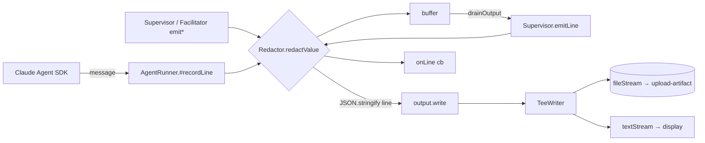

# Design 0850-a — libeval Trace Artifact Secret Redaction

## Components

| Component | Where | Role |
| --- | --- | --- |
| `Redactor` | `libraries/libeval/src/redaction.js` (new) | Pure module. Recursively walks any JSON-serialisable value and replaces strings that match either redaction source with the corresponding placeholder. Stateless once constructed; safe to share across producers. |
| `createRedactor` | same | Factory. Reads `{ env, allowlist, patterns, enabled }` and returns `{ redactValue(v), enabled }`. The factory is also the owner of the one-shot stderr opt-out warning — it fires once at construction when `enabled === false`. `env` is a snapshot — captured once at command entry — so any in-process `process.env` write that lands later cannot smuggle a value past the redactor (`agent-runner.js:307` and `commands/run.js:98` are existing in-process writers; future ones inherit the same protection). |
| `AgentRunner` redactor seam | `agent-runner.js` constructor + `#recordLine` | Constructor accepts `redactor` (required, never optional). `#recordLine` calls `redactor.redactValue(message)` before `JSON.stringify` — every consumer (`output.write`, `buffer.push`, `onLine`, `onBatch`) sees the redacted shape. |
| Command-entry wiring | `commands/run.js`, `commands/supervise.js`, `commands/facilitate.js` | Each entry point builds the redactor as the **first observable side-effect after option parsing** (before any `process.env =` write the command itself performs), reads `LIBEVAL_REDACTION_ENV_VARS` (overrides the default allowlist) and `LIBEVAL_REDACTION_DISABLED`, and injects into the producer constructor. The same redactor instance is also applied to the `{source, seq, event}` envelope in the `commands/run.js` `onLine` callback — the inner-line redact at `#recordLine` is load-bearing; the outer envelope redact is defence-in-depth and named as such here so future contributors do not remove either thinking the other suffices. |
| `Supervisor` redactor seams | `supervisor.js` constructor + `emitLine` (line 402), `emitOrchestratorEvent` (line 430), `emitSummary` (line 444) | Each `emit*` redacts its constructed event object via `redactor.redactValue` before `JSON.stringify` and `output.write`. `emitSummary` is the highest-risk seam — `result.summary` originates as untrusted text from the `Conclude` MCP handler (`orchestration-toolkit.js:46`) and never traverses `#recordLine`. Without redaction here a successful injection of the supervisor's `Conclude` argument writes its untouched value into the artifact. |
| `Facilitator` redactor seams | `facilitator.js` constructor + `emitLine` (line 327), `emitOrchestratorEvent` (line 341), `emitSummary` | Mirrors supervisor. Same `Conclude`-handler risk applies to `emitSummary`. |
| `TeeWriter` (no API change) | `tee-writer.js` | Already receives pre-redacted lines; the `fileStream` and `textStream` paths inherit redaction by construction. The `TraceCollector` it embeds for `toText()` replay also operates on redacted turn shapes — placeholders survive offline replay byte-for-byte (criterion 5). |
| Default env-var allowlist | `redaction.js` constant | `["ANTHROPIC_API_KEY", "GH_TOKEN", "GITHUB_TOKEN"]`. The first two are the explicit exports at `agent-react.yml:180-181`; `GITHUB_TOKEN` is the implicit GHA-default secret that `secrets.GITHUB_TOKEN` exposes to any composite action — included for defence-in-depth across other workflows that may export it. Override with `LIBEVAL_REDACTION_ENV_VARS=NAME1,NAME2,…` (replaces the list, does not extend). |
| Default credential patterns | `redaction.js` constant | Anthropic API key (`sk-ant-` + ≥80 url-safe chars — heuristic, not formally documented; the env-allowlist layer is the primary defence for Anthropic keys), GitHub PAT (`ghp_` + 36 chars), GitHub installation token (`ghs_` + 36 chars), GitHub OAuth token (`gho_` + 36 chars), GitHub fine-grained PAT (`github_pat_` + 82 chars). Anchored character classes; documented prefixes per [GitHub auth-token formats](https://github.blog/security/application-security/behind-githubs-new-authentication-token-formats/). |
| Documentation | `libraries/libeval/README.md`, `.github/actions/kata-action-eval/action.yml` README block | Both state redaction is on by default, list the allowlist + patterns, document `LIBEVAL_REDACTION_DISABLED=1` opt-out and its CI-on-public-repo prohibition. |

## Component graph



`drainOutput → emitLine` re-passes the buffered line through the redactor —
double-application is a no-op because placeholders are stable, and writing it
this way keeps the chokepoint claim ("every byte that reaches a persistent
sink crosses the redactor") true even when reviewers consume `extractTranscript`
/ `extractLastText` (`supervisor.js:367-396`, `facilitator.js:306-320`) which
read from `runner.buffer` for LLM prompt construction — those reads are not
sinks but they share the same already-redacted bytes.

## Interfaces

```
redaction.js
  createRedactor({ env, allowlist, patterns, enabled }): Redactor
  Redactor.redactValue(value: unknown): unknown   // structure-preserving deep-walk
  Redactor.enabled: boolean

agent-runner.js  AgentRunner({ ..., redactor })   // redactor required
supervisor.js    Supervisor({ ..., redactor })
facilitator.js   Facilitator({ ..., redactor })
```

`redactValue` walks objects and arrays; on every primitive string it applies
`redactString` (allowlist substring replace, then pattern regex replace) and
returns the result. Non-string primitives pass through unchanged. When
`enabled === false`, `redactValue` is the identity function on every input —
no walk, no allocation — so the perf cost of the opt-out path is one boolean
check per message.

Test factories that build `AgentRunner` / `Supervisor` / `Facilitator` need
to pass a redactor; a documented `createNoopRedactor()` helper (lives next to
`createRedactor` in `redaction.js`) is the test-fixture form and equals
`createRedactor({ enabled: false })` semantically.

## Placeholders

Two stable, non-collidable forms — fixed in this design and treated as a
contract once shipped:

| Source | Placeholder | Example match |
| --- | --- | --- |
| Env-var value hit | `[REDACTED:env:NAME]` | `ANTHROPIC_API_KEY=sk-ant-abc…` &rarr; `[REDACTED:env:ANTHROPIC_API_KEY]` |
| Credential-pattern hit | `[REDACTED:pattern:KIND]` | `ghp_AbCd…` (36) &rarr; `[REDACTED:pattern:gh-pat]` |

`[` and `]` JSON-encode as themselves (no escape sequence), so the placeholder
strings appear identically in raw object form, NDJSON wire form, and `toText()`
replay output. A real secret of the covered shapes cannot produce either
string — the bracket characters are not part of any documented credential
alphabet.

## Opt-out surface

| Channel | Form | Reason |
| --- | --- | --- |
| Env var | `LIBEVAL_REDACTION_DISABLED=1` | One channel, one name, no CLI surface to tunnel through. CI workflows must edit `agent-react.yml` to set it — that diff is reviewable and visible in PR. Documented prohibition: never set in CI on a public repo. |
| Warning | `createRedactor` writes one stderr line at construction when `enabled === false`: `libeval: trace redaction DISABLED via LIBEVAL_REDACTION_DISABLED — secrets may appear in trace artifact`. Stderr is captured by the workflow log; reviewers and post-hoc auditors can grep for the string. |

The opt-out is auditability via reviewer attention — stderr line + workflow
YAML diff + the documented prohibition. Code-side enforcement (e.g. refusing
to disable when the runtime detects public-repo CI) is feasible but deferred:
the marginal protection over the YAML-diff review is small and the false-
positive risk in non-CI environments is real.

## Key Decisions

| # | Decision | Rejected alternative | Why |
| --- | --- | --- | --- |
| 1 | Redact in-process at the JSON-serialisable value boundary, before `JSON.stringify`. | Post-hoc CLI step (`fit-trace redact`) inserted between `Split trace` and `Upload trace bundle` in `kata-action-eval/action.yml`. | The producer-side edge is structural: the trace file never exists on disk in unredacted form, and a workflow author cannot accidentally remove or reorder the step. Post-hoc redaction also leaves the `Split trace` artifact briefly unredacted on the runner filesystem. |
| 2 | Single `Redactor` instance built at command entry, injected into every producer (`AgentRunner`, `Supervisor`, `Facilitator`) via constructor. | Implicit module-level singleton accessed via `import`. | Constructor injection keeps the env snapshot deterministic per session, makes test isolation trivial (pass a stub redactor), and forces every new producer to declare the dependency rather than silently inheriting it. |
| 3 | Compose value-based (env allowlist) and pattern-based redaction; both run on every string. | Patterns only, or allowlist only. | The two layers fail in different directions. Patterns miss tokens that adopt new prefixes before libeval ships an update; values miss secrets the agent reads from disk that never appeared in `process.env`. The defence-in-depth gap the spec calls out is closed only by having both. |
| 4 | Allowlist sourced from an explicit named list; default = the two `agent-react.yml` exports plus the implicit GHA `GITHUB_TOKEN`. Override via `LIBEVAL_REDACTION_ENV_VARS`. | `process.env` enumeration, or glob (`*_KEY`, `*_TOKEN`). | Enumeration would redact `RUNNER_TEMP`, `HOME`, `CI`, etc. — strings that legitimately appear in tool outputs and would produce false-positive redaction that breaks trace replay. Globs trade the same false-positive risk for an appearance of completeness without an audit trail. The named list forces every addition to be a deliberate audit. |
| 5 | Two stable placeholders: `[REDACTED:env:NAME]` and `[REDACTED:pattern:KIND]`. | Single `[REDACTED]` token. | When a leak slips through (e.g. an unredacted occurrence next to a redacted one), the placeholder shape tells the auditor which redactor fired and which did not. The naming cost is one token per hit; the diagnostic value when investigating a real incident is large. |
| 6 | Walk-then-serialise: redact the JS value, then `JSON.stringify`. | Regex over the already-serialised JSON line. | `tool_result.content` is itself JSON-stringified at `trace-collector.js:202`, so a secret embedded in tool output containing a backslash, double quote, or control char is escape-rewritten when nested inside the outer wire JSON — a regex over the encoded line can split the credential across the escape and miss it. Walking the structure operates on the original string before encoding and is correct by construction. |
| 7 | Env snapshot captured once at command entry. | Live `process.env` read per redaction call. | The libeval process itself writes `process.env` mid-stream — `agent-runner.js:307` sets `LIBEVAL_SKILL` on every Skill tool call, `commands/run.js:98` sets `LIBEVAL_AGENT_PROFILE` before runner construction. Reading live would let a future code path drop a sentinel from the allowlist after the redactor was built. Snapshotting freezes the allowlist values for the session. |
| 8 | Opt-out via env var; no CLI flag. | `--no-redact` flag on every libeval subcommand. | One channel reduces the surface area to audit. The env-var form puts the disable signal in the workflow YAML where it is reviewable in PR, rather than buried in a long CLI invocation in a shell script. |

## Test surfaces

The design names two surfaces; the plan picks the layering. **All test
sentinels must be JSON-stable strings — printable ASCII without `"`, `\`, or
control characters** — so a substring scan over `fileStream` bytes is sound;
non-stable sentinels would JSON-escape and pass the substring check even when
redaction missed.

| Surface | What it covers |
| --- | --- |
| `redaction.js` unit | Deep walk over fixtures: nested objects, arrays, mixed primitives, the carrier shapes named in spec criterion 1 (`tool_use.input.*`, `tool_result.content`, assistant `text`, orchestrator `summary`, system payloads). False-positive cases from criterion 3 (prose, Markdown, URLs, git SHAs, UUIDs, quoted shell commands). Pattern hits at canonical length (criterion 2). |
| Producer-side integration | A `TraceCollector` + `TeeWriter` pipeline fed pre-fabricated SDK messages; assert the bytes that reach `fileStream` contain no sentinel substring (criterion 1) and that `toText()` over the captured trace preserves both placeholder forms (criterion 5). Also covers the `Supervisor.emitSummary` / `Facilitator.emitSummary` paths with sentinel-bearing `Conclude` summaries. |

## Out of scope (carried from spec)

Bash hardening of `agent-react.yml`, GitHub artifact ACL changes, removing
`bypassPermissions`, actor gating, prompt-injected user content, retroactive
scrubbing, and other libraries' shell-exec usage are unchanged from spec § Out
of scope, deferred. The redaction layer alone closes the producer-side leak
path; the deferred items remain worthwhile but separable.

— Staff Engineer 🛠️
