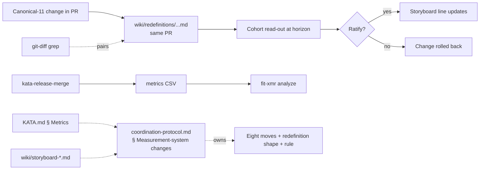

# Design 0860-B — Measurement-system change protocol (alternative)

## How this differs from design-a

Design-a creates a new `measurement-protocol.md` sibling reference, embeds the
Operational Redefinition as a YAML block inside GitHub issue/PR bodies, picks
`time_to_first_approval_hours` (a duration) as the canonical-11 addition, and
amends KATA.md § Metrics to admit duration metrics.

Design-b makes four different decisions:

1. **Home** — extend the existing `coordination-protocol.md` (which already owns
   the approval-signal vocabulary) with a § Measurement-system changes section.
   No new sibling reference.
2. **Redefinition = file artifact** — each redefinition lives at
   `wiki/redefinitions/{YYYY-MM-DD}-{slug}.md`, versioned in the repo. Any
   canonical-11 edit must include the redefinition file in the same PR.
   Detection is filesystem-grep, not GitHub-issue-grep.
3. **Count metric, not duration** — the new canonical-11 entry is
   `approvals_recorded_per_run` (count of `<phase>:approved` label-add events
   observed during this run's PR sweep). KATA.md § Metrics' "count of units of
   work" rule is preserved; only the link to the protocol is added.
4. **Storyboard hook is structural** — the redefinition requirement is baked
   into `storyboard-template.md` (the canonical scaffold), not added as a
   `<do_confirm_checklist>` item in the team-storyboard overlay.

The repair-move typology (eight moves), the redefinition shape, and the
no-silent-redefinition rule itself carry over unchanged in content; their
**home, artifact form, and enforcement surface** change.

## Architecture summary

`coordination-protocol.md` gains a § Measurement-system changes section that
names the eight repair moves, the redefinition shape, the no-silent-redefinition
rule, and the detection recipe. Each canonical-11 change lands a
`wiki/redefinitions/{YYYY-MM-DD}-{slug}.md` file in the same PR — the file IS
the redefinition. KATA.md § Metrics gains one linking paragraph.
`kata-release-merge` records `approvals_recorded_per_run` as new rows in its
existing `wiki/metrics/kata-release-merge/{YYYY}.csv`. The canonical-11
enumeration in `wiki/storyboard-*.md` becomes a bulleted list including the new
metric. `storyboard-template.md` requires canonical-11 change items to link a
redefinition path.

## Components

| Component | Lives in | Responsibility |
| --- | --- | --- |
| § Measurement-system changes | `.claude/agents/references/coordination-protocol.md` | Names the eight moves, redefinition shape, no-silent-redefinition rule, redefinition-file detection-grep recipe. Sibling section to § Approval signal. |
| KATA.md § Metrics extension | `KATA.md` | One paragraph linking to the new section. No constitutional change to "count of units of work." |
| `wiki/redefinitions/` directory | `wiki/redefinitions/{YYYY-MM-DD}-{slug}.md` | One file per redefinition. The file IS the redefinition; PRs that touch canonical-11 edges include their redefinition file in the same diff. |
| `approvals_recorded_per_run` metric | `wiki/metrics/kata-release-merge/{YYYY}.csv` (additional rows; `metric` column; `unit=count`) | New canonical-11 entry. Producer = `kata-release-merge`. One row per run. |
| Canonical-11 enumeration | `wiki/storyboard-*.md` | New bulleted list under § Metrics; one bullet per metric mapping `{metric → producer skill}`. Replaces inline "11 canonical metrics" prose. |
| `kata-release-merge` `references/metrics.md` extension | `.claude/skills/kata-release-merge/references/metrics.md` | New row alongside `prs_merged`. |
| Storyboard redefinition hook | `.claude/skills/kata-session/references/storyboard-template.md` | Template requires every canonical-11 change line carries a `Redefinition: wiki/redefinitions/...md` link; cohort read-out items enumerate that day's redefinition files. |

## Repair-move typology

Eight named moves, identical content to design-a (closure of the list is the
same architectural choice), located in `coordination-protocol.md` § Measurement-
system changes: `producer-rehoming`, `mode-restriction`, `historical-phasing`,
`sidecar-pre-flight`, `stock-vs-flow-recast`, `event-driven-recast`,
`rule-semantics-rfc`, `habit-to-policy`. Each binds a one-sentence definition
and a falsifier-set kind. The list is **closed** at design time; extensions
land via the spec/design/plan/implement chain (matches design-a #3). Adding a
ninth move (e.g., `canonical-set-addition` for net-new metrics) is the
natural next-spec follow-on — see Migration boundary.

## Redefinition shape (file artifact)

```yaml
---
move: producer-rehoming | mode-restriction | historical-phasing |
      sidecar-pre-flight | stock-vs-flow-recast | event-driven-recast |
      rule-semantics-rfc | habit-to-policy
affected_metrics:
  - {skill: <skill>, metric: <metric>}
falsifier_set:
  - <predicate>
verdict_horizon: <YYYY-MM-DD>
cohort_readout: <YYYY-MM-DD>      # >= verdict_horizon
denominator_effect: none | sidecar | conditional-amend | amend
links:
  obstacle_issue: <#NNN>?
  experiment_issue: <#NNN>?
  pr: <#NNN>?
---

# Redefinition — <human-readable title>

<one-paragraph context: what changed, why this move, what the cohort ratifies>
```

The file is YAML front-matter plus a brief prose body. `denominator_effect`
non-`none` requires a linked storyboard headline and a cohort read-out date.
`verdict_horizon ≤ cohort_readout` is the only ordering constraint.

## Detection (Success #6)

The rule is `git diff`-native, stated in `coordination-protocol.md`: **any
commit touching a canonical-11 metric edge must, in the same commit, add or
modify a `wiki/redefinitions/*.md` file.** Edges are edits to lines naming a
canonical-11 metric in `wiki/storyboard-*.md`,
`.claude/skills/*/references/metrics.md`, or `coordination-protocol.md`
§ Measurement-system changes (which mirrors the canonical-11 enumeration for
git-grep symmetry). Recipe:

```sh
# Commits that edit canonical-11 edges but do NOT touch wiki/redefinitions/.
for c in $(git log --format=%H --since="<date>" -- \
    'wiki/storyboard-*.md' \
    '.claude/skills/*/references/metrics.md' \
    '.claude/agents/references/coordination-protocol.md'); do
  git diff-tree --no-commit-id --name-only -r "$c" \
    | grep -q '^wiki/redefinitions/' || echo "$c missing redefinition"
done
```

CI mechanisation on `HEAD...main` is the natural follow-on (out of scope).

## No-silent-redefinition rule

> No change to the canonical-11 denominator (additions, removals, conditional
> or unconditional redefinitions) lands without a redefinition file at
> `wiki/redefinitions/{YYYY-MM-DD}-{slug}.md` whose `denominator_effect` is
> non-`none`, a cohort read-out date on or before the storyboard meeting at
> which the change takes effect, and a linked storyboard headline.

This single statement lives in `coordination-protocol.md` § Measurement-system
changes. KATA.md § Metrics links to it; no other file restates it.

## Approval-throughput metric

`approvals_recorded_per_run` reads the binding constraint #572 names without
amending KATA.md.

- **Producer:** `kata-release-merge`. Already iterates phase PRs and reads
  label state; the new metric counts label-add events from the current run's
  sweep. No new GitHub-API surface beyond the existing
  `gh pr view --json labels,timelineItems`.
- **Definition:** count of `<phase>:approved` label-add events with timestamp
  in `[previous_run_start, current_run_start)` for any open phase PR observed
  this run. `APPROVED` review events count as one each. `plan:implemented` is
  a state label, excluded.
- **Cadence:** one row per run (three times daily).
- **Stock-vs-flow note:** count is flow-shaped (matches every other canonical
  metric). Approval-queue dwell — the stock signal design-a records — is
  recoverable from the same timeline data and is the natural future sidecar
  (would file its own redefinition with `move: sidecar-pre-flight`).
- **Empty-run row:** zero is recorded as `0` (matches every count metric;
  structural-zero risk applies only when the producer is missing).

## Data flow



## Key decisions

| # | Decision | Rejected alternative | Why |
| --- | --- | --- | --- |
| 1 | Locate the typology, redefinition shape, rule, and grep recipe inside `coordination-protocol.md` as a new § section. | New sibling `measurement-protocol.md` (design-a #1). | The redefinition-and-approval-signal vocabularies are tightly coupled (approvals are how cohort ratification happens; `<phase>:approved` is the binding constraint metric). Co-locating keeps one home for one coherent topic; a new file fragments protocol space and adds a navigation hop. **Size impact:** `coordination-protocol.md` is 165 lines today; the new section adds ~70 lines (typology table + redefinition shape + rule + grep), pushing it to ~235 lines. References do not carry the 200-line cap that designs do (no soft cap is documented in CONTRIBUTING.md or CLAUDE.md for this directory); design-a's choice of a separate file was made for topic separation, not size. |
| 2 | Redefinition is a file artifact at `wiki/redefinitions/{YYYY-MM-DD}-{slug}.md`, included in the same PR as the canonical-11 change. | YAML block embedded in GitHub issue/PR body (design-a #2). | Issue/PR bodies are mutable post-merge and live outside `git`. A file artifact is review-gated, history-bearing, and lets detection be `git diff`-native (Success #6) rather than dependent on GitHub-API queries. CI can mechanise the pairing check; embedded YAML cannot. |
| 3 | Producer for the approval-throughput metric is `kata-release-merge`. | New `kata-approval-meter` skill; or `kata-session`. | Same reasoning as design-a #4 — `kata-release-merge` already iterates phase PRs and reads label state; new skill adds matrix entry for one metric; `kata-session` runs once daily and would miss between-meeting churn. (Design-a and -b agree here.) |
| 4 | The new metric is `approvals_recorded_per_run` (count of fresh `<phase>:approved` events observed this run), preserving KATA.md "count of units of work." | `time_to_first_approval_hours` (duration; design-a #7) — requires KATA.md § Metrics constitutional extension. | **Acknowledged trade-off:** count reads approval throughput as a *rate* and detects rate drops via `xRule2`; it does NOT directly surface queue-dwell drift the way design-a's duration metric does. Design-a sees dwell-stock-shape as the binding-constraint signal #572 names; design-b takes the position that dwell is a derivable signal a future sidecar can read (move: `sidecar-pre-flight`, filed as its own redefinition) once the count metric establishes the producer cadence. The win is that no KATA.md amendment is required to admit either count or any subsequent sidecar. The cost is one cycle of latency before dwell becomes a first-class signal. Reviewers should weigh: is preserving "count of units of work" worth deferring the dwell signal? |
| 5 | Repair-move list is closed at design time (matches design-a #3). | Open list, or a `tbd` provisional. | Spec Scope-in enumerates the eight moves explicitly — the closure is spec-level. A `tbd` provisional reverts to ad-hoc; an open list with `new-move` defeats the typology. New moves land via spec/design/plan/implement, same as design-a. (Both designs agree.) |
| 6 | New metric joins existing `kata-release-merge/{YYYY}.csv` as additional rows. | Sibling CSV. | (Same as design-a #6 — both designs agree.) |
| 7 | Storyboard hook lives in `storyboard-template.md` (every storyboard inherits the redefinition requirement structurally). | `<do_confirm_checklist>` items in `team-storyboard.md` (design-a #8). | A template inclusion is a structural property of every storyboard file; a checklist item runs once per meeting and is human-checked. Template inclusion makes the redefinition link a visible scaffold the meeting fills in, not a check-the-box gate. Detection (Success #6) becomes part of the template-rendered file itself. |
| 8 | `denominator_effect: conditional-amend` admitted as a first-class enum value. | (Same as design-a #9 — both designs agree.) | Identical reasoning. |

## Migration boundary

The implementation PR for spec 0860 is **explicitly grandfathered**: it is the
founding diff and predates the protocol it lands. It records the denominator
change (11→12) in the spec and storyboard diffs but does not file a
redefinition — none of the eight named moves cleanly cover "net-new-metric
addition to the canonical set." Acknowledged gap: the first follow-on spec adds
a ninth move (`canonical-set-addition`) and its falsifier-set kind. From that
spec forward, every canonical-11 change uses a redefinition file. Existing
experiments and obstacles do not file retroactive redefinitions. Each
storyboard's inline "11 canonical metrics"
prose becomes the bulleted enumeration on the implementation PR; "≥6 of 11"
becomes "≥6 of 12" in the same diff. "Canonical-11" is retained historically.

## Out of scope (re-affirming spec)

`fit-xmr` semantics; per-skill metric definitions other than the new entry;
re-running open experiments; CSV backfill; branch-protection installation;
`agent-react` routing changes; skill-pack publishing; agent-persona changes;
the choice of any other binding-constraint metric. CI enforcement of the
redefinition-pairing grep is acknowledged as a desirable follow-on, not part of this
spec.
