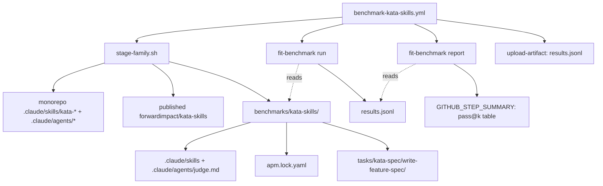

# Design 0890-a — Kata-Skills Benchmark Family (v1, no ablation)

Spec [#890](spec.md) closes two gaps the `fit-benchmark` substrate left open:
no task family targets the kata pack, and no operational cadence runs it. This
design names the components and interfaces that close both gaps inside the
substrate already shipped by spec [#870](../870-fit-benchmark-coding-tasks/design-a.md)
— a top-level `benchmarks/` root with one family, one task, one workflow.

## Components

| Component | Where | Role |
| --- | --- | --- |
| Benchmarks root | `benchmarks/` (new top-level) | Hosts task families per skill pack under test. Carries `benchmarks/README.md` (catalog: layout, how to add a family) and `benchmarks/.benchmark-fixture` (sentinel: see § Fixture-safety mechanism). Forward-compatible with future `benchmarks/fit-skills/` etc. |
| Family root | `benchmarks/kata-skills/` (new) | The single v1 family. Directory name matches the pack id under test (`forwardimpact/kata-skills`); a future `fit-skills` family slots in alongside without renaming. Holds the family-local README, the staged `.claude/` tree, the staging script, and `tasks/`. |
| Family README | `benchmarks/kata-skills/README.md` (new) | Documents family-local conventions (task layout, the v1 task, the marker mechanism) and links to spec #870 for substrate-level notes. Does **not** re-enumerate sandbox flags, agent-cwd discipline, or judge-profile-only-for-v1 — those are read from #870. |
| Staging script | `benchmarks/kata-skills/scripts/stage-family.sh` (new) | The build-time mechanism that produces a valid `fit-benchmark` family tree at the family root. Accepts a regime flag (published \| in-repo); the regime selects the source of `.claude/skills/kata-*` and `.claude/agents/*` and the `source_identity` recorded in the lockfile. |
| Staged skill tree | `benchmarks/kata-skills/.claude/skills/kata-*/` (build output) | Identical layout to `.claude/skills/kata-*` in the monorepo; populated by the staging script, not checked in. |
| Staged judge profile | `benchmarks/kata-skills/.claude/agents/judge.md` (new, checked in) | The judge agent profile the harness invokes per spec #870's judge contract — see Decision 4 for rationale. |
| Lockfile | `benchmarks/kata-skills/apm.lock.yaml` (build output) | The file `ApmInstaller` hashes for `skillSetHash`. Bytes are deterministic per regime (see § Lockfile shape) and change when the staged sources change. |
| v1 task | `benchmarks/kata-skills/tasks/kata-spec/write-feature-spec/` (new) | The single v1 task. METR-style `task_family_name/task_name` (`kata-spec/write-feature-spec`). Carries `instructions.md`, `supervisor.task.md` (reserved, unread in v1 per #870 Decision 14), `judge.task.md`, `specs/` (a brief plus a JTBD persona+job snippet copied into the agent CWD), `workdir/scripts/preflight.sh` (no-op `exit 0` — the task ships nothing to boot), and `scoring/run.sh` (the structural rubric). |
| Structural rubric | `benchmarks/kata-skills/tasks/kata-spec/write-feature-spec/scoring/run.sh` (new) | Hidden grading per #870 — invoked by the harness's `Scorer` from the template path, never copied into the agent CWD. Asserts the rubric enumerated in § Grading rubric. NDJSON rows to `$RESULTS_FD`; exit code is the authoritative verdict. |
| Judge prompt | `benchmarks/kata-skills/tasks/kata-spec/write-feature-spec/judge.task.md` (new) | Reads `{{SCORING}}` and `{{AGENT_TRACE_PATH}}` per #870. Judges whether the spec *addresses the brief* — the layer the structural rubric cannot grade. |
| Workflow | `.github/workflows/benchmark-kata-skills.yml` (new) | Drives the three trigger signals, calls the staging script with the regime appropriate to the trigger, invokes `fit-benchmark run` + `fit-benchmark report`, writes the pass@k table to `$GITHUB_STEP_SUMMARY`, and uploads the JSONL artefact. |

## Component graph



## Family layout

```
benchmarks/
  .benchmark-fixture                       # sentinel (see Fixture-safety)
  README.md                                # catalog: per-family layout, how to add
  kata-skills/
    README.md                              # family-local conventions + link to #870
    scripts/stage-family.sh                # regime-aware staging
    apm.lock.yaml                          # build output; bytes drive skillSetHash
    .claude/                               # build output
      skills/kata-*/                       # staged from regime source
      agents/judge.md                      # checked in (family-local judge prompt)
    tasks/
      kata-spec/
        write-feature-spec/
          instructions.md                  # agent prompt: brief + persona+job ref
          supervisor.task.md               # reserved (v1: unread per #870)
          judge.task.md                    # judge prompt (templated)
          specs/                           # copied into agent CWD: the brief, JTBD excerpt
          workdir/scripts/preflight.sh     # `exit 0` — no scaffold to boot
          scoring/run.sh                   # structural rubric; lives template-side
```

## Staging-regime sequence

```mermaid
sequenceDiagram
  participant WF as benchmark-kata-skills.yml
  participant STG as stage-family.sh
  participant FAM as benchmarks/kata-skills/
  participant FB as fit-benchmark run
  WF->>STG: stage(regime=in-repo | published)
  alt regime = in-repo (PR job)
    STG->>FAM: copy monorepo .claude/skills/kata-* → .claude/skills/
    STG->>FAM: copy monorepo .claude/agents/*.md → .claude/agents/ (excluding judge.md)
    STG->>FAM: write apm.lock.yaml (regime=in-repo; source_identity = sha256 over staged contents)
  else regime = published (schedule / dispatch)
    STG->>FAM: fetch forwardimpact/kata-skills at latest main commit; record its sha
    STG->>FAM: copy fetched skills/ → .claude/skills/; agents/ → .claude/agents/ (excluding judge.md)
    STG->>FAM: write apm.lock.yaml (regime=published; source_identity = pack version + commit sha)
  end
  WF->>FB: run --family benchmarks/kata-skills --runs N --model M --max-turns T
  FB-->>WF: results.jsonl (one record per (task, runIndex))
```

The harness chain per `apm-installer.js:21-22` and `workdir.js:67`:
`ApmInstaller` reads the family-root `apm.lock.yaml`, computes `skillSetHash`
over its bytes per #870 Decision 4, and mirrors the family-root `.claude/`
into `<output>/.apm-staging/.claude/`; `WorkdirManager` then copies that
staging mirror into each per-task agent CWD's `.claude/`. The lockfile drives
the hash, not materialisation (see Decision 2).

## Lockfile shape

`apm.lock.yaml` is a real apm-format file the substrate can parse unchanged;
the bytes vary across regimes via a `benchmark:` metadata block the substrate
ignores but the hash includes:

```yaml
apm_lock_version: 1
dependencies: []
benchmark:
  regime: in-repo            # or "published"
  source_identity: sha256:…  # in-repo: hash of staged contents
                             # published: "<pack-version>@<commit-sha>"
```

Deterministic per regime: the in-repo branch hashes the staged contents after
the copy completes; the published branch records the resolved version and
commit sha captured during the fetch. `skillSetHash` flips iff the staged
sources flip — the property spec #890 § Success Criteria asserts.

## Fixture-safety mechanism

Every fixture file checked into the family is unambiguously skippable two ways
without parsing its body:

1. **Path predicate** — `benchmarks/**` is the primary marker. Downstream
   crawlers (the kata `rg '<job '`, `rg '<read_do_checklist'`,
   `rg '<do_confirm_checklist'` discoveries listed in `CLAUDE.md` § Jobs and
   Checklists) exclude this prefix via a single `--glob '!benchmarks/**'`.
2. **Directory sentinel** — `benchmarks/.benchmark-fixture` is an empty file
   that tools without path context (any walker that does not know the
   monorepo's top-level conventions) can detect by ancestor lookup.

The family README documents both. Agent **outputs** (produced at run time
inside per-task ephemeral CWDs) are not in scope — they never land in the repo.

## Workflow triggers

| Trigger | Regime | Notes |
| --- | --- | --- |
| `workflow_dispatch:` | published | Manual; cost-controlled by humans. |
| `schedule:` (weekly, `main`) | published | Cadence — drift detector. |
| `pull_request:` with paths filter | in-repo | Filter scoped to in-repo kata-skill sources, agent profiles, the family tree, and the workflow file. Globs are plan-level. |
| Concurrency group | (all triggers) | Keyed on the GitHub ref; cancel-in-progress so a later push on the same PR supersedes an in-flight run. Group string is plan-level. |

## Cost envelope

| Lever | v1 value | Recording substrate |
| --- | --- | --- |
| Model | `claude-haiku-4-5-20251001` (pinned cheap model) | `result.model` |
| Runs per task | 5 | `result.runIndex` |
| Max turns per session | 25 | `result.turns` |
| Per-invocation budget | ≤ $5 | Σ `result.costUsd` across the JSONL |

Concretes are design choices the spec permits; the recording substrate the
design **must** preserve is the result-record fields above. The budget
assertion is workflow-level (post-run sum over JSONL) — see Decision 9.

## Grading rubric (structural)

The `scoring/run.sh` script grades the agent's emitted `spec.md` against the
quality bar `.claude/skills/kata-spec/SKILL.md` § DO-CONFIRM publishes:

| Check | Property |
| --- | --- |
| File present | A `spec.md` exists at the prescribed path under `$WORKDIR`. |
| Problem first | First non-title section is headed `## Problem` (or equivalent) and precedes any proposal. |
| Specific scope | A `## Scope` (or `## In scope`) section names entities and an explicit exclusion. |
| Verifiable success | A `## Success Criteria` section pairs each claim with a command, path, or observable. |
| No HOW leak | Absence of file-path/function-signature patterns characteristic of plan-grade content. |
| Cites JTBD | References a persona+job present in the staged `JTBD.md` excerpt (under `$WORKDIR/specs/`). |

`verdict = "pass"` iff scoring **and** judge both pass, per #870's combined
gate.

## Key Decisions

| # | Decision | Rejected alternative | Why |
| --- | --- | --- | --- |
| 1 | Top-level `benchmarks/` root, one directory per pack-under-test (`benchmarks/kata-skills/`). | Nest under `libraries/libeval/benchmarks/` or `products/gear/benchmarks/`. | Top-level matches the spec's wording and signals that benchmark families are first-class artefacts of the monorepo, not internals of one library. A future `benchmarks/fit-skills/` slots in symmetrically. |
| 2 | Stage `.claude/` at build time, never check it in. Empty `dependencies: []` in the lockfile; staging is the script's job, not `apm install`'s. | Check `.claude/skills/kata-*` into the family directory. | Avoids drift between the in-repo source of truth and a copy. Keeps a single PR-job staging mechanism for the in-repo regime — the published regime simply substitutes the source. |
| 3 | One staging script with a regime flag, not two scripts. | Two parallel scripts (`stage-from-repo.sh`, `stage-from-published.sh`). | One script keeps the lockfile-emission contract in one place; regime is a single conditional. v1 differentiates the two staging paths inside the build step (per spec § In scope), and a one-script-with-flag is the smallest mechanism that does so. |
| 4 | `judge.md` agent profile lives **inside** the family (`.claude/agents/judge.md`), not in the monorepo's `.claude/agents/`. | Pull a judge profile from `.claude/agents/judge.md` in the monorepo. | The judge prompt is family-specific (it grades spec quality). Coupling it to the monorepo's shared agent registry would make the agent registry care about benchmark mechanics. |
| 5 | Fixture-safety = path predicate (`benchmarks/**`) + directory sentinel (`.benchmark-fixture`). Both, not one. | Front-matter token on every fixture file. | Front-matter requires parsing every file body, which is exactly what the spec asks the mechanism to avoid. Path + sentinel are both purely structural; together they cover walkers with and without monorepo-path awareness. |
| 6 | One workflow file with three triggers, not three workflows. | Split `pr.yml`, `schedule.yml`, `dispatch.yml`. | The three triggers differ only in the staging regime (one conditional in a single build step). Splitting would multiply the result-upload, summary-render, and budget-assert code threefold. |
| 7 | PR-regime staging copies from in-repo `.claude/skills/kata-*` directly; the lockfile's bytes are derived from a sha256 over those staged contents. | Run `apm install` in PR mode against a pre-published preview package. | `kata-skills` publishes only on push to `main` (per `.github/workflows/publish-skills.yml`) — a preview package does not exist for PRs. Direct copy ensures the change under review is what gets graded. |
| 7b | Published-regime version-pin = the latest commit on `forwardimpact/kata-skills` `main` at fetch time; the resolved commit sha is recorded into the lockfile's `benchmark.source_identity`. | A monorepo-side checked-in pin file rotated on each release. | `kata-skills` has no versioning channel finer than `main`. A pin file would have to be rotated on every release and would drift between scheduled runs and the dispatched runs that prompted the rotation. Recording the resolved sha keeps the substrate-identity on the result record (via `skillSetHash`) without a second source of truth to maintain. |
| 8 | v1 reports `pass@1` (and at most `pass@5` given runs=5). No threshold, no delta, no "skill-positive" label. | A baseline-vs-current delta against the previous scheduled run. | Spec § Out of scope, deferred — delta tables and skill-positive labels are revisited with the ablation spec. v1 surfaces the number; humans read it. |
| 9 | Cost-envelope post-run assertion in the workflow (sum `costUsd`, fail on overrun). No per-task per-turn pre-flight cap inside the harness. | Wire a budget enforcer into `fit-benchmark` itself. | Spec asserts the envelope target and the recording substrate; the envelope is a workflow-level invariant, not a harness-level one. Keeps the harness unchanged for v1. |
| 10 | `preflight.sh` is a no-op (`exit 0`) for the v1 task. | A real scaffold smoke probe. | The task ships no scaffold — the agent writes a markdown file. Spec #870's pre-flight contract requires the file exist and be executable; v1 satisfies the contract minimally and defers real probes to future tasks (e.g., one that asks the agent to ship code). |

## Out of scope

Unchanged from spec § Out of scope, deferred.
