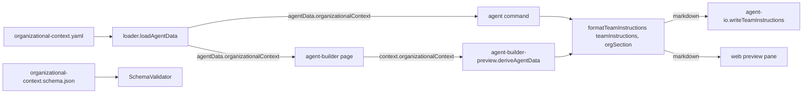

# Design 0920 — Pathway Organizational Context Slot

## Architecture

The slot lives where Pathway's other installation-scoped sibling files already
live: a single YAML file at the data-directory root, loaded into `agentData` by
the same loader that loads `claude-settings.yaml`, validated by the same Ajv
pipeline that validates every other Pathway entity, and rendered by a new pure
function that runs alongside `interpolateTeamInstructions` on both surfaces
(CLI agent command and web agent-builder preview).



The CLI and the web preview converge on the same pure composer. Byte-identical
output on the section falls out of single-source rendering, not parallel
formatting paths.

## Components

| Component | Where | Responsibility |
|---|---|---|
| **`organizational-context.yaml`** | `products/map/starter/` | Installation-scoped data carrying the six concerns. Sibling of `claude-settings.yaml`. The starter ships an example file populated with placeholder values to teach the shape. |
| **`organizational-context.schema.json`** | `products/map/schema/json/` | Ajv schema. Top-level concerns optional (so partial population is valid); fields within structured entries (escalation paths, adjacent leads) required when the entry exists. `additionalProperties: false` so unknown keys produce line-attributable errors. |
| **`SchemaValidator` mapping** | `products/map/src/schema-validation.js` § `SCHEMA_MAPPINGS` + `#OPTIONAL_SILENT` | New `SCHEMA_MAPPINGS` entry alongside `claude-settings.yaml`. Added to `#OPTIONAL_SILENT` so an absent file produces no warning (the spec's "no errors when absent" criterion). The slot is canonical at the data-directory root; the `repository/` fallback the loader supports is for compatibility only and is out of scope for the validator. |
| **Loader extension** | `products/map/src/loader.js` § `loadAgentData` | Loads the slot through the existing `#loadRepoFile` helper used by `claude-settings.yaml` and `vscode-settings.yaml`. Returned as `agentData.organizationalContext`. Absent file → `null` (not `{}`), so the renderer distinguishes "no slot" from "empty slot" via nullish check. The divergence from sibling files' `{}` fallback is deliberate; see § Key Decisions. |
| **`renderOrganizationalContext(orgContext)`** | `libraries/libskill/src/agent.js` (new export, alongside `interpolateTeamInstructions`) | Pure function. Takes the loaded YAML object (or `null`), returns a markdown section string — or `null` when the slot is absent or has no non-empty concerns. Lives in `libskill` because both `fit-pathway` CLI and the web preview already import `interpolateTeamInstructions` from there. |
| **`formatTeamInstructions(teamInstructions, orgSection, template)`** | `products/pathway/src/formatters/agent/team-instructions.js` (existing function, signature extended) | Composes the two pieces into the `content` slot of `claude.template.md`. When `orgSection` is `null`, output is byte-identical to today. When `teamInstructions` is null/empty and `orgSection` is non-null, the section renders alone. When both are non-null, the section follows the `teamInstructions` body separated by a single blank line. Returns `null` only when both inputs are null/empty. |
| **CLI call site** | `products/pathway/src/commands/agent.js` (agent command handler) + `products/pathway/src/commands/agent-io.js` § `writeTeamInstructions` | The command passes `agentData.organizationalContext` through `renderOrganizationalContext` into the composer. The write-skip gate (which today returns early in `writeTeamInstructions` when `teamInstructions` is falsy) is moved to gate on both inputs: skip writing only when both `teamInstructions` and `orgSection` are null, so the slot-only case writes the file as the spec requires. |
| **Web call site** | `products/pathway/src/pages/agent-builder-preview.js` § `deriveAgentData`, fed by `agent-builder.js` § `buildDeriveContext` | The page is extended to thread `agentData.organizationalContext` into `context.organizationalContext`. `deriveAgentData` calls the same composer, so `teamInstructionsContent` becomes non-null whenever either input is — preserving the existing field name and the existing UI card. |
| **Pre-change baseline fixture** | A snapshot fixture captured from `main` immediately before this change ships, against a starter copy with no slot file present. | The byte-identical-absent test runs the post-change generator against a starter copy whose `organizational-context.yaml` has been removed, and compares against this fixture. The populated-starter test (separate) runs against the unmodified starter and asserts the placeholder values appear in the rendered section. |
| **`fit-pathway agent --help`** & **`fit-pathway` skill** | libcli `documentation` array on the agent command and `## Documentation` section of `.claude/skills/fit-pathway/SKILL.md` | Both carry the org-context guide URL in the same position (per [products/CLAUDE.md § Linking rule](../../products/CLAUDE.md)). |
| **Guide updates** | `websites/fit/docs/products/agent-teams/organizational-context/index.md` and `websites/fit/docs/products/authoring-standards/index.md` | Two-layer story: track-scoped `teamInstructions` (shared across teams) vs. installation-scoped slot (per-team facts). Guide names the marker contract verbatim. Authoring guide adds the slot entry alongside the existing entity types. |

## Data Shape

```yaml
# products/map/starter/organizational-context.yaml
repositories: [molecularforge, data-lake-infra, api-gateway]
team: pharma-platform
manager: athena
adjacentLeads:
  - handle: iris
    role: DX
  - handle: prometheus
    role: DS/AI
projects: [drug-discovery-pipeline, lab-data-portal]
escalationPaths:
  - trigger: production page after hours
    destination: pagerduty://pharma-platform-oncall
  - trigger: security incident
    destination: security@pharma.example.com
```

Top-level keys map one-to-one with the spec's six concerns. Plural keys take
string lists; singular keys take a single string. `adjacentLeads` and
`escalationPaths` carry lists of objects whose fields are both required when
the entry exists.

## Rendered Section

```markdown
## Organizational Context

- **Repositories:** molecularforge, data-lake-infra, api-gateway
- **Team:** pharma-platform
- **Manager:** athena
- **Adjacent leads:** iris (DX), prometheus (DS/AI)
- **Projects:** drug-discovery-pipeline, lab-data-portal
- **Escalation paths:**
  - production page after hours → pagerduty://pharma-platform-oncall
  - security incident → security@pharma.example.com
```

Handles render as the bare strings the engineer wrote (no `@` decoration in
v1 — spec says handles are free-form strings). The section is emitted after
the `teamInstructions` body, separated by one blank line, whenever **at least
one** concern in the slot has a non-empty value. When no concern is populated
(slot file present but all fields absent or empty), the section is suppressed
— the renderer returns `null` and behavior collapses to the absent-slot path.
Within the section: a singular field that is missing or empty suppresses its
bullet; a list that is empty or absent suppresses its bullet; a structured
list with at least one entry emits the parent bullet and one sub-bullet per
entry.

## Marker Contract

The section opens with the literal line `## Organizational Context`. Downstream
tooling locates the section by exact-string match on that line. Because the
section is appended **last** to the rendered file, tooling that needs the
unique occurrence matches the **final** `## Organizational Context` in the
file — robust against the unlikely case that a track author writes that
heading inside `teamInstructions` prose. The guide documents both the marker
and the last-occurrence rule.

## Key Decisions

| Decision | Choice | Rejected alternative | Why |
|---|---|---|---|
| Slot shape | Single YAML file at `products/map/starter/organizational-context.yaml` | Directory of per-concern files | The slot is installation-scoped and small (six concerns); existing precedents (`claude-settings.yaml`, `vscode-settings.yaml`) are also single sibling files. A directory adds path management for no representational gain. |
| Slot location | Data-directory root | Nested under `repository/` | The starter advertises the file by sitting alongside its peers; new installers see it on `ls`. The `#loadRepoFile` helper already supports both paths transparently for installations that prefer the subdirectory. |
| Library home | `libraries/libskill/src/agent.js` | A new module under `products/pathway/src/formatters/` | `interpolateTeamInstructions` already lives in libskill and is the function both CLI and web preview import. Keeping both renderers in the same module preserves "one place to look for agent-instruction composition." |
| Composer signature | Extend existing `formatTeamInstructions` to accept the org-section as a second argument | A new sibling function `composeClaudeMd` calling `formatTeamInstructions` internally | `formatTeamInstructions` already owns the `content` slot of `claude.template.md` and is the single call site on both surfaces. Extending its signature avoids a third name in the rendering chain. |
| Section marker | `## Organizational Context` heading | HTML comment marker; fenced custom block | A heading is detectable by string match (the spec's bar), survives markdown-to-HTML rendering for the web preview, and is legible to the engineer who opens `.claude/CLAUDE.md`. Invisible markers optimize for tooling at the cost of human readability. |
| Section ordering | After `teamInstructions` body | Before | Putting the per-installation refinement after the stable track identity preserves the existing top-of-file experience, keeps the absent-slot byte-identical test a pure suffix check, and gives the marker contract the "match the last occurrence" property that survives prose collisions. |
| Section emission rule | Emit when at least one concern has a non-empty value | Emit whenever the file exists | A slot file with all fields empty or absent has no information to add to the agent; emitting an empty section would leave the file with a heading and no body. Treating that case as "effectively absent" preserves the user invariant that the slot reaches the agent only when populated. |
| Loader fallback | `null` when absent | `{}` (matching `claudeSettings`/`vscodeSettings`) | A single nullish check at the renderer's entry covers both "no slot" and "loader could not parse"; `{}` would force the renderer to check for `null`, `undefined`, *and* the empty-object case. The existing siblings can use `{}` because their consumers ask for specific keys rather than testing the object's presence. The component table calls out the divergence so planners see it. |
| Validation philosophy | Top-level concerns optional; structured-entry fields required | All top-level concerns required | A team may know its repos and manager before knowing its escalation paths; partial population must not block adoption. But once an engineer writes an escalation path, missing `trigger` or `destination` is a typo worth flagging. |
| Validator silent-absence | `#OPTIONAL_SILENT` includes the new file | Warn on absent file (matching the precedent of other single-file entries in `SCHEMA_MAPPINGS` like `levels.yaml` or `drivers.yaml`) | The spec requires "no errors when the slot is absent." Silent absence honors that; warnings are user-visible noise for the (likely majority) case where the installation has no organizational facts to add. |
| Schema location | `products/map/schema/json/organizational-context.schema.json` | A new schema directory | The existing `SCHEMA_MAPPINGS` reads from one directory; splitting it would force a loader change for no benefit. |

## Invariants Honored

| Spec invariant | Where in design |
|---|---|
| Absent slot produces output byte-identical to today | Composer returns `teamInstructions` content unchanged when `orgSection` is `null`; renderer returns `null` when no concern is populated; pre-change baseline fixture pins the comparison. |
| CLI and web preview render the same section | Single `renderOrganizationalContext` in libskill; single `formatTeamInstructions` extension in the pathway formatter. Both surfaces call the same two functions. |
| "Don't edit outputs" preserved | All six concerns live in `organizational-context.yaml`. The composer is a pure function of `(teamInstructions, orgSection, template)`; two runs produce identical bytes. |
| Section detectable by downstream tooling without parsing | `## Organizational Context` heading at the section's start; appended last so the unique occurrence is the final match; guide documents both. |

## Scope Faithfulness

Every component above maps to a Scope row in the spec. The slot's contents
flow into the rendered `CLAUDE.md` and stop there; items the spec lists
out-of-scope (per-repository overrides, roster-backed handle validation,
per-track variation, auto-discovery, migration, structured access from skills,
removing `teamInstructions`, localization) do not appear in any component,
interface, or data shape above.

— Staff Engineer 🛠️
