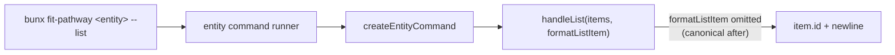

# Design 0930 — Pathway `--list` Id-Only Normalisation

## Architecture

The factory `createEntityCommand` in
`products/pathway/src/commands/command-factory.js` already encodes the desired
behaviour as its **default** — `handleList` writes `item.id + "\n"` per item
whenever the optional `formatListItem` config is omitted. The published JSDoc
contract says exactly that: "Clean newline-separated list of IDs (for piping)".

Every entity command (level, discipline, track, behaviour, driver, skill)
overrides that default with a multi-column `formatListItem` and passes it into
the factory. The implementation diverges from the contract by **opt-in**, not
by accident — six explicit overrides, one per command.

This design collapses that divergence. The factory contract, its default
branch, and `handleList` stay exactly as they are. After the change, no entity
command supplies `formatListItem`; the default produces the canonical shape;
the summary-hint copy and the two guide example blocks that today render the
multi-column shape match the new contract.

## Components

| Component | Where | State after |
|---|---|---|
| **Factory contract & default** | `products/pathway/src/commands/command-factory.js` — `createEntityCommand`, `handleList` | Unchanged. JSDoc already says id-only; the default branch already produces it; the optional `formatListItem` config remains available. |
| **Entity list overrides** | `formatListItem` definitions and `createEntityCommand({ …, formatListItem })` references in `level.js`, `discipline.js`, `track.js`, `behaviour.js`, `driver.js`, `skill.js` | Absent. The factory default is the only path that runs for `--list`. (`discipline.js` was the only in-tree caller of `isProfessional`/`validTracks` for list output — neither is referenced elsewhere for this purpose.) |
| **Summary-hint copy** | `formatSummary` bullet in `level.js` (today: "for IDs and titles"), and in `discipline.js`, `track.js`, `behaviour.js`, `driver.js` (today: "for IDs and names") | Each bullet advertises "IDs" only, matching the new contract. `skill.js` already reads "for IDs" — untouched. |
| **Career Paths guide** | `websites/fit/docs/products/career-paths/index.md` — three rendered output blocks following the `level --list`, `discipline --list`, and `track --list` examples | Rendered output blocks show the id-only shape. |
| **Define Role authoring guide** | `websites/fit/docs/products/authoring-standards/define-role/index.md` — `discipline` and `track` rendered output blocks | Rendered output blocks show the id-only shape. |
| **Other guides referencing `--list`** | `websites/fit/docs/products/agent-teams/index.md`, `websites/fit/docs/libraries/integrate-standard/derive-profile/index.md`, `websites/fit/docs/getting-started/engineers/pathway/index.md`, `websites/fit/index.md` | Unchanged. These reference `--list` only inline (no rendered output blocks); nothing to realign. The spec's discovery `rg` returns them but the realignment surface is empty. |

## Interfaces

The factory contract — `createEntityCommand({ …, formatListItem, … })` and
`handleList(items, formatListItem)` — is unchanged. The behavioural shift sits
**only at the call site**: entity command modules no longer pass
`formatListItem` into the factory.

Observable contract for `--list` after the change: for any entity in
`{level, discipline, track, behaviour, driver, skill}`, output is one line per
item, each line is the item's `id`, in the same order the default summary table
renders. No header, no commas, no trailing whitespace. This is exactly what
`handleList`'s default branch produces today; the design's contribution is
making it the only branch reachable from the six entity commands.

## Key Decisions

| Decision | Choice | Rejected alternative & why |
|---|---|---|
| **Where to make the change** | Remove the six `formatListItem` opt-ins; the factory default is the only path. | Rewrite each override body to `return item.id`. Rejected: adds a one-line indirection that hides the contract behind six redundant functions. Collapsing the divergence at its source is the architecturally honest move. |
| **Whether to remove `formatListItem` from the factory** | Keep it, optional, default `item.id`. | Remove the option entirely. Rejected: closes the door on legitimate future variants (a hidden debug column, a `--list --verbose` shape), and removing an exported config key is a wider API break than the spec scopes. |
| **Where descriptive columns live after** | The default (non-`--list`) `formatSummary` table — already the canonical human surface. | Add `--json` / `--format` for structured output. Rejected: explicit out-of-scope in the spec. |
| **How summary-hint copy moves** | Per-command edit to each `formatSummary` bullet. | Extract a shared `formatListHint(entityName)` helper. Rejected: a one-line copy change in five files; factoring would obscure rather than clarify. |
| **Breaking-change surfacing channel** | Conventional-Commit `feat(pathway)!:` on the implementation PR title; the `!` flows into the next `pathway@v0.x.y` GitHub Release notes. | Add a `products/pathway/CHANGELOG.md` ad-hoc. Rejected: no product carries one (release notes are the channel); introducing a per-product convention for one spec is scope expansion. |
| **Whether to migrate `skill.js`'s `--agent`-discovery hint** | Leave as-is. | Update it. Rejected: the hint uses the canonical `--list \| xargs … --json` idiom that already works under both shapes — it never depended on column data. |

## Out of Scope

Mirrors the spec — three items: starter-data ordering from #875,
parameterised flow `--list` commands (`job`, `interview`, `progress`, `agent`),
and structured-output flags (`--json` / `--format`). See
[`spec.md` § Out of scope](./spec.md#out-of-scope) for the full statements.

## Risk & Mitigation

External shell-script or agent scrapers parsing the comma-separated shape are
the only break surface; the spec triaged the in-repo population and found
none. The breaking-change marker on the implementation PR title is the only
pre-publication mitigation channel available. The factory's published
"id-only" contract is the consumer's post-publication anchor — the design
closes the gap between contract and behaviour, which is the only durable form
of compatibility this CLI can offer.
