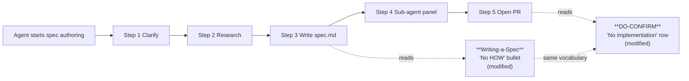

# Design 0980-a — kata-spec: forbid `file:line` citations in spec bodies

## Problem restated

The `kata-spec` SKILL.md tells spec authors not to leak HOW into the spec, but
states the rule abstractly. Spec [#890](../890-kata-skills-benchmark-family/)'s
benchmark shows agents reach for `file:line` (e.g. `src/foo.ts:42`) as Problem
evidence anyway. The fix is to name the `file:line` shape inside two existing
bullets — one author-facing (Writing a Spec) and one verifier-facing (DO-CONFIRM)
— without expanding scope to other HOW-leak vectors.

## Components

The "components" here are textual loci inside `.claude/skills/kata-spec/SKILL.md`.
Each surface has a different role in the agent's authoring loop:

| Component                              | Surface                                | Layer ([COALIGNED.md](../../COALIGNED.md)) | Role in author loop                                                |
| -------------------------------------- | -------------------------------------- | ------------------------------------------ | ------------------------------------------------------------------ |
| **Writing-a-Spec "No HOW" bullet**     | SKILL.md, "Writing a Spec" subsection  | L4 (procedural)                            | Drafting-time guidance — fires as the agent forms Problem evidence |
| **DO-CONFIRM "No implementation" row** | SKILL.md, DO-CONFIRM checklist         | L6 (verificational)                        | Verification-time guard — fires before recommending approval       |
| READ-DO "file paths" bullet            | SKILL.md, READ-DO checklist            | L6 (verificational)                        | **Unmodified** — already names file paths; further edit is dupe    |
| All other SKILL.md content             | rest of file                           | L4 / L6                                    | **Unmodified** — outside spec scope                                |

The two modified components share one vocabulary token (`file:line`). They differ
in tense: the author-facing bullet (L4) says "do not write this shape"; the
verifier-facing bullet (L6) says "check that this shape was not written."

### Layering (COALIGNED.md)

The two modified surfaces sit on different layers of the
[COALIGNED.md](../../COALIGNED.md) standard, and the design's choices honor the
inter-layer rules:

| Invariant ([COALIGNED.md](../../COALIGNED.md))                                                          | How the design honors it                                                                                                                                                                                                                                          |
| ------------------------------------------------------------------------------------------------------- | ----------------------------------------------------------------------------------------------------------------------------------------------------------------------------------------------------------------------------------------------------------------- |
| **L4 is procedural, L6 is verificational; no layer restates another** (§ The Layers; § Layer Rules)     | The L4 bullet directs the author ("do not write `file:line`"); the L6 row verifies the artifact ("the spec body contains no `file:line` citation"). Shared *vocabulary*, not shared *prose* — separation enables the cross-bullet grep audit (Decision 1).        |
| **A checklist item must never teach; if it needs explanation, the procedure above it is incomplete** (§ Layer Rules; § L6) | Decision 3 keeps the abstract HOW-belongs-in-the-plan rule as the L6 bullet's lead clause with `file:line` attached as a named instance; Decision 6 tail-positions the token; Decision 7 forbids worked examples — together these keep L6 verificational, not instructional. The teaching lives in the L4 bullet. |
| **Killer items only; 5–7 items per checklist** (§ Properties of Good Checklists)                        | The DO-CONFIRM extension is **in-place** on an existing bullet (Decision 3), not a new sibling — the checklist's item count is unchanged.                                                                                                                          |
| **Auto-loaded layers consume context on every run; keep them tight** (§ Length and Loading)             | SKILL.md is L4 (≤192 lines, auto per skill). The change is two in-bullet extensions; Decision 7 forbids worked-example or callout additions elsewhere in the file, so the L4 budget is preserved.                                                                  |

## Data flow

The agent meets each modified surface exactly once per spec: once while
drafting evidence, once while verifying the drafted artifact.

## Interfaces

Both bullets are markdown list items inside `.claude/skills/kata-spec/SKILL.md`.
The interface to consumers (spec-authoring agents) is the rendered SKILL.md
they load when the `kata-spec` skill activates. No code, no CLI, no published
schema — the contract is the bullet text and its position in the document.

Shared `file:line` vocabulary across both surfaces is the cross-component
contract: the literal token appears in both bullets so
`grep -n 'file:line' .claude/skills/kata-spec/SKILL.md` returns at least one
match in each locus (the test specified by spec success criteria 1 and 2). If
the author bullet's anti-pattern name drifts from the verifier bullet's, the
agent loses the pattern-match between drafting and checking.

## Key Decisions

| #   | Decision                                                                                                                                  | Rejected alternative                                                                                                              | Why                                                                                                                                                                                                                                                |
| --- | ----------------------------------------------------------------------------------------------------------------------------------------- | --------------------------------------------------------------------------------------------------------------------------------- | -------------------------------------------------------------------------------------------------------------------------------------------------------------------------------------------------------------------------------------------------- |
| 1   | Use the literal token `file:line` in both bullets.                                                                                        | Use a paraphrase like "line-number citations" or "path-and-line pointers".                                                        | Spec success criteria 1 & 2 are grep tests for the literal substring `file:line`. The token also matches the benchmark rubric's vocabulary so reviewers reading either side can connect the rule to the failure mode.                              |
| 2   | Present the Writing-a-Spec change as an **inline contrastive clause** in the existing bullet (entity-or-behaviour name vs `file:line`).   | (a) Standalone example pair block; (b) nested sub-bullet under "No HOW"; (c) new sibling bullet.                                  | A standalone example block or new bullet expands the modified surface, risking the success-criterion-3 boundedness test. A nested sub-bullet creates a second list level just for one rule. Inline contrastive prose matches the surrounding form. |
| 3   | Extend the DO-CONFIRM bullet **in place** (one bullet, abstract rule first, named instance attached). Punctuation is plan scope.            | Add a sibling bullet specifically about `file:line`.                                                                              | Spec § In-scope row 2 mandates in-bullet extension. Preserving the abstract HOW-belongs-in-the-plan framing as the umbrella keeps the bullet a generalisation, with `file:line` as the one named instance the rubric currently catches.            |
| 4   | Name **only** `file:line` — do not name function signatures, code fences, or other HOW-leak vectors in either bullet.                     | Enumerate all known HOW-leak vectors observed in benchmark runs.                                                                  | Spec § Out-of-scope row 4 defers other vectors to per-vector follow-up specs. Success criterion 3 explicitly forbids naming additional vectors in this diff.                                                                                       |
| 5   | Leave the READ-DO checklist's "file paths" bullet unchanged.                                                                              | Mirror the `file:line` naming there as well.                                                                                     | Spec § Out-of-scope row 1: the READ-DO bullet already lists "file paths" among three implementation-detail kinds. Tightening it is duplicative with the Writing-a-Spec change.                                                                     |
| 6   | Position the anti-pattern token at the **end** of each bullet, after the existing rule statement.                                         | Place the named token at the head of the bullet ("`file:line` citations are HOW…").                                              | Front-loading inverts the umbrella relationship — `file:line` is one instance of "No HOW", not the rule itself. Keeping it tail-positioned preserves the abstract rule as the lead clause.                                                         |
| 7   | Do **not** add a worked example, a "Bad / Good" block, or a callout in any other part of SKILL.md.                                        | Add a small example block in the "Writing a Spec" section showing one bad and one good Problem-evidence sentence.                 | Success criterion 3 bounds the diff to the two named bullets. An example block elsewhere would still touch SKILL.md outside those two loci.                                                                                                        |

## Cross-cutting non-concerns

These were considered and rejected as out-of-scope for design 0980-a:

- **Updating the benchmark rubric or threshold.** Spec § Out-of-scope row 2.
  Spec #890 deferred rubric/threshold work; design-a inherits that deferral.
- **Updating `kata-design` or `kata-plan` skills.** Those skills permit (and
  in `kata-plan`'s case require) precise citations. Spec § Out-of-scope row 5.
- **Re-running historical benchmark records.** The next scheduled or
  PR-triggered benchmark run picks up the change through spec #890's staging
  path. Spec § Out-of-scope row 6.
- **Release plumbing.** The existing `forwardimpact/kata-skills` sync on push
  to `main` is the only publication path; success criterion 4 enforces no
  workflow/release-tooling edits.

## Risks & mitigations

| Risk                                                                                            | Severity | Mitigation                                                                                                                                                                                                       |
| ----------------------------------------------------------------------------------------------- | -------- | ---------------------------------------------------------------------------------------------------------------------------------------------------------------------------------------------------------------- |
| Agent generalises beyond `file:line` (e.g. starts forbidding all line numbers in Problem prose) | medium   | Decisions 3 + 6 together enforce the umbrella relationship: Decision 3 keeps the abstract HOW rule as the bullet's lead clause; Decision 6 positions `file:line` at the tail as one named instance.              |
| Adding the named anti-pattern in two places goes stale separately                               | low      | Decision 1: identical literal token in both bullets means a single `grep -n 'file:line'` audit (already a success-criteria test) detects drift in either place.                                                   |
| Next HOW-leak vector observed (e.g. code fences) prompts a second naming round in the same bullets | low    | Decision 4 + spec § Out-of-scope row 4 establish the per-vector follow-up-spec pattern. Future specs add new named instances at the same loci using the same in-bullet-extension shape.                          |

## What this design does **not** specify

These belong in `plan-a.md`:

- Exact diff text for each bullet (final wording, punctuation, dash style).
- Whether the in-place DO-CONFIRM extension uses an em-dash, parenthetical, or
  semicolon to attach `file:line`.
- Ordering of plan steps and the bun-format command invocation.
- The kata-review panel prompt text.

— Staff Engineer 🛠️
