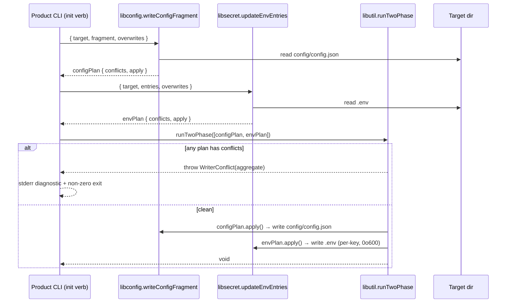

# Design 1000-b — Per-surface writers + generic two-phase coordinator

Alternative to [design-a](design-a.md). Where design-a introduces a new
`@forwardimpact/libinit` library with one `bootstrapProject` entry,
this design **extends the libraries that already own each surface**
(libconfig owns `config/config.json`, libsecret owns `.env`) and adds a
**surface-agnostic** `runTwoPhase` combinator in libutil that
aggregates conflicts across any number of `Plan` objects before any
writer commits. It picks **top-level namespace** ownership (the spec's
literal framing) with leaf-grained diagnostics, and sequences `fit-map
init` and `fit-map substrate stage` as independent subprocesses.

## Components

| Component | Home | Role |
|---|---|---|
| `writeConfigFragment` | libconfig | Returns a `Plan` over `config/config.json`: merged result + conflicts under top-level-namespace ownership; `apply()` commits canonical JSON. |
| `updateEnvEntries` | libsecret | Returns a `Plan` over `.env`: per-key write decisions + conflicts; `apply()` commits via libsecret's existing per-key `updateEnvFile` so `0o600` + comment-rewrite are preserved transitively. |
| `runTwoPhase` | libutil | Surface-agnostic combinator over `Plan[]`. Aggregates conflicts across all plans; throws `WriterConflict` if any has conflicts, otherwise awaits every plan's `apply()`. Knows nothing about config or env. |
| `Plan` (interface) | libutil | `{ conflicts: ConflictEntry[], apply(): Promise<void> }`. Contract both writers satisfy. |
| `WriterConflict` | libutil | Aggregating error: `{ entries: ConflictEntry[] }`. Each entry: `{ kind: "config" \| "env", path: string, overwriteSurface: string }` — `path` is the conflicting leaf (dotted for config, bare for env). |
| Onboarding contract | libconfig `README.md` § *Bootstrapping* | Names writer entry points, namespace declaration, overwrite-intent parameters, and the `runTwoPhase` pattern. Cross-links libsecret + libutil sections. |
| `fit-guide init` adapter | products/guide | Materialises generated secrets via `getOrGenerateSecret` before building plans; hands plans to `runTwoPhase`. |
| `fit-map init` adapter | products/map | Builds empty plans; `runTwoPhase` still materialises `config/config.json`. |
| Workflow change | `.github/workflows/kata-interview.yml` | Substrate stage step sequences `fit-map init` and `fit-map substrate stage` as two subprocesses; the `mkdir -p` workaround line is removed. |
| `fit-map substrate stage` | products/map | **Unchanged.** Does not call the bootstrap writers; its precondition is that `fit-map init` already ran. |

## Interface

```js
import { writeConfigFragment } from "@forwardimpact/libconfig";
import { updateEnvEntries }    from "@forwardimpact/libsecret";
import { runTwoPhase }         from "@forwardimpact/libutil";

const configPlan = await writeConfigFragment({
  target,                            // absolute path
  fragment: {                        // top-level keys are product-owned namespaces
    "product.guide": { systemPrompt: "…" },
    "service.mcp":   { systemPrompt: "…", tools: { … } },
  },
  overwrites: ["product.guide"],     // top-level namespace names
});

const envPlan = await updateEnvEntries({
  target,
  entries:    { SERVICE_SECRET: "…", MCP_TOKEN: "…" },
  overwrites: ["MCP_TOKEN"],         // bare keys
});

await runTwoPhase([configPlan, envPlan]);
```

Each writer is independently callable; `runTwoPhase` enforces
refuse-before-mutate across the set. The product's `init` verb is the
spec's "one callable interface" — the three-call pattern is its
implementation, fixed by the README contract. `runTwoPhase` admits a
future third surface (e.g. `.gitignore` lines) without re-architecting.

`writeConfigFragment` always materialises `config/config.json` (`{}`
when `fragment` is empty and the file is absent) — this is what
satisfies the spec's anchoring criterion for `fit-map init` without
shipping a `product.map` fragment. `.env` is created (mode `0o600`)
on the first entry written; never created with zero entries.

## Two-phase commit



Cross-file atomicity remains spec-deferred — a crash between the two
`apply()` calls leaves a half-written layout, same as today.

## Library layering

`product → { libconfig, libsecret, libutil }`; `libconfig → libutil`;
`libsecret → libutil`. The coordinator sits **below** the surface
writers, so no domain-aware library imports a sibling surface library.
libconfig and libsecret each gain a libutil dep (for `WriterConflict`);
libutil gains no new deps — it stays generic.

## Namespace ownership semantics

For `config.json`, ownership is enforced at the **top-level key**
(the spec's literal framing). Each top-level key in the fragment
classifies against the existing on-disk subtree under the same key:

| Pre-state | Fragment subtree | Result |
|---|---|---|
| absent | any | write subtree |
| present, deep-equal (canonical JSON) | same | no-op |
| present, different | different | refuse, unless top-level key ∈ `overwrites` |

"Deep-equal canonical JSON" = sorted-key, no-whitespace serialisation
compared as strings — the normalisation rule that makes A→B→A→B
converge regardless of input key order or whitespace.

**Ownership granularity is top-level; diagnostic granularity is
leaf.** When a top-level subtree differs, the writer enumerates the
leaf paths that disagree into `ConflictEntry.path`, so a write of
`product.x.foo = "b"` against existing `product.x.foo = "a"` produces
a diagnostic naming `product.x.foo` (satisfying spec § Failure
surfacing) while the overwrite-intent surface remains the top-level
namespace `product.x`. See Decision #4.

For `.env`, the same three rows apply at bare-key granularity. Value
comparison is byte-for-byte after `KEY=`. "Cross-namespace writes
always succeed" holds by construction at the top-level boundary; two
products contributing under the *same* top-level namespace is
out-of-scope per the spec's defer list.

## fit-map init ↔ substrate stage

The spec leaves the *which-invokes-which* arrangement as a design
choice. This design picks **two independent subprocesses sequenced by
the caller**. Substrate stage's precondition is that `fit-map init`
already ran. Bootstrap-shape parity becomes test-asserted rather than
structural — Decision #6 carries the trade-off against the spec's
identity criterion.

## Re-run semantics

The spec's re-run requirements drop out of the merge rules. The
`fit-guide init` adapter resolves `SERVICE_SECRET` / `MCP_TOKEN` via
`getOrGenerateSecret` *before* building the env plan, so a re-run
classifies them same-key-same-value and writes nothing; the pre-spec
`"config/ already exists, skipping starter copy"` log line is
replaced by the writer's silent no-op. The `fit-map init` adapter's
pre-spec `./data/pathway/ already exists` non-zero exit becomes a
no-op so the `init`-then-`stage` sequence is byte-stable.

## Key decisions

| # | Decision | Rejected alternative | Reason |
|---|---|---|---|
| 1 | Extend libconfig (writer) + libsecret (env-batch); generic combinator in libutil. | New library `@forwardimpact/libinit` hosting all three. | Each surface already has an owner; a new library duplicates surface ownership across three libraries (read in libconfig/libsecret, write in libinit). Keeping writers with existing read-side owners keeps per-library README as the single contract home. |
| 2 | Per-surface writers + generic `runTwoPhase` combinator. | One monolithic `bootstrapProject` entry. | Per-surface writers are independently testable and reusable outside init (e.g. a future `fit-guide secret rotate` reuses `updateEnvEntries` standalone). A generic combinator admits future surfaces (`.gitignore`, etc.) without re-architecting. |
| 3 | Two-phase plan/apply with conflict aggregation across all plans. | Throw on the first refused write (design-a's structural ordering). | Aggregation surfaces *all* conflicts in one error so a caller fixes both surfaces in one round-trip; first-throw forces N round-trips for N conflicts. |
| 4 | Top-level-namespace **ownership**; leaf-path **diagnostic**. | (a) Leaf-path ownership (design-a #5). (b) Top-level diagnostic. | (a) Top-level ownership matches the spec's normative text and how products think about their slice; leaf-path is stronger than asked and forces per-leaf overwrite opt-in. (b) Top-level diagnostic alone would name only `product.x` and fail the spec's success-criterion assertion that the diagnostic carries `product.x.foo` — splitting ownership from diagnostic granularity satisfies both clauses. |
| 5 | `overwrites` is a positional argument per writer (top-level keys for config; bare keys for env). | Flat `overwrites: string[]` mixed across surfaces. | Each writer takes the overwrite list shaped for its own ownership unit; no shared partitioned object needed when writers are separately called. (Diverges from design-a #3 — partitioning is unnecessary when writers are split.) |
| 6 | Caller sequences `init` and `substrate stage` as two subprocesses. | Substrate stage delegates internally to a shared bootstrap call (design-a #8). | Independent subprocesses match the developer-local flow exactly; substrate stage stays narrow (provisioning, not bootstrap). Trade-off accepted: parity is asserted by test rather than structural. |
| 7 | `writeConfigFragment` always materialises `config/config.json`; `updateEnvEntries` never auto-creates `.env`. | Symmetric auto-creation. | The spec's anchoring criterion needs `config/config.json` to exist; `.env` has no equivalent anchoring role and auto-creating an empty `0o600` `.env` would surprise developers. |
| 8 | `WriterConflict` is an aggregating error; per-entry `overwriteSurface` names the caller's parameter. | Library prints the diagnostic itself. | The library names the conflicting leaf path + overwrite parameter; the CLI maps that to its flag wording. Keeps the diagnostic greppable for both per spec without coupling libraries to CLI text. |
| 9 | `updateEnvEntries` wraps libsecret's per-key `updateEnvFile`. | Reuse libutil's `updateEnvFile` primitive. | libutil's `updateEnvFile` lacks libsecret's comment-rewrite + `0o600` guarantees; wrapping libsecret's keeps the on-disk contract intact and reuses its test coverage. |
| 10 | Empty-string `.env` values written verbatim. | Skip empty values. | Spec 0990 makes empty-string-on-shell-env equivalent to absent on the **read** path; the writer's job is bytes, not read semantics. |
| 11 | Onboarding docs in libconfig `README.md` with cross-links. | A new `libinit/README.md`. | The contract surfaces three libraries; the README home follows the highest-leverage surface (the config writer products always call). |

## Coherence with spec 0990

- **`mkdir -p` workaround** — removed. The workflow's Substrate stage
  step becomes a two-subprocess sequence (`init` then `stage`); the
  `if: inputs.product == 'landmark'` gate is preserved.
- **Credential-override read order** — unchanged. Writers produce
  bytes only; libconfig still resolves shell env > `.env` > defaults.
  Empty-string writes to `.env` produce `KEY=` on disk; the
  credential-override loop independently treats shell-empty-string as
  absent.

## Verification surfaces

| Success criterion | Surface |
|---|---|
| Two-namespace merge, idempotent re-invoke, A→B→A→B convergence, refuse + leaf-path diagnostic | libconfig writer unit tests |
| `.env` ownership + `0o600` mode + diagnostic | libsecret unit tests (extends `updateEnvFile` suite) |
| Refuse-before-mutate aggregates across plans | libutil `runTwoPhase` unit tests (surface-agnostic — uses fake `Plan` objects) |
| `fit-map init` anchors locally; bootstrap-shape parity (`init` vs `init && stage`) | fit-map product tests |
| Workflow runs end-to-end without in-workflow `mkdir`; Landmark interview prep preserved (substrate roster non-empty, substrate issue writes `.env` + `.substrate.json`, `resolveIdentity()` succeeds, Landmark self-smoke green) | kata-interview CI on the implementation branch + workflow source grep |
| `fit-guide init` first-run + re-run preservation | fit-guide product test + existing suite |
| README documents onboarding contract | libconfig README test (grep for entry points, namespace step, overwrite-intent param, `runTwoPhase` pattern) |
| Existing in-tree tests stay green | `bun run test` on the implementation branch |

## Out of scope (deferred to plan or follow-ups)

- File-level changes inside adapters — plan scope.
- Cross-file atomicity; schema validation of merged `config.json`;
  secret rotation as a separate verb — all deferred per spec.
- Two products contributing under the same top-level namespace —
  out of scope per spec's namespace-ownership framing.
