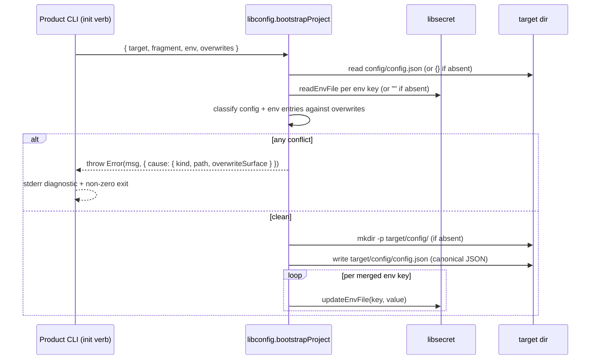

# Design 1000-c — Bootstrap writer in libconfig (no new library)

Alternative to [design-a](design-a.md) and [design-b](design-b.md). Design-a
introduces a new `@forwardimpact/libinit` library; design-b extends three
existing libraries with a generic plan/apply coordinator. **This design
extends exactly one existing library — libconfig — with a single
`bootstrapProject` entry that takes an explicit target directory and
delegates `.env` writes to `libsecret`.** No new library, no new error
class, no new env-writing surface; the writer never upward-walks, so
`fit-map init` cannot escape into an ancestor `config/`.

## Components

| Component | Home | Role |
|---|---|---|
| `bootstrapProject` | `libraries/libconfig/src/bootstrap.js` | Single entry. `{ target, fragment, env, overwrites } → void`; throws on refused write. Writes `config/config.json` at `target` and delegates `.env` writes to libsecret. |
| `mergeConfigFragment` | `libraries/libconfig/src/merge.js` | Pure classifier over `{ existing, fragment, overwrites }`. Same shape applies to the `.env` table over bare keys. |
| Refusal | `libraries/libconfig/src/errors.js` | `Error` whose message names the conflicting key and the overwrite-intent parameter; `cause` carries the structured fields. The product CLI's existing stderr-then-exit-non-zero behaviour renders it without per-CLI templating. |
| `fit-guide init` adapter | `products/guide/src/commands/init.js` | Materialises generated secrets before the bootstrap call so a re-run classifies them same-key-same-value; preserves first-run output and exit code. |
| `fit-map init` adapter | `products/map/src/commands/init.js` | Calls `bootstrapProject` with an empty fragment. Existing `data/pathway/` copy becomes idempotent so substrate stage can re-stage. |
| `fit-map substrate stage` adapter | `products/map/src/commands/substrate-stage.js` | Runs `runInit` as a new first phase before the existing Supabase-stack phases. Re-reads config after init so subsequent phases see the materialised `config.json`. |
| Workflow cleanup | `.github/workflows/kata-interview.yml` | Drops the `mkdir -p .../config` line in the Substrate stage step; Landmark gate preserved. |
| Onboarding contract | `libraries/libconfig/README.md` § *Bootstrap* | Names the entry point, the namespace-declaration step, the overwrite-intent parameter, and a one-line cross-link to libsecret's `.env` primitives. |

## Interface

```js
import { bootstrapProject } from "@forwardimpact/libconfig";

await bootstrapProject({
  target,                              // absolute path; defaults to process.cwd()
  fragment: {                          // top-level keys are product-owned namespaces; {} or omitted is allowed
    "product.guide": { systemPrompt: "…" },
    "service.mcp":   { systemPrompt: "…", tools: { … } },
  },
  env: {                               // .env entries; {} or omitted is allowed
    SERVICE_SECRET: "…",
    MCP_TOKEN:      "…",
  },
  overwrites: {
    config: ["product.guide"],         // top-level namespace names (single segment)
    env:    ["MCP_TOKEN"],             // bare keys
  },
});
```

`bootstrapProject` **always materialises `target/config/config.json`** (`{}`
when fragment is empty and the file is absent) — this is what satisfies the
spec's anchoring criterion for `fit-map init` without a `product.map`
starter fragment. `.env` is created only when at least one entry is
supplied; an empty `env` against an existing `.env` is a no-op regardless
of the file's contents.

## Data flow



Both classifications complete before any FS mutation, so a **refused write**
never leaves a half-written `config.json` on disk. Cross-file **FS
atomicity** (mid-loop crash after `config.json` is written) remains
spec-deferred — the existing `fit-guide init` property is preserved, not
tightened.

## Namespace ownership semantics

Ownership is enforced at the top-level key; diagnostics name the leaf that
disagrees. Each top-level key classifies:

| Pre-state | Fragment subtree | Result |
|---|---|---|
| absent | any | write subtree |
| present, deep-equal (canonical JSON) | same | no-op |
| present, **any leaf** disagrees | any | refuse, unless top-level key ∈ `overwrites.config` |

"Deep-equal canonical JSON" = sorted-key, no-whitespace string compare —
what makes A→B→A→B converge regardless of input order. On refusal the
diagnostic carries the disagreeing leaf path (e.g. `product.x.foo`) so the
spec's success-criterion test passes; the `overwrites.config` entry the
caller passes remains the **top-level key** (`product.x`). Forcing a single
leaf write forgives the entire top-level namespace by design — see
Decision #3.

For `.env`, the same three rows at bare-key granularity against
`overwrites.env`. Value comparison is byte-for-byte after `KEY=`.

## Reader/writer anchor invariant

The writer never upward-walks: it operates on `target` (default
`process.cwd()`). The reader continues to use libstorage's
`createStorage("config", …)` upward walk, which lands locally on the
writer's freshly-planted `config/` for any subsequent invocation. The
invariant a future reader refactor must preserve: **once `config/` exists
at the working directory, the reader resolves there.** Decision #4 captures
the trade-off against sharing resolution code with the reader.

## fit-map init ↔ fit-map substrate stage

The spec leaves the *which-invokes-which* arrangement open. This design
picks **substrate stage delegates to init**: substrate stage's first phase
calls `runInit` against its own target. Because `createProductConfig`
tolerates an absent `config.json` (the fallback path), the existing
module-top config load in `fit-map.js` is not blocked by an unbootstrapped
workspace; substrate stage re-reads config after its init phase so the
remaining Supabase-stack phases see the materialised state. The kata-interview
workflow keeps `bunx fit-map substrate stage` as its only substrate entry
point.

## Re-run semantics

The spec's re-run requirements drop out of the merge rules:

- **fit-guide init** — generated secrets are materialised via
  `libsecret.getOrGenerateSecret` *before* the bootstrap call, so a re-run
  classifies them same-key-same-value (no-op). First-run `formatSuccess`
  output and exit code are preserved; the pre-spec `"config/ already
  exists, skipping starter copy"` line is dropped.
- **fit-map init** — the pre-spec `./data/pathway/ already exists`
  non-zero exit becomes a no-op so substrate stage re-running against a
  bootstrapped workspace is byte-stable.

## Key decisions

| # | Decision | Rejected alternative | Reason |
|---|---|---|---|
| 1 | Bootstrap writer lives in **libconfig**. | (a) New library `@forwardimpact/libinit` (design-a). (b) Per-surface writers split across libconfig + libsecret (design-b). | The dominant complexity is namespace-ownership over `config.json` — that knowledge belongs alongside libconfig's existing `config.json` semantics. Env writes are a one-call delegation. `libraries/CLAUDE.md` mandates checking the catalog before adding a generic capability; libconfig's identity widens from "read-side config" to "config concerns" rather than splintering into a new library. |
| 2 | Single `bootstrapProject` entry. | Per-surface writers + coordinator (design-b). | The spec's "one callable interface" admits a coordinator reading, but a single entry makes refuse-before-mutate structural (one classification, one decision point) rather than caller-disciplined. Design-b's `runTwoPhase` ships a generic abstraction the spec doesn't ask for. |
| 3 | Top-level-namespace **ownership**; leaf-path **diagnostic**. | (a) Leaf-path ownership (design-a #5). (b) Top-level diagnostic. | Top-level ownership matches the spec's literal framing and how products think about their slice; the leaf-path diagnostic in the message and `cause.path` satisfies spec § *Failure surfacing*'s `product.x.foo` test. **Any** leaf disagreement under a top-level key triggers refusal at that top-level — the table in § *Namespace ownership semantics* is the canonical home. |
| 4 | Writer takes explicit `target` (defaults to `process.cwd()`); never upward-walks. | Share `findUpward` with the reader. | The reader's upward walk is precisely the failure spec § *Anchor escape* exists to fix; making the writer share it would re-introduce the escape on the init path. The invariant in § *Reader/writer anchor invariant* records what a future reader refactor must preserve. |
| 5 | Refusal is a plain `Error` with structured `cause`; the library composes the message. | (a) `ConflictError` class (design-a). (b) `WriterConflict` aggregate (design-b). | The message names the conflicting key and overwrite-intent parameter; `cause` carries the same fields structurally. Spec's "greppable for both" lands on stderr; structured `cause` is for callers wanting programmatic introspection. Extends the in-tree plain-`Error` pattern with Node's standard `cause` slot — no new exported class. |
| 6 | `.env` writes reuse `libsecret.updateEnvFile`; reads use `libsecret.readEnvFile`. | (a) New batch wrapper in libsecret (design-b). (b) New env writer inside libconfig. | `updateEnvFile` already preserves `0o600` + comment-rewrite + trailing-newline; `readEnvFile` is the corresponding read primitive. No new libsecret surface; per-key invocation matches the existing `fit-guide init` pattern. |
| 7 | Substrate stage runs `runInit` as a new first phase and re-reads config after init. | Workflow sequences `init` + `stage` as two subprocesses (design-b). | Bootstrap-shape parity becomes structural (one code path) rather than asserted (one CI test). Re-reading config is the architectural consequence of running init in-process after the verb's module-top config load. |
| 8 | `runInit` becomes idempotent on `data/pathway/`. | Keep the non-zero exit. | Spec § *Re-invoking* idempotency requires it; substrate stage re-running against a bootstrapped workspace requires it. |
| 9 | Always materialise `config/config.json`; never auto-create empty `.env`; empty-env on existing `.env` is a no-op. | Symmetric auto-creation. | The anchoring criterion needs `config/config.json` to exist; `.env` has no anchoring role. Auto-creating an empty `0o600` `.env` would surprise developers and mask absence on the read path. |
| 10 | Empty-string `.env` values written verbatim. | Skip empty values. | Spec § *Read-side coherence with spec 0990* preserves spec 0990's empty-string-equals-absent rule for credential keys on the *read* path; the writer's job is bytes for any key. No write-side filtering. |
| 11 | Onboarding docs in `libraries/libconfig/README.md` § *Bootstrap* with a one-sentence cross-link to libsecret env primitives. | (a) New `libinit/README.md` (design-a). (b) Three sections across three READMEs (design-b). | Spec § *New-product onboarding* mandates "the shared library's README." The orchestrator lives in libconfig, so libconfig is the shared library; a single cross-link is not the fan-out design-b incurs. |
| 12 | libconfig adds a direct `@forwardimpact/libsecret` dependency. | Have product CLIs call libsecret directly after libconfig's merge. | Refuse-before-mutate requires the orchestrator to own both surfaces. Layering: libconfig → libstorage → libsecret already exists transitively but doesn't re-export the env primitives, so a direct edge is needed; no cycle, since libsecret has no libconfig dep. |

## Coherence with spec 0990

- **`mkdir -p` workaround** — removed. The Landmark gate on the Substrate
  stage step is preserved; only the `mkdir` line goes.
- **Credential-override read order** — unchanged. The writer produces
  bytes only; libconfig's reader still resolves shell env > `.env` >
  defaults. Empty-string writes to `.env` produce `KEY=` on disk; the
  credential-override loop independently treats shell-empty-string as
  absent.

## Verification surfaces

| Success criterion | Surface |
|---|---|
| Two-namespace merge, idempotent re-invoke, A→B→A→B convergence, refuse + leaf-path diagnostic | libconfig unit tests |
| `.env` ownership + `0o600` mode | libconfig unit tests |
| Stderr diagnostic carries both conflicting key and overwrite-intent parameter | libconfig CLI-integration test (greps stderr for both substrings) |
| `fit-map init` anchors locally even when an ancestor `config/` exists | fit-map product test |
| Workflow runs end-to-end without in-workflow `mkdir`; Landmark interview prep preserved (substrate roster non-empty, substrate issue writes `.env` + `.substrate.json`, `resolveIdentity()` succeeds, Landmark self-smoke green) | kata-interview CI on the implementation branch + workflow source grep |
| Bootstrap-shape parity (`fit-map init` vs substrate stage) | fit-map product test (both call `runInit`) |
| `fit-guide init` first-run + re-run preservation | fit-guide product test + existing suite |
| README documents onboarding contract | libconfig README test |
| Existing in-tree tests stay green | `bun run test` on the implementation branch |

## Out of scope (deferred to plan or follow-ups)

- File-level changes inside the three adapters — plan scope.
- Cross-file atomicity between `config.json` and `.env` — deferred per spec.
- Schema validation of the merged `config.json` — deferred per spec.
- Secret rotation as a separate verb — deferred per spec.
