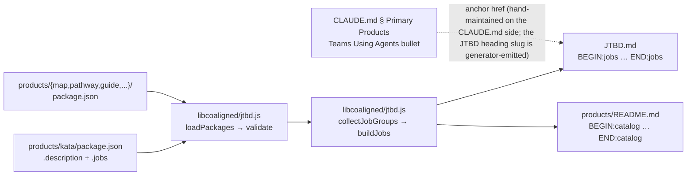

# Design 1010 — Teams Using Agents persona, canonical JTBD entry

## Overview

The spec is a four-surface integrity contract: vision narrative (CLAUDE.md),
generator pipeline (libcoaligned), generated document (JTBD.md), and the
upstream source the generator reads. Today only three surfaces exist; the
upstream source is missing, the generator's persona allowlist excludes Teams
Using Agents, and the generated document carries no block for the persona.

This design adds the fourth surface (`products/kata/package.json` as a
metadata-only product) and extends the existing generator allowlist by one
literal. No new code path: the generator already loops over
`products/*/package.json .jobs`; adding a directory feeds the same pipeline.

## Components

| Component                                    | Role                                                                                | Change kind  |
| -------------------------------------------- | ----------------------------------------------------------------------------------- | ------------ |
| `products/kata/package.json`                 | Authoritative source for the Teams Using Agents `<job>` block. `.jobs[0]` carries the Big Hire; `.description` feeds the catalog row. `"private": true` so `npm publish` skips it (the catalog generator is not gated on `private` and still consumes the file). | **new file** |
| `products/kata/README.md`                    | Bare body — no `# heading` and no `BEGIN:description` marker — so `buildDescription` neither injects nor regenerates a managed block. One disclaimer sentence: "Metadata-only — Kata ships as a skill pack under `.claude/skills/kata-*/` per CLAUDE.md § Distribution Model." | **new file** |
| `libraries/libcoaligned/src/jtbd.js` `VALID_USERS` | String literal allowlist; one entry added: `"Teams Using Agents"`.              | **edit**     |
| `JTBD.md`                                    | Regenerated `<!-- BEGIN:jobs --> … <!-- END:jobs -->` body now contains a `<job user="Teams Using Agents">` block emitted from `products/kata/package.json .jobs`. | **regenerated** |
| `products/README.md` catalog table           | One row appended for `kata`. Spec § Scope does not name `products/README.md` explicitly, but the regeneration is the forced mechanical consequence of choosing Option A — the generator iterates every `products/*/package.json` with a `.description` (see D6). Spec § Out of scope does not exclude it. | **regenerated** |
| `products/CLAUDE.md` § `package.json` metadata | One-sentence note that a `products/<name>/` may carry `"private": true` with `description` + `jobs` only, when the product ships outside the `npx fit-<name>` channel (e.g., Kata's skill-pack distribution). Resolves the contradiction with `products/CLAUDE.md` § Audience that would otherwise be created by the new directory. | **edit**     |
| `CLAUDE.md` § Primary Products — Teams Using Agents bullet | Inline Big Hire prose replaced by single markdown link to the JTBD anchor. Other persona bullets untouched (out of scope). | **edit**     |
| `libraries/libcoaligned/test/jtbd.test.js`   | New cases: (a) persona admitted when in allowlist; (b) persona rejected when absent (regression); (c) Kata-fixture render satisfies criterion 1 substrings (`autonomous`, plan/ship/stud/act, trailing `→ **Kata**`); (d) idempotency — two consecutive `checkJtbd({fix:true})` runs leave the working tree clean (criterion 3). | **edit**     |

## Data flow



Validation short-circuits the regeneration (`processJtbdMd` lines 396–400):
errors found by `validate` block both `J` and `R` outputs, so the new
allowlist entry is the precondition for any block to render.

## Key Decisions

| # | Decision | Rejected alternative | Why |
| - | -------- | -------------------- | --- |
| D1 | Authoritative source is a new `products/kata/package.json` (metadata-only) — spec § Strategic decision Option A. | Spec Option B alternatives: (b1) new `data/jtbd/kata.yml`; (b2) structured frontmatter in `KATA.md`; (b3) aggregate from `.claude/skills/kata-*/SKILL.md` frontmatter. | (b1) introduces a parallel source pattern the generator must learn; the existing pipeline already iterates products/. (b2) forces the generator to parse markdown for one persona only — every future persona faces the same one-off. (b3) Big Hire belongs to one persona, not fifteen skills; aggregating would re-implement collectJobGroups. Option A reuses a single pipeline. |
| D2 | `VALID_USERS` stays a hardcoded literal allowlist; one entry added. | Derive `VALID_USERS` dynamically from discovered jobs. | Dynamic derivation would silently accept typos as new personas. The allowlist is the schema; schema changes should be explicit edits with grep-visible diff. |
| D3 | `products/kata/` carries `package.json` + bare `README.md` only — no `bin/`, `src/`, `test/`. Adds a one-sentence carve-out to `products/CLAUDE.md` so the metadata-only shape is permitted by policy. | Full product skeleton with stubs. | CLAUDE.md § Distribution Model preserves "Kata ships as a skill pack" on purpose. Stubs would lie about what's published; metadata-only matches truth. The `products/CLAUDE.md` edit is the smallest change that removes the policy-vs-fact contradiction without rewriting the distribution model. |
| D4 | One job initially: the full PDSA loop framed as a single Big Hire. Job content adopts the spec § Candidate job structure illustrative draft verbatim (including the four `forces` strings); a later spec may split into two jobs once a distinct Study-Act hire surfaces. | Two jobs at first landing (Plan-Do + Study-Act). | Spec's binding floor is one job; the Big Hire already names all four PDSA verbs ("plans, ships, studies its own traces, and acts on findings"). Splitting now would force a Study-Act little-hire whose product target is still Kata — adding a row without adding distinction. Adopting the spec's illustrative draft verbatim makes the design's commitment unambiguous; a later wording refinement is a separate spec change. |
| D5 | `CLAUDE.md` change is a one-bullet edit, not a § Primary Products refactor. | Convert all four primary-product persona bullets to JTBD links for symmetry. | Out of scope per spec § Out of scope (other personas' bullets). Future spec can harmonize; this design ships the minimum that satisfies the contract. |
| D6 | Catalog row for `kata` in `products/README.md` is allowed to render (not filtered out). | Filter `kata` from `loadPackages` so it doesn't enter the products catalog. | Filtering would add a second code path. `products/README.md`'s catalog is a description list; a row for `kata` is correct — CLAUDE.md § Primary Products already names Kata as a top-level product. Spec § Out of scope does not exclude the catalog; consistency wins. |

## Interface contracts

### `products/kata/package.json` shape

```jsonc
{
  "name": "@forwardimpact/kata",
  "private": true,
  "description": "Run an autonomous, continuously improving development team via a daily Plan-Do-Study-Act loop, shipped as a skill pack under .claude/skills/kata-*/.",
  "jobs": [
    {
      "user": "Teams Using Agents",
      "goal": "Run a Continuously Improving Agent Team",
      "trigger": "Agents are shipping work but nobody can tell whether the team is getting better — the only feedback loop is reading every diff.",
      "bigHire": "run an autonomous, continuously improving development team that plans, ships, studies its own traces, and acts on findings.",
      "littleHire": "onboard a Kata installation that runs the Plan-Do-Study-Act loop without per-team prompt engineering.",
      "competesWith": "bespoke per-agent system prompts; manual orchestration scripts; not measuring agent outcomes; abandoning agent investment after a failed pilot",
      "forces": {
        "push": "Agent regressions are silent until users complain.",
        "pull": "A closed loop that surfaces what improved and what regressed, grounded in evidence.",
        "habit": "Treating each agent run as a one-off rather than an iteration.",
        "anxiety": "Autonomy might amplify bad patterns faster than humans can intervene."
      },
      "firedWhen": "the autonomous loop becomes harder to operate than direct prompting; or organizational policy bans autonomous agent execution."
    }
  ]
}
```

Field values follow the validation rules already enforced by `validateEntry`:
trigger / competesWith strings; bigHire / littleHire end with `"."`.

### Rendering pipeline (mechanism, not flag)

`mergeHireField` in `jtbd.js` always prefixes `"Help me "` to the joined hire
prose and always appends `→ **<product names>**` to the end. The
`capitalize: true` flag (set inside `processJtbdMd`) capitalizes the **product
name** (`kata` → `Kata`); it does not affect the hire body. Together this
yields:

```
**Big Hire:** Help me run an autonomous, continuously improving development team that plans, ships, studies its own traces, and acts on findings. → **Kata**
```

which satisfies spec criterion 1: contains `autonomous`; contains all four of
`plan`, `ship`, `stud`, `act` as substrings; ends with the literal `→ **Kata**`.

### Generator allowlist diff (libcoaligned/src/jtbd.js)

```js
const VALID_USERS = [
  "Engineering Leaders",
  "Empowered Engineers",
  "Platform Builders",
  "Teams Using Agents",      // new — USER_ORDER index 3, renders last
];
```

`USER_ORDER` derives sort index from array position. Teams Using Agents
takes index 3, which is strictly greater than Platform Builders' index 2,
so the new `<job>` blocks render after the existing Platform Builders section.

### CLAUDE.md bullet shape (satisfies spec criterion 4)

```md
- **Teams Using Agents** —
  [Run a continuously improving agent team](JTBD.md#teams-using-agents-run-a-continuously-improving-agent-team).
```

Anchor is the GitHub-flavored slug of `## Teams Using Agents: Run a
Continuously Improving Agent Team`. Exactly one markdown link; trailing period
is sentence punctuation, not a sentence-form clause. Neither "autonomous" nor
"Plan-Do-Study-Act" appears outside the link target.

## Risks

| Risk | Mitigation |
| ---- | ---------- |
| `products/kata/` looks like a real product to a future contributor who tries to add `bin/` or `src/`. | The README disclaimer + the one-sentence carve-out in `products/CLAUDE.md` (D3) name the metadata-only shape explicitly; the directory carries no `bin/` or `src/` to be loaded by anything. |
| Future persona additions repeat the same allowlist + synthetic-product pattern. | Acceptable. One additional persona has landed in two years; the cost of the literal edit is below the cost of dynamic-allowlist machinery. Revisit if a third synthetic product appears. |
| `@forwardimpact/kata` namespace collides with published `kata-*` skill-pack tooling. | The name `@forwardimpact/kata` is in the scoped `@forwardimpact/` namespace; `kata-*` packs publish under unscoped names (per CLAUDE.md § Distribution Model). `"private": true` prevents accidental publish either way. |

## Out of scope (re-affirmed)

This design does not touch `KATA.md` prose, the `### Kata — kata-skills`
product subsection in CLAUDE.md, the other persona bullets in § Primary
Products, or merged specs 0860/0880/1060. See spec § Out of scope.

— Staff Engineer 🛠️
