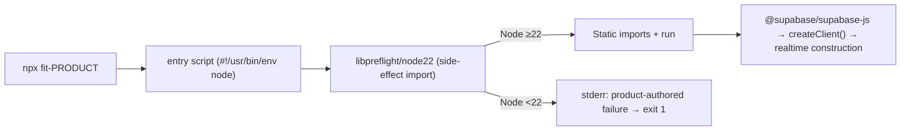

# Design 1020-a — Node.js runtime floor alignment

Architecture for [spec 1020](./spec.md). Spec sets the WHAT (Node 22 floor at
every doc, manifest, and CLI surface) and rejects three alternatives. Design
resolves WHICH components carry the floor, WHERE the preflight intercepts the
unsupported-Node invocation, and the interface contract between them.

## Architecture



Three surface families carry the floor; one invariant script (chained into the existing `bun run invariants` umbrella) triangulates them in CI.

| Surface family | Authoritative file(s) | Count |
|---|---|---|
| Doc claim | every page under `websites/fit/docs/getting-started/{leaders,engineers}/**/index.md` that names a Node version | 10 pages today (the predicate is "names a Node version," not a static list — assertion (c) below enforces both directions) |
| Manifest claim | every `package.json` carrying `engines.node` (workspace root + every library + every product + every service) | 49 files today; 50 after libpreflight is added — assertion (a) below is discovery-based and scans whichever count is current at test time |
| Runtime claim | `@forwardimpact/libpreflight/node22` (new) imported as first import of every published CLI entry script | 35 entry scripts today (6 `products/*/bin/*.js` + 23 `libraries/*/bin/*.js` + 6 `services/*/server.js` — the services entries are published as `fit-svc{graph,map,mcp,pathway,trace,vector}` per each `services/*/package.json#bin`). Discovery rule for assertion (b): "every file targeted by a published `package.json#bin` field," so new bins added in the future fall under the check automatically |

## Components

| Component | Role | Surface |
|---|---|---|
| `@forwardimpact/libpreflight` (new, `libraries/libpreflight/`) | Pure-JS, zero-dep module exposing a side-effect entry per Node floor and a parameterised checker for unit tests. | npm-published package |
| `libpreflight/src/check.js` | Exported `check(requiredMajor, processObj=process)` reads `processObj.versions.node`, writes a product-authored failure to `processObj.stderr` and calls `processObj.exit(1)` when the detected major is below `requiredMajor`. Pure function, testable with a mock process. | library internal |
| `libpreflight/src/node22.js` (only `node22` for now; future floors add `node24.js`, `node26.js`, etc. as needed by a future spec) | Side-effect module: `import { check } from "./check.js"; check(22);`. One file per supported floor. | subpath export `./node22` |
| Updated entry scripts (35 files: 29 `bin/*.js` plus 6 `services/*/server.js`) | First import statement is `import "@forwardimpact/libpreflight/node22"`. Shebang is `#!/usr/bin/env node` for all 35 (Decision 6 normalises `products/outpost/bin/fit-outpost.js`); existing static imports follow unchanged below the preflight import. | published CLIs |
| `scripts/check-node-floor.mjs` (new) — invoked via the new `invariants:check-node-floor` package script, chained into the existing `invariants` umbrella alongside `invariants:check-workspace-imports` and `invariants:check-libharness` | One script with four assertions: (a) every `package.json#engines.node` lower bound resolves to a Node major `≥ 22`, found by globbing `**/package.json` (excluding `node_modules`) and parsing the leading integer of the lower bound — accepts `>=22`, `>=22.0.0`, `^22`, `22.x`; rejects `>=20`, `>=18.0.0`; the parser is a 5-line regex helper inside the script, no new dependency; (b) every file targeted by any `package.json#bin` field includes `import "@forwardimpact/libpreflight/nodeNN"` as its first import statement, with `NN` matching its own `package.json#engines.node` lower-bound major — discovery-based so new bins land under the check automatically; (c) every `getting-started/{leaders,engineers}/**/index.md` page that names "Node.js" names `Node.js 22+` and no other Node version — checked in both directions so neither drift (`18+` lingering) nor omission (a new page added without the marker) escapes; (d) the floor literal at one doc page, one manifest, and the `check.js` body agree — single-source comparison per the spec's wording. The script exits non-zero with a per-assertion failure message; matches the shape of the two existing `scripts/check-*.mjs` invariant checks. | CI (runs via `bun run invariants` in `check-quality.yml`'s `invariants` job, alongside the existing two invariant checks) |
| Updated getting-started pages (10 files) | Replace `Node.js 18+` with `Node.js 22+` in place. | doc surface |

## Interfaces

**Library export contract.**

```json
{ "name": "@forwardimpact/libpreflight",
  "exports": { "./node22": "./src/node22.js", "./check.js": "./src/check.js" } }
```

Subpath-exports keep the side-effect entry per-floor and the testable helper
separately importable. No default export — the package has no useful surface
beyond the two named subpaths.

**Bin invocation contract.** The first import in every published entry script
is the side-effect import. ESM evaluation is post-order over the module graph;
because libpreflight has zero production dependencies, its `check(22)` body
runs before any sibling import's body evaluates. If `libpreflight/node22`
calls `process.exit(1)`, no subsequent import — including
`@supabase/supabase-js` — evaluates, and no `createClient()` call (the actual
trigger of the upstream realtime construction; the supabase package entry
itself does not construct a realtime client at module-evaluation time) ever
runs. The zero-dep property is load-bearing: if a future change adds any
production dependency to libpreflight, the assertion (b) test should be
extended to fail on the addition until the evaluation-order argument is
re-validated. The reason this design prefers the side-effect import over the simpler
"inline check at top of bin file" is **drift control plus defence-in-depth**:
inline duplicates a floor literal across 35 entry scripts (each diverging
risk caught only by assertion (b)), and a future upstream package that *does*
construct at module-evaluation time would defeat the inline-at-top pattern but
not the side-effect import. The libpreflight package has no production
dependencies, so the import cost is parsing one short module.

**Failure message contract.** `check.js` writes exactly two lines to
`processObj.stderr` then calls `processObj.exit(1)`:

```
Error: This command requires Node.js {N} or later (running {process.versions.node}).
Install Node.js {N} (LTS) from https://nodejs.org/ and re-run.
```

`{N}` is the major-version integer passed to `check(N)` (e.g. `22`).
`{process.versions.node}` is the full `major.minor.patch` string Node exposes
(e.g. `20.11.0`) — the spec's "detected Node version" criterion is satisfied
by the full triple, not the major alone. The text contains neither upstream
realtime string. Format is human-readable; machine parsing is out of scope.

## Data flow

1. User runs `npx fit-landmark people push` on Node 20.
2. npm spawns `node bin/fit-landmark.js`; npm has already emitted `EBADENGINE`
   if the manifest's `engines.node` was unmet (npm-side, not in our control).
3. Node parses `bin/fit-landmark.js`. ESM linking parses every static import.
4. ESM evaluation begins. First static import is `libpreflight/node22` →
   `check(22)` runs → detects major=20 < 22 → writes failure → exits 1.
5. `@supabase/supabase-js`, the rest of landmark's graph, and the upstream
   realtime construction never evaluate. The user sees the product-authored
   failure, not `Node.js 20 detected without native WebSocket support.`

Under Node ≥22 the side-effect import returns silently; the bin continues as
today.

## Key decisions

| # | Decision | Rejected alternative & why |
|---|---|---|
| 1 | **Side-effect import from a tiny published package** (`libpreflight/node22`). | _Inline check at top of each bin file._ Works today for the supabase case (supabase's realtime construction happens at `createClient()` call time, not at module evaluation — verified against the spec § Problem text), but loses on two grounds: (a) drift — the floor literal duplicates across 35 entry scripts and only assertion (b) catches divergence; (b) defence-in-depth — a future upstream package that does construct at module-evaluation time would defeat the inline pattern. _Workspace-internal (unpublished) helper module._ Cannot be `import`ed from a published bin without being itself published, because every consumer is a separate npm package that resolves `import` paths through its own `node_modules`. _Install-time hook (`preinstall` script)._ Bypassed by `npm install --ignore-scripts`; not run by `npx`. _Global `engine-strict`._ User-side config, not author-side. |
| 2 | **One floor literal per side-effect entry path** (`/node22`, `/node24`, …) instead of a runtime parameter. | _Single `/check` subpath called from each bin._ Loses the side-effect property — bin would have to call `check(22)` after the import, which (per Decision 1) means after hoisted imports. Per-path keeps the floor encoded in the subpath the bin imports; the bin's `engines.node` and its import path stay coupled, and the CI test in Decision 5 verifies they match. |
| 3 | **Single workspace-wide floor — every `engines.node` declares `>=22.0.0`** with no per-package exemption. | _Library-package exemptions (lower floor for pure libraries with no Supabase reach)._ The spec § Out of scope defers this. A uniform floor is easier to verify (one regex) than a per-package matrix; matches the workspace template that propagates today; and the cost of holding pure libraries at the same floor as products is "users on Node 20 cannot consume our pure libraries either," which matches user expectations of the workspace as a single product family. |
| 4 | **Hand-update the 10 doc pages plus a CI agreement test**, no shared partial. | _Spec-790 content partial `partials/node-floor.md` included by each page._ Adds 10 include points to remove one literal; the CI test in Decision 5 catches drift at lower cost. The partial route remains available for a future spec if any doc page drifts more than once. |
| 5 | **One invariants script (`scripts/check-node-floor.mjs`) holds four assertions** wired into the existing `bun run invariants` umbrella as `invariants:check-node-floor`. Scans the workspace by discovery (glob `**/package.json#bin`, glob `**/package.json#engines.node`, glob the doc pages) so future bins/packages/pages land under the check automatically. | _Standalone `tests/check-node-floor.test.js` outside the invariants umbrella._ The four assertions are pure repo-state invariants (manifest values, file contents, literal agreement) — same shape as `check-workspace-imports.mjs` and `check-libharness.mjs`, which already live under `bun run invariants`. Keeping the floor check in the same place matches the existing convention, runs in the same `check-quality.yml#invariants` job, and lets `bun run invariants` stay the single command for repo-shape checks. Bundling all four assertions in one script makes the agreement check the script's headline and keeps the doc/manifest scans next to it; splitting into three independent scripts would fight the spec § Success Criteria phrasing ("a single-source comparison"). |
| 6 | **Normalise `products/outpost/bin/fit-outpost.js` from `#!/usr/bin/env bun` to `#!/usr/bin/env node`** as part of this change. | _Leave the bun shebang and skip the preflight for outpost._ outpost's `src/` imports only `node:*` builtins and `@forwardimpact/*` libraries — no `Bun.*` calls verified by `rg 'Bun\.' products/outpost/src/`. The bun shebang is a latent inconsistency that would cause `npx fit-outpost` to fail when bun is not on the user's PATH. Normalising it brings outpost under the preflight contract and resolves the latent issue in the same pass. _Defer the shebang change to a separate spec._ Splits one rationale (uniform Node-floor contract across all published CLIs) across two PRs; cheaper to do together. |
| 7 | **No CI workflow `node-version` matrix edits.** All six workflow files that name a `node-version` already pin `22` (verified `rg 'node-version' .github/workflows/`); no `18`/`20` job exists to drop. The new `check-node-floor` invariant script (Decision 5) becomes the spec's "CI verifies the floor" gate, running via `bun run invariants` in `check-quality.yml`'s `invariants` job alongside the existing two invariant checks. Concretely: a regression that drops a manifest's `engines.node` below the floor fails assertion (a); a new entry script that omits the preflight import fails assertion (b); a doc page that drifts fails assertion (c); a divergence between the three surfaces fails assertion (d). | _Add a Node-18 job that runs each entry script and greps for the product-authored failure._ Costs a runner per CI run for a check the unit test against `check.js` already covers with a mock process. The triangulation check (Decision 5) catches drift between the runtime failure message and the doc/manifest claim without a second matrix axis. |
| 8 | **No change to `@supabase/*`, `@grpc/*`, or other upstream package floors in this design.** | _Bump upstreams in the same pass._ Spec § Out of scope explicitly defers. Keeps the diff scoped to the Node-floor question; an unrelated upstream bump in the same PR would obscure regressions. |

**libpreflight bootstrap note (design constraint, not a decision).** The new
`libraries/libpreflight/package.json` itself declares `engines.node` at
`>=22.0.0` like every other manifest. This is internally consistent: the only
reason to import libpreflight is to enforce a `>=22` floor in a downstream
consumer, so libpreflight's own floor can never sit below its lowest
consumer's floor. No special treatment.

## Out of scope (deferred to plan / future spec)

- The exact sequencing of the 49 manifest edits, the 10 doc edits, the 35
  entry-script edits, and the new `libraries/libpreflight/` package — plan
  scope (HOW/WHEN).
- Whether `engines.npm` is also asserted alongside `engines.node` — not raised
  by the spec; design does not constrain.
- Whether the contributors getting-started page (which advertises Bun, not
  Node) gains a parallel Bun-floor preflight — explicitly out of spec scope.
- The Node-floor decision for composite-action `using:` fields — spec 1040
  ([spec.md](../1040-composite-action-node-runtime-alignment/spec.md)) covers
  this and inherits the Node 22 line chosen here.

— Staff Engineer 🛠️
