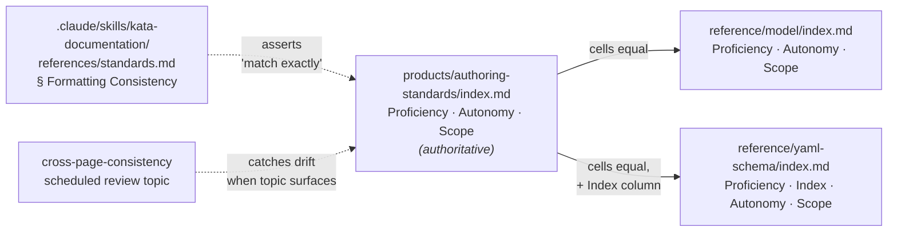

# Design 1030 — Proficiency Table Reference Resolution

## Problem recap

Three proficiency tables across the FIT docs site use incompatible column
shapes — `Proficiency · Autonomy · Scope` (canonical),
`Proficiency · Description` (`reference/model/`), and
`Proficiency · Index · Description` (`reference/yaml-schema/`) — with
divergent cell vocabulary ("Learning fundamentals…" vs canonical
"with guidance / team"). Documentation standards
(`.claude/skills/kata-documentation/references/standards.md` §
Formatting Consistency) say the canonical proficiency table is authoritative
and copies must match exactly. PR #858 resolved the same class of drift for
the Behaviour Maturity table by cell-level rewrite. The proficiency table is
the structural outlier left over from that pass and now requires a
restructure-or-summarise decision before any cell-level edit is meaningful.

## Approach

**Option A — Restructure reference tables to the canonical column shape.**
Both reference pages adopt `Proficiency · Autonomy · Scope`. The
`reference/yaml-schema/` page retains its `Index` column as an extra column
(`Proficiency · Index · Autonomy · Scope`), so YAML-schema readers still see
the 0..4 ordering inline.

## Components

| Component | Role | Change |
|---|---|---|
| `products/authoring-standards/index.md` proficiency table (canonical) | Authoritative cell set | none — already correct |
| `reference/model/index.md` proficiency table | Reference copy (lookup tier) | columns become `Proficiency · Autonomy · Scope`; cells equal canonical |
| `reference/yaml-schema/index.md` proficiency table | Reference copy + index reference | columns become `Proficiency · Index · Autonomy · Scope`; Index unchanged, Autonomy/Scope cells equal canonical |
| Mermaid ordering flowchart on `reference/model/` | Visual `awareness → … → expert` chain | none — orthogonal to the table |
| `kata-documentation/references/standards.md` § Formatting Consistency | Drift-control rule (already names this exact case) | none — text already mandates exact-match |
| `cross-page-consistency` documentation review topic | Drift detection (one topic per scheduled run, oldest-first per `kata-documentation/SKILL.md` § Scheduled Review) | none — clearance event is removal of the proficiency-table blocker row from `wiki/technical-writer.md` after the next time this topic is the picked one |

## Data flow

The canonical proficiency cell set — five rows × `(autonomy phrase, scope
phrase)` — is the source. Reference pages duplicate that cell set; the
yaml-schema page additionally exposes the `Index` value. Drift is detected by
the documentation-review skill on its scheduled cadence rather than at build
time (see Decision 3).

## Key decisions

| # | Decision | Chosen | Rejected | Why |
|---|---|---|---|---|
| 1 | Resolution shape | A — Restructure to canonical | B — Replace tables with link to canonical; C — Signposted summary (keep `Description` shape, rewrite cells with autonomy/scope vocab) | B: reference pages lose self-containment for offline / agent-fetch consumers; PR #858 precedent is "align cells in place, do not redirect". C: lossy — canonical's two orthogonal dimensions cannot be re-expressed in one prose cell without information loss, and cells remain not-mechanically-equal to canonical so drift recurs. |
| 2 | `yaml-schema` Index column | Keep inline as a 4th column | Replace the proficiency table entirely with a link to canonical and host `Index` ordering as a separate inline list; Split inline into two adjacent tables (proficiency + Index) | Link-replacement is Decision 1's rejected B by another route — same self-containment loss. Two adjacent tables are worse for readers consulting the YAML schema page, who want one place to verify both Index and meaning. |
| 3 | Drift control | Existing standards.md rule + `cross-page-consistency` review topic on its scheduled-run cadence | New libdoc build-time table-equality check | Spec § Out of scope confines change to two reference pages. Success Criterion 5 names the review run (not a build-time check) as the verification; no new code warranted at this scope. |
| 4 | Mermaid ordering flowchart on `reference/model/` | Retain unchanged | Remove (information now in table) | Diagram and table express orthogonal facts: ordering vs autonomy/scope dimensions. Both stay; together they preserve the at-a-glance scan that the previous one-column table provided. |
| 5 | Behaviour Maturity tables on the same pages | Out of scope (PR #858 in flight) | Bundle restructure in same change | Canonical Behaviour Maturity table is already single-column `Description`, so reference copies are structurally aligned — only PR #858's cell-level work is required. Spec § Out of scope defers. |

## Interfaces

No code-level interfaces change. The contract is **column-and-cell equality
between canonical and reference tables**, enforced by the standards rule and
the review cadence.

| Contract | Producer | Consumers |
|---|---|---|
| Proficiency cell set (5 rows × `{autonomy, scope}`) | `products/authoring-standards/index.md` proficiency table | `reference/model/index.md`, `reference/yaml-schema/index.md` |
| Index ordering (0..4) | `reference/yaml-schema/index.md` (inline) | YAML-schema readers; downstream `products/map/starter/levels.yaml` consumers |

## Risks

| Risk | Mitigation |
|---|---|
| Future canonical edit not propagated to reference copies | Same risk class as Behaviour Maturity (PR #858); covered by the standards rule and the existing cross-page-consistency review cadence — no new mechanism warranted at this scope. |
| Reference page becomes denser, dulling "lookup" intent | The 3-column canonical shape carries short cells (5 rows, ≤4 words each); reading-load delta is small. The Mermaid ordering diagram on `reference/model/` keeps the at-a-glance scan intact. |
| yaml-schema 4-column table widens beyond reasonable rendering | Cells are short ("with guidance", "team", "0", "awareness"); rendered width comparable to the current 3-column `Description` shape. |

## Out of design scope (handed to plan)

- Column-header capitalisation, yaml-schema column ordering, and pipe-table
  alignment characters.
- File-edit ordering and commit grain.

Verification mechanics (`bunx fit-doc build` and the `grep` round-trips) are
already bound by spec § Success Criteria and need not be reopened.
