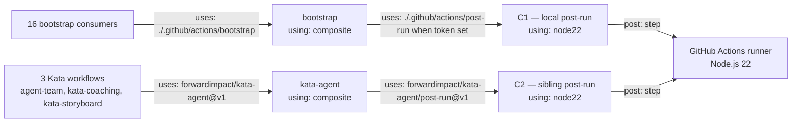

# Design 1040 — Composite-action Node runtime alignment

Architecture for [spec 1040](spec.md): bring the two `post-run/action.yml`
files the monorepo controls (local in-tree + sibling `kata-agent@v1`) onto
`using: node22`, in coherence with [spec 1020](../1020-node-runtime-floor-alignment/spec.md)'s
product-CLI floor, and remove the contradictory `node20` description in
`.github/CLAUDE.md`.

## Components

The architecture is three manifest-level edits coordinated across two
repositories. No new components, no new code paths.

| # | Component | Repository | Role |
|---|---|---|---|
| C1 | `.github/actions/post-run/action.yml` | this monorepo | Local composite action; `using:` field declares the Node runtime the `post:` step executes under |
| C2 | `forwardimpact/kata-agent/post-run/action.yml` at tag `v1` | sibling repo | Mirror composite action consumed by Kata-loop workflows; same `using:` semantics |
| C3 | `.github/CLAUDE.md` § Local composite actions, `post-run` row | this monorepo | Documentation that names the runtime alongside C1 — must agree with C1's declared value |

The two `index.mjs` / `post.mjs` files under each `post-run/` are out of
scope architecturally: they use only `fs.appendFileSync` and
`child_process.execSync` (verified against both copies at the named refs)
— APIs stable from Node 18 onward, so the runtime line change is a pure
manifest edit with no source-code coupling.

## Data flow

The post-merge steady state declares `node22` on both manifests. The three
sibling-path consumers are enumerated because the design's verification step
names one of them (`agent-team.yml`) as the cron representative — the local
side reaches a count, not a list, because the verification step names the
representative by workflow path, not by consumer enumeration.

## Key Decisions

| # | Decision | Rejected alternative |
|---|---|---|
| 1 | Runtime literal is **`node22`** | `node24` — not yet named in the deprecation warning text spec § Strategic decision pins to; would diverge from spec 1020's chosen line. `node20` — the value being retired. |
| 2 | Local-path edit lands first via PR; sibling force-tag follows after local merge | Sibling-first — sibling force-tag is direct push with no PR review surface, so it has no discrete checkpoint where CI exercises the new `using:` value before propagation. Local-first gives the PR's `check-quality.yml` run a chance to surface a manifest-rejection error before either path moves. |
| 3 | Sibling rollout is a force-tag move of `v1`, per `.github/CLAUDE.md § Editing a published action` | Cutting `v2` on the sibling and bumping every consumer workflow — three workflow files would change in step with the sibling edit, expanding scope beyond what spec § In scope authorises. |
| 4 | `.github/CLAUDE.md` doc edit ships in the same PR as C1 | Separate doc PR — would leave doc and code disagreeing about the runtime literal during the gap between the two merges; spec § Success criteria row 4 (no `node20` mention in `.github/CLAUDE.md`) would be transiently false on `main`. |
| 5 | Verification observes the next scheduled run of one workflow on each path: `check-quality.yml` (local) and `agent-team.yml` (sibling) | Synthetic `workflow_dispatch` runs — dispatch-only runs are not equivalent to the natural cron path, and `agent-team.yml` cron is the trigger spec § Why now cites as the warning-emission cadence to clear. |
| 6 | Rollback for C1 is a forward revert PR; rollback for C2 is a force-tag move of `v1` back to the pre-change SHA captured at staging time | Carrying a long-lived `v1-pre-1040` lightweight tag as a rollback handle — adds a second mutable tag the sibling has to maintain, when the same recovery is available from `git rev-list` history; the SHA-capture step at staging time gives the implementer an explicit handle that lives in the PR body. |

## Architectural sequencing

The two surfaces unavoidably move at different cadences (PR + force-tag).
The design treats the transient as a first-class state, not an error:

1. **t₀ — steady state, pre-change.** Both C1 and C2 declare `using: node20`. `.github/CLAUDE.md` describes the local action as `node20`.
2. **t₁ — C1 + C3 land on `main` (one PR).** Local path runs under `node22`. Sibling path still on `node20`. Spec § Success criteria rows 1, 4 hold; rows 2, 3, 5 transiently false.
3. **t₂ — sibling force-tag completes.** Both paths on `node22`. All success criteria hold once one scheduled run on each path lands without the deprecation banner.

The window `(t₁, t₂)` is bounded at **7 days** by spec § Rollout-window
note. The design does not introduce a feature flag, runtime detection, or
any cross-surface coordination primitive — the two surfaces are
independent and the transient is acceptable.

The pre-change SHA the rollback in Decision 6 names is captured at the
moment the sibling edit is staged (before `git push origin v1 --force`),
not at design-authoring time, because other sibling commits may land
between design and implementation.

## Out of scope (architecturally)

These surfaces look adjacent but architectures do not extend to them:

- **Bootstrap action** — `.github/actions/bootstrap/action.yml` declares `using: composite`, not `using: node*`. No runtime field to change.
- **Audit / coaligned-check local actions** — `using: composite` (verified). No runtime field.
- **Sibling `fit-eval`, `fit-benchmark`** — both `using: composite` at their `main` HEAD (spec § What is not the problem). Bringing them into the diagram would falsely imply a runtime line to align.
- **`setup-node@v6.4.0` node-version values** — already `22` across the six workflows that pin one; orthogonal to the `using:` field. Bumping these later is a separate spec.
- **Skill-pack runtimes** — `forwardimpact/{kata-skills,fit-skills}` are publish targets, not Actions; consumer Node controls execution (spec 1020 scope).
- **Removing historical warning lines** — past run logs are immutable.

## Coupling and risks

| Risk | Mitigation in this architecture |
|---|---|
| Sibling SHA-pin RFC (MEMORY.md Discussion #1022, verdict 2026-05-26) ratifies SHA-pinning during the `(t₁, t₂)` window — consumer workflows would need workflow-side SHA updates in lockstep with the force-tag | Decision 3 keeps `v1` mutable; the architecture splits into three substates by RFC-verdict timing relative to t₁: (a) verdict pre-t₁ — implementation folds SHA-pinning into the C1 PR, sibling force-tag is a no-op for already-pinned consumers; (b) verdict ∈ (t₁, t₂) — sibling force-tag has already happened, so consumers SHA-pin to the post-change sibling commit, not the pre-change one; (c) verdict post-t₂ — orthogonal change handled separately. The 7-day window bound from spec § Rollout-window note keeps (t₁, t₂) short enough that case (b) is bounded; if it occurs the implementation phase captures the post-change SHA from the same staging-time observation as Decision 6's rollback handle. The architecture does not block on the RFC. |
| Spec 1020 (currently `spec approved`, design PR #997 open) lifts its Node floor before this design's implementation | Decision 1's rejected-alternative line names this case. Implementation re-reads spec 1020's merged design before applying the literal; if `node22` no longer holds, the design is revisited per spec § Strategic decision revisit clause — no silent drift. |
| Node 22 runner regression on the `post:` step | `index.mjs` and `post.mjs` use Node-stable APIs (`fs.appendFileSync`, `child_process.execSync`) — no Node 22-specific surface. Decision 2's local-first sequencing surfaces a manifest-level rejection (e.g. `node22` typo) in the PR's CI before the sibling moves. |
| Verification false-negative — a scheduled run after t₂ still cites `post-run` in a deprecation warning | Decision 5 names the two workflows whose next-scheduled runs are observed. If either still cites `post-run`, the edit on that surface did not land and the implementation phase re-applies it. The 7-day rollout-window bound surfaces the stall as a spec-reopen, not a silent failure. |

— Staff Engineer 🛠️
