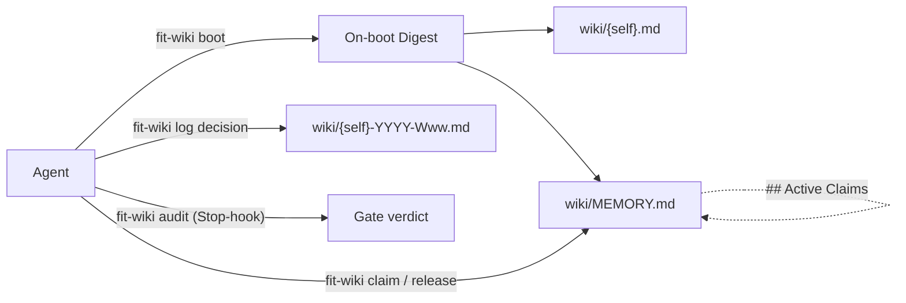
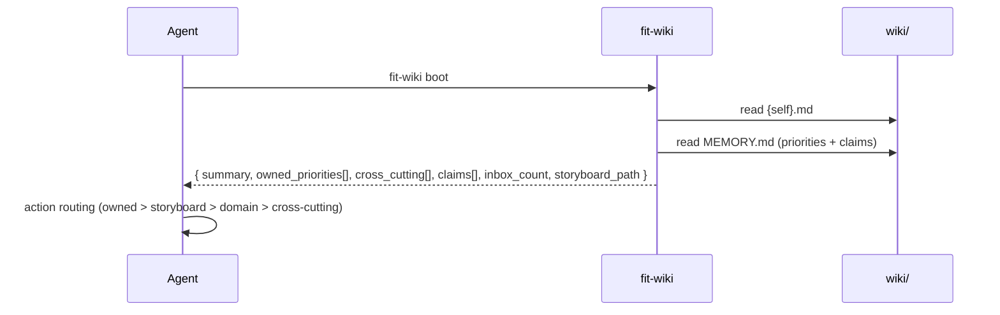
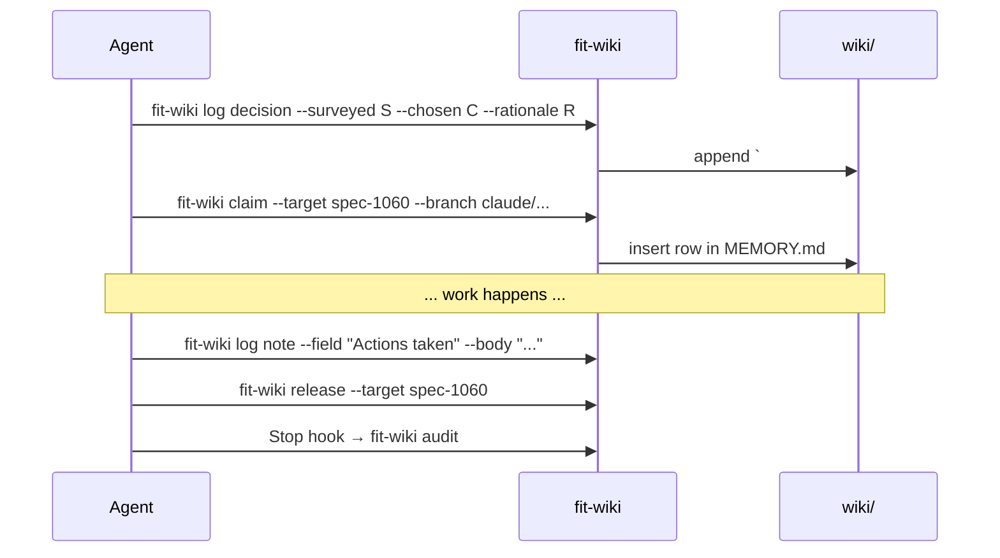

# Design 1060 — Memory Protocol Redesign

## Architectural Posture

The current protocol asks agents to *find files, read files, parse files, write
files.* Every gap the spec catalogues (F3, F4, F5, F6, F10, F11, F13, F17, F18)
is a tax that lands on the agent because the protocol contracts the work but
not the surface that performs it. The redesign inverts that: **`fit-wiki`
becomes the agent's interface to memory.** Reads collapse to one call that
returns a structured digest. Writes collapse to one call that resolves paths,
dates, headings, and budgets. Direct file edits remain possible but become the
escape hatch, not the path.

This is what makes the read-on-boot habit cheap enough to beat
`gh`/`git`/source re-derivation (the JTBD Habit named in the spec § Forces).
The CLI is calibrated, on every primitive, to cost fewer tool calls than the
alternative it competes with.

## Components

| Component | Where | Responsibility |
|---|---|---|
| **`fit-wiki boot`** | `libraries/libwiki/src/commands/boot.js` (new) | Read Tier 1, emit structured digest (summary, priority slice for `{self}`, active claims, inbox count, storyboard pointer). One tool call replaces three file reads. |
| **`fit-wiki log`** | `libraries/libwiki/src/commands/log.js` (new) | Append `## YYYY-MM-DD` + leading `### Decision` block to the current week's log. Subcommands: `decision`, `note`, `done`. |
| **`fit-wiki claim` / `release`** | `libraries/libwiki/src/commands/claim.js` (new) | Read/write the `## Active Claims` section of `wiki/MEMORY.md`. |
| **`fit-wiki inbox`** | `libraries/libwiki/src/commands/inbox.js` (new) | Subcommands: `list`, `ack`, `promote`, `drop`. Inbox lifecycle without hand-editing. |
| **`fit-wiki rotate`** | `libraries/libwiki/src/commands/rotate.js` (new) | When a weekly log crosses the line budget, archive to `wiki/{agent}-YYYY-Www-partN.md` and start a fresh part. Called automatically by `log`. |
| **`fit-wiki audit`** | `libraries/libwiki/src/commands/audit.js` (absorbs `scripts/wiki-audit.sh`) | Runs every contract gate. Stop-hook + CI step. |
| **`fit-wiki memo`** | unchanged | Send a cross-agent memo. Existing contract preserved. |
| **`fit-wiki push` / `pull` / `init` / `refresh`** | unchanged | Existing lifecycle commands; `init` extended to scaffold the `## Active Claims` section. |
| **`memory-protocol.md`** | `.claude/agents/references/` | Rewritten to specify CLI contracts (WHAT the CLI guarantees), not file-shape contracts (HOW agents touch files). |
| **`MEMORY.md`** | `wiki/` | Retains canonical-priority role; gains the `## Active Claims` schema. |
| **Stop-hook wiring** | `.claude/settings.json` (extended) | `fit-wiki audit` runs on Stop; failure surfaces in the agent's own session. |

## Data Flow

### On boot

One tool call satisfies the Tier 1 read contract. Skills replace their current
"read wiki/{self}.md, wiki/MEMORY.md, wiki/storyboard-*.md" instruction with
"run `fit-wiki boot` first."

### During run

## Decision-area Positions

| # | Area | Position |
|---|---|---|
| 1 | **Tier 1 read set** | 2 files: `wiki/{self}.md` + `wiki/MEMORY.md`. Storyboard moves to Tier 2 (pulled by skills that need it: `kata-session`, `kata-wiki-curate`). The agent's *interface* to Tier 1 is `fit-wiki boot`, not three file paths. |
| 2 | **Weekly-log size budget** | 500 lines per file, anchored on **≤2.5% of a 200k context window** (~3,750 tokens at 7.5 tokens/line) for a Tier 2 read. Overflow rotates to `…-Www-part2.md`. Cutover: ISO **2026-W23** (Mon 2026-06-01). Pre-cutover logs exempt and unmodified. Append-only guarantee preserved — rotation seals a part rather than rewriting it. |
| 3 | **Canonical priority surface** | `wiki/MEMORY.md` retained. Read-on-every-boot is realized by `fit-wiki boot` emitting the priority slice for `{self}` in the first response. The 0-of-8 trace finding cannot recur because *no skill's Step 0 reads files anymore* — they call `boot`. |
| 4 | **In-flight work surface** | New `## Active Claims` section in `MEMORY.md`. Schema: `\| agent \| target \| branch \| pr \| claimed_at \| expires_at \|`. Written by `fit-wiki claim`, removed by `fit-wiki release`, auto-flagged stale by `audit` after `expires_at` (default: claim+24h). Read by `boot`. Machine-readable: parseable markdown table. |
| 5 | **Mechanical enforcement** | `fit-wiki audit` (absorbs `scripts/wiki-audit.sh`) gates: 80-line summary cap, `<!-- memo:inbox -->` marker present, `## Message Inbox` is first H2, weekly-log cap, claim-row schema. Wired to Stop-hook (per-run, agent-self-correcting) and pre-merge CI (collective gate). |
| 6 | **Decision-block adoption** | Required at the **opening** of each weekly-log entry. Mechanism: `fit-wiki log decision` is the only sanctioned way to start a run entry; `audit` flags entries that lack a leading `### Decision`. Past entries not retrofitted. |
| 7 | **Tool-vs-memory habit** | **Memory-first**, anchored on CLI cost. Stated in protocol: when deciding between asking memory and re-deriving via `gh`/`git`/source, prefer memory because the CLI is calibrated to be cheaper. One call for the on-boot read set (closes F11). One call to record a decision (closes F4). One call to surface inbox state (closes F5 partial). |
| 8 | **`fit-wiki` CLI surface** | See § CLI Surface table. Every protocol contract maps to a CLI subcommand; every subcommand maps to a protocol contract. The protocol's CLI-gated rules and the CLI's subcommand list are kept in lock-step by a doc-test that diffs them. |

## CLI Surface

| Subcommand | Status | Realizes contract | Closes |
|---|---|---|---|
| `boot` | new | Tier 1 on-boot read; priority-surface read; in-flight visibility | F5, F11 |
| `log decision` | new | Decision block at run opening | F4, F6, F13 |
| `log note` | new | Field appends within the open run entry | F4 |
| `log done` | new | Closes the entry, runs `audit`, triggers `rotate` if needed | F3, F17 |
| `claim` / `release` | new | In-flight work surface, append-only audit trail | F8, F18 |
| `inbox list` / `ack` / `promote` / `drop` | new | Inbox lifecycle | F5 (partial) |
| `rotate` | new | Weekly-log overflow handling | F3, F17 |
| `audit` | absorbed (from `scripts/wiki-audit.sh`) | All gated rules; Stop-hook + CI | F10, F13 |
| `memo` | retained (unchanged) | Cross-agent memo into recipient inbox | — |
| `push` / `pull` | retained (unchanged) | Wiki git sync | — |
| `init` | modified | Scaffold MEMORY.md `## Active Claims` section | #4 |
| `refresh` | retained (unchanged) | Storyboard XmR chart refresh | — |

## Key Decisions

| Decision | Chosen | Rejected alternative | Why |
|---|---|---|---|
| Read primitive | `fit-wiki boot` returns a structured digest | Keep "read these 3 files" Tier 1 list | The current 3-file list is the source of F11 (0 reads of MEMORY.md across 8 traces). One CLI call calibrated cheaper than 3 file opens removes the "skip Step 0" Habit. |
| Tier 1 size | 2 files (own summary + MEMORY.md) | Keep storyboard in Tier 1 (3 files) | Storyboard is 537 lines today (~5% of 200k context). Useful only for storyboard-shaped work. Move to Tier 2, demanded by `kata-session` / `kata-wiki-curate` only. |
| Claims location | New `## Active Claims` section inside MEMORY.md | Separate `wiki/CLAIMS.md` | One read fetches priorities and claims together. Claims *are* priorities-in-flight; co-locating them is conceptually honest and saves a Tier 1 file. |
| Decision-block timing | Required at run **open** | Required at run end (status quo) | F6/F13 are about retroactive writing. Opening-position can be enforced because `log decision` is the only sanctioned start-of-run write; later notes append within. |
| Weekly-log budget | 500 lines / file with mid-week rotation to `-partN` | Daily file rotation; or no cap | Daily rotation explodes file count (7×). No-cap reproduces F3/F17. 500-line cap preserves one-file-per-week as the common case while bounding worst-case context cost at 2.5% of a 200k window. |
| Append-only preservation | Rotation seals a part (read-only) and starts a new file; never rewrites | Truncate in place | Audit trail (the original justification for append-only) survives because no part is ever rewritten; only new parts are added. |
| Audit timing | Stop-hook + CI | CI-only (status quo of `scripts/wiki-audit.sh`) | Pre-merge gating fires too late — bad state has already shipped to wiki. Stop-hook catches violations in the run that produced them, giving the agent the chance to self-correct *before* it leaves a mess. |
| Habit position | Memory-first, anchored on CLI cost | Tool-first; or silence (status quo) | Spec § Forces names Habit (gh/git/source) as the dominant competitor to memory. A position taken on exhortation alone won't shift behaviour. The position is enforced by primitive cost, not by rule. |
| MEMORY.md retention | Retained as canonical priority surface | Fold MEMORY.md into agent summaries; or retire entirely | The priority schema needs *one* writable surface that the curator owns. Distributing it across 6 summaries reintroduces drift; retiring it sheds the cross-cutting role. Retaining and making it cheap to read (via `boot`) closes F11 without rehoming the schema. |
| Coordination/coupling | `coordination-protocol.md` and `approval-signals.md` not modified | Fold them in | Spec § Out of scope. CLI surface respects boundaries: `memo` (memory write) is here; `agent-react` dispatch (coordination) stays in `coordination-protocol.md`. |

## Non-Goals (Restated from Spec)

- No retrofit of pre-cutover weekly logs.
- No `agent-react` dispatch changes.
- No `coordination-protocol.md` / `approval-signals.md` redesign.
- No `libwiki/` internal refactor beyond what the new commands require.
- No external-system survey.

## Trade-offs Accepted

- **CLI dependency.** Skills now require `fit-wiki` to be on `PATH` for Step 0
  to function. Mitigated: `fit-wiki` already ships in every Kata installation
  (`just quickstart` includes it). Failure mode: a broken `fit-wiki` fails
  loud, where today a broken `Read wiki/MEMORY.md` quietly returns nothing
  agents notice.
- **One more abstraction layer.** Agents now interact with memory via a
  command surface rather than the filesystem. The 6-probe write fan-out (F4)
  is the cost the abstraction collapses; the win on every weekly-log write
  exceeds the conceptual cost.
- **Structured digest format.** `fit-wiki boot`'s output shape is now an
  interface that downstream skills depend on. Versioned via the CLI's
  `--version` and treated as a stable contract — changes go through a
  follow-up spec, not silent edits.

## Open Questions for Plan Phase

- Digest format — JSON-by-default with markdown-rendered for human reading, or
  the reverse? Plan decides; spec is silent.
- Stop-hook installation — `.claude/settings.json` edit, or `init` script?
- `inbox promote` target — MEMORY.md row, or a separate follow-up?
- Migration order for the 6 agent profile Step 0 updates — staged or atomic?

## References

- Spec [1060](spec.md)
- [memory-protocol.md](../../.claude/agents/references/memory-protocol.md) — current
- [libwiki](../../libraries/libwiki/) — CLI implementation
- [wiki-audit.sh](../../scripts/wiki-audit.sh) — to be absorbed
- Research corpus: [research](../../wiki/memory-protocol-research-2026-05-16.md), [study](../../wiki/memory-protocol-study-2026-05-16.md), [content analysis](../../wiki/memory-protocol-content-analysis-2026-05-16.md), [JTBD](../../wiki/memory-protocol-jtbd-2026-05-16.md), [failures](../../wiki/memory-protocol-failures-2026-05-16.md)
