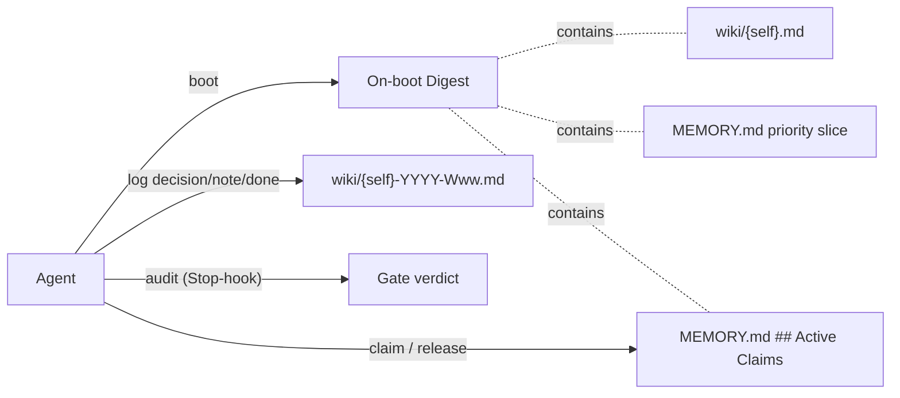
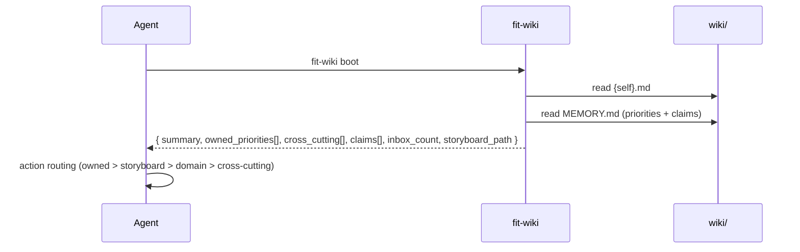
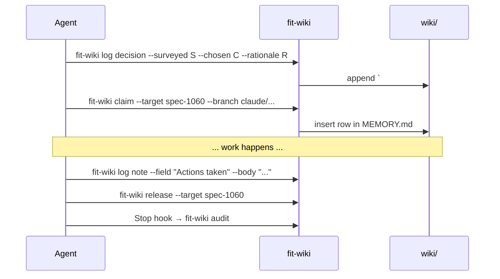

# Design 1060 — Memory Protocol Redesign

## Architectural Posture

The current protocol asks agents to *find files, read files, parse files, write
files.* Every gap the spec catalogues (F3, F4, F5, F6, F8, F10, F11, F13, F17,
F18) is a tax that lands on the agent because the protocol contracts the work
but not the surface that performs it. The redesign inverts that: **`fit-wiki`
becomes the agent's interface to memory.** Reads collapse to one call that
returns a structured digest. Writes collapse to one call that resolves paths,
dates, headings, and budgets. Direct file edits remain possible but become the
escape hatch, not the path.

This is what makes the read-on-boot habit cheap enough to beat
`gh`/`git`/source re-derivation (the JTBD Habit named in the spec § Forces).
The CLI is calibrated, on every primitive, to cost fewer tool calls than the
alternative it competes with.

## Components

| Component | Responsibility |
|---|---|
| **`fit-wiki boot`** | Read Tier 1, emit structured digest (summary, priority slice for `{self}`, active claims, inbox count, storyboard pointer). One tool call replaces three file reads. |
| **`fit-wiki log`** | Append `## YYYY-MM-DD` + leading `### Decision` block to the current week's log. Subcommands: `decision`, `note`, `done`. |
| **`fit-wiki claim` / `release`** | Read/write the `## Active Claims` section of `wiki/MEMORY.md`. |
| **`fit-wiki inbox`** | Subcommands: `list`, `ack`, `promote`, `drop`. Inbox lifecycle without hand-editing. |
| **`fit-wiki rotate`** | Archive a weekly log over the line budget to `wiki/{agent}-YYYY-Www-partN.md` and start a fresh part. Invoked automatically by `log done`; exposed as a standalone subcommand for operator use on oversized historical logs. |
| **`fit-wiki audit`** | Absorbs `scripts/wiki-audit.sh`. Runs every contract gate. Stop-hook + pre-merge CI. |
| **`fit-wiki memo`** | Unchanged. Send a cross-agent memo. |
| **`fit-wiki push` / `pull` / `refresh`** | Unchanged. |
| **`fit-wiki init`** | Modified additively (idempotent): when MEMORY.md exists, insert the `## Active Claims` heading + table header below the priorities table if missing; never rewrites existing content. |
| **`memory-protocol.md`** | Rewritten to specify CLI contracts (WHAT the CLI guarantees), not file-shape contracts (HOW agents touch files). |
| **`MEMORY.md`** | Retains canonical-priority role; gains the `## Active Claims` schema. |
| **Stop-hook wiring** | `.claude/settings.json` carries the `Stop` → `fit-wiki audit` entry; installed by `init` on new installations and a one-shot migration on existing ones. |

## Data Flow

### On boot

One tool call satisfies the Tier 1 read contract. Skills replace their current
"read wiki/{self}.md, wiki/MEMORY.md, wiki/storyboard-*.md" instruction with
"run `fit-wiki boot` first."

### During run

## Decision-area Positions

Each row carries the redesign's position, the rejected alternative, and why.

| # | Area | Position | Rejected · Why |
|---|---|---|---|
| 1 | **Tier 1 read set** (closes F5, F11) | 2 files: `wiki/{self}.md` + `wiki/MEMORY.md`. Storyboard moves to Tier 2 (loaded only by `kata-session`, `kata-wiki-curate`). The agent's *interface* is `fit-wiki boot`, not three file paths. | Rejected: keep the 3-file Tier 1 instruction (status quo). · The current list is the source of F11 (0/8 reads of MEMORY.md). A CLI primitive calibrated cheaper than three file opens removes the "skip Step 0" Habit. |
| 2 | **Weekly-log size budget** (closes F3, F17) | 500 lines per file. Anchored at ~21,000 tokens per Tier 2 read (~10% of a 200k context window) via the spec's 25k-token / 600-line Read-cap proxy (≈42 tokens/line). Overflow rotates to `…-Www-partN.md`; rotation seals the prior part read-only (append-only audit preserved). Cutover: ISO **2026-W23** (Mon 2026-06-01). Pre-cutover logs exempt. | Rejected: daily file rotation; no cap. · Daily explodes file count 7×; no-cap reproduces F3/F17. The 500-line cap preserves one-file-per-week as the common case while bounding worst-case context cost. |
| 3 | **Canonical priority surface** (closes F11, F8) | `wiki/MEMORY.md` retained. Read-on-every-boot is realized by `fit-wiki boot` emitting the priority slice for `{self}`. Skills' Step 0 calls `boot` rather than naming files. | Rejected: distribute priorities across agent summaries; or retire MEMORY.md. · Distributing reintroduces drift; retiring sheds the cross-cutting role. Retain and make cheap to read. |
| 4 | **In-flight work surface** (closes F8, F18) | New `## Active Claims` section in `MEMORY.md`. Schema: `\| agent \| target \| branch \| pr \| claimed_at \| expires_at \|`. **Row presence = "actively working on X"; row absence (or post-`expires_at`) = "settled state."** Written by `claim`, removed by `release`, auto-marked stale (separate column flag) by `audit` after `expires_at` (default: claim+24h). Stale rows are visible but excluded from `boot`'s active set. Read by `boot`; machine-readable as a parseable markdown table. | Rejected: separate `wiki/CLAIMS.md`. · One read fetches priorities and claims together. Claims *are* priorities-in-flight; co-locating saves a Tier 1 file. |
| 5 | **Mechanical enforcement of summary contract** (closes F10) | Per rule, each of the three is **kept and gated** by `fit-wiki audit`: (a) 80-line summary cap (`wc -l`), (b) `<!-- memo:inbox -->` marker present directly below `## Message Inbox`, (c) `## Message Inbox` is the first H2. Audit runs on the Stop-hook (per-run self-correction) and pre-merge CI (collective gate). | Rejected per rule: (a) raise the cap and skip gating, (b) drop the marker convention, (c) drop the first-H2 requirement. · The rules are already documented and load-bearing for on-boot inbox visibility; the problem named in F10 is that they are unchecked, not that they are wrong. |
| 6 | **Decision-block adoption** (closes F6, F13) | Required at the **opening** of each weekly-log entry. `fit-wiki log decision` is the only sanctioned start-of-run write; `audit` flags entries that lack a leading `### Decision`. Past entries not retrofitted. | Rejected: status quo (closing-position, retroactive). · F6/F13 are about retroactive writing. Opening-position is enforceable because the CLI owns the start-of-run write. |
| 7 | **Tool-vs-memory habit** (closes F4, F5, F11) | **Memory-first**, anchored on CLI cost. The redesigned protocol states: when deciding between asking memory and re-deriving via `gh`/`git`/source, prefer memory because the CLI is calibrated to be cheaper. One call for the on-boot read set (F11). One call to record a decision (F4). One call for inbox state (F5 partial). | Rejected: tool-first; or silence (status quo). · The Habit (gh/git/source) competes only when memory access is more expensive. A position taken on exhortation alone will not shift behaviour; one taken via primitive cost will. |
| 8 | **`fit-wiki` CLI surface composition** (cross-cuts F3, F5, F8, F10, F17, F18) | See § CLI Surface. Every protocol contract maps to a subcommand; every subcommand maps to a protocol contract. A doc-test diffs the protocol's CLI-gated rule list against the CLI's subcommand list; mismatch fails CI. | Rejected: ship a subset CLI and leave gaps. · Spec § In scope (#8) requires bidirectional mapping; partial coverage reproduces the read/write asymmetry that produced F11. |

## CLI Surface

| Subcommand | Status | Realizes contract | Closes |
|---|---|---|---|
| `boot` | new | Tier 1 on-boot read; priority-surface read; in-flight visibility | F5, F11 |
| `log decision` | new | Decision block at run opening | F4, F6, F13 |
| `log note` | new | Field appends within the open run entry | F4 |
| `log done` | new | Closes the entry, runs `audit`, triggers `rotate` if needed | F3, F17 |
| `claim` / `release` | new | In-flight work surface; append-only audit trail | F8, F18 |
| `inbox list` / `ack` / `promote` / `drop` | new | Inbox lifecycle | F5 (partial) |
| `rotate` | new | Weekly-log overflow handling | F3, F17 |
| `audit` | absorbed (`scripts/wiki-audit.sh`) | All gated rules; Stop-hook + CI | F3, F10, F13, F17, F8, F18 |
| `memo` | retained (unchanged) | Cross-agent memo into recipient inbox | — |
| `push` / `pull` | retained (unchanged) | Wiki git sync | — |
| `init` | modified (additive, idempotent) | Scaffold MEMORY.md `## Active Claims` section; install Stop-hook entry on new installs | F8, F18 |
| `refresh` | retained (unchanged) | Storyboard XmR chart refresh | — |

## Cross-cutting Architectural Choices

| Choice | Position | Rejected · Why |
|---|---|---|
| Named jobs in protocol text (spec § In scope) | The protocol explicitly names the three jobs the spec calls out and binds each to a CLI primitive: "find next thing to pick up without colliding" → `claim`/`release`; "trust another agent's reported state without re-deriving" → `boot` digest + MEMORY.md; "receive memos without breaking my contract" → `inbox list/ack/promote/drop`. | Rejected: leave them unnamed; or disclaim. · Read-write asymmetry produced F11. Naming the jobs in the read contract and pointing each to its write contract closes the loop. |
| Append-only audit preservation under rotation | Rotation seals a part read-only and starts a new part. No part is ever rewritten. | Rejected: truncate the oldest entries in place. · Audit trail survives because no part is rewritten; only new parts are added. |
| MEMORY.md retention | Retained as canonical priority surface. | Rejected: fold into agent summaries or retire entirely. · Priority schema needs one writable surface the curator owns; distributing reintroduces drift, retiring sheds the cross-cutting role. |
| Coordination boundary | `coordination-protocol.md` and `approval-signals.md` not modified. `memo` (memory write) stays here; `agent-react` dispatch stays in `coordination-protocol.md`. | Rejected: fold sibling references in. · Spec § Out of scope; collapsing them blurs distinct contracts. |

## Non-Goals (Restated from Spec)

- No retrofit of pre-cutover weekly logs.
- No `agent-react` dispatch changes.
- No `coordination-protocol.md` / `approval-signals.md` redesign.
- No `libwiki/` internal refactor beyond what the new commands require.
- No external-system survey.

## Trade-offs Accepted

- **CLI dependency.** Step 0 now requires `fit-wiki` on `PATH`. Mitigated:
  `fit-wiki` already ships in every Kata installation (`just quickstart`). A
  broken CLI fails loud, where a missed `Read wiki/MEMORY.md` fails silent.
- **One more abstraction layer.** Agents interact with memory via a command
  surface rather than the filesystem. The win on every weekly-log write (6
  probes → 1 call, F4) and every cold boot (3 reads → 1 call) exceeds the
  conceptual cost.
- **Digest-format coupling.** Downstream skills consume `boot`'s output shape.
  Treated as a stable contract under semantic versioning; format changes
  require a follow-up spec.

## Open Questions for Plan Phase

- **Digest format** — JSON-by-default with markdown-rendered for human reading,
  or the reverse? Both are reasonable read paths for agents; the plan picks one
  and documents it.
- **`inbox promote` target** — MEMORY.md row directly, or a separate follow-up
  artifact (GitHub Issue / Discussion) the curator then promotes? Plan decides.
- **Migration order for the 6 agent profile Step 0 updates** — atomic single
  PR, or staged per-agent with a feature-flag period? Plan decides.

## References

- Spec [1060](spec.md)
- [memory-protocol.md](../../.claude/agents/references/memory-protocol.md) — current
- [libwiki](../../libraries/libwiki/) — CLI implementation
- [wiki-audit.sh](../../scripts/wiki-audit.sh) — to be absorbed
- Research corpus: [research](../../wiki/memory-protocol-research-2026-05-16.md), [study](../../wiki/memory-protocol-study-2026-05-16.md), [content analysis](../../wiki/memory-protocol-content-analysis-2026-05-16.md), [JTBD](../../wiki/memory-protocol-jtbd-2026-05-16.md), [failures](../../wiki/memory-protocol-failures-2026-05-16.md)
