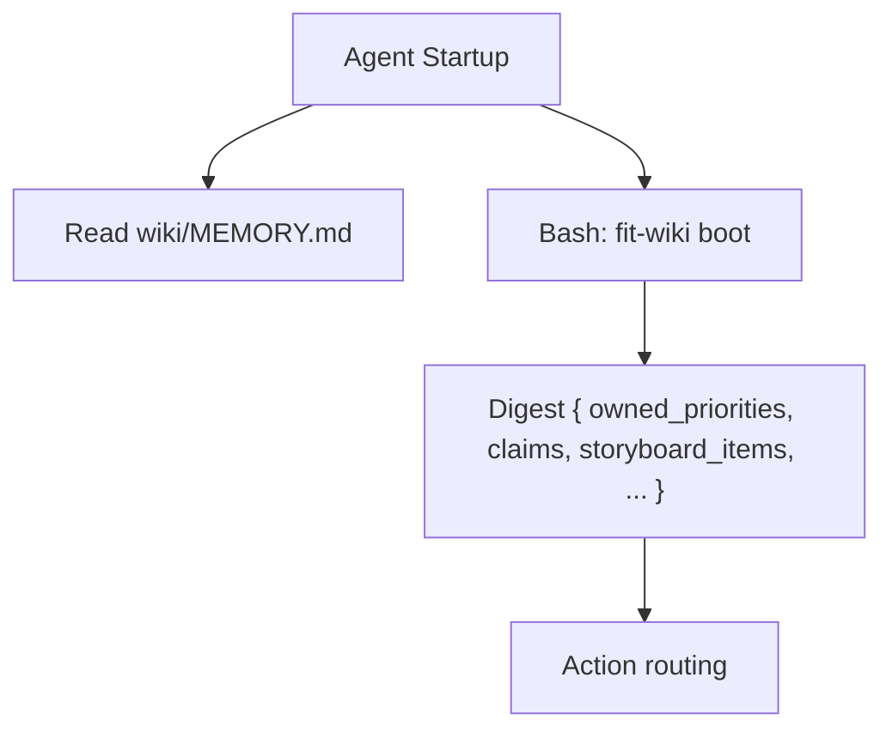

# Plan 1060 Part 02 — Protocol Rewrite + MEMORY.md Schema

Rewrites `memory-protocol.md` to specify CLI contracts (not file shapes)
and seeds `wiki/MEMORY.md` with the `## Active Claims` section that Part
01's `claim`/`release` write. Updates cross-references in `KATA.md` and
`CONTRIBUTING.md`. Depends on Part 01 being in the same commit series so
every CLI primitive the new protocol names exists.

Libraries used: none. All markdown edits.

## Step 1 — Rewrite `.claude/agents/references/memory-protocol.md`

Modified: `.claude/agents/references/memory-protocol.md`. Full rewrite;
target ≤200 lines (relaxed from 180 to absorb the bidirectional CLI map
and the named tool-vs-memory section the reviewers flagged). If the
draft lands >200, halt and reconsider scope rather than truncating
contracts.

New section structure (each H2 is a fixed anchor — agents profile
Step 0 in Part 03 links to these slugs, so the headings cannot change
after this part lands):

```
# Memory Protocol
## On-Boot Read Set
## On-Boot Routing
## Tool-vs-Memory Habit
## During Each Run
## Summary Contract
## Weekly Log Contract
## Cross-Cutting Priorities
## Active Claims
## Named Jobs This Protocol Serves
## CLI Contract Map
```

`Cross-Cutting Priorities` and `Active Claims` are sibling H2s, not a
combined section — this mirrors `wiki/MEMORY.md`'s shape and closes the
read/write asymmetry that fed F11. The `Tool-vs-Memory Habit` H2 is
explicit so spec § Success Criteria row 8 verifies by section.

Section content:

- **On-Boot Read Set.** Names the three Tier 1 surfaces literally as a
  table the implementer can copy: `wiki/{self}.md`, `wiki/MEMORY.md`,
  `wiki/storyboard-YYYY-MNN.md`. Mandates two tool calls within the
  first ten of every run: `Read wiki/MEMORY.md` and
  `Bash: fit-wiki boot`. Spec § Success Criteria row 3 satisfaction is
  literal.
- **On-Boot Routing.** Identical four-level scheme as today (owned >
  storyboard items > domain > cross-cutting fallback) but anchored on
  the `boot` digest fields (`owned_priorities`, `claims`,
  `storyboard_items`, `cross_cutting`) so action routing maps to
  digest keys, not file scanning. Names the convention that an agent
  treats its own active claim as preempting routing (skip-self rule
  moves here from the agent profile to keep the routing contract in
  one place).
- **Tool-vs-Memory Habit.** Required H2 section (spec § Success
  Criteria row 8). Position: memory-first, anchored on CLI cost.
  Sample prose: "When the next answer can come from either
  `fit-wiki boot` / `Read MEMORY.md` (memory) or `gh` / `git` / source
  re-derivation (the tool habit named in the JTBD analysis), prefer
  memory because every primitive is calibrated to cost fewer tool
  calls than the alternative — one for the on-boot read (closes F11),
  one for a Decision-block append (closes F4), one for inbox state
  (partial F5)." The prose must cite **F4, F5, and F11** by name
  inside this section (spec verifies via
  `rg -n 'F4|F5|F11' .claude/agents/references/memory-protocol.md`
  returning ≥1 hit inside the section).
- **During Each Run.** Mandates `fit-wiki log decision` as the only
  sanctioned run-opener (`### Decision` is the leading heading); cites
  F6, F13 by id. `fit-wiki log note` for in-run fields; `fit-wiki log
  done` to close the entry. Inbox triage uses `fit-wiki inbox list`
  then `ack` / `promote` / `drop`. Cross-agent memos remain
  `fit-wiki memo` (retained).
- **Summary Contract.** Retains the three rules unchanged in shape but
  adds: each is gated by `fit-wiki audit` on Stop-hook and pre-merge CI
  (spec § Success Criteria row 5). Names the failure ids F10 by reference.
- **Weekly Log Contract.** New: **500-line cap, ISO week 2026-W23
  cutover**, anchored in context cost. Required prose: "A Tier 2 read
  of the largest legal weekly log consumes ≤2.5% of the agent's
  1M-token context window (≈25k tokens; ≈42 tokens/line × 500 lines).
  This is the *context tax* every reader pays — the cap binds before
  the Read tool's 25k-token ceiling, not at it." (Spec § Success
  Criteria row 5 requires this rationale explicitly.) Rotation
  primitive: `fit-wiki rotate`, with implicit rotation on `log`'s
  seal-before-append (choose one path — implicit is the default; the
  explicit subcommand is the operator escape). Pre-cutover logs
  exempt.
- **Cross-Cutting Priorities.** Existing schema retained. Read by
  `boot` (digest's `owned_priorities` + `cross_cutting` slices);
  written by `inbox promote` (new) and direct `kata-wiki-curate`
  edits.
- **Active Claims.** Sibling H2 to Cross-Cutting Priorities; both live
  in `wiki/MEMORY.md`. Documents the schema (table header copy-pasted
  verbatim from `constants.js ACTIVE_CLAIMS_TABLE_HEADER`). Required
  definition prose: "A *claim* is an assertion that an agent is
  actively working on a named target (a spec, an open PR, a
  storyboard experiment) and intends to ship the next observable
  state change for it. Row present = active; row absent = settled."
  Lifecycle: `claim` writes, `release` removes (normal lifecycle),
  `release --expired` cleans expired rows (default `claim+7d`). Audit
  history lives in git history of MEMORY.md.
- **Named Jobs This Protocol Serves.** Three jobs named (spec § In
  scope third bullet): "find next thing to pick up without colliding"
  → `claim`/`release`; "trust another agent's reported state without
  re-deriving" → `boot` digest + MEMORY.md; "receive memos without
  breaking my contract" → `fit-wiki inbox`.
- **CLI Contract Map.** Three-column bidirectional table satisfying
  spec § Success Criteria row 10 (per-existing-subcommand disposition)
  and row 11 (mapping each subcommand to its contract **and** each
  contract assigned to the CLI to the subcommand(s) that realize it):

  | Subcommand | Status | Contract(s) this subcommand realizes |
  |---|---|---|
  | `boot` | new | On-Boot Read Set; On-Boot Routing |
  | `log decision` | new | During Each Run; Decision-block opening |
  | `log note` | new | During Each Run (field append) |
  | `log done` | new | During Each Run (entry close) |
  | `claim` | new | Active Claims write (claim) |
  | `release` | new | Active Claims write (release; `release --expired` lifecycle) |
  | `inbox list` | new | Message Inbox read |
  | `inbox ack` | new | Message Inbox triage (acknowledge) |
  | `inbox promote` | new | Cross-Cutting Priorities write (from inbox) |
  | `inbox drop` | new | Message Inbox triage (drop) |
  | `rotate` | new | Weekly Log Contract (explicit rotation) |
  | `audit` | absorbed (`scripts/wiki-audit.sh`) | Summary Contract; Active Claims schema; Decision-block opening; Weekly Log Contract; Expired claims |
  | `memo` | retained (unchanged) | Sibling channel (cross-agent memo) — outside this protocol's read/write contract |
  | `push` | retained (unchanged) | Sibling channel (wiki git lifecycle) |
  | `pull` | retained (unchanged) | Sibling channel (wiki git lifecycle) |
  | `init` | modified | Active Claims scaffold; Stop-hook installation |
  | `refresh` | extended | Sibling channel (storyboard rendering) — cross-link only |

  Footnote (one line under the table): "One-shot administrative scripts
  (e.g. `scripts/spec-NNN-*.mjs`) write to `wiki/` transiently and
  self-delete in the same commit that runs them; they are not part of
  the protocol's read/write contract. See plan-a-05.md for an
  example."

  Followed by the reverse table:

  | Contract assigned to the CLI | Subcommand(s) that realize it |
  |---|---|
  | On-Boot Read Set / On-Boot Routing | `boot` |
  | Decision-block opening (write) | `log decision` |
  | Decision-block opening (gate) | `audit` |
  | Weekly log append | `log decision`, `log note`, `log done` |
  | Weekly log cap (write-side enforcement) | `log` (seal-before-append), `rotate` |
  | Weekly log cap (gate) | `audit` |
  | Active Claims write | `claim`, `release`, `release --expired` |
  | Active Claims gate (schema, expiry) | `audit` |
  | Cross-Cutting Priorities write | `inbox promote` (plus direct `kata-wiki-curate` edits, sibling) |
  | Message Inbox read | `inbox list` |
  | Message Inbox triage | `inbox ack`, `inbox drop`, `inbox promote` |
  | Summary Contract (gate) | `audit` |
  | Active Claims surface scaffold | `init` |
  | Stop-hook install | `init` |

The diagram at the top of the file is replaced with:



Verification:
- `rg -n 'F(3|4|5|6|8|10|11|13|17|18)\b' .claude/agents/references/memory-protocol.md` returns ≥1 hit per id the redesign keeps (each id checked individually if a single grep is ambiguous).
- `rg -n -A5 'F4|F5|F11' .claude/agents/references/memory-protocol.md` returns ≥1 hit whose containing line falls inside the `## Tool-vs-Memory Habit` section (success criterion row 8).
- `rg -n -A5 '### Decision' .claude/agents/references/memory-protocol.md` returns a hit; "required at the opening" appears within 5 lines (success criterion row 8 part 2).
- `wc -l .claude/agents/references/memory-protocol.md` ≤200.
- Each H2 in the section list above appears as a top-level `^## ` heading in the file (anchor slugs are stable for agent profile links in Part 03).

## Step 2 — Seed `wiki/MEMORY.md ## Active Claims`

Modified: `wiki/MEMORY.md`. After the existing `## Cross-Cutting
Priorities` section and before `## Storyboard`, insert:

```markdown
## Active Claims

In-flight work claimed by an agent. Row present = active; row absent =
settled. Schema and lifecycle in
[memory-protocol.md § Cross-Cutting Priorities and Active Claims](../.claude/agents/references/memory-protocol.md#cross-cutting-priorities-and-active-claims).
Writers: `fit-wiki claim`, `fit-wiki release`. Reader: `fit-wiki boot`.

| agent | target | branch | pr | claimed_at | expires_at |
| --- | --- | --- | --- | --- | --- |
| *None* | — | — | — | — | — |
```

Verification: `bunx fit-wiki audit` reports no Active Claims schema
failures (the empty-state row is the explicit empty-state convention,
mirroring the priority-index pattern).

## Step 3 — Update `KATA.md`

Modified: `KATA.md`. Three surgical edits, no rewrite. Line numbers
are planning-time; re-locate each anchor by content at implementation
time:

- **Action routing prose** (currently L89 — "owned MEMORY.md priorities
  first, then storyboard…"): add ", then active claims surfaced by
  `fit-wiki boot`" after "priorities first" so the doc names the new
  claim surface alongside priorities.
- **First prose block naming `memory-protocol.md`** (currently L238):
  add a single sentence after the link: "Read contract:
  `Read wiki/MEMORY.md` + `Bash: fit-wiki boot`."
- **Second prose block** (currently L251): same one-sentence addition
  as above.

Verification: `rg 'memory-protocol' KATA.md` returns the same line
count as before (no link rewrites); `rg 'fit-wiki boot' KATA.md`
returns ≥2 hits (additive); diff is additive only.

## Step 4 — Update `CONTRIBUTING.md` and sibling references

Modified: `CONTRIBUTING.md`. The DO-CONFIRM line currently reads "wiki
writes per `memory-protocol.md`". Replace with "wiki writes per
`memory-protocol.md` — prefer `fit-wiki` subcommands over hand-edits".

Run `rg -n 'memory-protocol|MEMORY\.md|Tier 1|Tier 2|80-line|Message Inbox|wiki-audit' CONTRIBUTING.md`
before editing; any additional hits get the same surgical update
treatment (citation only, no policy change). Likely zero additional
hits at planning time.

Modified: `.claude/agents/references/coordination-protocol.md`. The
sibling reference cites `memory-protocol.md` four times today. Verify
each link target still resolves to a section in the rewritten file
(`Memory Tiers` heading no longer exists; the new equivalent is
`On-Boot Read Set`). Update each anchor accordingly. **No content
changes to coordination-protocol.md** beyond anchor fixes — spec § Out
of scope disclaims redesigning it.

Verification:
- `bun run check` passes (Biome formatter unchanged).
- `rg -n 'memory-protocol.md#' .claude/agents/references/coordination-protocol.md` returns anchors that all exist as `^## ` headings in the new protocol file.

## Step 5 — Citation inventory artifact

Created: `specs/1060-memory-protocol-redesign/citation-inventory.md`.

Two-column table satisfying spec § Success Criteria row 12 ("No
dangling references to the old file map"):

| Call site | Status post-redesign |
|---|---|

Rows cover every match of the expanded pattern across `.claude/`,
`wiki/`, `CONTRIBUTING.md`, `KATA.md`, `products/`, `libraries/`, and
`scripts/`. Status values:

- `matches new` — terminology aligns with the rewritten protocol
- `edited in Part 02` — protocol file itself, MEMORY.md, KATA.md, CONTRIBUTING.md, coordination-protocol.md
- `edited in Part 03` — agent profile, skill, fit-wiki SKILL
- `edited in Part 04` — justfile, .claude/settings.json, wiki-audit.sh deletion
- `historical exempt` — research artifact dated 2026-05-16; weekly log pre-cutover; past changelog entry

Built by (expanded pattern to capture every load-bearing term the old
protocol carries):

```sh
rg -n 'memory-protocol|MEMORY\.md|<!-- memo:inbox -->|80-line|Tier 1|Tier 2|### Decision|Memory Tiers|Cross-Cutting Priority|Action Routing|Weekly Log Contract|Summary Contract|Open Blockers|Message Inbox|storyboard-YYYY-MNN|Surveyed.*Chosen.*Alternatives.*Rationale|wiki/\{agent\}|wiki-audit\.sh' \
   .claude/ wiki/ CONTRIBUTING.md KATA.md products/ libraries/ scripts/ \
   > /tmp/citations.txt
```

then classify each match into the table.

The inventory is the contract Part 03 satisfies (every "edited in Part
03" row must show a corresponding edit in that part; rows marked Part
02 or Part 04 are checked by their owning parts). Pre-cutover weekly
logs and the `wiki/memory-protocol-*-2026-05-16.md` research corpus are
tagged `historical exempt`.

**Inventory snapshot semantics.** The inventory is a one-time
artifact built at Part 02's commit. The Part 05 migration script
(`scripts/spec-1060-migrate-wiki.mjs`) does not exist at inventory-
build time — it is added later in commit 05A and deleted in 05B, so
it never appears in a final-state grep of the tree. If a reader
re-derives the inventory between 05A and 05B and sees the script,
treat it as `historical exempt (Part 05 transient)`. After 05B, the
inventory is stable against re-derivation.

Verification: every row in the inventory falls in one of the five
states; no row reads "stale".

## Risks (Part 02 only)

- **MEMORY.md table-row syntax variance.** Active Claims and
  Cross-Cutting Priorities use different schemas; the `audit`
  parser (Part 01 Step 6) must scope each parse to its own H2.
  Mitigation: the `## Active Claims` heading is added literally — no
  ambiguity at parse time.
- **Decision-block citation count.** Spec criterion 8 part 2 requires
  the redesign locate a required/optional/hybrid keyword within 5
  lines of `### Decision`. The text writes "required at the opening"
  inside the During Each Run section's first paragraph after the
  heading; verified by `rg -B0 -A5 '### Decision'`.
