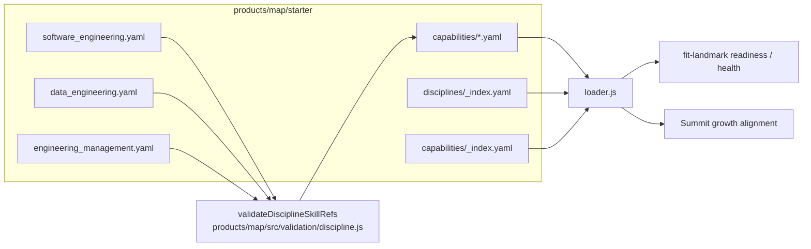

# design-a(1080): Starter discipline + capability coverage

Architectural sketch for [spec(1080)](spec.md). Closes the gap between starter
content (`products/map/starter/`) and the substrate's three-discipline roster
by adding two discipline files plus the capability content their skill
references close against.

## Components

| ID | Artifact | Role |
| --- | --- | --- |
| C1 | `products/map/starter/disciplines/data_engineering.yaml` | New discipline file mirroring substrate's `data_engineering` block. |
| C2 | `products/map/starter/disciplines/engineering_management.yaml` | New discipline file mirroring substrate's `engineering_management` skill block; management-role fields (`isManagement` / `isProfessional`) settled by Decision 4 below. |
| C3 | `products/map/starter/capabilities/{delivery,reliability,scale,business,people}.yaml` | Capability set per § Skill partition. `delivery` and `reliability` extended in place; `scale`, `business`, `people` added. |
| C4 | `products/map/starter/{disciplines,capabilities}/_index.yaml` | Regenerated by existing `IndexGenerator` (`products/map/src/index-generator.js`) via `bunx fit-map generate-index`. No new code path. |

C1 and C2 declare 14 tier slots between them (3 core + 2 supporting + 2 broad
each), referencing 12 unique skill IDs — `architecture_design` and
`stakeholder_management` appear in both disciplines. All 12 are new to starter
content. C3 grows the capability catalog to cover those 12 plus the 3
existing starter skills (`task_completion`, `planning`, `incident_response`),
restoring `validateDisciplineSkillRefs` closure.

## Skill partition

Five-capability partition mirrors the substrate's `standard.capabilities`
block so starter and substrate share vocabulary. 15 unique skill IDs.

| Capability | Skills (starter-existing → new) |
| --- | --- |
| `delivery` (extended) | task_completion, planning **+** data_integration |
| `reliability` (extended) | incident_response **+** incident_management |
| `scale` (new) | architecture_design, data_modeling, performance_optimization, cloud_platforms |
| `business` (new) | stakeholder_management, product_thinking, regulatory_compliance, risk_management |
| `people` (new) | team_collaboration, mentoring |

`data_integration` and `incident_management` land in their semantically-nearest
existing capability rather than spawning a sixth capability for one skill each.

## Discipline skill declarations

Each new discipline mirrors substrate's `core/supporting/broad` exactly so
substrate readiness (criterion 3) and `fit-landmark` health (criterion 4)
report against the same skill set the synthetic terrain encodes.

| Discipline | core | supporting | broad | validTracks |
| --- | --- | --- | --- | --- |
| `data_engineering` | data_integration, data_modeling, performance_optimization | architecture_design, cloud_platforms | stakeholder_management, regulatory_compliance | `[null, platform]` |
| `engineering_management` | stakeholder_management, team_collaboration, mentoring | product_thinking, risk_management | architecture_design, incident_management | `[null]` |

`software_engineering.yaml` is untouched (spec row 5 / criterion 6). Its three
skills resolve under the extended `delivery` and `reliability` capabilities.

## Data flow

Closure runs as part of `bunx fit-map validate`; criterion 2 is met iff that
edge does not produce `INVALID_REFERENCE` errors. The downstream landmark/Summit
edges supply criteria 3 and 4.

## Interfaces (no schema changes)

- Discipline schema (`products/map/schema/json/discipline.schema.json`) —
  consumed unchanged. Both new files declare existing fields:
  `specialization`, `roleTitle`, `validTracks`, `description`, `coreSkills`,
  `supportingSkills`, `broadSkills`, optional `behaviourModifiers`, optional
  `isProfessional` / `isManagement`, `human.*`, `agent.*`.
- Capability schema (`products/map/schema/json/capability.schema.json`) —
  consumed unchanged. New capability files carry one `skills[]` entry per
  skill ID with `human` proficiency descriptions, markers, and `agent`
  identity sections matching the shape of existing `delivery.yaml`.
- Server-side loader (`products/map/src/loader.js`) — scans directories via
  `readdir` and ignores `_index.yaml`; new files are picked up immediately.
- Browser-side loader (`products/pathway/src/lib/yaml-loader.js`) — reads
  `_index.yaml` to discover discipline and capability files. C4 regeneration
  is the load path criterion 5 guards.
- Validator entry points unchanged — `validateDiscipline` and the closure
  function `validateDisciplineSkillRefs` already enforce criterion 2.

## Key Decisions

| # | Decision | Rejected alternative |
| --- | --- | --- |
| 1 | Mirror substrate skill declarations verbatim per discipline (3 core / 2 supporting / 2 broad). | One-skill-per-tier minimal shape mirroring current SE. Passes validator but produces stub readiness checklists for any real persona — defers the richness work the spec exists to enable. |
| 2 | Five-capability partition reusing substrate names (`delivery`, `scale`, `reliability`, `business`, `people`). | Cram all 15 skills into existing `delivery` + `reliability`. Semantically wrong (`regulatory_compliance` is not "delivery") and breaks the substrate ↔ starter vocabulary alignment that downstream consumers rely on. |
| 3 | Extend `delivery` and `reliability` in place rather than rename. | Adopt substrate's exact `delivery` skill set (`data_integration`, `full_stack_development`, `problem_discovery`, `rapid_prototyping`) — would drop `task_completion`/`planning` and violate criterion 6 (existing SE skill IDs must keep resolving). |
| 4 | `engineering_management.yaml` sets `isManagement: true`, `isProfessional: false`. Substrate sets only `isProfessional false` (`data/synthetic/story.dsl:630`); `isManagement: true` is a design extension over substrate, justified because `products/map/src/levels.js:167` branches on `isManagement` to pick the management responsibility map. | Leave both unset — `fit-landmark` would show a professional-track readiness checklist for a discipline whose substrate intent is the opposite. |
| 5 | `behaviourModifiers` — `data_engineering` carries `systems_thinking: 1`, `engineering_management` omits modifiers. | Add new behaviour files to enable richer per-discipline shaping — explicitly out of scope per spec § "Not in scope" (behaviours/). Within the single available behaviour, omission is more honest than a forced value. |
| 6 | `_index.yaml` regenerated via existing `bunx fit-map generate-index` subcommand (wraps `IndexGenerator.generateAllIndexes`). | Hand-edit `_index.yaml` files. Drift-prone — the file header already declares itself auto-generated, and the regenerator covers both directories in one call. |
| 7 | Skill IDs `data_integration` and `incident_management` collapse into existing capabilities rather than spawn singleton capabilities. | One capability file per substrate cluster verbatim (would need a sixth capability for one orphan skill each). Adds two files for two skills with no semantic clustering payoff. |

## Risks / open questions

| Row | Risk | Mitigation |
| --- | --- | --- |
| 1 | `fit-landmark readiness` for substrate personas at J080/J090 still fails on `Unknown level` (starter level ladder stops at the substrate's ceiling but #985 carries a separate level-ladder follow-on). Criterion 3 excludes those personas. | Criterion 3 verification must filter the roster to personas whose `level` is in starter `levels.yaml`; the discipline gap is observable only within the ladder. |
| 2 | If `bunx fit-map generate-index` is wired but broken, criterion 5 fails despite valid C1-C3 files. | Fallback path is to invoke `createIndexGenerator().generateAllIndexes(starterDir)` directly from a script — same `IndexGenerator` class, no new code. |
| 3 | Skill IDs split across multiple capability files would produce ambiguous lookups. Validator deduplicates per discipline tier but capability authoring must not split a skill across files. | Partition table above is canonical: each skill ID appears in exactly one capability file. |

— Staff Engineer 🛠️
