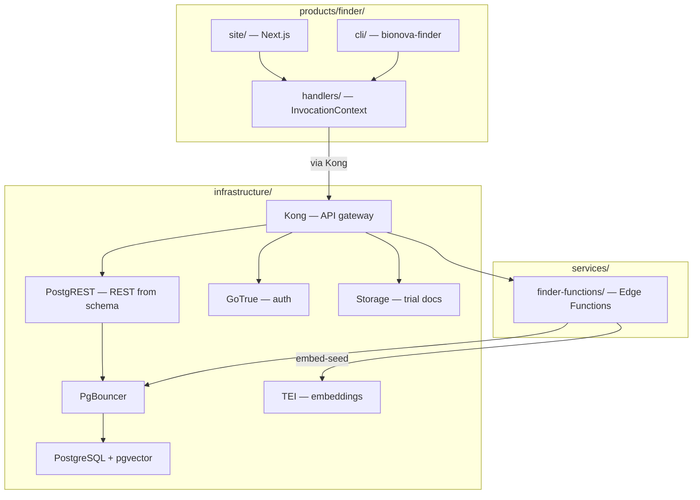

# Design 1160 — BioNova Finder Application

All paths below are within the `bionova-apps` repository — a separate,
MONOREPO.md-compliant repo that consumes Forward Impact libraries from npm.

## Components

| Component | Location | Purpose |
| --- | --- | --- |
| Handlers | `products/finder/handlers/` | Surface-agnostic business logic |
| Web frontend | `products/finder/site/` | Next.js App Router + Tailwind + shadcn/ui |
| CLI | `products/finder/cli/` | `bionova-finder` via libcli |
| Edge Functions | `services/finder-functions/` | Deno functions for eligibility, seeding, sync |
| Infrastructure | `infrastructure/` | PG On Rails self-hosted Supabase stack |
| Seed data | `data/synthetic/` | story.dsl + terrain-generated SQL and JSONL |

## Architecture



## Shared Library Consumption

| Library | Consumer | Role |
| --- | --- | --- |
| `libcli` | `products/finder/cli/` | CLI dispatch, `--help`, subcommand routing |
| `libui` | `products/finder/site/` | Routing, reactive state, and `freezeInvocationContext` for the web surface |
| `libformat` | `products/finder/handlers/` | Render handler output to ANSI (CLI) or HTML (web) |
| `libtemplate` | `products/finder/handlers/` | Mustache templates for trial cards, eligibility reports |
| `librepl` | `products/finder/cli/` | `bionova-finder repl` — staff interactive trial data exploration |

## Shared Surface Architecture

Both surfaces produce an `InvocationContext { data, args, options }` (`libcli`
on the terminal, `libui` on the web) and dispatch to the same handler function.
Handlers return surface-agnostic data; `libformat` renders to ANSI or HTML.

| Handler | CLI command | Web route | Args |
| --- | --- | --- | --- |
| `searchTrials` | `search` | `/search` | `--condition`, `--phase`, `--status`, `--location` |
| `showTrial` | `trial <id>` | `/trials/:id` | `id` positional |
| `checkEligibility` | `eligibility <id>` | `/trials/:id/eligibility` | `id` positional |
| `listSites` | `sites` | `/sites` | `--specialty` |
| `showAbout` | `about` | `/about` | none |
| `manageTrial` | `admin trial <id>` | `/admin/trials/:id` | `id` positional (staff auth); includes interest signal aggregates |

The CLI entry point (`bin/bionova-finder.js`) uses `createCli` from
`@forwardimpact/libcli`. The `admin` subcommand group requires GoTrue JWT
via `--token` or `SUPABASE_SERVICE_ROLE_KEY`.

## PostgreSQL Schema

Tables seeded by the terrain pipeline (`supabase_migration` output via
`renderSql()` in libsyntheticrender):

| Table | Columns | Source entity |
| --- | --- | --- |
| `conditions` | `id pk`, `name`, `icd10 text[]`, `synonyms text[]`, `synthea_module`, `severity`, `prose_topic`, `prose_tone` | `ClinicalConditionEntity` |
| `sites` | `id pk`, `name`, `address`, `city`, `state`, `country`, `org_ref`, `capacity int`, `specialties text[]` | `ClinicalSiteEntity` |
| `researchers` | `id pk`, `person_ref`, `name`, `email`, `role`, `trial_ids text[]`, `specialty` | `ClinicalResearcherEntity` |
| `trials` | `id pk`, `name`, `protocol_id`, `phase`, `therapeutic_area`, `sponsor`, `status`, `target_enrollment int`, `current_enrollment int`, `start_date date`, `estimated_end_date date`, `arms text[]`, `prose_topic`, `prose_tone`, `principal_investigator_id fk`, `project_ref`, `project_id` | `ClinicalTrialEntity` |
| `criteria` | `trial_id pk/fk`, `inclusion jsonb`, `exclusion jsonb` | `ClinicalCriterionEntity` |
| `trial_conditions` | `trial_id fk`, `condition_id fk` (composite pk) | Junction from `trial.conditions[]` |
| `trial_sites` | `trial_id fk`, `site_id fk` (composite pk) | Junction from `trial.sites[]` |
| `condition_embeddings` | `id pk`, `condition_id fk`, `embedding vector(384)` | `renderSql(include_embeddings: true)` + `embed-seed` edge function |

Hand-written migrations at `products/finder/site/supabase/migrations/` (not
terrain-generated; sequenced after seed migrations):

```sql
-- interest_signals table
CREATE TABLE interest_signals (
  id UUID PRIMARY KEY DEFAULT gen_random_uuid(),
  trial_id TEXT NOT NULL REFERENCES trials(id),
  screener_answers JSONB NOT NULL,
  match_score TEXT NOT NULL
    CHECK (match_score IN ('eligible', 'possibly_eligible', 'not_eligible')),
  created_at TIMESTAMPTZ NOT NULL DEFAULT now()
);

-- notify-updates trigger (invokes the notify-updates edge function)
CREATE OR REPLACE FUNCTION notify_trial_status_change()
RETURNS trigger LANGUAGE plpgsql AS $$
BEGIN
  PERFORM net.http_post(
    url := current_setting('app.edge_function_url') || '/notify-updates',
    body := jsonb_build_object('trial_id', NEW.id, 'old_status', OLD.status, 'new_status', NEW.status)
  );
  RETURN NEW;
END;
$$;

CREATE TRIGGER trial_status_change
  AFTER UPDATE OF status ON trials
  FOR EACH ROW
  WHEN (OLD.status IS DISTINCT FROM NEW.status)
  EXECUTE FUNCTION notify_trial_status_change();
```

`sites.org_ref` is a plain text column with no foreign key constraint —
orgs live in the non-clinical entity graph and are not included in the
clinical migration output. The same applies to `trials.project_ref` and
`trials.project_id`: both are plain text columns carrying cross-domain
references for display purposes (e.g. linking a trial to its project page)
but referential integrity is not enforced at the database level.

The `criteria.inclusion` and `criteria.exclusion` JSONB columns carry
structured objects: `{ age_min, age_max, conditions_required, ecog_max,
prior_treatments_allowed, custom[] }` and `{ conditions_excluded,
active_autoimmune, prior_immunotherapy, custom[] }` respectively. The
`eligibility-check` edge function reads `custom[]` strings as the screener
question source — no runtime LLM dependency.

### Row-Level Security

| Table | Policy |
| --- | --- |
| `conditions`, `sites`, `researchers`, `trials`, `criteria`, junction tables, `condition_embeddings` | `public_read`: `FOR SELECT USING (true)` (generated by `render-sql.js`) |
| `trials` | Staff write: `FOR INSERT WITH CHECK (auth.jwt() ->> 'role' = 'staff')`; `FOR UPDATE USING (auth.jwt() ->> 'role' = 'staff')` |
| `interest_signals` | Anonymous insert: `FOR INSERT WITH CHECK (true)`; staff read: `FOR SELECT USING (auth.jwt() ->> 'role' = 'staff')`. Anonymous inserts must not use PostgREST `Prefer: return=representation` — the staff-only SELECT policy blocks anon read-back. |

## Edge Functions

| Function | Trigger | Data flow |
| --- | --- | --- |
| `embed-seed` | `setup.sh` (one-time) | Read condition/trial text from PG, POST to TEI (`tei:8080`), INSERT vectors into `condition_embeddings` |
| `eligibility-check` | POST from screener UI/CLI | Read `criteria` for trial, evaluate answers against `custom[]`, return match score |
| `notify-updates` | DB trigger on `trials.status` change | Query `interest_signals` for affected trial, log notification (stub; email via GoTrue deferred) |
| `sync-listings` | Cron (`pg_cron`) or manual invoke | Re-read seed SQL from `data/synthetic/output/`, upsert changed rows |

## Data Seeding Pipeline

```
data/synthetic/story.dsl
  → npx fit-terrain generate
  → data/synthetic/output/seed_*.sql + seed_embeddings.jsonl
  → setup.sh copies to products/finder/site/supabase/migrations/
  → docker compose up → supabase db push → schema + seed data
  → setup.sh invokes embed-seed edge function
  → TEI (tei:8080) generates 384-dim vectors
  → condition_embeddings populated with pgvector
```

## Key Decisions

| Decision | Chosen | Rejected | Why |
| --- | --- | --- | --- |
| Terrain output path | `data/synthetic/output/` with `setup.sh` copy to migrations | Direct output to `products/finder/site/supabase/migrations/` | `writeFiles()` in sinks.js joins the first two path segments of each output file into a directory and `rm -rf`'s it before writing — outputting to `products/finder/...` would delete `products/finder/` including `cli/`, `handlers/`, and authored code. Routing to `data/synthetic/output/` keeps generated files in the disposable zone; `setup.sh` copies them into the migration directory. |
| Deployment | Railway watch-path CI/CD — one service per `infrastructure/` subdirectory | Kubernetes, Fly.io | PG On Rails provides Railway config out of the box; watch-paths limit rebuilds to changed services. |
| API layer | PostgREST auto-generated from schema | Hand-written API routes | Schema-driven REST eliminates boilerplate; handlers call PostgREST via Kong. Staff writes also go through PostgREST with GoTrue JWT for RLS enforcement. |
| Screener questions | Derived from `criteria.custom[]` strings at display time | Pre-generated `screener_questions` JSONB column | `custom[]` already contains plain-language criteria from the DSL. Displaying them as yes/no questions is a presentation concern, not a data concern. Avoids an extra prose pipeline key. |
| Embedding model | HuggingFace TEI (`BAAI/bge-small-en-v1.5`, 384-dim) on Docker network | External API (OpenAI, Cohere) | Zero external API keys; deterministic; runs locally alongside the stack. TEI container joins the Docker network as `tei`. |
| Location search | City/state dropdown filter on `sites.city`, `sites.state` | PostGIS proximity search | Seed data has 5 sites. Dropdown filtering is simpler and sufficient; no geocoding dependency. |
| CLI auth | `--token` flag or `SUPABASE_SERVICE_ROLE_KEY` env var | Interactive OAuth flow | CLI is for staff automation. Service role key avoids GoTrue browser flow. |

## Infrastructure Services

Docker Compose orchestrates these PG On Rails services under
`infrastructure/`:

| Service | Image / Build | Port | Purpose |
| --- | --- | --- | --- |
| `kong` | `kong:3.4` | 8000 | API gateway routing |
| `postgres` | `supabase/postgres` + pgvector | 5432 | Primary database |
| `pgbouncer` | `edoburu/pgbouncer` | 6432 | Connection pooling |
| `postgrest` | `postgrest/postgrest` | 3000 | REST API from schema |
| `gotrue` | `supabase/gotrue` | 9999 | Auth service |
| `realtime` | `supabase/realtime` | 4000 | PG On Rails baseline (not wired for MVP) |
| `storage` | MinIO + `supabase/storage-api` | 5000 | `trial-documents` bucket; `manageTrial` uploads via Kong |
| `imgproxy` | `darthsim/imgproxy` | 8081 | PG On Rails baseline (not wired for MVP) |
| `tei` | `ghcr.io/huggingface/text-embeddings-inference` | 8080 | Embedding generation |
| `finder-site` | `products/finder/site/Dockerfile` | 3001 | Next.js frontend |
| `finder-functions` | `services/finder-functions/` | 8082 | Deno edge functions |
