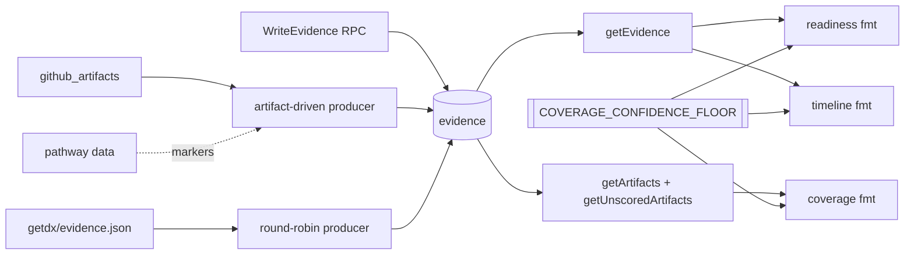
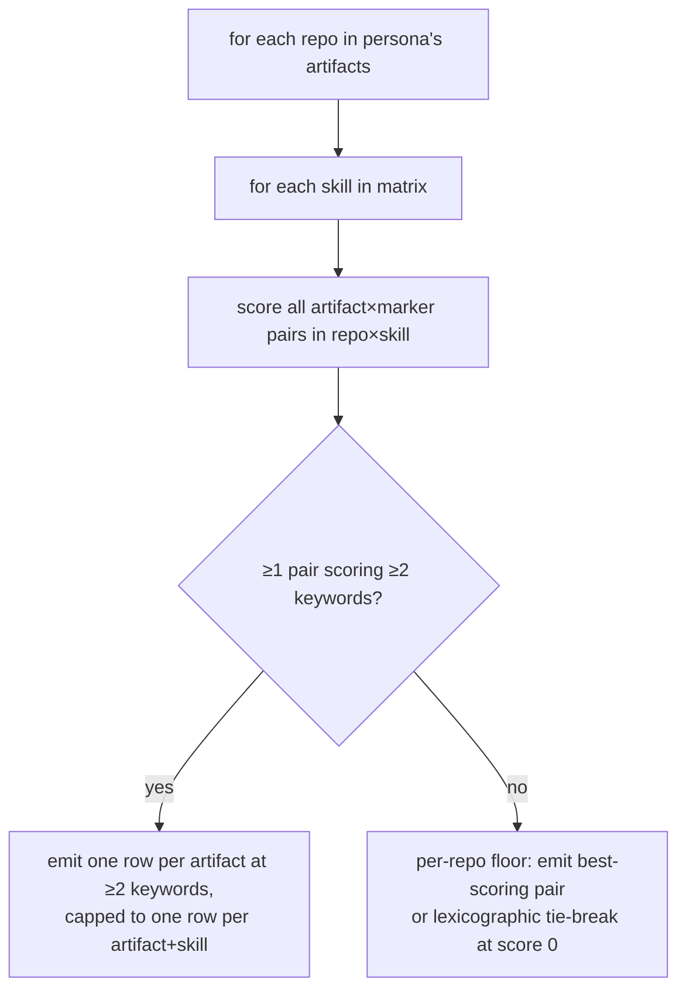

# Design 1210: Landmark evidence coverage

WHICH/WHERE for the four leverage points in [spec.md](spec.md): an
artifact-driven producer that grows the numerator, a provenance class on
every row, coverage adjacent to the readiness verdict, and a single
confidence floor that flips three commands to negative-evidence framing.

## Components

| Component | Where | Role |
| --- | --- | --- |
| Artifact-driven producer | `products/map/src/activity/transform/evidence-artifact.js` (new sibling to `evidence.js`) | Reads `github_artifacts`, derives the persona's marker matrix from pathway data (same source as `landmark readiness`), applies the bounded heuristic below, emits rows tagged `provenance: artifact_interpreted` |
| Round-robin producer | `products/map/src/activity/transform/evidence.js` (existing, modified) | Existing GetDX path; rows tagged `provenance: synthetic_placeholder`; delete scope narrows from `rationale = "synthetic"` to `provenance = "synthetic_placeholder"` |
| Transform orchestrator | `products/map/src/activity/transform/index.js` | After `transformAllGitHub`, calls artifact-driven producer, then round-robin (artifact-driven first is the determinism contract; see § Storage) |
| Provenance carrier | `services/map/proto/map.proto` adds optional string `WriteEvidenceRequest.provenance`; DB schema adds `evidence.provenance text NOT NULL` column with default `'human_attested'`; the existing UNIQUE on `(artifact_id, skill_id, level_id, marker_text)` (migration `20250504000004_evidence_upsert_key.sql`) is reused | Four-class field on every row; queryable; back-compat for existing RPC callers (RPC handler maps omitted-field to `human_attested`; DB default catches any path that bypasses the handler) |
| Provenance validation | `products/map/src/activity/provenance.js` (new) exports `PROVENANCE_CLASSES = ['synthetic_placeholder','artifact_interpreted','agent_attested','human_attested']` and a guard used by the `WriteEvidence` handler and both producers | Single accepted-value set (criterion 2's three-class floor plus `agent_attested` for Guide; still under spec's five-class ceiling); an RPC payload outside the set is rejected before insert |
| Confidence floor | `products/landmark/src/lib/confidence-floor.js` (new) exports `COVERAGE_CONFIDENCE_FLOOR = 0.30` + `isBelowFloor(ratio)`; CLI definition at `products/landmark/bin/fit-landmark.js` imports the constant at module load and interpolates it into the `description` string passed to libcli's existing `documentation` slot; readiness/timeline/coverage formatters import the same constant for runtime copy; criterion 1's ratio-target test imports the same constant | Single product-facing source-of-truth for the floor; one numeric, one import path |
| Readiness command + formatter | `products/landmark/src/commands/readiness.js`, `formatters/readiness.js` | Command attaches `coverage` to view payload; formatter renders the ratio one line after `X/Y markers evidenced`; below-floor branch wraps the verdict |
| Timeline command + formatter | `products/landmark/src/commands/timeline.js`, `formatters/timeline.js` | Command attaches `coverage`; below-floor branch wraps timeline output |
| Coverage formatter | `products/landmark/src/formatters/coverage.js` | Adds per-provenance breakdown alongside the existing per-type breakdown; classes with zero rows shown explicitly (criterion 5); below-floor banner above ratio |
| Guide skill writer | `products/guide/starter/skills/evaluate-evidence/SKILL.md` step (e) | Append `provenance: 'agent_attested'` to the `WriteEvidence` call signature so Guide-judged rows land in `agent_attested` instead of the DB default `human_attested` (criterion 7) |

## Provenance

| Class id | Producer | `marker_text` shape | Default-when-omitted |
| --- | --- | --- | --- |
| `synthetic_placeholder` | `transform/evidence.js` (round-robin) | free-form from `artifact.metadata.title \| message` | producer always sets |
| `artifact_interpreted` | `transform/evidence-artifact.js` (new) | canonical marker text from the standard's vocabulary | producer always sets |
| `agent_attested` | Guide `evaluate-evidence` skill → `WriteEvidence` RPC | verbatim marker text from `GetMarkersForProfile` | skill must pass `provenance: 'agent_attested'` (this spec edits step (e); see § Related producers) |
| `human_attested` | direct/manual `WriteEvidence` RPC | free-form per RPC contract | RPC handler default + DB column default |

Round-robin and artifact-driven producers write disjoint `marker_text`
shapes — collisions on the UNIQUE key are rare in practice, and the
determinism contract does not rely on them.

The proto field is **optional string** rather than enum to keep backward
compatibility — existing `WriteEvidence` callers continue to work without
recompiling. Validation lives in `provenance.js` (§ Components); the
handler rejects values outside `PROVENANCE_CLASSES` so the consumer-facing
read path always sees one of the four classes (criterion 2). Four classes
sit inside [spec § Risks → Provenance enum cardinality](spec.md#risks)'s
three-class floor and five-class ceiling.

## Related producers

Guide's `evaluate-evidence` skill writes to the same `evidence` table via
the existing `WriteEvidence` RPC. Both populate `evidence` from
`github_artifacts`; `provenance` distinguishes them at read time.

| Producer | Runs when | Provenance |
| --- | --- | --- |
| Artifact-driven (this design) | `fit-map activity transform` — synchronous, deterministic, no LLM | `artifact_interpreted` |
| Round-robin (existing) | Same transform pass; placeholders | `synthetic_placeholder` |
| Guide `evaluate-evidence` | Scheduled MCP/gRPC agent runs LLM judgement on unscored artifacts | `agent_attested` |
| Direct `WriteEvidence` | Hand-attestation via RPC | `human_attested` |

Coverage at t=0 (criterion 1's fresh-install harness) is held by the
artifact-driven producer alone — Guide's stack isn't running yet.
`agent_attested` rows accumulate on top once a deployment runs the
scheduled agent; `human_attested` rows accumulate from manual RPC calls.

**Guide skill writer (in scope, criterion 7).**
`products/guide/starter/skills/evaluate-evidence/SKILL.md` step (e)
currently calls `WriteEvidence` without `provenance`, so rows route to
the DB default `human_attested` — honest about the path, loose about
the attester. This spec edits step (e) to pass
`provenance: 'agent_attested'` as the seventh named field. Verified by
inspecting step (e) and reading rows back via `getEvidence`.

## Confidence floor

`COVERAGE_CONFIDENCE_FLOOR = 0.30` lives in **one place**: the JS module
`products/landmark/src/lib/confidence-floor.js`. Every consumer imports
it — readiness/timeline/coverage formatters, below-floor copy templating,
`fit-landmark.js`'s libcli `documentation` slot (interpolated at module
load), and the criterion-1 ratio-target test. The literal `30%` lives
nowhere else; criterion 4(a) discoverability flows through `--help`.

## Artifact-driven producer

The match heuristic is bounded by three rules. The two-keyword threshold
is the primary inflation control; the per-artifact ceiling and per-repo
floor shape distribution.

1. **Token-overlap threshold (primary inflation control).** Marker
   keywords are the marker text tokenised on whitespace, lowercased,
   stop-words removed, tokens of length <4 dropped. A marker matches an
   artifact when ≥2 distinct keywords appear in the artifact's text
   surface (`title + body` for PRs, `body` for reviews, `message` for
   commits). The two-keyword floor rejects single-coincidence matches
   that drove the original synthetic-rationale problem.
2. **Per-artifact ceiling of one row per skill_id.** A single artifact
   may produce evidence for multiple skills but no more than one row per
   (artifact_id, skill_id). Caps shape: distribution, not scale.
3. **Per-(repo, skill) emit floor (criterion 1(c) structural guarantee).**
   For each `(repository, skill_id)` pair where the persona has ≥1
   artifact in that repository, the producer emits at least one row.
   Selection rule: pick the (artifact, marker) pair with the highest
   token-overlap score for that (repo, skill); on a tie or zero-overlap,
   pick the lexicographically earliest marker text and the
   chronologically earliest artifact. The floor fires unconditionally —
   even when no marker scored at all — so criterion 1(c) does not depend
   on fixture keyword overlap.

Floor rows that scored below the ≥2-keyword threshold still classify as
`artifact_interpreted` — same producer, honest about that. Zero-overlap
is rare in practice; the floor is structural, not interpretive.

## Determinism and coexistence

The determinism contract rests on three rules, in order of load-bearing:

1. **Per-class DELETE before INSERT.** Each producer deletes only its own
   provenance class before inserting (artifact-driven:
   `provenance = "artifact_interpreted"`; round-robin:
   `provenance = "synthetic_placeholder"`). Human-attested rows are never
   touched. This is the primary mechanism — rerun on unchanged inputs
   replaces each producer's full output cleanly.
2. **Mandatory producer ordering: artifact-driven first.** The
   orchestrator calls artifact-driven after `transformAllGitHub` and
   before round-robin. Ordering matters only on the (rare) cross-producer
   key collision: artifact-driven writes first, then round-robin's INSERT
   uses `ON CONFLICT (artifact_id, skill_id, level_id, marker_text) DO
   NOTHING` so the artifact-interpreted row stands. This is a
   belt-and-braces guard, not the primary mechanism — disjoint
   `marker_text` shapes already keep most collisions from happening.
3. **Existing UNIQUE index reused.** `(artifact_id, skill_id, level_id,
   marker_text)` is already UNIQUE per migration
   `20250504000004_evidence_upsert_key.sql` over NOT-NULL columns
   (`level_id NOT NULL` per migration `20250504000002_evidence_not_null.sql`).
   No new constraint or migration on this key.

Rerun on unchanged inputs reproduces the same set on the projection
`(artifact_id, skill_id, level_id, marker_text, matched, provenance)`
(criterion 6).

## Surface changes

Below-floor copy templates `R%` and `F% = COVERAGE_CONFIDENCE_FLOOR * 100`
from the same constant — no hard-coded `30%` anywhere.

| Command | Above-floor framing | Below-floor branch |
| --- | --- | --- |
| `fit-landmark readiness` | `X/Y markers evidenced` line, then on the next line `Evidence coverage: scored/total (R%)` — no intervening blank line or section header (criterion 3) | replaces the `X/Y` line with `Coverage below floor (R% < F%) — verdict suppressed`; names what would change (more artifact interpretations, Guide-attested rows, or hand-attested rows) |
| `fit-landmark timeline` | unchanged | prepends a banner naming the floor and framing the timeline as negative-evidence |
| `fit-landmark coverage` | adds per-provenance breakdown after the ratio, retains per-type breakdown; zero-row classes shown explicitly | banner above the breakdown; ratio still rendered (the diagnostic the reader acts on) |

## Key decisions

| # | Decision | Rejected |
| --- | --- | --- |
| 1 | New `evidence.provenance` field (optional string + DB column, default `human_attested`); four-class `PROVENANCE_CLASSES` distinguishes heuristic, placeholder, agent-attested (Guide), and hand-attested rows | `rationale` prefix; proto enum (wire break); free-text without validation; three-class vocabulary (collapses Guide LLM-judged with human-attested rows) |
| 2 | Confidence floor: one JS constant, every consumer imports it (formatters, `--help`, criterion-1 test) | published guide; starter YAML; CLI flag |
| 3 | Two-producer coexistence via per-class DELETE + mandatory artifact-first ordering; ON CONFLICT DO NOTHING on round-robin as a guard | UPSERT-as-arbitration (misleading: disjoint `marker_text` shapes make conflicts rare); insert-and-pray |
| 4 | Bounded heuristic: 2-keyword threshold + per-artifact-skill ceiling + per-(repo, skill) unconditional emit floor | LLM; title-only; unbounded substring match; conditional floor (left criterion 1(c) fixture-dependent) |
| 5 | Coverage embedded into readiness/timeline view payloads | separate command output the reader composes |
| 6 | Below-floor wraps the verdict on readiness; banner-only on timeline + coverage | banner-only on all three (would not satisfy criterion 4's "observably distinct") |
| 7 | Coverage formatter retains the per-type breakdown alongside the new per-provenance breakdown | replace per-type with per-provenance (per-type still diagnoses producer skew per spec risk 3) |

## References

- [spec.md](spec.md) — criteria 1–6 and risks
- `products/map/src/activity/transform/evidence.js:20,54-87` — round-robin producer (existing)
- `products/map/src/activity/transform/index.js` — orchestrator (modified)
- `products/landmark/src/lib/evidence-helpers.js:114-120` — coverage formula (unchanged)
- `services/map/proto/map.proto:28-41` — `WriteEvidenceRequest`
- `products/guide/starter/skills/evaluate-evidence/SKILL.md` step (e) — Guide's writer (this spec; passes `provenance: 'agent_attested'`)
- `data/synthetic/story.dsl:134` — `manufacturing_it` repos (`scada-bridge`, `mes-connector`)
- `products/map/supabase/migrations/20250504000004_evidence_upsert_key.sql` — UNIQUE index reused as conflict key
- `products/map/supabase/migrations/20250504000002_evidence_not_null.sql` — `level_id NOT NULL` makes the UNIQUE safe

— Staff Engineer 🛠️
