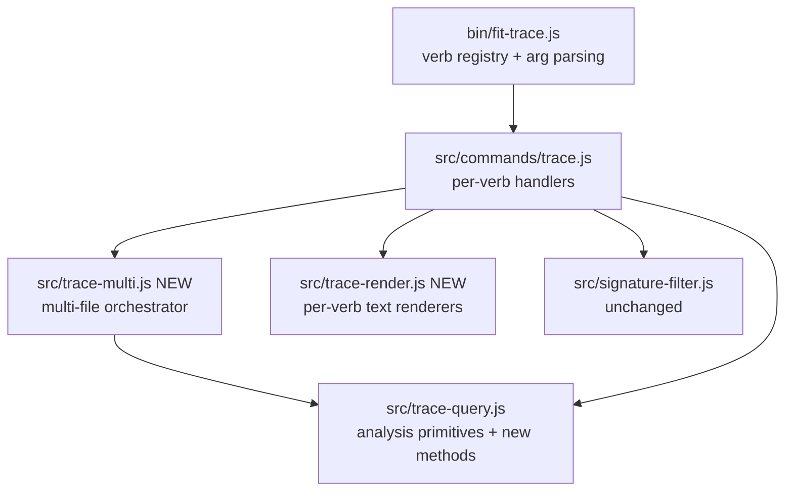

# Design (a): fit-trace CLI quality-of-life for browse-mode analysis

## Problem restated

Spec 1220 ships six user-visible `fit-trace` CLI changes: three aggregator
verbs (`tool-calls`, `commands`, `paths`), variadic file arguments with
source attribution on cross-trace-meaningful verbs, a `compare` verb, default
human-readable output with `--format json` opt-in, and `stats --by-tool` /
`--summary`. The user-facing promise is that the documented grounded-theory
method no longer requires Python wrappers.

## Component map

Two new modules (`trace-multi.js`, `trace-render.js`), three existing files
extended (`bin/fit-trace.js`, `commands/trace.js`, `trace-query.js`), two
documentation surfaces updated (`.claude/skills/fit-trace/SKILL.md`,
`websites/fit/docs/libraries/prove-changes/trace-analysis/index.md`).

## Verb classification

| Class | Verbs | Argv shape |
| --- | --- | --- |
| Cross-trace (variadic, source-tagged when N>1) | `overview`, `count`, `head`, `tail`, `tools`, `errors`, `reasoning`, `timeline`, `stats`, `init`, `filter`, `tool-calls`, `commands`, `paths` | `<files...>` |
| Single-file (extra positional binds one file) | `batch`, `tool <name>`, `turn <index>`, `search <pattern>` | unchanged |
| Two-file (positional pair) | `compare` | `<file-a> <file-b>` |
| Admin / IO (out of scope) | `runs`, `download`, `by-discussion`, `split`, `assert` | unchanged |

`count` and `timeline` emit plain text today; the format flip is a no-op for
them but they stay in the cross-trace class so multi-file invocation gets
source attribution like every other variadic verb. `init` and `filter` go
variadic because their output is per-trace and source attribution makes
cross-case browsing legible without shell loops — the same reason the
aggregator verbs are variadic.

## Query primitives — `src/trace-query.js`

| Addition | Returns | Notes |
| --- | --- | --- |
| `toolCalls()` | `[{turnIndex, name, toolUseId, input, result}]` | `result` is `{content, isError}` joined by `toolUseId`; orphaned calls emit `result: null` (see Key Decisions for sentinel choice) |
| `commands(re?)` | `[{turnIndex, toolUseId, command}]` | Filters `tool_use` blocks where `name === "Bash"`; optional regex tested against `input.command` |
| `paths(prefix?)` | `[{path, count}]` sorted by `count desc`, `path asc` tiebreak | Distinct `input.file_path` across `Read`, `Edit`, `Write`; optional `startsWith` prefix |
| `compare(other)` | `{a:{metadata,turnCount,tools,paths,cost}, b:{...}, delta:[{tool, a, b, diff}]}` | `other` is a peer `TraceQuery`. Each side's `metadata` carries `caseName` and `participant` (sourced from the trace's `metadata` block) per spec criterion 4. `cost` is `stats().totals.totalCostUsd`; `paths` is `paths().length` (cardinality, not the set); `tools` is `toolFrequency().length`. Identical traces emit zero deltas; empty traces emit zeroed counters with `metadata.marker = "(empty)"` on the affected side(s) |
| `statsByTool()` | `{perTool:[{tool, turns, inputTokens, outputTokens, costShare}], totals}` | Each `tool_use` block gets an equal share of its host turn's usage; assistant turns lacking any `tool_use` go to the `(no-tool)` bucket. `costShare` is the bucket's share of total tokens — `(inputTokens + outputTokens) / Σ(inputTokens + outputTokens)`. The largest bucket absorbs rounding error so the column sums to exactly 1.0. `Σ(inputTokens)` and `Σ(outputTokens)` across buckets equal the totals from `stats()` |
| `statsSummary()` | `{totals}` | Existing `stats().totals`; suppresses `perTurn` |

The existing `collectToolUseIds(turns, name)` helper is generalised to return a
`Map<toolUseId, {turnIndex, name, input}>` of every assistant `tool_use` block
(optionally filtered by name) — the shared join key consumed by `toolCalls()`,
`commands()`, and the existing `tool(name)` path.

## Multi-file orchestrator — `src/trace-multi.js`

| Function | Behaviour |
| --- | --- |
| `runOver(files, query)` | Loads each file (basename → `TraceQuery`), calls `query(tq)`, tags each emitted record with `source: <basename>` only when N>1. Concatenates file-then-record order. |
| `aggregate(files, query, key)` | Merges record arrays keyed by `key(record)` summing `count`; produces a single frequency-sorted list. Used by `paths` and `tools`. Records carry `sources: string[]` only when N>1. |
| `compareTwo(a, b)` | Loads two files and returns `traceA.compare(traceB)`. Not variadic. |

Each command handler picks `runOver` (per-record) or `aggregate`
(frequency-rollup) explicitly — no implicit branching inside the orchestrator.

## Output rendering — `src/trace-render.js`

One named export per renderable verb. Each renderer accepts the query
result plus `{multi: boolean, signatures: boolean}` and returns a string.

| Renderer | Default text shape |
| --- | --- |
| `renderToolCalls` | `[turnIdx] <Tool> <toolUseId>` header, `  in: <one-line input>`, `  out: <one-line result or "(no result)">` per block |
| `renderCommands` | `[turnIdx] <command-text>` one per line (grep-friendly, newlines in command text escaped) |
| `renderPaths` | `<count>\t<path>` columns, frequency-sorted |
| `renderCompare` | Two-column block: metadata header, per-row metric, then `Tool | A | B | Δ` delta table |
| `renderStatsByTool` | Columns: `Tool | Turns | In | Out | Share` sorted by `Share desc` |
| `renderStatsSummary` | Totals block only (matches today's `stats().totals` lines) |
| `renderSearch` | `[turnIdx] <match-prefix>: <excerpt>` one record-line per match. Under `--format json`, the matched-block interior carries the new representation per spec criterion 5's `search` exception (top-level envelope shape preserved, interior may change) |
| Other verbs (`overview`, `head`, `tail`, `tools`, `errors`, `reasoning`, `init`, `filter`, `tool`, `turn`, `batch`, `stats`) | Existing JSON shape textified — one record per block, fields newline-separated, no JSON braces or quotes |

Under multi-file invocation, record-per-line renderers (`commands`, `paths`)
prepend `<basename>:` to each line (`grep -H` convention); block renderers
(`tool-calls`, `compare`, `stats`, etc.) emit `# <basename>` header above each
block. Source attribution is suppressed when N==1.

## CLI surface — `bin/fit-trace.js`

| Change | Detail |
| --- | --- |
| Verb registry adds `tool-calls`, `commands`, `paths`, `compare` | Args: `<files...>` (cross-trace class), `<file-a> <file-b>` for `compare` |
| Args change to variadic on cross-trace verbs | Existing `<file>` becomes `<files...>` |
| `head`/`tail` carry `--lines <n>` instead of `[N]` | See Key Decisions for rationale and rejected alternative |
| New global option `--format <text\|json>` | Default `text`; `json` opts back into today's JSON envelope. Accepted on every verb; a no-op on `count`, `timeline`, and admin verbs (they emit their existing text on both settings) |
| `commands` flag `--match <regex>` | Filters records on Bash command text |
| `paths` flag `--prefix <string>` | Filters by `startsWith` |
| `stats` flags `--by-tool`, `--summary` | Existing per-turn output is the default when neither flag is set. Flags compose: `--by-tool` switches the per-turn array to per-tool buckets; `--summary` further suppresses any per-bucket/per-turn array, emitting `totals` only. Under multi-file invocation, `stats` emits one block per file via `runOver`; each block independently satisfies the criterion-6 invariant (`Σ(inputTokens)` and `Σ(outputTokens)` across buckets equal that file's un-flagged `stats` totals). Cross-file aggregation is not performed; structural equivalence is excluded under multi-file per criterion 5 |

`--signatures` is preserved as-is; `--format json` honours it on every verb.
`compare`'s two file positionals bypass the multi-file orchestrator.

## Key decisions

| Decision | Choice | Rejected | Why |
| --- | --- | --- | --- |
| Text renderer location | New `src/trace-render.js` | Inline in `commands/trace.js` | Existing `src/render/` is for live-stream renderers; trace renderers are query-output formatters with a different lifecycle. A separate module keeps `commands/trace.js` focused on dispatch and lets tests import the renderers directly |
| Multi-file orchestrator location | New `src/trace-multi.js` | Inline per handler | The same load-tag-concat / aggregate-and-sort logic repeats across 13 verbs; central residence is the only way to keep source-attribution and aggregation rules consistent |
| Aggregating vs per-record dispatch | Explicit choice in each handler | Heuristic in orchestrator | Two functions (`runOver` vs `aggregate`) read cleaner than a single function with a branching policy parameter; handlers signal intent |
| `head`/`tail` `[N]` positional | Move to `--lines <n>` flag | Keep `head`/`tail` single-file | Variadic `<files...>` cannot coexist with an optional positional `[N]` (parse becomes ambiguous). Keeping them single-file would carve them out of cross-trace browsing — exactly the friction the spec exists to remove. The flag migration is the smaller break and bounded by Risks row 1c (in-repo callers update alongside) |
| Multi-file `stats` aggregation | One block per file via `runOver`; no cross-file token sum | Cross-file sum into a single combined block | Per-file blocks preserve the criterion-6 invariant inside each block and let the analyst spot per-trace cost asymmetry; cross-file sums hide which trace contributed which bucket and break the structural-equivalence story under multi-file |
| `tool-calls` name | Keep the spec's proposed `tool-calls` | Rename to `calls` / `invocations` | Risk row 5 in the spec accepts cross-referencing in `--help` and the published guide as the mitigation; renaming creates a search-term the existing reflection doesn't anticipate |
| `commands` filter semantics | Regex via `new RegExp(val)` tested against `input.command` | Substring | `search` already uses regex on trace content; consistency wins over a second pattern syntax. Substring is achievable via literal regex |
| `paths` filter semantics | Prefix via `String.prototype.startsWith` | Regex | Spec calls out prefix; matches the file-path mental model; avoids regex-escaping path separators |
| `compare` edge cases | Empty trace emits zeroed counters with `metadata.marker = "(empty)"` | Throw on empty | Spec criterion 4 requires non-error behaviour; sentinel parenthesised string mirrors `(no-tool)` |
| Orphan-call sentinel in `tool-calls` | `result: null` (key always present) | `{}` empty object; omitting the key | Spec line 136 requires "present and explicitly empty, never silently dropped". `null` carries that signal in one token without inventing a sub-object shape (`{}` would also have to define what "missing fields" means for `content`/`isError`, expanding the contract); always-present key keeps the JSON shape uniform so downstream `jq` queries don't branch |
| `stats --by-tool` non-tool bucket | Sentinel `(no-tool)` | Bucket name like `_text` or `null` | Claude API tool names are camelCase identifiers; parentheses are guaranteed never to collide |
| `stats --by-tool` cost-share basis | Total tokens — `(input + output) / Σ(input + output)` | Output-only; model-priced USD; input-only | Spec wording is "token-proportional cost share"; total-tokens captures both sides of the bill, doesn't depend on a model-price table that drifts, and stays inside the `[0,1]` invariant. Model-priced share would tie the contract to pricing data outside the trace; output-only ignores the input cost dominant on Sonnet/Opus |
| Cost-share rounding strategy | Largest bucket absorbs the residual so the column sums to exactly 1.0 | Largest-remainder method; banker's rounding | Single-bucket absorption is one line of code and the binding test fixture can assert `sum === 1.0` without modelling rounding error; the residual is bounded by per-bucket precision and never material against `[0, 1]` |
| Structural-equivalence binding | JSON fixtures per affected verb are the binding reference; `--format json` output deep-equals the fixture via `JSON.parse` | Re-derive shapes from runtime | Risks row 2 mitigation pins fixtures as the binding reference; runtime derivation defeats the contract. (Fixture capture cadence is a plan-step concern.) |
| Source attribution shape | `source: <basename>` field in JSON records; `<basename>:` line / `# <basename>` block prefix in text | Full path | Basename is what aggregation needs; full paths inflate record width and leak local layout |

## Out of scope (deferred to plan)

- Exact CHANGELOG copy and migration-note wording (libeval package)
- Test fixture filenames, the deep-equality assertion harness, and the
  fixture-capture step ordering (the binding-fixture contract belongs to
  this design; sequencing belongs to the plan, per spec Risks row 1a which
  governs single-PR shipment)
- Enumeration of in-repo `fit-trace` callers to update alongside the flip
- Wording of the `--help` cross-references between `tool-calls`, `tool`,
  `tools` and the parallel guide edits

— Staff Engineer 🛠️
