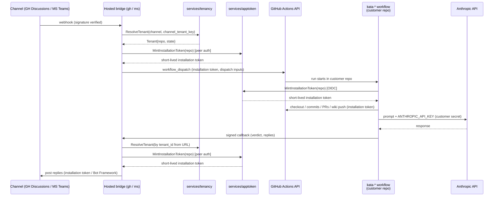

# Design 1270-a — Public hosting for the Kata Agent Team

Architectural design for [spec 1270](spec.md), building on
[design 1230-a](../1230-threaded-discussion-bridges/design-a.md). Adds
three structural pieces to the self-hosted architecture:
`services/apptoken` (single custody point for the public App's
private key; mints short-lived, repo-scoped installation tokens),
`services/tenancy` (the registry), and tenancy in `libraries/libbridge`
(channel-agnostic resolver interface). The kata-dispatch
workflow_dispatch input shape and callback payload schema are
unchanged; the callback URL scheme that the bridge serves gains a
`{tenant_id}` path segment.

## Components

| Component | Responsibility |
|---|---|
| `services/apptoken` | New. Holds the single Forward Impact-owned App private key in process and mints short-lived, **repo-scoped** installation tokens. Two callable surfaces: a control-plane gRPC interface for the bridges (mutual peer authentication; substrate is a plan concern), and a **public HTTPS endpoint** reached from GitHub Actions runners (authenticated via **GitHub Actions OIDC**, with the `repository` claim bounding the issued token). |
| `services/tenancy` | New. Owns the `(channel, channel_tenant_key) → Tenant` registry. Does not hold App-credential material (that lives only in `services/apptoken`) and does not hold any new cryptographic primitive — callback verification is achieved by tenant-binding the inherited 1230 single-use callback token, not by a new signature scheme. |
| `libraries/libbridge` | Adds a channel-agnostic `TenantResolver` interface. Bridges supply the resolver; libbridge imports no channel SDKs. Single-tenant mode returns a fixed `default` tenant; multi-tenant mode calls `services/tenancy`. |
| `services/ghbridge` | Gains multi-tenant mode. Calls `services/apptoken` for installation tokens (replies, reactions). Resolves tenant via `installation_id` from the webhook payload. |
| `services/msbridge` | Gains multi-tenant mode. Holds the multi-tenant **Bot Framework credential** in process — deliberately outside `services/apptoken`'s scope, which is the GitHub App private key only; Bot Framework custody hardening is a follow-on. Validates inbound JWTs against any consenting Microsoft tenant; resolves tenant via the activity's `tenantId`. Calls `services/apptoken` for the GitHub App credential used to dispatch the customer workflow. |
| Hosted GitHub App | Registration artifact (no code). One App owned by Forward Impact, public install URL. Permissions identical to the self-hosted Kata App; webhook subscriptions extended to include `installation`. |
| Hosted Azure AD app + Bot resource | Registration artifact (no code). Multi-tenant, consent-on-install. One Bot Framework resource shared across consenting tenants. |
| `kata-setup` workflow templates | Hosted-path templates carry no reference to the hosted App's private key, replacing every customer-side path that today consumes `KATA_APP_PRIVATE_KEY` with a single OIDC call to `services/apptoken`. The specific upstream actions and input names being replaced are a plan concern. Self-hosted templates unchanged. |
| `TRUST.md` | Repository root document. Enumerates operator access surface for both deployment paths, including what `services/apptoken` can mint and on whose behalf. |

## Data flow

The hosted control plane participates in event transit (webhook → dispatch),
reply transit (callback → channel), and **token issuance** for every kata
workflow. It does not participate in agent execution.



Scheduled and event-triggered kata workflows (every workflow named in
spec § Proposal 2 other than the bridge-dispatched `kata-dispatch.yml`
path above) start at the `GH->>WF` step with no bridge upstream and
re-mint via the same `WF->>AT` OIDC step. Anthropic processing
stays inside the customer's runner.

## Workflow identity

`services/apptoken` is the single point of App-key custody. The key never
leaves this process; callers receive only short-lived installation tokens.

| Caller | Authentication | Token scope |
|---|---|---|
| Customer kata workflow run | GitHub Actions OIDC. The broker validates the OIDC token and consults `services/tenancy.resolveByRepo` to confirm the claimed `repository` has an `active` Tenant row before minting. | The single repository named in the OIDC claim. |
| Hosted bridge | Mutual peer authentication inside the control plane (concrete substrate — mTLS, signed JWT, mesh-issued credential — is a plan concern). The bridge passes the tenant's resolved `repo` from `services/tenancy`. | The single repository the tenancy registry has on the active `Tenant` row. |

`services/apptoken` rejects mint requests when the claimed repo is not
an active installation / `active` tenant row, or when the per-tenant
issuance rate ceiling is exceeded. Token TTL is GitHub's installation-
token maximum; the customer workflow re-mints inside a long run.

## Tenancy abstraction

`libbridge` introduces a channel-agnostic resolver. Channel-specific
extraction (parsing a webhook or Bot Framework activity into a
`(channel, channel_tenant_key)` pair) lives in the calling bridge,
keeping libbridge free of channel SDK dependencies.

```ts
type ChannelTenantKey = { channel: "github-discussions" | "msteams"; key: string };

interface Tenant {
  tenant_id: string;        // stable uuid, registry-owned
  channel: "github-discussions" | "msteams";
  channel_tenant_key: string;   // GitHub: "{installation_id}:{owner}/{name}"; MS: azure tenantId
  repo?: { owner: string; name: string };  // required when state === "active"
  state: "pending_consent" | "active" | "revoked";
}

interface TenantResolver {
  resolve(k: ChannelTenantKey): Promise<Tenant>;     // active tenants only
  resolveByRepo(repo: { owner: string; name: string }): Promise<Tenant>;
  resolveByTenantId(tenant_id: string): Promise<Tenant>;     // for callback path
}
```

`resolveByRepo` exists for `services/apptoken`'s OIDC path (which has
a `repository` claim but no `channel_tenant_key`); both methods return
only `state === "active"` tenants. A GitHub installation may cover
many repositories — the registry creates one row per `(installation_id,
repo)` pair on `repositories_added`, encoded in `channel_tenant_key`.
Teams `pending_consent` rows lack `repo` until the customer self-serves
the mapping (see § Onboarding).

Per-tenant storage isolation. In multi-tenant mode the bridge
instantiates one `DiscussionContextStore` per resolved tenant, each
under storage prefix `tenants/{tenant_id}/`; existing record keys
(`channel:discussion_id`) and libstorage are unchanged. In
single-tenant mode the bridge uses one store with no tenant prefix —
self-hosted data files are read in place without migration.

## Tenant registry

| Field | Notes |
|---|---|
| `tenant_id` | UUID. Registry-owned. |
| `channel_tenant_key` | GitHub: composite `"{installation_id}:{owner}/{name}"`. MS Entra: tenant id. Unique per channel. |
| `repo` | Customer's `owner/name`. Set during onboarding; rotatable via re-onboarding. |
| `created_at` / `last_active_at` | Lifecycle bookkeeping. |
| `state` | `pending_consent` \| `active` \| `revoked`. Only `active` tenants resolve. |

Per-tenant callback verification reuses the inherited 1230 single-use
token. The dispatcher registers the token bound to `(correlation_id,
tenant_id)` and the URL is `/callback/{tenant_id}/{token}`; the
bridge consumes the token and rejects if the URL's tenant id does not
match the token's. No new cryptographic primitive.

Substrate: libindex JSONL initially. Callback verification holds no
per-tenant key/secret material; the verification state is the
`(correlation_id, tenant_id)` binding the bridge's existing
`CallbackRegistry` records at token registration. Production
hardening of the registry substrate is deferred.

## Onboarding

Hosted-mode onboarding is event-driven; self-hosted is configuration.

| Trigger | Handler | Effect |
|---|---|---|
| GitHub App `installation` webhook (`created` / `repositories_added`) | GitHub install handler in `ghbridge` | One `state = active` row per `(installation_id, repo)` pair in the event's repository set. No mapping step — the installation event already names the repos the App may act on. |
| Bot Framework `installationUpdate` activity (`action=add`) | Teams consent handler in `msbridge` | One `state = pending_consent` row keyed by Microsoft `tenantId`. The customer self-serves the repo mapping via a hosted onboarding endpoint; the Forward Impact operator takes no action between consent and mapping. |

A `Tenant` in `pending_consent` does not resolve and `services/apptoken`
does not mint tokens for it. Self-hosted mode is a deployment-time
configuration: each bridge reads a multi-tenant flag from its config
(name is a plan concern). Off → bridge returns the `default` tenant,
`services/tenancy` and `services/apptoken` are not started, `msbridge`
constructs a single-tenant Bot Framework authenticator from
`MICROSOFT_APP_TENANT_ID`. On → the bridge resolves per request and
`msbridge` constructs a multi-tenant authenticator that accepts JWTs
from any `active` tenant.

## Key decisions

| Decision | Chosen | Rejected | Why |
|---|---|---|---|
| GitHub App model | One Forward Impact-owned App, multi-installation | One App per customer | GitHub's App model is already multi-install. Per-customer Apps duplicate registration without changing the trust shape — the operator still holds whichever private key is in use. |
| Azure AD app model | One multi-tenant Azure AD app | One per customer tenant | Bot Framework supports multi-tenant validation natively. Per-tenant apps would require operator action per onboard. |
| App private key custody | Centralized in `services/apptoken` | (a) Each bridge holds the key in process; (b) the key lives in every customer repository's Actions secrets | (a) Duplicates the master credential across processes and forces every bridge to embed key-handling code. (b) Replicates the master credential across every customer's CI environment and is the disqualifying property the spec calls out — incompatible with public-App security. |
| In-workflow authentication to apptoken | GitHub Actions OIDC | (a) A long-lived per-customer secret installed in repository Actions secrets; (b) bridge-issued tokens carried as `workflow_dispatch` inputs | (a) Reintroduces the customer-side long-lived credential the spec exists to eliminate. (b) Bridge-issued tokens cannot reach scheduled workflows (`kata-shift`, `kata-storyboard`) which have no upstream bridge, and a single dispatched token cannot survive a multi-hour run. OIDC reaches every workflow surface uniformly and supports mid-run re-mints. |
| Workflow identity coverage | Every kata workflow on the hosted path uses the same `services/apptoken`-via-OIDC step | Only `kata-dispatch.yml` goes through the broker; scheduled workflows keep a customer-side secret | Mixed-model coverage leaves `KATA_APP_PRIVATE_KEY` in customer repositories and defeats the spec's master-credential criterion. One mechanism across all kata workflows is also one surface to audit. |
| Hosted dispatch identity | `services/apptoken`-minted installation token | Per-user OAuth via `services/ghauth` | Per-user OAuth requires every dispatcher to complete a one-time link flow before they can post — incompatible with the spec's setup-floor reduction. `services/ghauth` remains the dispatch identity for self-hosted operators who want per-user attribution. |
| Token scoping | Per-repo from OIDC claim / per-tenant `repo` row | Per-installation (broader scope) | Per-installation tokens can act on every repository the installation covers; per-repo tokens confine blast radius to the one repository named in the request and align with the OIDC claim used to authenticate the caller. |
| Registry packaging | Standalone gRPC service (`services/tenancy`) | (a) Library inside `libbridge`; (b) table inside `services/ghbridge` shared via direct DB access | Two bridges (and the apptoken service) share one authoritative registry. A library forces every caller to embed the same persistence code. A table inside ghbridge couples msbridge and apptoken to ghbridge's lifecycle. |
| Tenant resolver placement | Channel-agnostic interface in `libbridge`; channel-specific extraction in the calling bridge | Resolver lives entirely in `libbridge` and imports channel SDKs | Putting channel SDK imports in `libbridge` violates its existing "no channel SDKs" invariant. Keeping extraction in the bridge service preserves libbridge as channel-agnostic transport. |
| Storage isolation | One `DiscussionContextStore` instance per resolved tenant, each with a `tenants/{tenant_id}/` storage prefix | (a) Modify `libstorage` to enforce prefixing for every caller; (b) one big shared store with tenant-keyed entries in a single JSONL | libstorage stays caller-injected and unchanged per its existing invariant. Per-tenant store instances keep the existing `channel:discussion_id` key shape and confine a bug at the bridge layer (a missing tenant-prefix tag) to that tenant only, instead of risking cross-tenant key collisions in a shared file. |
| Anthropic key path | Stays in customer's repo secrets; control plane has no access | Proxy through control plane | Proxying would put the key in the operator's blast radius. BYOK keeps the credential, the prompt, and the response on the customer's runner. |
| Workflow execution | Customer's GitHub Actions runner via `workflow_dispatch` and scheduled triggers | Hosted runners managed by Forward Impact | Hosted execution would expand the trust surface to include every tool call and repo write the agents make. Dispatching into the customer's runner keeps execution in the customer's blast radius. |
| Self-hosted code path | Same code, single-tenant mode flag | A separate self-hosted-only bridge | One code path, exercised in two configurations; avoids hosted/self-hosted behaviour drift. |
| Trust model artifact | `TRUST.md` at repo root | Section in CLAUDE.md / README | A standalone document is linkable from external onboarding, the marketplace listing, and Teams app submission. |
| Bot Framework credential custody | Held in `services/msbridge` process | Centralize in `services/apptoken` alongside the GitHub App key | The GitHub App key is consumed by every kata workflow (high-fanout); centralising it gives a uniform OIDC-mint path. The Bot Framework credential is only consumed by `msbridge` itself (no fanout), so the marginal blast-radius win from centralising it does not justify the new in-process boundary; Bot Framework custody hardening is a follow-on (see § Deferred). |
| Callback authentication | Tenant-bind the inherited 1230 single-use token (registry stores `(correlation_id, tenant_id)` on register; bridge rejects on consume if the URL's tenant id mismatches the token's tenant id) | (a) Add a new signature primitive (HMAC or asymmetric) over the callback body per tenant; (b) shared secret across all tenants | (a) Introduces a primitive the spec did not authorize and adds new secret-management surface for no property gain — token-binding alone gives the cross-tenant rejection property the spec asks for. (b) A shared secret means a leak in any tenant's workflow logs compromises all tenants. |
| Callback URL routing | Per-tenant URL path: `/callback/{tenant_id}/{token}` | One URL with tenant inferred from body | Path-level scoping rejects mis-addressed callbacks before body parsing and pairs cleanly with the token-bind-on-register approach above. |
| `services/apptoken` customer-facing transport | Public HTTPS endpoint reached directly from GitHub Actions runners | Proxy OIDC mint requests through `services/ghbridge` | Scheduled runs (`kata-shift`, `kata-storyboard`) never call ghbridge; proxying their OIDC mints through it would expand ghbridge's attack surface and couple apptoken's availability to ghbridge's. A direct public endpoint keeps the mint path uniform. |

## What this design does not cover

- Publish-time artefacts (marketplace listing, App icon, screenshots,
  Teams catalog metadata).
- Concrete protobuf schemas for `services/tenancy` and `services/apptoken`.
- Exact GitHub Actions OIDC claim-validation rules; the design
  constraint is that the broker scopes minted tokens to the
  OIDC-asserted repository.
- Rate limiting and DoS posture beyond per-tenant scoping.
- KMS/HSM custody and rotation for the hosted App private key.
- Replacement of libindex JSONL with a managed datastore.
- Exact `TRUST.md` text (content is in scope, drafting is a plan concern).
- Migration paths between self-hosted and hosted deployments.
