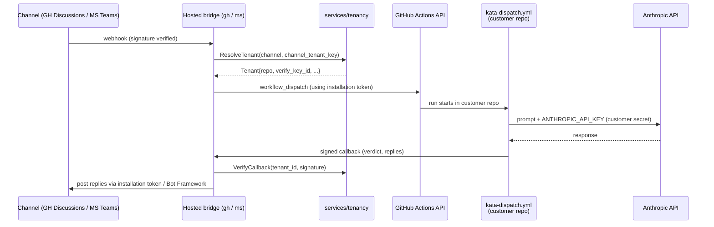

# Design 1270-a — Public hosting for Kata bridges

Architectural design for [spec 1270](spec.md). Builds on the bridge pattern
established by [design 1230-a](../1230-threaded-discussion-bridges/design-a.md):
adds tenancy to `libbridge`, multi-tenant modes to `services/ghbridge` and
`services/msbridge`, and a new `services/tenancy` service that owns the
installation-to-repository registry. The kata-dispatch workflow contract is
unchanged.

## Components

| Component | Responsibility |
|---|---|
| `libraries/libbridge` | Adds a channel-agnostic `TenantResolver` interface. Callers (the bridge services) supply a resolver implementation; libbridge does not import channel SDKs. In single-tenant mode the supplied resolver returns a fixed `default` tenant; in multi-tenant mode it calls the tenancy service. |
| `services/tenancy` | New gRPC service. Owns the registry mapping `(channel, channel_tenant_key) → Tenant`. Owns the per-tenant **callback verification material** used to authenticate inbound workflow callbacks. Distinct from the App-level credentials that each bridge holds for outbound API calls (see below). |
| `services/ghbridge` | Gains multi-tenant mode. Holds the single Forward Impact-owned **App private key** in process (one credential, not per-tenant) and mints per-installation tokens on demand from the resolved `channel_tenant_key`. Posts replies via that installation token. |
| `services/msbridge` | Gains multi-tenant mode. Holds the single multi-tenant **Bot Framework credential** (one credential, not per-tenant) and validates inbound JWTs against any consenting Microsoft tenant. Resolves tenant via the activity's `tenantId`. |
| Hosted GitHub App | Registration artifact (no code). One App owned by Forward Impact, public install URL. Permissions identical to the self-hosted Kata App. |
| Hosted Azure AD app + Bot resource | Registration artifact (no code). Multi-tenant, consent-on-install. One Bot Framework resource shared across consenting tenants. |
| `TRUST.md` | Repository root document. Enumerates operator access surface for both deployment paths. |

## Data flow



The control plane participates in event transit (webhook → dispatch) and reply
transit (callback → channel). It does not participate in agent execution. The
Anthropic key, prompt processing, tool results, and conversation execution
live entirely inside the customer's GitHub Actions runner.

## Tenancy abstraction

`libbridge` introduces a channel-agnostic resolver. Channel-specific
extraction (parsing a webhook body or a Bot Framework activity into a
`(channel, channel_tenant_key)` pair) lives in the calling bridge service —
keeping libbridge free of channel SDK dependencies per its existing
invariants.

```ts
type ChannelTenantKey = { channel: "github-discussions" | "msteams"; key: string };

interface Tenant {
  tenant_id: string;        // stable uuid, registry-owned
  channel: "github-discussions" | "msteams";
  channel_tenant_key: string;   // installation_id (GH) | azure tenantId (MS)
  repo?: { owner: string; name: string };  // populated when state === "active"
  state: "pending_consent" | "active" | "revoked";
  verify_key_id: string;        // opaque id; secret material never crosses RPC
}

interface TenantResolver {
  resolve(k: ChannelTenantKey): Promise<Tenant>;   // only returns active tenants in multi-tenant mode
}
```

`repo` is optional because onboarding may create rows in `pending_consent`
before the customer maps a repository (see § Onboarding).

`DiscussionContext` keys gain a tenant prefix: the bridge constructs every
storage path as `tenants/{tenant_id}/discussions/{discussion_id}` before
calling libstorage. libstorage itself is unchanged — the isolation
invariant is enforced by the bridge's path-construction discipline, the
same shape `DiscussionContextStore` already uses today.

## Tenant registry

The tenancy service persists:

| Field | Notes |
|---|---|
| `tenant_id` | UUID. Registry-owned. |
| `channel_tenant_key` | GitHub `installation_id` or MS Entra `tenant_id`. Unique per channel. |
| `repo` | Customer's `owner/name`. Set during onboarding; rotatable via re-onboarding. |
| `verify_key_id` | Opaque id for the per-tenant callback verification material. Secret material lives in the tenancy service's keystore and never crosses the gRPC boundary; the bridge calls `VerifyCallback(tenant_id, signature, body)` instead of pulling the key. |
| `created_at` / `last_active_at` | Lifecycle bookkeeping. |
| `state` | `pending_consent` \| `active` \| `revoked`. Only `active` tenants resolve. |

The keystore uses the libindex JSONL pattern already established in this
repo. Production hardening (managed datastore, KMS) is deferred — see § What
this design does not cover.

## Onboarding

Hosted-mode onboarding is event-driven; self-hosted mode uses configuration,
not runtime triggers.

| Trigger | Handler role | Effect |
|---|---|---|
| GitHub App `installation` webhook (`created` / `repositories_added`) | GitHub install handler in `ghbridge` | Creates a `Tenant` row keyed by `installation_id`, `state = pending_consent`. The customer maps to `owner/name` via a one-shot config endpoint to advance to `active`. |
| Bot Framework `installationUpdate` activity (`action=add`) | Teams consent handler in `msbridge` | Creates a `Tenant` row keyed by Microsoft `tenantId`, `state = pending_consent`. Customer maps to `owner/name` to advance to `active`. |

A `Tenant` in `pending_consent` does not resolve; the bridge rejects
inbound channel events for it until the customer completes the repo
mapping step.

**Self-hosted mode** is not an onboarding path — it is a deployment-time
configuration. The bridge runs with `SERVICE_*_MULTI_TENANT` unset; the
supplied `TenantResolver` returns a fixed `default` tenant unconditionally
and the tenancy service is not started. The existing
`MICROSOFT_APP_TENANT_ID` single-value JWT validation in `msbridge`
remains in force in this mode and is bypassed only when multi-tenant mode
is enabled.

## Key decisions

| Decision | Chosen | Rejected | Why |
|---|---|---|---|
| GitHub App model | One Forward Impact-owned App, multi-installation | One App per customer | GitHub's App model is already multi-install. Per-customer Apps duplicate registration without changing the trust shape — the operator still holds whichever private key is in use. |
| Azure AD app model | One multi-tenant Azure AD app | One per customer tenant | Bot Framework supports multi-tenant validation natively. Per-tenant apps would require operator action per onboard. |
| Registry packaging | Standalone gRPC service (`services/tenancy`) | (a) library inside `libbridge` consumed by each bridge; (b) table inside `services/ghbridge` shared via direct DB access | Two bridges (and any future channel) share one authoritative registry. A library would force every bridge to embed the same persistence and keystore code and reimplement consistency on its own. A table inside ghbridge would couple msbridge to ghbridge's lifecycle and process boundary. A standalone service follows the established `services/CLAUDE.md` pattern and keeps callback-verification material on one process. |
| Tenant resolver placement | Channel-agnostic interface in `libbridge`; channel-specific extraction in the calling bridge | Resolver lives entirely in `libbridge` and imports channel SDKs | Putting channel SDK imports in `libbridge` violates its existing "no channel SDKs" invariant (per `libraries/libbridge/CLAUDE.md`). Keeping extraction in the bridge service preserves libbridge as channel-agnostic transport. |
| Storage isolation | Tenant prefix in the path the bridge constructs before calling libstorage | (a) modify `libstorage` to enforce prefixing; (b) one libstorage instance per tenant | libstorage stays caller-injected and unchanged (per its existing invariant). The bridge's `DiscussionContextStore` already constructs paths; gaining a `tenant_id` segment is a path-construction change, not a libstorage change. Per-tenant instances complicate process startup without adding a guarantee against a buggy bridge. |
| Anthropic key path | Stays in customer's repo secrets; control plane has no access | Proxy through control plane | Proxying would put the key in the operator's blast radius. BYOK keeps the credential, the prompt, and the response on the customer's runner. |
| Workflow execution | Customer's GitHub Actions runner via `workflow_dispatch` | Hosted runners managed by Forward Impact | Hosted execution would expand the trust surface to include the agent's tool calls and repo writes. Dispatching into the customer's runner keeps execution in the customer's blast radius. |
| Self-hosted code path | Same code, single-tenant mode flag | A separate self-hosted-only bridge | One code path, exercised in two configurations. Avoids drift between hosted and self-hosted behaviour. |
| Trust model artifact | `TRUST.md` at repo root | Section in CLAUDE.md / README | A standalone document is linkable from external onboarding pages, the marketplace listing, and the Teams app submission. CLAUDE.md is internal. |
| Callback authentication | Per-tenant secret material in the tenancy keystore; bridges verify via a `VerifyCallback(tenant_id, signature, body)` RPC that does not return the key | A single shared secret across all tenants | A shared secret means a leak in any tenant's workflow logs compromises all tenants. Per-tenant material confines blast radius. The specific cryptographic primitive (HMAC vs asymmetric) is a plan concern; the design constraint is per-tenant isolation and that the verification material never leaves the tenancy service. |
| Callback URL routing | Per-tenant callback URL path: `/callback/{tenant_id}/{token}` | One URL with tenant inferred from body | Path-level scoping rejects mis-addressed callbacks before body parsing and aligns the tenant id with the audit and rate-limit dimensions. Exposing `tenant_id` in the URL is acceptable because it is an opaque registry-owned UUID, not a secret, and the per-tenant `token` carries the authority. |

## What this design does not cover

- The marketplace listing copy, App icon, screenshots, or any publish-time
  artefact for the GitHub App and the Teams app catalog entry.
- The concrete protobuf schema for `services/tenancy`.
- Rate limiting, abuse prevention, and DoS posture on the hosted control
  plane beyond per-tenant scoping.
- KMS integration and rotation procedures for the App private key and the
  Bot Framework secret.
- Replacement of libindex JSONL with a managed datastore.
- The exact text of `TRUST.md` — content is in scope, drafting is a plan
  concern.
- Migration paths between self-hosted and hosted deployments.
