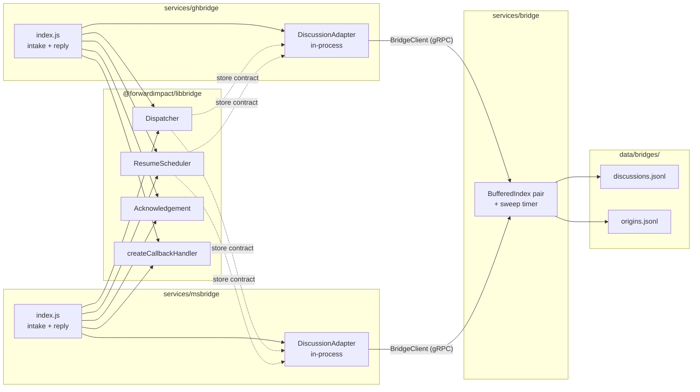

# Design 1300-a — svcbridge

Architectural design for [spec 1300](spec.md). A new gRPC service owns
the canonical discussion and origin records; both bridges call it
through generated clients while keeping their existing libbridge
composition. `ResumeScheduler`'s contract with its `store` parameter
widens so the resume lifecycle still works over a remote backend.

## Component boundary

The libbridge box ships no gRPC dependency. Each bridge's
`DiscussionAdapter` is the only thing that imports the generated client,
and it presents a store-shaped object to `Dispatcher` and
`ResumeScheduler`.

## Components

| Component | Role |
|---|---|
| `services/bridge/` | New gRPC service. Follows the `services/CLAUDE.md` layout (server entry, implementation, `proto/`, `test/`) and the peer naming convention — a bare directory name (`bridge`, matching `services/{trace,graph,vector}`) with the `svc`-prefix carried only by the npm package (`@forwardimpact/svcbridge`). Sits beside its `ghbridge`/`msbridge` clients. Owns the only on-disk discussion and origin state and runs the periodic sweep. |
| `services/bridge/proto/bridge.proto` | Declares `package bridge`, `service Bridge`, message `Discussion` (the persisted record the service stores; `service Bridge` leaves the bare `Discussion` name free of any service/message collision), `Origin`, `OpenRfc`, `Participant`, `ResumeTrigger`, plus a small set of request/response messages. |
| `services/bridge/index.js` | Implements `Bridge` over two `BufferedIndex` stores constructed against one shared `StorageInterface` rooted at `data/bridges/`. The service's own config block is `service.bridge.*` (the registered name on `createServiceConfig("bridge")`). |
| `services/{gh,ms}bridge/index.js` | Construct a `BridgeClient` at startup via `createClient("bridge", …)`. Wrap the client in a `DiscussionAdapter` (a small in-process object) and pass that adapter wherever the old `DiscussionContextStore` instance went. ghbridge calls `client.HasOrigin` / `client.RecordOrigin` from the webhook intake and reply paths without going through the adapter. |
| `libraries/libbridge` | Loses `discussion-context.js` and `origin-index.js`. `ResumeScheduler` widens its store contract to consume `loadByCorrelation` and `listOpenRecesses` (see § Key decisions); everything else stays. |

## Naming map

| Surface | Identifier |
|---|---|
| Service directory | `services/bridge/` (bare, matching peers like `services/trace`) |
| npm package | `@forwardimpact/svcbridge` |
| Proto file | `bridge.proto` |
| Proto package | `bridge` |
| gRPC service | `Bridge` |
| Generated base / client | `BridgeBase` / `BridgeClient` |
| Service implementation | `BridgeService` (extends `BridgeBase`) |
| Config block | `service.bridge.*` (registered via `createServiceConfig("bridge")`) |
| Supervisor entry name | `bridge` (bare, matching peer entries like `trace`, `graph`) |

These are not free variables. `createServiceConfig(name)` sets `config.name`, and librpc resolves the gRPC service from it: `getServiceDefinition` looks up `definitions[name.toLowerCase()]` (`librpc/src/base.js`) and both `Server` and `Client` do `capitalizeFirstLetter(config.name)` to name the gRPC service. libcodegen derives the generated dir, the definitions key, and the export prefix from the **proto file basename**, and the class inside each artifact from the in-proto `service` declaration (`libcodegen/src/base.js`, `services.js`, `definitions.js`). So the invariant is: **`config.name` (lowercased) == proto-file basename == lowercased gRPC service name.** The npm package and directory names are decoupled from this chain — `svc` lives only in the package/bin, exactly as peers do it. Aligning the config identifier therefore forces the proto file, proto package, and gRPC service to move with it.

## Discussion record on the wire

`Discussion` mirrors the existing in-memory shape one-for-one so
the record factory and dispatcher mutations do not change. The
persisted JSONL on disk follows the proto field names.

| Field | Proto type | Notes |
|---|---|---|
| `id` | `string` | `<channel>:<discussion_id>` — the libindex key. |
| `channel` | `string` | `"github-discussions"` or `"msteams"`. |
| `discussion_id` | `string` | Channel-side thread id. |
| `lead` | `string` | Conversation lead. |
| `last_active_at` | `int64` | Epoch ms. Sweep input. |
| `dispatches` | `repeated int64` | Rate-limiter input. |
| `history` | `repeated HistoryEntry` | `{ role, text }`. |
| `participants` | `repeated Participant` | `{ name, kind, external_id, metadata_json }`. |
| `open_rfcs` | `map<string, OpenRfc>` | Correlation id → `{ trigger, opened_at, history_index_at_open, due_at }`. |
| `pending_callbacks` | `map<string, string>` | Token → correlation id. Travels with the record per spec. |

`OpenRfc.trigger` is a typed `ResumeTrigger` message — `{ kind, responses, elapsed }` — so the on-disk field name remains `trigger` (preserving the spec's "persisted record shape is unchanged" requirement). `OpenRfc.due_at` is encoded as `optional int64` because `ResumeScheduler.enterRecess` only sets it for `elapsed` and `either` triggers; `ResumeScheduler.rearm` keys arming on field presence, not on the proto3 default `0`.

`Origin` is flat: `{ id, discussion_id, posted_at }`. Opaque per-participant metadata (Bot Framework `ConversationReference`, GitHub node metadata) rides as a JSON string because it is channel-shaped and outside this service's concern.

## RPC contract

| RPC | Request | Response | Caller |
|---|---|---|---|
| `LoadDiscussion` | `{ channel, discussion_id }` | `Discussion` or gRPC `NOT_FOUND` | Adapter `loadByChannel`. |
| `LoadDiscussionByCorrelation` | `{ correlation_id }` | `Discussion` or gRPC `NOT_FOUND` | Adapter `loadByCorrelation`. Lets `ResumeScheduler` find the owning record when an elapsed timer fires. |
| `ListOpenRecesses` | `common.Empty` | `repeated OpenRecessRef { correlation_id, due_at }` | Adapter `listOpenRecesses`. Server-side filter: returns one entry per open RFC that has a `due_at` set. Response-only triggers are excluded because `ResumeScheduler.rearm` only arms elapsed timers. |
| `SaveDiscussion` | `Discussion` | `common.Empty` | Adapter `save` — the single hot-path write that today is `add+flush`. |
| `HasOrigin` | `{ id }` | `{ exists: bool }` | ghbridge's `#handleDiscussionComment` self-echo guard. |
| `RecordOrigin` | `Origin` | `common.Empty` | ghbridge's `recordOrigin` callback inside `#handleReply`. |
| `Sweep` | `{ now: optional int64 }` | `{ evicted_discussions: int32, evicted_origins: int32 }` | Tests only. Absent `now` ⇒ server uses `Date.now()`. Production uses the server-internal 60 s timer. |

## Adapter contract (bridge side)

`DiscussionAdapter` is the only new abstraction on the bridge side. It wraps the generated `BridgeClient` and satisfies the contract `Dispatcher` and `ResumeScheduler` consume:

| Method | Implementation |
|---|---|
| `loadByChannel(channel, id)` | `client.LoadDiscussion`, returns `null` on gRPC `NOT_FOUND`. |
| `loadByCorrelation(correlationId)` | `client.LoadDiscussionByCorrelation`, returns `null` on gRPC `NOT_FOUND`. |
| `listOpenRecesses()` | `client.ListOpenRecesses` → array of `{ correlationId, due_at }`. |
| `add(ctx)` | `client.SaveDiscussion(ctx)`. |
| `flush()` | No-op. The server-side `BufferedIndex` owns batching, so a `SaveDiscussion` returns when the record is in the service's in-memory index but not necessarily on disk. See § Key decisions on the write-barrier shift this introduces. |
| `shutdown()` | No-op on the bridge side. The service drains its own buffer through librpc's SIGTERM handler. The previous bridge-side `store.shutdown()` flush gate disappears with the in-process buffer; bridges no longer drain anything on stop. |

`Dispatcher.dispatch` only uses `.add` and `.flush` and is satisfied by this adapter unchanged. `ResumeScheduler` consumes `loadByCorrelation` and `listOpenRecesses` from the adapter to drive its rearm and elapsed-fire paths; that contract widening keeps the resume lifecycle working over a remote backend without leaking gRPC into libbridge.

## Storage layout

The service constructs one `StorageInterface` rooted at `bridges/`, resolved by `libstorage` to `data/bridges/` from the monorepo root, and hands it to two `BufferedIndex` instances using the existing index keys (`discussions.jsonl`, `origins.jsonl`). Both files land at the canonical paths the spec requires, owned by a single process. The discussion store keeps the current 5 s / 1000-entry buffer; the origin store keeps the current 1 s / 100-entry buffer. Both can be overridden via `service.bridge.*`.

A single sweep timer evicts records older than the TTL from both indexes; the cadence carries over from today's `DEFAULT_SWEEP_INTERVAL_MS` (60 s). The discussion side keeps the existing 24 h `conversationTtlMs`. The origin side gains a periodic timer it did not have before — today's `OriginIndex.sweep(now)` is caller-driven; the service moves it onto the same cadence as discussions to put both indexes under one lifecycle. The origin TTL stays at 24 h.

## Key decisions

| Decision | Chosen | Rejected | Why |
|---|---|---|---|
| Surface shape | One `Bridge` service with seven RPCs covering both record kinds | Two services split by record kind (discussion + origin) | Spec mandates a single interface. Matches `trace.Trace` and `graph.Graph` — one proto, one stub, one supervised process. |
| Resume contract over gRPC | Widen the store contract with `loadByCorrelation` and `listOpenRecesses`; amend `ResumeScheduler` to use them in place of `store.loaded` / `store.loadData()` / `store.index.values()` | Keep the four-method adapter (`loadByChannel`, `add`, `flush`, `shutdown`) and let `ResumeScheduler.rearm` and `#findContextWithRfc` fail | The current `ResumeScheduler` reaches past `loadByChannel` to walk every record. A 4-method adapter cannot satisfy that. Either widen the contract or move resume into the service; widening keeps the dispatcher + scheduler composition on the bridge side, which is what the libbridge contract is designed around. |
| Message name | `Discussion` | `Discussion` | With the service named `Bridge`, the bare `Discussion` name is free — no service/message collision — and no peer service names a message after its service, which `Discussion` still honours. `Discussion` reads as the record `Bridge` stores; the `Record` suffix would be redundant. |
| Not-found channel | gRPC `NOT_FOUND` status from `LoadDiscussion` / `LoadDiscussionByCorrelation` | Sentinel empty `id` on a default-constructed `Discussion` | No peer service currently signals absence — every other librpc method either returns a collection or is a write that does not fail with "missing." `NOT_FOUND` is the standard gRPC status for this case, and the adapter translates it to `null` so bridge call sites read exactly as they do today. |
| Resume trigger over the wire | Typed `ResumeTrigger` message; on-record field name stays `trigger` | `string trigger_json` carrying the JSON-serialised trigger | A typed message keeps the spec's "persisted record shape is unchanged" intact — the on-disk JSONL field is still `trigger`, not `trigger_json` — and gives the service introspection over recess state if a future tool wants it. |
| Opaque participant metadata | JSON string per participant | `google.protobuf.Struct` or first-class proto fields | The Bot Framework `ConversationReference` and GitHub node metadata are channel-shaped and outside this service's concern. A JSON string keeps the contract minimal and matches how the JSONL already round-trips these blobs. |
| Sweep ownership | Server-internal 60 s timer plus a `Sweep` RPC for tests | Bridge-driven sweep | The TTL is store-owned, not caller-owned. A test-callable RPC keeps the integration test deterministic without exposing scheduling to production callers. The origin index gains a periodic timer it did not have before — intentional, so both indexes share one lifecycle. |
| Origin path on ghbridge | Direct `client.HasOrigin` / `client.RecordOrigin` calls; no adapter wrapper | Wrap the client in an `OriginIndex`-shaped class in libbridge | The actual call sites are explicit; the previous `.flush()` after each reply and the `.shutdown()` on stop disappear because the service owns batching and its own lifecycle. |
| Storage root | `createStorage("bridges")` inside the service, both indexes share it | Per-service root (`createStorage("bridge")`) with `indexKey` overrides | Lands the two files at the canonical paths the spec requires with no `indexKey` gymnastics. The bridges' previous `bridges/{ghbridge,msbridge}/` directories are not read or written by any code after cutover. |
| Buffering / durability | Server keeps the existing `BufferedIndex` cadences; adapter `flush()` is a no-op | Per-call synchronous append, or pass-through buffering on the client | Per-call append would slow the hot path. Client-side buffering would lose state when the bridge crashes. Server-side buffering keeps the simplest viable shape. |
| Write-barrier semantics | `Dispatcher.dispatch` and `ResumeScheduler.#fireElapsed` treat `add` + `flush` as a hard write barrier today; under this design `add` succeeds when the record is in the service's in-memory index but not necessarily on disk, and `flush` is a no-op | Issue a synchronous server-side flush from `flush()` on every call | Today a per-bridge crash loses that bridge's unflushed buffer. Under this design a `bridge` service crash loses any unflushed buffered writes from both bridges at once — the same window, larger blast radius. The plan must accept this trade or revisit the write-barrier. |
| Service supervision | Any starter that supervises a bridge also lists `bridge` in its `init.services` ahead of the bridge entries | Lazy connection with retries from the bridges | None of the shipped starters supervise the bridges today, so the design states the conditional rule rather than naming a concrete starter. Where a starter does bundle them, `bridge` must come first so the bridges' `createClient("bridge", …)` resolves at startup. |

## What this design does not cover

- The agent-facing tool surfaces over the new store (cross-bridge lookup, history recall). Foundation only; the follow-up spec for the tool catalogue will add RPCs without changing the underlying store.
- Concrete file paths, function signatures, or execution ordering inside any of the components above — those are plan concerns.
- The shape of the bridge fakes used in tests beyond the contract the adapter satisfies.
- Removal of the per-bridge legacy files under `data/bridges/{ghbridge,msbridge}/` on operator machines. The clean break means no code reads or writes them; cleanup is operational, not a code change.
