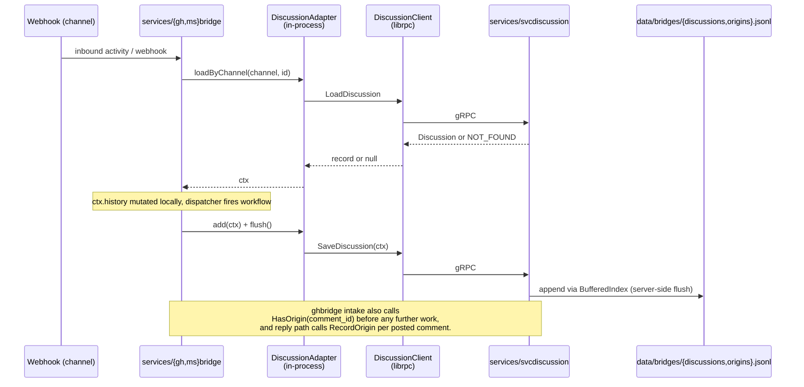

# Design 1300-a — svcdiscussion

Architectural design for [spec 1300](spec.md). A new gRPC service owns
the canonical discussion and origin records; both bridges call it
through generated clients while keeping their existing
`libbridge`-shaped composition intact.

## Components

| Component | Role in this design |
|---|---|
| `services/svcdiscussion/` | New gRPC service. Follows `services/CLAUDE.md` layout (server entry, implementation, `proto/`, `test/`). Holds the only on-disk discussion and origin state; runs the periodic sweep. |
| `services/svcdiscussion/proto/discussion.proto` | Declares package `discussion` and service `Discussion`. Five RPCs: `LoadDiscussion`, `SaveDiscussion`, `HasOrigin`, `RecordOrigin`, `Sweep`. |
| `services/svcdiscussion/index.js` | Implements `Discussion` over two `BufferedIndex`-backed stores constructed against one shared `StorageInterface` rooted at `data/bridges/`. |
| `services/ghbridge/`, `services/msbridge/` | Construct a `DiscussionClient` at startup via `createClient("discussion", …)`. The local-store dependency they pass to `Dispatcher` and `ResumeScheduler` is a thin in-process adapter over that client. ghbridge calls `HasOrigin` / `RecordOrigin` directly from its webhook intake and reply paths. |
| `libraries/libbridge` | Loses `discussion-context.js` and `origin-index.js`. Keeps `Acknowledgement`, `CallbackRegistry`, `Dispatcher`, `ResumeScheduler`, `RateLimiter`, `ElapsedScheduler`, the callback handler, the prompt/history/trigger helpers, `createBridgeServer`, `newDiscussionContext`, and the payload validator. `Dispatcher` and `ResumeScheduler` keep their store-shaped duck-typed contract (`.loadByChannel`, `.add`, `.flush`) unchanged. |

## Data flow

The sweep loop runs entirely inside `svcdiscussion`: a 60-second
interval evicts records whose `last_active_at` is older than the
configured 24-hour TTL. The `Sweep` RPC exists for deterministic tests
(callable with an explicit `now`) and is not called by either bridge in
production.

## Discussion record on the wire

`Discussion` mirrors the existing in-memory shape one-for-one so the
record factory (`newDiscussionContext`) and the dispatcher's mutations
do not change. Opaque payloads (Bot Framework `ConversationReference`,
GitHub node metadata) ride as a JSON string on each participant, the
same way they survive the existing JSONL round-trip.

| Field | Proto type | Notes |
|---|---|---|
| `id` | `string` | `<channel>:<discussion_id>` — the libindex key. |
| `channel` | `string` | `"github-discussions"` or `"msteams"`. |
| `discussion_id` | `string` | Channel-side thread id. |
| `lead` | `string` | Carries the conversation lead. |
| `last_active_at` | `int64` | Epoch ms. Sweep input. |
| `dispatches` | `repeated int64` | Rate-limiter input. |
| `history` | `repeated HistoryEntry` | `{ role, text }`. |
| `participants` | `repeated Participant` | `{ name, kind, external_id, metadata_json }`. |
| `open_rfcs` | `map<string, OpenRfc>` | Correlation id → `{ trigger_json, opened_at, history_index_at_open }`. |
| `pending_callbacks` | `map<string, string>` | Token → correlation id. Travels with the record per spec. |

`Origin` is flat: `{ id, discussion_id, posted_at }`.

## RPC contract

| RPC | Request | Response | Bridge call site |
|---|---|---|---|
| `LoadDiscussion` | `{ channel, discussion_id }` | `Discussion` (empty `id` ⇒ not found) | `loadByChannel` inside `#loadOrCreateContext` and the inbound paths in both bridges. |
| `SaveDiscussion` | `Discussion` | `common.Empty` | The single hot-path write that today is `await store.add(ctx); await store.flush()`. |
| `HasOrigin` | `{ id }` | `{ exists: bool }` | ghbridge's `#handleDiscussionComment` self-echo guard. |
| `RecordOrigin` | `Origin` | `common.Empty` | ghbridge's `recordOrigin` callback inside `#handleReply`. |
| `Sweep` | `{ now: int64 (optional) }` | `{ evicted: int32 }` | Tests only; production uses the server-internal timer. |

## In-process adapter (bridge side)

Both `Dispatcher` and `ResumeScheduler` already accept any store-shaped
object with `.loadByChannel`, `.add`, `.flush`. Each bridge's
`server.js` wraps its `DiscussionClient` in a four-method adapter and
passes that wherever the old `DiscussionContextStore` instance went:

| Adapter method | Implementation |
|---|---|
| `loadByChannel(channel, id)` | `client.LoadDiscussion({ channel, discussion_id: id })`, returns `null` on empty id. |
| `add(ctx)` | `client.SaveDiscussion(ctx)`. |
| `flush()` | No-op — the service's `BufferedIndex` owns batching. |
| `shutdown()` | No-op — the service owns its own lifecycle. |

The adapter keeps the libbridge invariant intact: `libbridge` ships no
gRPC dependency, and the channel-agnostic primitives still talk to a
store-shaped duck. ghbridge's origin path bypasses the adapter and
calls the client directly because `OriginIndex` was only ever a
two-method type and the call sites are explicit.

## Storage layout

The service constructs one `StorageInterface` rooted at `bridges/`
(resolved by `libstorage` to `data/bridges/` from the monorepo root) and
hands it to two `BufferedIndex` instances using the existing index keys
(`discussions.jsonl`, `origins.jsonl`). The two files therefore land at
the canonical paths the spec requires, owned by a single process. The
discussion store keeps the current 5 s / 1000-entry buffer; the origin
store keeps the current 1 s / 100-entry buffer. Sweep cadence and TTL
default to today's values and are overridable via
`service.discussion.{sweepIntervalMs,conversationTtlMs}`.

## Key decisions

| Decision | Chosen | Rejected | Why |
|---|---|---|---|
| Surface shape | One `Discussion` service with five methods covering both record kinds | Two services (`Discussion` + `Origin`) | Spec mandates a single interface. Matches the `trace.Trace` and `graph.Graph` shape — one proto, one stub, one generated client — and lets the service supervise one lifecycle. |
| Sweep ownership | Server-internal 60 s timer plus a `Sweep` RPC for tests | RPC-only sweep driven by a bridge cron, or every-call lazy eviction | Bridges should not own the TTL — both today and after this design the per-channel state is owned by the store, not the caller. A test-callable RPC keeps the integration test deterministic without exposing scheduling to production callers. |
| Record format on the wire | Full PUT of the `Discussion` message on every save | Delta API (`AppendHistory`, `SetOpenRfc`, …) | A delta API would freeze today's mutation set into the proto; the foundation is meant to enable future tools (cross-bridge lookup, history recall), and a single getter/setter pair is easier to evolve. The hot path today is one in-memory mutation followed by `add+flush`, so PUT semantics are already what the bridges do. |
| Opaque participant metadata | JSON string per participant | `google.protobuf.Struct` or first-class proto fields | The Bot Framework `ConversationReference` and GitHub node metadata are channel-shaped and outside this service's concern. A JSON string keeps the contract minimal and matches how the JSONL already round-trips these blobs. |
| Bridge-side integration | A four-method in-process adapter over the gRPC client, passed to `Dispatcher` and `ResumeScheduler` unchanged | Change `Dispatcher`/`ResumeScheduler` to take a client directly | The adapter preserves the libbridge invariant ("no channel SDKs or service SDKs in the library") and keeps the dispatcher/scheduler composable for any future store backend. The cost is twelve lines per bridge — well below the cost of widening the libbridge contract. |
| Origin path on ghbridge | Direct `client.HasOrigin` / `client.RecordOrigin` calls | Wrap the client in an `OriginIndex`-shaped class in libbridge | `OriginIndex` exists today only because `BufferedIndex` made it cheap; the actual call surface is two methods, used at two call sites. A library wrapper would import the gRPC client (invariant violation) and add a layer that hides nothing. |
| Storage root | `createStorage("bridges")` shared by both indexes inside the service | Per-service root (`createStorage("bridges/svcdiscussion")`) with `indexKey` overrides | The spec names the exact on-disk paths. Rooting at `bridges/` lands the two files at `data/bridges/discussions.jsonl` and `data/bridges/origins.jsonl` with no `indexKey` gymnastics. |
| Buffering | Server keeps existing `BufferedIndex` cadences (5 s / 1000 for discussions, 1 s / 100 for origins); adapter `flush()` becomes a no-op | Per-call synchronous append on the server, or pass-through buffering on the client | Per-call append would slow the hot path under load; client-side buffering would lose state when a bridge crashes. The service is now the only writer, so its own buffering is sufficient and matches today's durability behaviour. |
| Test seams | Bridge tests construct a fake `DiscussionClient` and the same adapter wrapper; service tests use `createMockStorage` against the real `BufferedIndex` pair | Mount the real service in-process in every bridge test | A fake client keeps bridge tests fast and focused on bridge logic; the service has its own test directory for store behaviour. Both layers can still grow integration tests later without restructuring. |
| Service supervision | The supervised-services list in the starter configuration gains `svcdiscussion` ahead of both bridges | Lazy connection from the bridges with retries | Today's starter shape gives every gRPC service a fixed start-up order; adding `svcdiscussion` to the same list keeps the lifecycle predictable and uses the same machinery `trace`, `graph`, etc. already rely on. |

## What this design does not cover

- The agent-facing tool surfaces over the new store (cross-bridge
  lookup, history recall). Foundation only; the follow-up spec for the
  tool catalogue will add RPCs without changing the underlying store.
- Concrete file paths, signatures, or execution ordering inside any of
  the components above — those are plan concerns.
- The shape of the bridge fakes used in tests, beyond the contract the
  adapter satisfies.
- Removal of the per-bridge legacy files under
  `data/bridges/{ghbridge,msbridge}/` on operator machines. The clean
  break means no code reads or writes them; cleanup is operational, not
  a code change.
