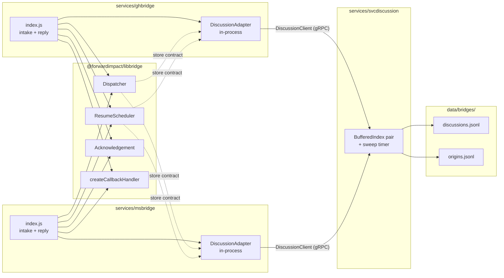

# Design 1300-a — svcdiscussion

Architectural design for [spec 1300](spec.md). A new gRPC service owns
the canonical discussion and origin records; both bridges call it
through generated clients while keeping their existing libbridge
composition. `ResumeScheduler`'s contract with its `store` parameter
widens so the resume lifecycle still works over a remote backend.

## Component boundary

The libbridge box ships no gRPC dependency. Each bridge's
`DiscussionAdapter` is the only thing that imports the generated client,
and it presents a store-shaped object to `Dispatcher` and
`ResumeScheduler`.

## Components

| Component | Role |
|---|---|
| `services/svcdiscussion/` | New gRPC service. Follows the `services/CLAUDE.md` layout (server entry, implementation, `proto/`, `test/`). Owns the only on-disk discussion and origin state and runs the periodic sweep. The `svc`-prefixed directory deviates from the bare names used by `services/{trace,graph,vector}` and matches the spec's explicit naming choice. |
| `services/svcdiscussion/proto/discussion.proto` | Declares `package discussion`, `service Discussion`, message `DiscussionRecord` (deliberately not `Discussion` to avoid the codegen service/message name collision), `Origin`, `OpenRfc`, `Participant`, `ResumeTrigger`, plus a small set of request/response messages. |
| `services/svcdiscussion/index.js` | Implements `Discussion` over two `BufferedIndex` stores constructed against one shared `StorageInterface` rooted at `data/bridges/`. The service's own config block is `service.discussion.*` (the registered name on `createServiceConfig("discussion")`). |
| `services/{gh,ms}bridge/index.js` | Construct a `DiscussionClient` at startup via `createClient("discussion", …)`. Wrap the client in a `DiscussionAdapter` (a small in-process object) and pass that adapter wherever the old `DiscussionContextStore` instance went. ghbridge calls `client.HasOrigin` / `client.RecordOrigin` from the webhook intake and reply paths without going through the adapter. |
| `libraries/libbridge` | Loses `discussion-context.js` and `origin-index.js`. `ResumeScheduler` is amended to stop reaching into `store.loaded`, `store.loadData()`, and `store.index.values()` (see § Key decisions). Everything else stays. |

## Discussion record on the wire

`DiscussionRecord` mirrors the existing in-memory shape one-for-one so
the record factory and dispatcher mutations do not change. The
persisted JSONL on disk follows the proto field names.

| Field | Proto type | Notes |
|---|---|---|
| `id` | `string` | `<channel>:<discussion_id>` — the libindex key. |
| `channel` | `string` | `"github-discussions"` or `"msteams"`. |
| `discussion_id` | `string` | Channel-side thread id. |
| `lead` | `string` | Conversation lead. |
| `last_active_at` | `int64` | Epoch ms. Sweep input. |
| `dispatches` | `repeated int64` | Rate-limiter input. |
| `history` | `repeated HistoryEntry` | `{ role, text }`. |
| `participants` | `repeated Participant` | `{ name, kind, external_id, metadata_json }`. |
| `open_rfcs` | `map<string, OpenRfc>` | Correlation id → `{ trigger, opened_at, history_index_at_open, due_at }`. |
| `pending_callbacks` | `map<string, string>` | Token → correlation id. Travels with the record per spec. |

`OpenRfc.trigger` is a typed `ResumeTrigger` message — `{ kind, responses, elapsed }` — so the on-disk field name remains `trigger` (preserving the spec's "persisted record shape is unchanged" requirement). `OpenRfc.due_at` is required for `ResumeScheduler` to rearm elapsed timers after a restart.

`Origin` is flat: `{ id, discussion_id, posted_at }`. Opaque per-participant metadata (Bot Framework `ConversationReference`, GitHub node metadata) rides as a JSON string because it is channel-shaped and outside this service's concern.

## RPC contract

| RPC | Request | Response | Caller |
|---|---|---|---|
| `LoadDiscussion` | `{ channel, discussion_id }` | `DiscussionRecord` or gRPC `NOT_FOUND` | Adapter `loadByChannel`. |
| `LoadDiscussionByCorrelation` | `{ correlation_id }` | `DiscussionRecord` or gRPC `NOT_FOUND` | Adapter `loadByCorrelation` — replaces `ResumeScheduler.#findContextWithRfc`'s linear scan over `store.index.values()`. |
| `ListOpenRecesses` | `common.Empty` | `repeated OpenRecessRef { id, channel, discussion_id, correlation_id, due_at }` | Adapter `listOpenRecesses` — used by `ResumeScheduler.rearm()` to arm elapsed timers without iterating the whole map. |
| `SaveDiscussion` | `DiscussionRecord` | `common.Empty` | Adapter `save` — the single hot-path write that today is `add+flush`. |
| `HasOrigin` | `{ id }` | `{ exists: bool }` | ghbridge's `#handleDiscussionComment` self-echo guard. |
| `RecordOrigin` | `Origin` | `common.Empty` | ghbridge's `recordOrigin` callback inside `#handleReply`. |
| `Sweep` | `{ now: optional int64 }` | `{ evicted_discussions: int32, evicted_origins: int32 }` | Tests only. Absent `now` ⇒ server uses `Date.now()`. Production uses the server-internal 60 s timer. |

## Adapter contract (bridge side)

`DiscussionAdapter` is the only new abstraction on the bridge side. It wraps the generated `DiscussionClient` and satisfies the contract `Dispatcher` and `ResumeScheduler` consume:

| Method | Implementation |
|---|---|
| `loadByChannel(channel, id)` | `client.LoadDiscussion`, returns `null` on gRPC `NOT_FOUND`. |
| `loadByCorrelation(correlationId)` | `client.LoadDiscussionByCorrelation`, returns `null` on gRPC `NOT_FOUND`. |
| `listOpenRecesses()` | `client.ListOpenRecesses` → array of `{ correlationId, due_at }`. |
| `add(ctx)` | `client.SaveDiscussion(ctx)`. |
| `flush()` | No-op. The server-side `BufferedIndex` owns batching, so a successful `SaveDiscussion` carries the same durability promise the old in-process `add+flush` did: in-memory until the next service-side flush. Crash semantics are identical to today — `svcdiscussion` losing buffered writes is the same crash window the per-bridge buffer had. |
| `shutdown()` | No-op on the bridge side. The service drains its own buffer through librpc's SIGTERM handler. The previous bridge-side `store.shutdown()` flush gate disappears with the in-process buffer; bridges no longer drain anything on stop. |

`Dispatcher.dispatch` only uses `.add` and `.flush` and is satisfied by this adapter unchanged. `ResumeScheduler` is amended to consume `loadByCorrelation` and `listOpenRecesses` in place of its current reaches into `store.loaded`, `store.loadData()`, and `store.index.values()`; that change keeps the resume lifecycle working over a remote backend without leaking gRPC into libbridge.

## Storage layout

The service constructs one `StorageInterface` rooted at `bridges/`, resolved by `libstorage` to `data/bridges/` from the monorepo root, and hands it to two `BufferedIndex` instances using the existing index keys (`discussions.jsonl`, `origins.jsonl`). Both files land at the canonical paths the spec requires, owned by a single process. The discussion store keeps the current 5 s / 1000-entry buffer; the origin store keeps the current 1 s / 100-entry buffer. Both can be overridden via `service.discussion.*`.

A single 60 s sweep timer evicts records older than the TTL from both indexes. The discussion side mirrors the existing 24 h `conversationTtlMs`. The origin side gains a periodic timer it did not have before — today's `OriginIndex.sweep(now)` is caller-driven; the service moves it onto the same cadence as discussions to put both indexes under one lifecycle. The origin TTL stays at 24 h.

## Key decisions

| Decision | Chosen | Rejected | Why |
|---|---|---|---|
| Surface shape | One `Discussion` service with seven RPCs covering both record kinds | Two services (`Discussion` + `Origin`) | Spec mandates a single interface. Matches `trace.Trace` and `graph.Graph` — one proto, one stub, one supervised process. |
| Resume contract over gRPC | Widen the store contract with `loadByCorrelation` and `listOpenRecesses`; amend `ResumeScheduler` to use them in place of `store.loaded` / `store.loadData()` / `store.index.values()` | Keep the four-method adapter (`loadByChannel`, `add`, `flush`, `shutdown`) and let `ResumeScheduler.rearm` and `#findContextWithRfc` fail | The current `ResumeScheduler` reaches past `loadByChannel` to walk every record. A 4-method adapter cannot satisfy that. Either widen the contract or move resume into the service; widening keeps the dispatcher + scheduler composition on the bridge side, which is what the libbridge contract is designed around. |
| Message name | `DiscussionRecord` | `Discussion` | proto3 allows `service Discussion` + `message Discussion` in the same package, but every peer service (`trace.Trace`/`Span`, `graph.Graph`/`PatternQuery`) keeps the names distinct; matching the convention avoids codegen-tool friction. |
| Not-found channel | gRPC `NOT_FOUND` status from `LoadDiscussion` / `LoadDiscussionByCorrelation` | Sentinel empty `id` on a default-constructed `DiscussionRecord` | Status codes are how every other librpc service signals absence; the adapter translates `NOT_FOUND` to `null` so the bridge call sites read exactly as they do today. |
| Resume trigger over the wire | Typed `ResumeTrigger` message; on-record field name stays `trigger` | `string trigger_json` carrying the JSON-serialised trigger | A typed message keeps the spec's "persisted record shape is unchanged" intact — the on-disk JSONL field is still `trigger`, not `trigger_json` — and gives the service introspection over recess state if a future tool wants it. |
| Opaque participant metadata | JSON string per participant | `google.protobuf.Struct` or first-class proto fields | The Bot Framework `ConversationReference` and GitHub node metadata are channel-shaped and outside this service's concern. A JSON string keeps the contract minimal and matches how the JSONL already round-trips these blobs. |
| Sweep ownership | Server-internal 60 s timer plus a `Sweep` RPC for tests | Bridge-driven sweep | The TTL is store-owned, not caller-owned. A test-callable RPC keeps the integration test deterministic without exposing scheduling to production callers. The origin index gains a periodic timer it did not have before — intentional, so both indexes share one lifecycle. |
| Origin path on ghbridge | Direct `client.HasOrigin` / `client.RecordOrigin` calls; no adapter wrapper | Wrap the client in an `OriginIndex`-shaped class in libbridge | The actual call sites are explicit; the previous `.flush()` after each reply and the `.shutdown()` on stop disappear because the service owns batching and its own lifecycle. |
| Storage root | `createStorage("bridges")` inside the service, both indexes share it | Per-service root (`createStorage("svcdiscussion")`) with `indexKey` overrides | Lands the two files at the canonical paths the spec requires with no `indexKey` gymnastics. The bridges' previous `bridges/{ghbridge,msbridge}/` directories are not read or written by any code after cutover. |
| Buffering / durability | Server keeps the existing `BufferedIndex` cadences; adapter `flush()` is a no-op | Per-call synchronous append, or pass-through buffering on the client | Per-call append would slow the hot path. Client-side buffering would lose state when the bridge crashes. Server-side buffering is the simplest viable choice; durability does not improve relative to today (the service can still lose buffered writes on crash), and the design is honest that the crash window moves rather than disappears. |
| Service supervision | The product starter that bundles the bridges (today none of the shipped starters does) gains `svcdiscussion` in its `init.services` list before the bridge entries | Lazy connection with retries from the bridges | Today's bridges are not in any shipped starter; this design does not assume they are. When a starter does bundle them, `svcdiscussion` must come first so the bridges' `createClient("discussion", …)` resolves at startup. |

## What this design does not cover

- The agent-facing tool surfaces over the new store (cross-bridge lookup, history recall). Foundation only; the follow-up spec for the tool catalogue will add RPCs without changing the underlying store.
- Concrete file paths, function signatures, or execution ordering inside any of the components above — those are plan concerns.
- The shape of the bridge fakes used in tests beyond the contract the adapter satisfies.
- Removal of the per-bridge legacy files under `data/bridges/{ghbridge,msbridge}/` on operator machines. The clean break means no code reads or writes them; cleanup is operational, not a code change.
